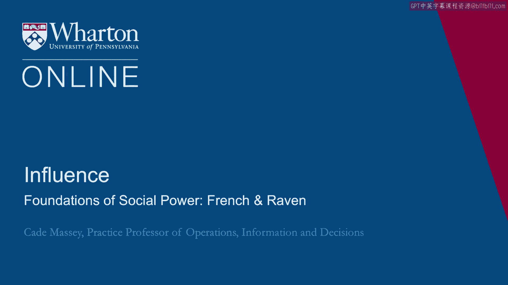
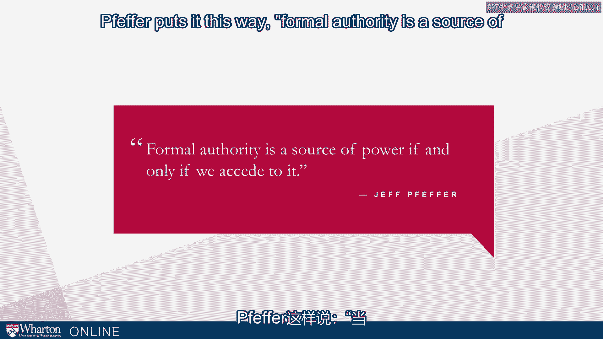
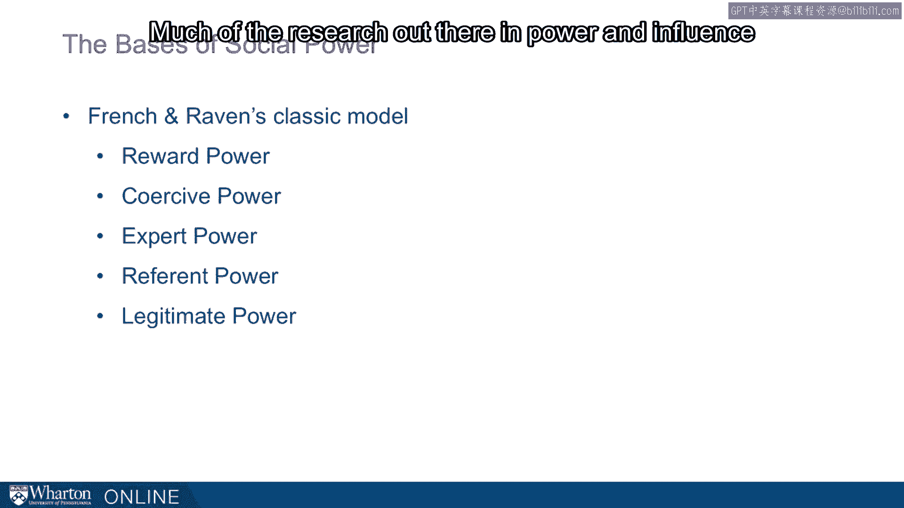

# 沃顿商学院《实现个人和职业成功（成功、沟通能力、影响力）｜Achieving Personal and Professional Success》中英字幕 - P69：5_弗兰奇和雷文关于社会权力的基础.zh_en - GPT中英字幕课程资源 - BV1VH4y1J7Zk

In this section we want to understand where power and authority comes from。

John Gardner puts it this way。 He says， "Leaders cannot maintain authority unless followers are prepared to believe in。

that authority。"， In a sense， leadership is conferred by followers。

It's not something that's demanded or taken。 Rather。

it's conferred by those who would follow the leader。 If effort puts it this way。

formal authority is a source of power if and only if we accede。

to it。 So， this raises the question， if obedience and the acceptance of authority is vital to。

an understanding of politics， why do people obey？ Why and when do they accept authority？

The best take on that and one of the first takes on this comes from French and Raven。

to sociologists who provide a classic model of the basis of social power and they enumerate。

five elements。 Reward power， coercive power， expert power， referent power， and legitimate power。

This framework underlies much of the work in power and influence。

It provides one of the touchstone frameworks for our work。 Let's illuminate it quickly。

A couple of them are rather intuitive。 Reward power and coercive power are exactly as you might expect。

You have reward power if you can provide nice things to other people， whether it's money。

or non-monetary benefits。 Coercive， just the opposite if you're able to hurt them in some way。

French and Raven point out that these things don't necessarily go together in a formal， structure。

You tend to think people have both， if they have reward power， they have coercive power。

they can travel independently。 Some folks have reward power without having coercive and some coercive without having。

reward。 The other three are a little bit more involved so we want to unpack them a little bit and。

we'll go back to D'Mello and look at ways in which D'Mello's behaviors show how these， things work。

Expert power is mostly about confidence。 Performance and reputation based。

This is about someone's functional status， someone knowing something you don't。

This is one of the reasons you see diplomas on doctors' walls， for example， any kind of。

accreditation。 Herb Simon says that this is probably the principal type of authority that operates。

in society in general。 It's that important。 Where do we see it from D'Mello？ Well。

when D'Mello went into East Timor， the resistance leaders there had heard about。

the UN in previous countries， they had heard， for example， that they had come in in Cambodia。

and made a big mess， left a big trail and not really made any difference。

So D'Mello was very sensitive to this。 He knew that not repeating Cambodia meant aggressively establishing functioning government。

structures that made a concrete and lasting difference to citizens。

The emphasis there is the concrete and lasting difference that they had to go out and establish。

a reputation for performance straight away。 A second notion is referent power。

So referent power is an identification with or a feeling of oneness with or a desire for。

that feeling with another person。 So being part of a group， for example。

can give credibility or confidence to the like-mindedness。

An in-group identification can make suggestions by others in the group more attractive。

These are all indications of referent power。 This is something。

an interesting aspect of this source of power is that it's often outside。

the awareness of those who are influenced。 One can be under the sway of referent power without really understanding it。

It's also outside the intentionality of a person who has it。

A person doesn't have to want to be exerting referent power to actually have referent power。

Where do we see D'Mello with this？ Well， his emphasis on language you might think of as a way of cultivating referent power。

He said， "How do you win the sympathy of the people？"， First， you have to learn the language。

Language is the key to a people's culture and culture is the key to a people's heart。

If you force them to speak your language， you will never win their sympathy。

He knew this from his many years working in foreign countries。 It applies， of course。

to language per se in countries， but you might think about it more， generally。

Even if you're speaking English and you're a native English speaker， what does it mean。

to walk into an organization and speak their language？ Organizations have their own languages。

Functional disciplines have their own language。 This is a lesson that we can take and apply in many situations。

Finally， the fifth element of the French and Raven framework is legitimate power。

Legitimate power is about what a person should， when they should obey or they ought to obey。

or a leader has a right to。 It's all of those kinds of elements。

This comes from the fact that most people in most situations are indoctrinated to "play。

according to the rules of the game。"， This is not to say everybody all the time does。

but there's a general inclination that， direction and there's this shadow that follows over that that says you're going to obey those。

who are in positions of authority。 This is especially true in hierarchies or in societies which are more hierarchical。

This is intended to be something that's independent of the other sources of power。

Independence of confidence， independent of the extent to which you identify with someone。

independent of the sanctions they may have， those in authority tend to be granted this。

kind of legitimate power。 There is a kernel of rationale to this。

There's a reason this holds in general。 Those who are higher in hierarchies are there for a reason。

They've earned it in some way， so it makes sense to grant them the authority。

Maybe they have information that you don't have access to。 Again， it would make sense。

But French and Raven are underlining the fact that it happens independently， that it can。

be overgeneralized from that。 Again， this is something that people don't necessarily know that they have。

People in positions of power may not realize why people obey them。

Sometimes it's merely the dent of the office they hold。

DeMally was very sensitive to this kind of thing。 He very much understood the separation between formal power and informal power。

He used participation as a source of legitimacy。 He knew that even though they were the UN。

this great worldwide organization that in， East Timor， their legitimacy was pretty weak actually。

The folks that they considered to be truly in power were the ones that had resisted。

and basically created independence。 They had a very short rope and they had to build legitimacy in some other way。

For example， colored the way he dealt with Guzman。

Guzman had earned that legitimate authority from the citizens and yet somehow DeMally。

had to move it from that military basis to more institutional， constitutional basis。

He had to balance acknowledging Guzman as the de facto leader and not enshrining him。

before there was a way to formally build Congress and build a presidency。

Some subtleties in French and Raven， some details here that are worth noting。

One is that any use of power， especially the coercive element of power， can invoke opposing。

resistance。 It would be in your calculus on when you use these things to know that when you use them。

they will invoke some kind of opposition， especially coercive power。

The idea that these types of power differ in their degree of internalization。

Rewards and punishment tend to be more temporal where the referent and the expert tend to be。

a little longer lasting。 The idea which we stand repeating a few times here is that influence of power does not have。

to be intentional， many people don't understand the ways in which they have power outside。

of their intention just because of who they are or the offices that they hold or the way。

people react to them internationally。 And then finally this notion。

it's a good caution for all of us。 The attempted use of power that is outside that powers range will decrease the power of。

the authority。 This of course is going to put a premium on understanding where does your authority come。

from because you want to be able to use that authority but you don't want to overreach。

that authority。 So this is the framework from French Raven。 Again this is a good foundation for us。

you'll see it in many places。 Even if you don't see it explicitly。

it's underlying much of the research out there。

in power and influence。 These five elements as the bases of social power。 Reward power， coercive。

expert， referent and legitimate。 Thank you。 [BLANK_AUDIO]。

