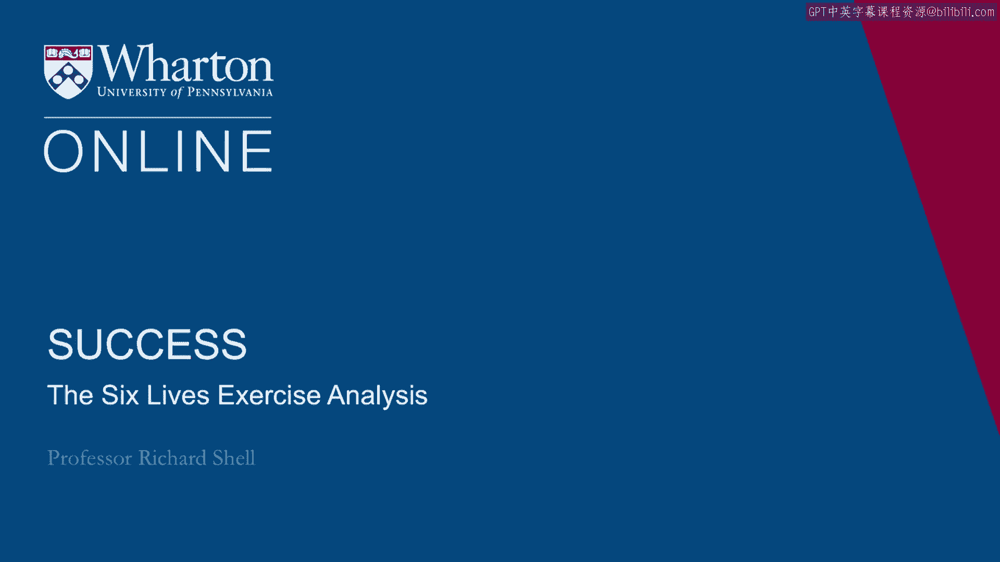
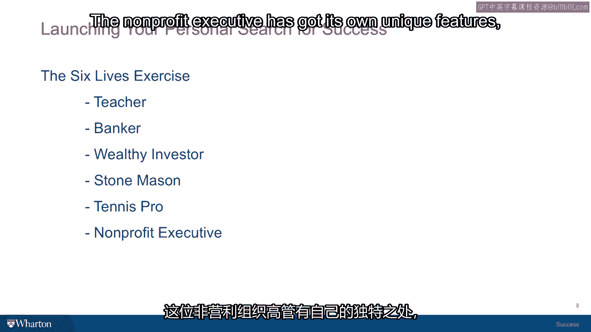

# 沃顿商学院《实现个人和职业成功（成功、沟通能力、影响力）｜Achieving Personal and Professional Success》中英字幕 - P7：6_六种生活练习分析.zh_en - GPT中英字幕课程资源 - BV1VH4y1J7Zk

In this session we're going to talk about your answers to the six lives exercise。

I've taught this in many different contexts to thousands of people and I've got some。

data that I can share with you about their results as well as some perspectives that。

people have shared with me about their reasons for ranking one life or another either very。

high or very low。 If you haven't had a chance to do the six lives exercise yet， no worries。

Go on to the next session and come back to this one after you've had a chance to do it。

So there are six different people profiled here and I'm just going to talk about each。

one in turn and share some perspectives on the sort of high and the low。

The people who rank this life number one or the people who rank it number six。

And if you didn't rank it either one you just ask yourself whether it was near the top。

of your list or near the bottom and there might be some insights that you can gain from this。

So the first life on the list is the teacher。 The teacher。

if you chose the teacher as your number one life， I think it often signals。

a very passionate perspective on being a mentor， being involved in a small setting where you。

really get to coach people， bring out their excellence。 You're involved with people。

you're involved in a school where you're coaching bright。

students to win science prizes and that sort of perspective feels very satisfying to some， people。

Sometimes though people pick this life last because as you'll remember in the story the。

person who's the teacher has one child who has become estranged from their family。

They no longer in contact， the child doesn't respond to efforts to reach out to them and。

it feels like there's kind of fracture in the home life of this story and people are。

very reluctant to endorse that as a successful life。

Sometimes the people who point to that factor feel that the teacher has a little bit of incomplete。

in the sense that they seem to be able to throw themselves at helping others in their work。

but then when it comes to their own home life and their own children they haven't been able。

to bring that same sense of connection to their home life。

People who again picked the life on the high side look at that factor and say well it wasn't。

really the teacher's choice that the child would become disaffiliated and so they don't。

count that against them as much。 I think with all these lies what you're going to find is that your own experience tends to。

color a good deal which one you pick as closer to the top or closer to the bottom and the。

idea of a sibling or a child that's no longer involved with a family。

If you're experienced with that it's very painful then the chances are that you'll kind。

of push that one to the bottom。 You're not reconciled but then have found a way to get back together again then I think。

you are more of a believer in the healing process and that part of that life feels like。

it's something that can be solved。 At the very least if you ranked it high consider this a sort of signal about your motivations。

for working in smaller groups to affect the lives of others and to bring out other people's。

talents。 Number two life is the banker。 The banker is a single woman with a child who has a severe disability。

She has no partner in her life， adult partner and is a dedicated loyal professional with。

a rather successful career in wealth management。 She has turned her family situation into an asset as she has become a marathon runner。

She's used her running to facilitate a sort of a cause for children with disabilities。

She wheels her kid with her on her marathon runs in a device that she's gotten specially。

rigged up and gets publicity for the cause。 So people who pick this life number one often salute this person's autonomy。

her choices。 All her friends are saying that she should put her child in a home or in a facility and。

get on with her life and her reaction is no no this is my life。 This is provides meaning for me。

And so you feel the courage of the position that she's taken and her certainty and confidence。

in it。 People who pick this life down near the bottom see this sort of the burden aspect of having。

a child with a severe disability as a defining characteristic of this person's life as a。

little too narrow。 And they feel like this would not be a life they would choose because it seems she doesn't。

want to be married。 She doesn't she devoted herself to this one person in her life and it seems kind of restricted。

to them。 So again if you're one of your highest values is loyalty devotion to family then this life。

looks a little more appealing if you're thinking more about autonomy and a career or a life。

with lots of options and the ability to travel extensively and so on。 This one doesn't look so good。

So you know none of them are the right or the wrong answer they're just different values。

that people elicit when they have to answer these questions。

So life number three is the wealthy investor。 Now among all the lives the wealthy investor is the one who has first of all the most autonomy。

The person made a great deal of money on an early investment in their career。

They've then been able to turn to investing that money and to providing themselves with。

the means of carrying out all kinds of hobbies and causes。 They love hang gliding。

They have lots of travel in their lives lots of freedom and then they can even get involved。

in political causes so they give some of their money to political causes that they believe， in。

So they're having a lot of impact on the world around them outside of their little intimate， sphere。

People who pick this life way down at the bottom instead of focusing on all the freedom and。

autonomy look at this life and say this person looks lonely。 They've been married。

It didn't work out。 They've never remarried。 They have no children。 They have no family。

That's discernible from the story and so there's this big missing piece for people。

Now again I actually got an email from an MBA student recently who picked this life and。

said that this life was very appealing to her because freedom is a value that she。

esteemes above all others。 She was actually coming to Wharton from a country where freedom was not always an assumption。

that she could count on。 So when she got here this life felt very appealing。

Other people on the other hand choose this life at the bottom because no family， no family。

only kind of an emotional deficit。 Okay， so that's number three。 Moving on to number four。

the Stone Mason。 So in many ways the Stone Mason's life is the opposite of their wealthy investor's life。

This is a man who has a family， has been married for decades to the same partner， has， children。

some of whom have gone on to do completely different careers than he has。

He builds homes with stone。 They've gone on to be lawyers and so on。

He describes his life in very almost mystical terms。 He sees his day as very much under his control。

He has a kind of craftsman's like ability to just find just the right stone and put it。

in just the right place。 He's built homes for his children and he can drive through his town and see the homes he's。

built。 And so there's a lot of coherence in this life and people who pick it near the top are inclined。

to salute that sort of embrace of family， embrace of craft， embrace of controlling the。

experience they're having in their life。 Very integrated。

People who pick it down near the bottom often see this as a life with very little scale。

This person is only affecting their family。 They're only affecting a few people in their community with the homes they build。

He builds and they want to have a bigger impact on the world。

Plus there seems to be no recognition outside of this person to his skill。

So there's not even an award from Stonemason Weekly that he was Stonemason of the week。

He's just an average guy who builds pretty good homes。 So again。

if your success values are more oriented toward the family， toward integration， then。

this one's going to rank very high。 If they're oriented more toward impact on others and scale as well as a sort of autonomy。

and options， then this one doesn't seem quite as appealing。

I did have one executive once comment to me about this life because in a class I might。

pick one person who picked it number one and they described why they liked it and one person。

who picked it number six and they described why they didn't。 It was in a big group。

a hundred people in the room and someone who just described the。

Stonemason in rather disparaging terms and why they picked it number six。

This man stood up in the back of the room and I think he was from a very strong spiritual。

background because he stood and said， "The Stonemason is having a tremendous effect， on society。

The Stonemason is building a society as he builds his homes and that he is the foundation。

for his family。"， So this very poetic view of the implications and the symbolism for this life。

Anyway， this is one that elicits a lot of different emotions from people when they take， it。

Life number five is the tennis pro。 Now the tennis pro of all of the different lives is the one person that actually appeared。

on the cover of a magazine。 It's clear that she is a very accomplished professional on the circuit and has been acknowledged。

and recognized for this very important accomplishment and is so therefore has this sort of success。

in the traditional sense very， very well outlined and defined。 She also has a family partner。

They couldn't have children of their own so she adopted children。

She has a little tennis camp that she's running that gives underprivileged kids a chance to。

experience tennis and learn the skills that come with that。

So people who like this life put it higher often focus on all those attributes and have。

a very positive feeling for the combination of things that she's bringing to her life。

On the other hand， people who rank it down to the bottom point to other aspects of this， vignette。

One of which is she complains that she's so busy with her profession that she doesn't。

have time to be with her kids as much as she would like because she has to be on the road。

They see this as maybe a difficulty in her work-life balance。

She's not choosing the right priorities。 And then there's a sense the way the story is written although it's not explicit that。

maybe this person didn't choose tennis and it could just be that she was the product of。

a tiger mother or gorilla father household and they drilled her and drilled her and drilled。

her when she was a kid， didn't have a choice， she just had to do it and then she just had。

an aptitude for it and she got to be really good at tennis but the sense that she didn't。

choose it herself does not appeal to some people。 They feel like she's more of a victim maybe than a success。

So depending on which part of that story resonates with you， you might have picked it higher。

or lower。 The final life of the six is a nonprofit executive。

The nonprofit executive has got his own unique features。

The first is that this person has had a successful career in finance and now has turned it and。

has gone into a nonprofit environment where they're working for a religious group， a very。

strong belief system that they have。 So they're repurposing their professional skills toward a greater cause that appeals。

to some people。 In addition， they are now turning their attention to a very important cause in Africa。

clean， water in villages in rural Africa and they're about to take their whole family over there。

and lead the effort to handle this initiative and help others。

That feels very appealing to some people who want to have an impact and do good in the， world。

People who choose this life at the bottom， again， focus on a different part of the story。

They see all that but this person is taking children who， some of whom are in high school。

away from their social environments， they don't want to go。

He's taken them to Africa anyway with his spouse and they feel this is just a time bomb。

of a family about ready to explode in rural Africa and not at all something that you would。

define as successful。 So again， depending on your hopes， fears and fantasies。

as well as your experience， you， focus on different aspects of this life and either favor it or disfavor it。

I had a very interesting experience。 I did this exercise with a group up in Boston and we got through all the lives and I was。

calling on people and asking them why they chose one or the other。

And a young lady who was in the front row had picked a nonprofit executive as the sixth。

out of six lives and I said， "Well， what was the problem for you with this life？"， And she said。

"Very passionately。"， "Well， my mother and father were both evangelical ministers。

They dragged us everywhere they went。 They never cared about us。

I would never choose this life for anybody。"， And everybody is sort of taken with this passion that she spoke with。

So these lives are impossible to judge， of course， because they're very sketchily drawn。

And so what you're really doing is reading your life story into each of them and depending。

on what aspects of your life story resonate as success values， those are the lives that。

seem to be the ones that are appealing。 Those are the ones for others who fear them and don't choose them。

So just for some additional perspective， first， you may not be surprised to know that every。

single time I give this exercise to any group of people， 20 or more， there is someone in。

the audience who chooses each of the lives as number one and there is someone in that。

audience who chooses each of those lives as number six。

So this begins to help you see the point that success is not something that has an objective。

function。 This is something you get to choose and it's your perceptions， your values， your history。

your experience， your family that is going to be the foundation for your own vision of。

what a successful life is because they all get picked and make people feel equally strongly。

about each of them。 Just one last bit of data for what it's worth is I've given this online to。

it's available， online and thousands of people have taken it and it basically。

the results online with， that many people taking it have fallen into three tranches， three sets。

The top two lives that people pick most often are the teacher and the stonemason and they're， tied。

It's not one over the other。 So people seem to value the family part， the mission part。

the autonomy part in some way， that those two lives embody。

The bottom two lives that people pick and this is a big gap between the top and the bottom。

are the wealthy investor and the banker。 I think it's interesting that both of those lives are the ones with the most pared down。

vision of family。 The banker has no family。 The banker has one person in their family but no spouse and no interest in marrying and。

the wealthy investor has no children and no spouse and no interest in marrying。

There is a defining feature of the choices people are making and family seems to be one。

of the biggest factors that people weigh when they actually give success some deeper thought。

and then of course the non-profit executive and the tennis player both occupy the middle。

zone but it fascinates me that they're tied they're basically two at the top two in the。

middle two at the bottom。 So your answers are yours。

They are valid and the most important thing is to try to gain some insight about yourself。

from which ones you picked。 I just want to give you one last challenge that I give to my students at the end of this。

exercise and it may cause you to think about it differently or not。 That depends。

But let me give you one last question。 Suppose that you died and went to heaven or whatever afterlife you can imagine and you。

went to check in to the everlasting life and the deity there looked on you with compassion。

and said well you know welcome but I have one final task for you that you have to do before。

you're allowed to check in and that is this。 You need to take one of the six lives in the six lives exercise and you need to give it。

to your only child。 So the problem you now face is which of these six lives would you endow to your only child。

the person you would want the best for the person that you care the most about。

And when I put that question to people very often as many as half of them sometimes a。

little more change their vote for number one。 People who voted for the stonemason changed their vote to the teacher or to the wealthy。

investor or someone else。 People who voted for the wealthy investor changed their vote to the nonprofit executive。

or someone else。 And I think the reason that people change not all do some people stick with the same。

vote they had them at the beginning but the reason they change their vote is because when。

you're asked to give one of these lives to someone you love who has a life in front of。

them it stops being a question of just what's your ideal or what's sort of the perfect picture。

of success in a theoretical way and becomes something where you want the person to have。

options you want them to have financial security you want them to be safe。

And I think that's a different question and I think it's a more important one because。

inside each of you there is someone who is trying to protect you and make sure that your。

life works and make sure that you make choices that will allow you to prosper。

And you're not just going off and living some life that you think is ideal or has some theoretical。

properties you're picking and making choices to sustain you to the next choice point。

And so I think it's worth thinking about because the chances are that your actual theory of。

success has more to do with this second question because that will describe more accurately。

the actual choices that you're making in your life and not just a theoretical point。

So as you contemplate this exercise and we'll come back to it periodically during the course。

you might just come to terms with what your values actually are what your choices actually。

are and don't get lost in the fog of thinking about some perfect world that you could never。

actually make choices in make real life choices in。

So with that we've come to the end of our first exercise and now we're going to dig。

deeper a little bit into the next session and see what happens to success when you unpack， it。

Thank you。 。

[BLANK_AUDIO]。
