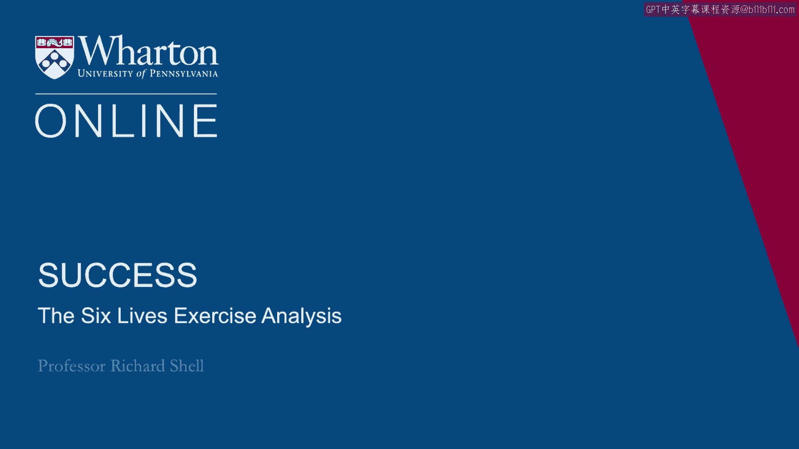
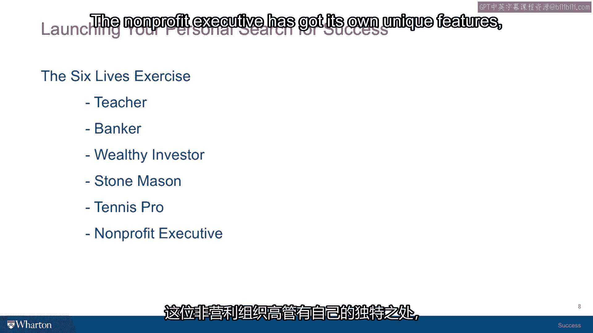

# 沃顿商学院课程《实现个人和职业成功》第7讲：六种生活练习分析 🧩

在本节课中，我们将深入分析“六种生活练习”的答案。我们将探讨每种生活选择背后常见的价值观和考量，并分享来自数千名参与者的数据与洞见。通过理解他人为何将某种生活排在首位或末位，你可以更清晰地反思自己的选择，从而洞察你个人对成功的定义。

---

## 六种生活概览

上一节我们介绍了“六种生活练习”，本节中我们来看看每种生活的具体细节，以及人们通常如何评价它们。你的排名没有对错之分，它仅仅反映了你内心深处的价值观和人生经历。

以下是六种生活的逐一分析：

### 1. 教师 👩‍🏫

如果你将教师生活排在第一位，这通常意味着你非常看重成为导师、在小环境中指导他人并激发其潜能所带来的满足感。这种生活涉及与聪明学生紧密合作，帮助他们赢得科学奖项等成就。

然而，有些人将这种生活排在最后。在故事中，这位教师有一个与家庭疏远、不再联系的孩子。这种家庭关系的破裂让一些人难以将其视为成功的人生。

*   **排名靠前者的视角**：他们往往认为孩子疏远家庭并非教师本人的选择，因此不会因此过多地否定这种生活。
*   **排名靠后者的视角**：他们可能认为，这位教师在工作中全心帮助他人，却未能将同样的连接感带入自己的家庭生活，这显得不够完整。

**核心洞见**：你的个人经历会极大地影响你的选择。如果你曾经历过亲人疏远的痛苦，你很可能将这种生活排在后面。如果你曾见证过关系的修复，你可能会更相信愈合的过程。

如果你的排名靠前，这可能是一个信号，表明你重视在小组工作中影响他人、发掘他人才能的动机。

### 2. 银行家 💼

银行家是一位单身母亲，孩子有严重残疾，生活中没有伴侣。她在财富管理领域事业成功，并将家庭处境转化为一种资产——她成为马拉松跑者，用特制推车带着孩子一起跑步，为残疾儿童事业宣传。

*   **排名靠前者的视角**：他们赞赏此人的自主性和坚定选择。她顶住了朋友将孩子送入专业机构的建议，坚持自己的道路，这体现了勇气和信念。
*   **排名靠后者的视角**：他们将抚养残疾孩子视为一种沉重的负担，认为这种生活过于局限，缺乏婚姻、广泛的旅行选择等其他可能性。

**核心洞见**：如果你高度看重对家庭的忠诚与奉献，这种生活可能更有吸引力。如果你更看重自主性、广泛的职业选择或旅行自由，它可能就不那么吸引人。

### 3. 富裕投资者 💰

在六种生活中，富裕投资者拥有最大的自主权。他早年投资获利颇丰，之后得以将财富用于投资、追求各种爱好和事业（如滑翔伞、旅行），并资助自己信仰的政治事业，在个人亲密圈子之外对世界产生影响。

*   **排名靠前者的视角**：他们看重这种生活带来的自由和自主权。
*   **排名靠后者的视角**：他们认为此人看起来很孤独。故事显示他曾结婚但未再婚，没有孩子和家庭，这对许多人来说是一个巨大的缺失。

**核心洞见**：价值观的差异在此凸显。例如，一位来自自由受限国家的学生极度推崇这种生活，而另一些人则因“没有家庭”带来的情感缺失而将其排在末位。

### 4. 石匠 🏠

石匠的生活在许多方面与富裕投资者的生活相反。他拥有家庭，与伴侣结婚数十年，有孩子。他以近乎神秘的方式描述自己的生活，享受作为工匠挑选石头、建造房屋的过程，并为孩子们建造了家园。

*   **排名靠前者的视角**：他们赞扬这种对家庭、手艺和掌控生活体验的拥抱，认为这是一种非常完整、和谐的生活。
*   **排名靠后者的视角**：他们认为这种生活影响范围太小，只影响到家庭和社区少数人，缺乏外界的认可（例如，没有获得“每周最佳石匠”奖项），他们希望拥有更大的世界影响力。

**核心洞见**：如果你的成功价值观更倾向于家庭、完整性和内在控制，这种生活会排名很高。如果你的价值观更倾向于对外界的影响、规模以及自主选择，它可能就不那么吸引人。

### 5. 网球职业选手 🎾

网球职业选手是六人中唯一登上杂志封面的人，在传统意义上取得了明确的、被认可的成功。她有家庭伴侣，因无法生育而收养了孩子，并经营一个网球夏令营，让贫困孩子有机会学习网球。

*   **排名靠前者的视角**：他们关注所有这些积极属性，对她生活中结合的各项成就感到满意。
*   **排名靠后者的视角**：他们指出其他方面：她抱怨因职业繁忙而无法多陪伴孩子；此外，故事暗示她可能并非自主选择网球，而是从小被“虎妈”式教育逼迫训练，这让她看起来更像受害者而非成功者。

**核心洞见**：你对这个故事的哪部分产生共鸣，决定了你的排名高低。是看重其公开成就与慈善的结合，还是担忧其工作与生活的平衡及自主性的缺失？

### 6. 非营利组织高管 🌍

此人曾在金融领域取得成功，后转型为一个宗教非营利组织工作，即将带领全家前往非洲乡村，致力于解决清洁用水问题。

*   **排名靠前者的视角**：他们被这种将专业技能用于崇高事业、并对世界产生积极影响的生活所吸引。
*   **排名靠后者的视角**：他们关注点不同：此人将正值高中阶段、不愿离开社交环境的孩子强行带到非洲，他们认为这就像一个家庭定时炸弹，绝非成功的定义。

**核心洞见**：依据你的希望、恐惧、幻想以及个人经历，你会关注这个故事的不同侧面，从而决定是青睐还是否定这种生活。

---

## 整体数据与洞见

在分析了每种生活后，我们来看看整体的数据模式，这能帮助我们理解更广泛的趋势。

首先，一个关键发现是：**每次向超过20人的群体进行这个练习时，每种生活都既有人将其排在第一，也有人将其排在最后。** 这有力地证明了成功没有客观标准，它是你的感知、价值观、历史和经历共同构筑的。

其次，根据数千份在线问卷的数据，人们的排名大致分为三个梯队：

1.  **最常被选为前两名**：**教师**和**石匠**（两者并列）。这表明人们普遍重视家庭、使命感和某种程度的自主权。
2.  **最常被选为后两名**：**富裕投资者**和**银行家**（与前列差距明显）。有趣的是，这两种生活对家庭的构想最为简化（银行家无配偶，富裕投资者无子女无配偶）。**家庭似乎是人们深思成功时最重要的权衡因素之一。**
3.  **中间两名**：**非营利组织高管**和**网球职业选手**。

你的答案属于你自己，它们是有效的。最重要的是，尝试从你的选择中获得关于自我的洞察。

---

## 最终挑战：赋予你唯一的孩子

在课程结束时，我通常会向学生提出最后一个挑战性问题，这可能会让你以不同的方式思考。

**假设场景**：你去世后，来到天堂（或任何你想象的来世）。那里的神明慈悲地看着你说：“欢迎，但在你入住之前，还有一个最终任务：你需要从六种生活中选择一种，赋予你唯一的孩子。”

现在你面临的问题是：**你会将这六种生活中的哪一种，赠予你唯一的孩子——这个你最为关心、希望他拥有最好人生的人？**

当提出这个问题时，经常有多达一半或更多的人改变了他们最初“第一选择”的投票。例如，选择石匠的人可能改为教师或富裕投资者；选择富裕投资者的人可能改为非营利组织高管。

**核心洞见**：改变的原因在于，当被要求为你所爱的人选择一种生活时，这不再仅仅是一个关于理想或完美成功图景的理论问题。你开始希望对方拥有**选择权、财务安全和保障**。这是一个不同且更重要的问题，因为它触及了你内心那个试图保护自己、确保生活顺利、做出能让你繁荣发展的选择的“内在守护者”。你不仅仅是在追求一个理论上的理想生活，而是在做出能支撑你走到下一个选择点的实际选择。

因此，值得思考的是：**你实际的成功理论，很可能与这第二个问题（给孩子选）更相关，因为它更准确地描述了你现实生活中实际做出的选择，而不仅仅是一个理论观点。**

---

## 总结

本节课中，我们一起深入分析了“六种生活练习”。我们探讨了每种生活背后的常见评价，了解了整体数据趋势，并思考了“赋予孩子生命”这一终极挑战带来的深刻洞见。

通过这个练习，希望你能够认清自己真实的价值观和实际的选择倾向，而不要迷失在对一个你永远无法在其中做出真实选择的“完美世界”的幻想迷雾中。

至此，我们的第一个练习分析就结束了。接下来，我们将更深入地探讨，当你拆解“成功”时，它会呈现出怎样的面貌。

感谢学习。