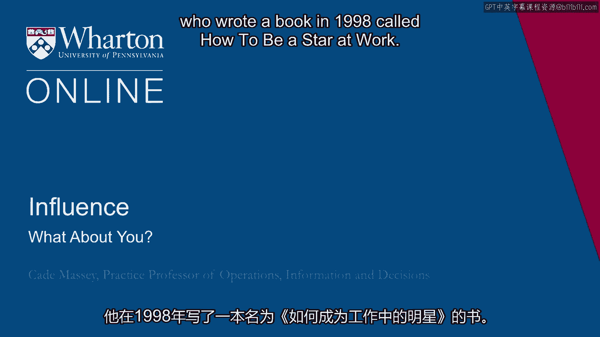
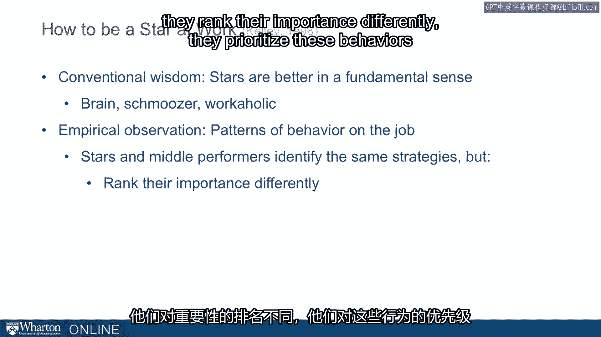
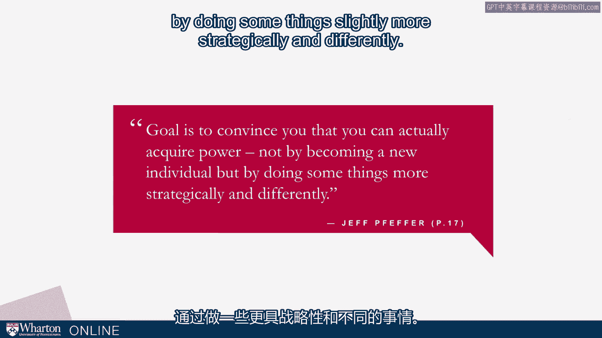
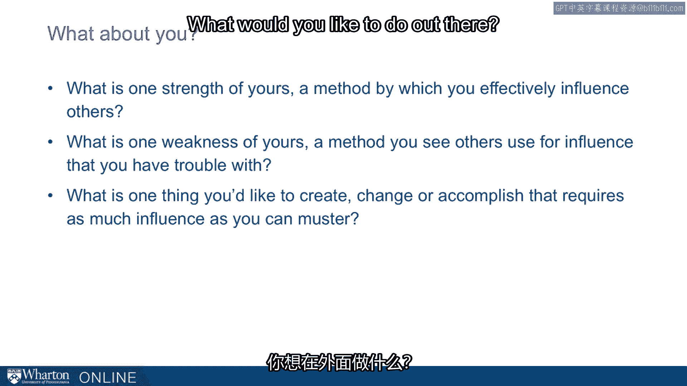

# 沃顿商学院《实现个人和职业成功（成功、沟通能力、影响力）｜Achieving Personal and Professional Success》中英字幕 - P70：6_你的看法.zh_en - GPT中英字幕课程资源 - BV1VH4y1J7Zk

What a wrap up with an observation by Robert Kelly who wrote a book in 1998 called "How。

to Be a Star" it worked a little bit of a cheesy title。 Fantastic book though。

can highly recommend it。 He went into this work trying to understand what separates the star performers from middle。

performers。 His hypothesis was more or less a conventional wisdom。

They're going to be different in some fundamental way that they will be smarter， they'll be。

brains or they'll be better in person， they'll be schmoozers or they'll just work harder。

they'll be workaholics perhaps。 They tested for all of these things and found that these fundamental dispositions didn't。

separate stars from middle performers。 Instead， they doubled their efforts。

they observed more closely and they found that it was patterns， of behavior on the job。

That stars and middle performers in fact exercised many of the same strategies but they ranked。

their importance differently， they prioritized these behaviors differently and they described。

them differently。 One of the most important takeaways from this work is that it's not a DNA test that separates。

star performers from middle performers but rather their strategies and their strategies。

essentially available to everybody。 Jeff Efreber puts it the following way。

"Our goal in studying power and influence， our， goal here in the class is to convince you that you can actually acquire power not by becoming。

a new individual but by doing some things slightly more strategically and differently。"。

So this puts the focus back on you and this is going to be a big theme in the class。

This is a very personal class and we want you to stop and reflect on what does it mean。

to you and what do you want to change as a result。 So let's start with a few questions。

What is one strength of yours in this space？ What's one method you can effectively influence others？

What is kind of your go-to move in influencing other people？ This is a starting place for you。

This is where you can get some traction。 But as important， perhaps more important。

what is one weakness of yours？ What is the method you see others use for influence that you have trouble with that you。

might start stretching on and try to improve on？ And then finally。

what is one thing you'd like to create， change， or accomplish that。

requires as much influence as you can muster？ This is kind of the motivation for the course。

What would you like to do out there？

What are the goals out there， the ambitions out there that you need power and influence。

in order to accomplish？ What about you？ Finally， leave you with a thought from Kelly。 Again。

illustrated here with Sergio de Melo。 It isn't what these stars had in their head that made them stand-outs。

but how they used， what they had。 [BLANK_AUDIO]。

