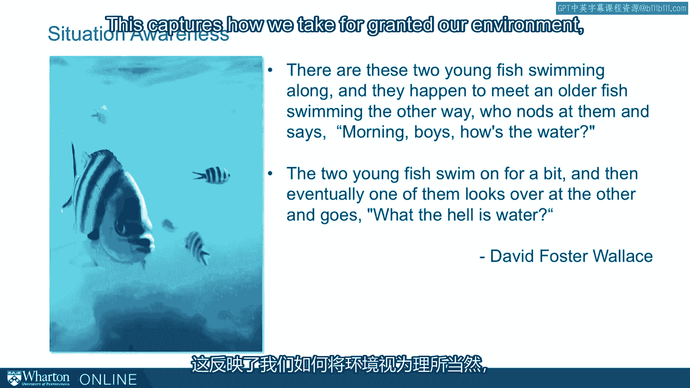

# 课程 P71：状况感知能力 🧠

在本节课中，我们将学习一个关键概念——**状况感知能力**。我们将通过一个经典的心理学实验、一个生动的比喻以及来自军事和领导力领域的实例，来理解为什么关注环境变化如此重要，以及如何培养这种能力。

---

## 一个关于注意力的测试

我们将以一个快速测试开始本节内容。

我们在这里嵌入了一段视频，视频中的人们在互相传球。你的任务是：**数一数穿白色衬衫的人传了多少次球**。请观看这段约一分半钟的视频。

[空白音频]

你看到了多少次传球？这个任务有点难度，大家的答案可能各不相同。然而，这个测试的重点其实不在于数传球。这个测试是关于**你可能注意到的其他事情**。

你看到其他东西了吗？视频中是否发生了其他有趣的事情？

让我们回看一个特定片段。这次，请更广泛地观察传球之外发生了什么。

[空白音频]

这次你肯定看到了：一个穿着大猩猩服装的人走出来，捶打胸口，然后离开了屏幕。令人惊讶的是，**相当高比例**的人在专注于数传球时，完全没有看到这只“大猩猩”。

这是一个引人注目的演示。西蒙斯和查布里斯在21世纪初重现了这个源自70年代的经典研究，用以展示和调查“变化盲视”现象——人们如何因为过于专注于某项特定任务而忽略环境中发生的变化。

我们认为，这对于理解组织内发生的事情至关重要。因此，这是一个很好的起点，并引出了“状况感知”这个概念。

---

## “水”的比喻：我们忽略的环境

为了深入探讨，我们引用大卫·福斯特·华莱士在几年前一次毕业演讲中讲的故事。他说：

> “有两条小鱼在水里游，迎面碰到一条年纪大点的鱼。大鱼朝它们点点头说：‘早上好，孩子们。水怎么样？’两条小鱼继续游了一会儿，最后其中一条看着另一条问道：‘水到底是什么东西？’”

这个比喻捕捉了我们如何将环境视为理所当然。

即使是像鱼生活的水这样基本的要素，如果我们不加注意，它也会淡入背景。重要的是，这会极大地影响我们运作和理解周遭情况的能力。

因此，我们将更深入地探讨这个问题。

---

## 什么是状况感知能力？

这里引用达美航空前CEO理查德·安德森的话：
> “领导力就像开飞机。你必须抬起头，必须对你周围发生的一切有**状况感知**。”

他并非偶然使用这个术语。这是一个已经存在数十年的短语。它的定义听起来有点技术性，但请耐心听我解释：

**状况感知**是**在特定时间和空间范围内，对环境要素的感知、对其意义的理解，以及对其近期状态的预测**。

这最初是一个军事概念。如果你有军事背景，可能听过他们谈论“SA”（Situational Awareness，状况感知）。他们在行动中不断被训练要有SA，因为它至关重要。这个概念从军事领域扩展到航空、重工业操作，现在越来越多地出现在像医院这样的行业，强调员工的状况感知能力。

我们将把它从军事和工业导航领域，扩展到**组织政治导航**领域，因为它对于理解组织内发生的事是一个非常实用的概念。

---

## 简化理解：两个关键维度

简化这个概念的一种方法是，思考环境中的要素如何随时间变化。它们的重要性如何增加或减少？风险如何增加？不确定性如何变化？这些因素对于在组织中良好生存和导航至关重要。

另一种思考方式是，沿着两个维度来看待各种状况：**重要 vs. 不重要**，以及**熟悉 vs. 陌生**。

*   **重要且熟悉**：你处于相当稳固的境地。
*   **不重要**：无论熟悉与否，都无关紧要。
*   **重要且陌生**：**状况感知变得极其重要**。

你需要敏锐地察觉自己何时处于这种“重要且陌生”的状况中，这样你才能更加小心地去理解风险、不确定性、什么在变动、什么在驱动这些状况中的行动。

这个“重要且陌生”的象限对你尤其关键。

---

## 为什么状况感知至关重要？

几年前，作家劳伦斯·冈萨雷斯进行了一项研究，他对为何在自然环境中发生事故（如雪崩、激流漂流中有人丧生）感兴趣。这些看似休闲的区域如何出了问题？

他写了一本非常有趣的书叫《深度生存》。在书的结尾，他引用了一位生存教练的话：
> “我们来自城市，学会了期望事物保持不变。但它们并非如此，这会快速或缓慢地杀死我们。”

这大致总结了他认为野外出事的原因：**人们没有意识到状况会改变**。正如生存教练所说，在我们的城市和日常生活中，状况不怎么变；但在这里（野外），它们会变。因为人们没有注意，所以陷入了麻烦。

**这就是为什么我们要强调状况感知能力**。正是你组织环境、政治环境中的**变化**会让你真正陷入麻烦。是那种悄然滋生、降低你警惕性的**自满**会让你陷入麻烦。通过强调状况感知，你可以抵消这种自满。

---

## 领导者的典范：约翰·肯尼迪

一位以状况感知能力闻名并获得广泛赞誉的领导者是约翰·肯尼迪。

在古巴导弹危机最紧张的时刻，他在思考如何应对苏联时说：
> “让我担心的不是第一步，而是双方升级到第四步、第五步。而我们不会走到第六步，因为那时已经没有人能去做了。”

正是这种推理帮助肯尼迪度过了古巴导弹危机。这也是我们希望你能领悟的那种**状况感知**。

---

## 本节总结

在本节课中，我们一起学习了**状况感知能力**的核心概念。我们从“看不见的大猩猩”实验了解到专注可能导致的盲视，通过“水”的比喻认识到忽略环境的危险性。我们明确了状况感知的定义：**感知、理解并预测环境要素**。通过“重要-陌生”象限分析，我们知道了何时需要特别提高警惕。最后，我们明白了培养这种能力是为了对抗自满、应对变化，并以肯尼迪总统为例看到了它在关键时刻的价值。

下一节，我们将更深入地探讨古巴导弹危机这个案例，进一步学习状况感知的实际应用。

[空白音频]

