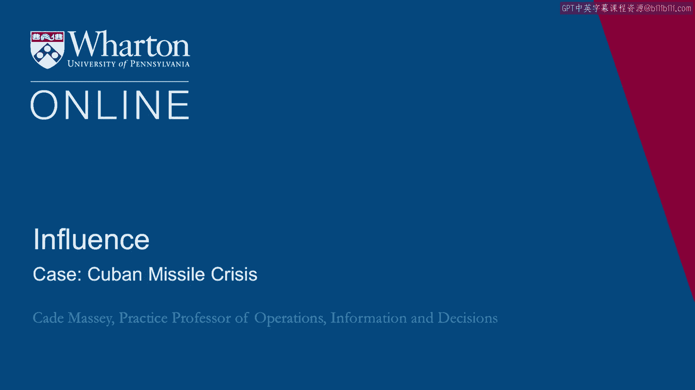
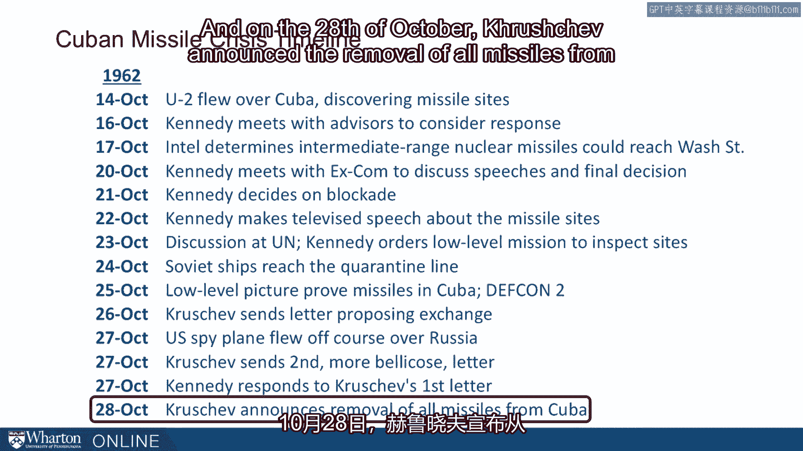

# 沃顿商学院《实现个人和职业成功（成功、沟通能力、影响力）｜Achieving Personal and Professional Success》中英字幕 - P72：8_古巴导弹危机案例.zh_en - GPT中英字幕课程资源 - BV1VH4y1J7Zk

The Cuban Missile Crisis in 1962 marked the height of the Cold War。

By all accounts， it is the closest the world has ever come to nuclear war。

This was a showdown between the United States and the Soviet Union over new missile installations。

in Cuba。 And people have used it to better understand how and why countries act the way they do。

And we can borrow the frameworks used there to understand why organizations more generally。

do what they do。 So let's first run through at a very high level what happened in the Cuban Missile Crisis。

So this was the Kennedy administration。 He had come into office in 1960。 The Bay of Pigs fiasco。

you almost never say Bay of Pigs without adding fiasco， was the。

year before in one of his first years in office。 And so Cuba had been an issue for the Kennedy administration from the beginning。

And in the fall of 1962 in a routine spy plane flight over Cuba， they discovered the， U。S。

discovered missile sites there。 And this was a great concern because of how close Cuba is to the U。

S。 and so immediately， the administration starts gathering and figuring out what they should do。

So over the next 13 days this crisis unfolded and we're just going to quickly summarize。

what happened and then in the next section we'll drop more deeply into the details underneath。

that and why we think it happened the way it did。 So Kennedy gathered this administration on the 16th of October to consider a response。

The debate in the administration was between the doves and the hawks。

This was the beginning of the term dove versus hawk actually。

There were those who wanted to use diplomacy and there were those who wanted to use military。

options including possibly a ground invasion in Cuba。 But at the very least a surgical airstrike。

So this was the big debate in the administration and of course it all leaned heavily on what。

they believed the Soviets would do in response to however the U。S。 responded。

So one of the critical moments was on the 17th that our intelligence services， U。S。

intelligence services determined that these were intermediate range nuclear missiles meaning。

they could reach all the way to the Pacific Northwest all the way up to Washington state。

So essentially the entire lower 48 of the U。S。 were within range of the missiles that were。

being installed in Cuba。 It's obviously a critical moment for security。

Kennedy had put together what became known as X-COM， executive committee of advisors。

It was run more or less by his brother Robert Kennedy who was attorney general and interestingly。

in the early meetings the feeling was that the group wasn't speaking as freely with Kennedy。

there so Kennedy excused himself from the rest of them so they could debate more freely。

But over the next few days X-COM was where the real decisions got hashed through or not。

the decisions but at least the key in the decisions for Kennedy。

Eventually they decided on a blockade。 The blockade was a middle route。

A blockade was setting up the navy some miles off of Cuba to prevent additional materials。

to come into Cuba。 It wasn't clear yet that they had everything they needed and so they didn't want any more。

Soviet ships reaching Cuba and they were going to do that with a naval blockade。

This was considered a middle option between mere diplomacy and something more aggressive。

like surgical strikes。 So Kennedy makes a televised speech。

It was one of the bigger moments in Kennedy's administration to announce that these missiles。

existed and that the US was going to take action。 They sent the ambassador to the UN to challenge the Soviet Union over this and Kennedy also。

ordered low level flights instead of the high level U2 flights， low level flights to get。

closer pictures so they can better understand what was going on there。

On October 24th the real height of this crisis was reached when the Soviet ships got to the。

quarantine line， the blockade line。 No one knew what they would do。

No one knew if they were going to run the blockade or if they would stop and honor the， blockade。

So this was when on the next day the US reached DEF CON 2 which is the military preparedness。

and awareness is the highest it's ever been。 It's the closest we've ever been to actually being in nuclear war。

This was also when we got back， the US military got back， the low level reconnaissance pictures。

and figured out for sure that there were missiles already there。

They didn't have to wait to come in on the ships that were already there and they were。

very close to being prepared for use if they wanted to use them。 On the 26th。

Khrushchev who was the premier of the Soviet Union sent a letter proposing。

an exchange that if the US would promise not to invade Cuba that Russia would， the Soviet。

Union would pull out the missiles。 This was preserving a victory of sorts for Khrushchev and it was a bit of an opening。

for the US administration。 Not this time some other things go a little bit wrong so for example completely unrelated。

to the Cuban Missile Crisis， a YouTube plane， a spy plane flew over Russia， it was shot。

down over Russia because it flew off course which was to say the least horrible timing。

for US-Soviet relations。 And about this time a second letter came across supposedly from Khrushchev that was much more。

bellicose， did not provide an opening for an exchange and those on the US side were left。

wondering what's the difference。 Why the more friendly exchange。

the first time in the more bellicose exchange， the second。

time there clearly was discord among the Soviets on what was going on and how they should respond。

Kennedy's way of dealing with this and the administration's way of dealing with this。

was to respond to the first letter， to basically ignore the second letter and to take Khrushchev。

up on his exchange， on his offer for an exchange。 And in fact there's this wrinkle in there where the US had military installations and。

hungry， missiles and hungry that were obsolete and they were about ready to pull them out。

anyway and they offered to as a part of this exchange remove those missiles from hungry。

But they also said they wouldn't say that publicly， they couldn't be seen doing that， publicly。

they would just， they promised that they would get it done。

And so essentially Kennedy and Khrushchev reached this exchange and on the 28th of October。

Khrushchev announced the removal of all missiles from Cuba and the crisis was averted。

Incredibly tense time。 People have used it from all disciplines， people have used this moment。

these 13 days， to understand politics and organizations and we think we can learn a lot about understanding。

politics and power and influence from studying it。

So in the next section we'll drop it a little more deeply into the details。 [BLANK_AUDIO]。

