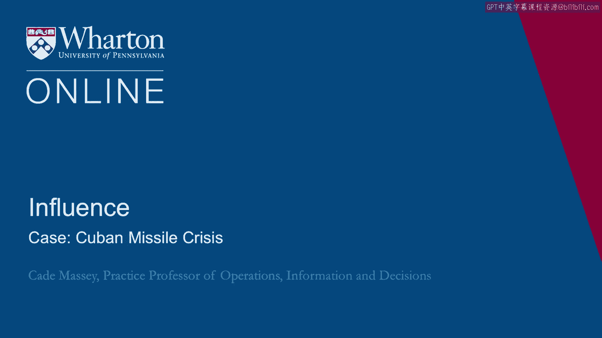

# 课程 P72：古巴导弹危机案例 🚀

在本节课中，我们将学习1962年古巴导弹危机的历史事件。我们将概述危机的关键节点，并理解它为何成为研究国家行为、组织决策以及权力与影响力的经典案例。

---

1962年的古巴导弹危机标志着冷战达到了顶峰。

普遍认为，这是世界最接近核战争的一次。

这是美国与苏联围绕在古巴部署新导弹设施的一次直接对峙。

人们利用这一事件来更好地理解国家行为的方式和原因。

我们也可以借用分析此事件的框架，来更广泛地理解组织的行为逻辑。因此，让我们首先从宏观层面回顾一下古巴导弹危机的经过。

当时是肯尼迪政府执政。他于1960年上任。猪湾事件（人们几乎总是在“猪湾”后面加上“惨败”一词）发生在他上任初期的前一年。

因此，古巴问题从一开始就是肯尼迪政府面临的一个难题。

1962年秋，在一次对古巴的例行侦察机飞行中，美国发现了那里的导弹发射场。

这引起了极大担忧，因为古巴距离美国太近了。于是，美国政府立即开始召集会议，研究应对之策。

在接下来的13天里，危机持续发酵。我们将快速总结事件经过，然后在下一节中，我们将深入探讨其背后的细节以及我们认为事件如此发展的原因。

肯尼迪于10月16日召集政府成员商讨应对方案。

政府内部的辩论在“鸽派”与“鹰派”之间展开。

“鸽派”与“鹰派”的说法实际上正是由此开始。

一方主张采用外交手段，另一方则希望采取军事选项，包括可能对古巴进行地面入侵。但至少要进行一次外科手术式的空袭。

这是政府内部的主要争论，当然，这一切都严重依赖于他们对苏联将如何回应美国任何行动的预判。

一个关键时刻出现在10月17日，当时美国情报部门判定这些是中程核导弹。

这意味着导弹的射程可以远至太平洋西北部，直达华盛顿州。

实质上，美国本土的48个州全部都在古巴部署的导弹射程之内。这对国家安全来说显然是一个关键时刻。

肯尼迪组建了一个后来被称为“执委会”（X-COM，即总统执行委员会）的顾问团。

该委员会或多或少由他的兄弟、时任司法部长的罗伯特·肯尼迪负责。有趣的是，在最初的会议中，大家感觉肯尼迪在场时，小组讨论不够自由，因此肯尼迪自行回避，以便他们能更自由地辩论。

在接下来的几天里，执委会是真正进行决策推敲（或者说至少是为肯尼迪提供决策关键意见）的地方。

最终，他们决定实施封锁。封锁是一条中间路线。

封锁是指在美国海军在距离古巴数英里的海域设立防线，以防止更多物资运入古巴。当时尚不清楚苏联是否已运入所有所需物资，因此他们希望阻止更多苏联船只抵达古巴，计划通过海军封锁来实现。

这被认为是介于单纯外交和更激进手段（如外科手术式打击）之间的一个折中选项。

于是，肯尼迪发表了电视讲话。这是肯尼迪政府任内的重大时刻之一，他宣布了导弹的存在以及美国将采取行动。

他们派大使到联合国就此事质询苏联，肯尼迪还下令进行低空侦察飞行（而非高空的U2侦察），以获取更清晰的照片，从而更好地了解当地情况。

10月24日，当苏联船只抵达隔离线（即封锁线）时，危机达到了真正的顶点。无人知晓他们将作何反应。

无人知晓他们是会强行突破封锁，还是会停下来遵守封锁。

因此，在第二天，美国将战备状态提升至**DEFCON 2**（二级防御戒备状态），这是美军战备和警戒级别有史以来的最高水平。这是我们最接近实际爆发核战争的一次。

也正是在此时，美军获取了低空侦察照片，并最终确认导弹已经部署到位。

它们无需等待正在途中的船只运抵，而且如果苏联愿意，这些导弹几乎已处于随时可用的状态。

10月26日，苏联领导人赫鲁晓夫送来一封信，提议进行一项交换：如果美国承诺不入侵古巴，苏联将撤出导弹。

这在某种程度上为赫鲁晓夫保全了颜面，也为美国政府提供了一个突破口。

但与此同时，发生了一些其他意外。例如，一架U2侦察机（与古巴导弹危机完全无关）在飞越苏联时偏离航线，被击落。这至少可以说是美苏关系最糟糕的时机。

大约此时，据称来自赫鲁晓夫的第二封信送达，语气变得**更为好战**，没有提供交换的余地。这让美方感到困惑：为何会有这种差异？为何第一次来信态度较为友好，而第二次却如此强硬？

显然，苏联内部对于局势及如何应对存在分歧。

肯尼迪及政府处理此事的方式是：回应第一封信，基本忽略第二封信，并接受赫鲁晓夫进行交换的提议。

事实上，这其中还有一个细节：美国在土耳其部署的导弹已经过时，本就计划撤除。他们提出作为此次交换的一部分，从土耳其撤走这些导弹。

但他们也表示不会公开承认此事，不能让人看到他们公开这样做，他们只是承诺会完成撤除。

因此，实质上肯尼迪与赫鲁晓夫达成了这项交换。10月28日，赫鲁晓夫宣布从古巴撤走所有导弹，危机得以避免。

那是一段极其紧张的时期。来自各个学科的人们都利用这一时刻、这13天，来理解政治与组织行为。我们认为，通过研究它，我们可以学到很多关于理解政治、权力与影响力的知识。

在下一节中，我们将更深入地探讨其中的细节。

[空白音频]

---

**本节课总结**

本节课我们一起回顾了古巴导弹危机的关键时间线与决策过程。我们看到了危机如何从侦察发现开始，经历政府内部“鸽派”与“鹰派”的激烈辩论，最终通过封锁（中间路线）和秘密外交交换得以解决。这次事件不仅是最接近核战争的时刻，也为我们理解国家与组织在高压下的决策、权力博弈以及沟通策略提供了经典框架。下一节，我们将深入分析这些决策背后的深层逻辑。