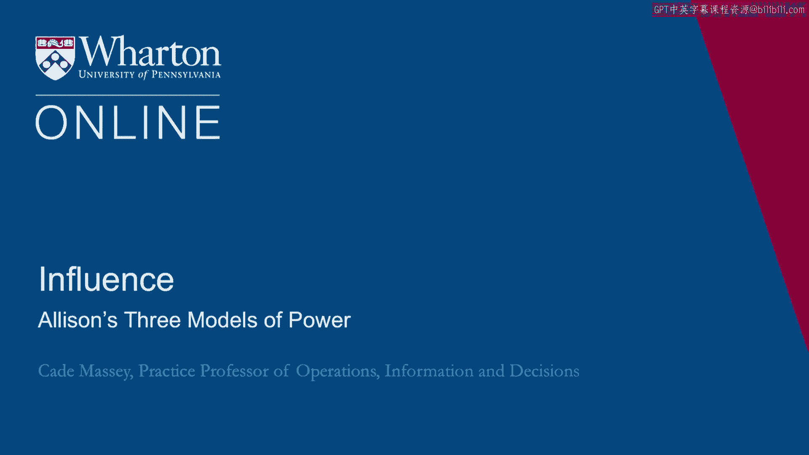
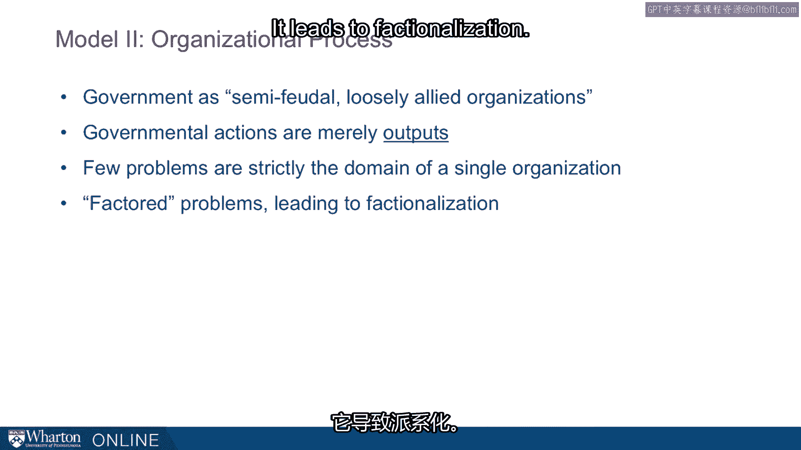

# 沃顿商学院《实现个人和职业成功（成功、沟通能力、影响力）｜Achieving Personal and Professional Success》中英字幕 - P73：9_艾莉森关于权力的三种模式.zh_en - GPT中英字幕课程资源 - BV1VH4y1J7Zk

In 1969， political scientist Graham Allison published a profoundly influential paper called。

"Conceptual Models and the Cuban Missile Crisis。"。

His motivation was to suggest that there were multiple ways we could understand why countries。

do what they do。 And yet， political science had only focused on one of those ways。

So he used the Cuban Missile Crisis as a case study to better understand， to illuminate。

three different models you could bring to explaining international behavior， governmental， behavior。

So the three models， we'll go to each of these in more details， but the three models were。

model one， the rational analysis， model two， organizational process， and model three， bureaucratic。

politics。 So， model one， rational policy， rational analysis。 In this model。

the national government is a unitary actor。 So there's no dispersion of interest underneath it。

It's just a solitary actor。 You can think of it as a person， essentially， a single solitary actor。

And then that actor is rational。 This is a critical bit。

There's no room for biases or misunderstanding of lack of information。

This is a rational decision maker。 And each action you observe then is part of a strategic objective。

according to some plan， to accomplish the goal。 And this has been the default way of analyzing governmental behavior。

So in the Cuba case， how might that explain what we observed？

So consider the options that the US had in responding to discovering these missiles in， Cuba。

They could do nothing。 That wasn't going to happen。 They could use diplomacy。

which was one option that was definitely debated。 They could approach Cuba secretly to see if they could work out a deal。

They could use the blockade， which is ultimately what they decided。

They could have used surgical airstrikes， which was probably the single most heavily considered。

alternative to the blockade。 Or they could do a full-scale invasion。

What does the rational model say about what we observe？ Well。

it suggests that it was the rational choice to do the blockade。

It was best because it was the middle course of action， not as extreme as either diplomacy。

or military intervention。 It put the onus back on Khrushchev。

So the Kennedy administration felt the burden of choice here。

And they might have wanted to return it back to Khrushchev and find out what he wanted， to do。

And then it limits the engagement。 This was a critical part of the debate there。

that it's not as big a commitment， obviously， as involving your military。

So there's a little bit of an engagement， enough of an engagement to so that they're serious。

but not a full-scale engagement。 And then finally and importantly。

it showed that the US has a military advantage， especially， in this part of the world。

So on conventional military arms at this time， the US had an advantage， and it would demonstrate。

that and that would be an important signal to the Soviet Union as they decided how they。

wanted to respond。 So there are all these rational reasons and there's a single interest that the government。

wanted to accomplish， and that would help us explain what happened。 But that's only one way。

Another model， this is where Allison really starts digging in， is what he called organizational。

process。 And in this model， the government is not a unitary actor。 It's a semi-futile。

loosely-aligned organization。 So you can think of it as， you know， you've got different departments。

you've got different， interests， you've got different groups trained in different ways。

and they may not all have， the same way of thinking about things。

They may not even have all the same interests。 In this model， the governmental actions are outputs。

They're not a choice an organization makes。 It's just an output of a routine as they went about their business。

Interestingly， few problems in organizations， especially governments， are strictly the domain。

of a single part of the organization。 They're factored。

They get divided into split-across organizations。 And this can lead to difficulty in coordination。

at least to factionalization。

And it emphasizes that this isn't in fact a choice the organization's making as much。

as just the outcome of these factionalized parts of the organization going about their， business。

So there's a great quote Allison has in this article。 He says。

"The best explanation of an organization's behavior at T is T minus one。"， What he means by that is。

if you want to understand why an organization did what they did today。

just look at what they did yesterday。 There's so much inertia。

There's so much routine in an organization that a lot of what we observe at any given。

moment is just a product of what they've been doing。 So how does this explain Cuba？

What organizational routines influence the outcome here？

So one set of routines were around intelligence gathering。

So there were bits of information that were collected by various intelligence agencies。

Lumber ships rode very high in the water。 That was odd because lumber ships should be full of lumber and therefore they should。

be low in the water。 There was a Cuban and a bar ranting about what was going on down there。

There was a view at one point of a missile profile。

But these were in different parts of the organization。 There was no routine for aggregating those。

And so they never rose up into some conclusion。 This anticipates some of the critique of the intelligence community at 9/11 as well。

The routines just weren't built for aggregating into a solitary organization。

There was a delay in scheduling surveillance flights due to interagency conflict。

The intelligence agencies wanted to fly the planes but the military organizations wanted。

to fly the planes。 And until they could get that settled they didn't fly the planes。

And so they gathered intelligence more slowly than they would have otherwise。

And then in one of the most profound examples the configuration of the Soviet missile bases。

made a difference here。 So here's a map and this actually comes from the lower level reconnaissance flights that。

took place later in the crisis。 But you can see the installation here。

And this is a close up version of what they observed on the first day of the crisis when。

they thought there might be missile installations in Cuba。 How did they know that？

They knew that because each of the elements of this missile site， the tanks， the trucks。

the tents that cover the missile materials are laid out in the exact same way in Cuba as。

they are at every other Soviet missile site in the world。

So there is a routine the Soviet military had for setting up missile sites。

The commander that is in charge here locally gets there。 His materials arrive。

He opens up the Soviet handbook for how to set up a missile site and he starts following， the plan。

That routine made it trivial really for the U。S。 to diagnose when they saw this picture。

that this was a Soviet missile site。 Purely the product of organizational process。 Other examples。

So analysis， at one point the U。S。 considered these mobile missiles。

They classified them as mobile missiles。 And that changed the way the administration thought about how they should respond because。

they thought if they're mobile they're going to move as we deploy surgical strikes。

But it turned out that was merely a semantics essentially that even though it was called。

mobile it wasn't so mobile that the strikes wouldn't have worked and yet it affected the。

decision making at the most important moment the decision making of the U。S。 government。

The processes around implementing the blockade。 So for example in a moment that's caught in the movie 13 days which is a fantastic movie。

about this whole thing。 The naval blockade， there's a certain way naval blockades are set up。

They've been done the same way for essentially centuries and yet the kid of the administration。

wanted to set them up differently。 The kid of the administration wanted to set them up closer to the country to give the Soviet。

more the Soviets more time。 They wanted more distance between the ships and the blockade。

They wanted to give the Soviets more chance to turn around essentially。

This was a major point in contention with the Navy because as they said we've been setting。

up blockades since the days of John Paul Jones and they were reluctant to do it differently。

even though it was fundamental to how the U。S。 navigated this crisis。

And then finally there were all these routinized activities that sent kind of false signals。

about what was going on。 We mentioned the U2 flight over Russia。

Also there was a nuclear test often in the Pacific theater that was again completely unrelated。

to what was going on between the U。S。 and Soviets and Cuba。 But how would the Soviets know that？

As one person said in fact this was Kennedy。 There's always one son of a bitch who doesn't get the message。

Just routines just organizational processes but dangerously provoking the situation as， a result。

The third model that Allison suggests is bureaucratic politics。

And in this model policy is the outcome of bargaining games。

Heath in this model thinks about organizations as participants， players with different positions。

interest， ambitions and where you are。 What position you're in。

what placement the organization influences your decision。

And the outcome rather than a solitary actor making a single rational decision is just this。

output of all these different negotiations。 So a quote he has here that captures it well is where you stand depends on where you sit。

This I hope begins to demonstrate to you the connection between this military governmental。

situation and your organization because we think things like this greatly apply to most。

organizations where you stand depends on where you sit。 So some examples here from this case。

What were the interest and abilities of the key players here？

This whole event carried extra weight for Kennedy because he was mid term。

He was a couple just a little bit more， two years away from election， a year away from。

the campaign beginning。 He had been seen as weak among his critics on military matters and so he faced this extra。

risk of anything on the diplomatic side of things because of the political consequences。 Moreover。

the Bay of Pigs still loomed large for them。 This was a complete fiasco in his first year in office and that meant that there was extra。

weight on this crisis as well。 And then there were key alliances within the organization。

So probably the most important was between Kennedy and his brother Robert， the attorney， general。

What if Robert Kennedy had been in favor of bombing？

Would that have made a bigger difference than the advocates that did exist were typically。

military guys。 The president Kennedy was closer to his brother than the military leaders so the fact that。

Robert Kennedy was inclined that way probably made a difference。

What if McNamara hadn't been reluctant to employ the military？

McNamara was the secretary of defense and again somebody that had a lot of influence over， Kennedy。

McNamara was slow。 He was reluctant to engage the military in the way that the actual military leaders wanted。

them engaged。 So it seems like in this situation the individuals。

the dispositions of the individuals and the alliances。

they had made a very big difference in what happened。

So when you approach problems with a model three mindset you not only navigate the politics。

of your own organization but it helps you understand the politics of the other organization。

perhaps， the organization that you're negotiating with。

So this led to Kennedy responding to the first of Christchoff's messages， not the second。

of Christchoff messages。 There are tapes of the conversations of the ex-com meetings where advisors are trying to。

they're advocating different views of what's going on in the Soviet Union and they're trying。

to understand how can you reconcile the first message with the second。

And some of them come to believe， "Well， we think Christchoff is in this position。

He has these interests。 He has these constraints and the best way to get to him is to ignore the second letter。

appeal to the first and that kind of reasoning helped Kennedy offer the exchange and ultimately。

encourage persuade Christchoff to pull missiles out of there。"， So to recap。

Allison's models of organizational politics which we're talking about here in。

governmental situations because we think they're relevant in a non-governmental model one。

rational analysis， this model explains an outcome as the optimal response for the organization。

as a whole to a specific set of conditions and objectives very rational and this has。

been the traditional way of thinking about organizations。 Model two， organizational process。

This model explains an outcome as the result of systemic pressures and routinized behavior。

The key to applying this framework is to think of an outcome as being the byproduct of activities。

the byproduct of activities and imperatives not specifically intended to produce that outcome。

And then model three， bureaucratic politics。 The model explains outcomes as a product of the accumulated preferences and strategies。

of people or sub-organizations。 Sometimes negotiations are between parts of the organization making up an organization。

So here's a quick summary。 You could think about the logic of these models being rational in model one。

routine in model， two and bargaining， rational routine or bargaining。

You can think about the locus of them bearing as well。 Model one。

the locus is the organization as a whole。 Model two is more the division or function and then model three is more the individual。

And you can also think about what they manifest。 Model one manifests choice of the organization。

Model two is more an output， more byproduct and model three is more an outcome。

All these individual bargains， negotiations going on bubble up to an outcome for the organization。

[BLANK_AUDIO]。

