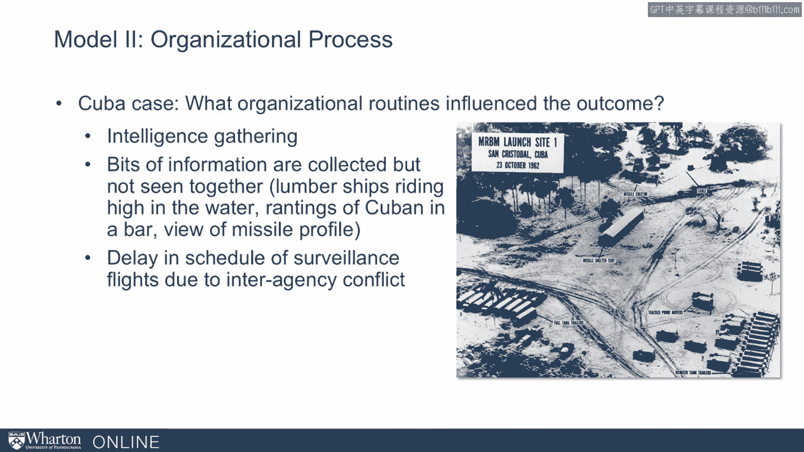
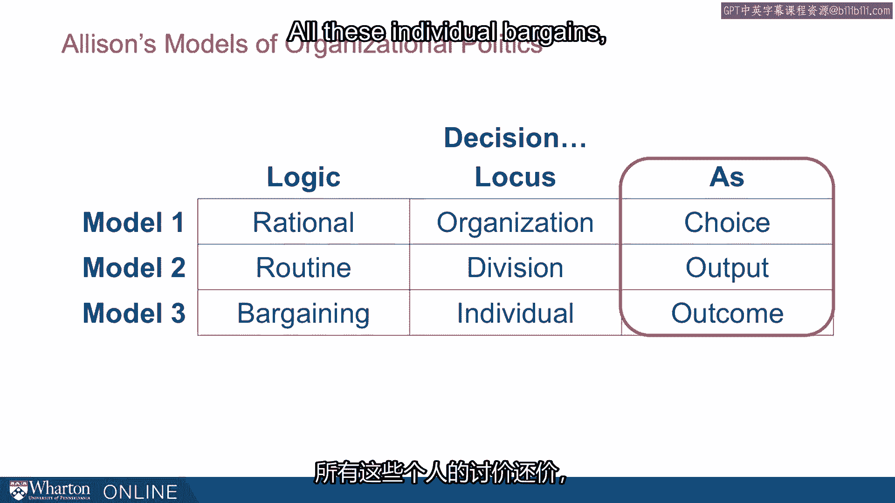

# 沃顿商学院《实现个人和职业成功》课程笔记 P73：艾莉森关于权力的三种模式 🧠

在本节课中，我们将学习政治学家格雷厄姆·艾莉森提出的三种分析组织行为的模型。这些模型最初用于解释政府行为，但其核心思想同样适用于理解我们日常工作中的团队、公司等任何组织。我们将逐一探讨理性分析、组织过程和官僚政治这三种模式，并通过古巴导弹危机的经典案例来理解它们的应用。

---

## 1. 模型一：理性分析 🧮

上一节我们介绍了艾莉森模型的背景，本节中我们首先来看看第一种模型：理性分析。

在这个模型中，国家政府被视作一个**单一的、统一的行动者**。它就像一个独立的个人，其内部没有分散的利益。这个行动者是**完全理性的**，这意味着决策没有偏见、误解或信息缺失。我们观察到的每一个行动，都是其为了实现某个战略目标、按照某个计划而采取的一部分。这是分析政府行为的传统默认方式。

在古巴导弹危机的案例中，美国发现了苏联在古巴部署的导弹，面临多种选择。以下是美国当时可能采取的行动选项：
*   **不作为**：这不太可能发生。
*   **外交手段**：这是一个被认真讨论的选项。
*   **与古巴秘密接触**：试图私下达成协议。
*   **海上封锁**：这是美国最终的决定。
*   **外科手术式空袭**：这是除封锁外被考虑最多的替代方案。
*   **全面入侵**。

理性模型如何解释美国最终选择了封锁呢？它认为封锁是**理性的最佳选择**，原因如下：
*   它是**中间路线**，不像单纯外交那么温和，也不像军事干预那么极端。
*   它将**选择压力转移给了赫鲁晓夫**，让苏联领导人承担下一步决策的负担。
*   它**限制了冲突的规模**，不是全面的军事介入，但足以表明美国的严肃态度。
*   它**展示了美国在该地区的常规军事优势**，向苏联传递了重要信号。

因此，理性模型认为，政府作为一个单一行动者，基于一系列理性原因和一个统一的利益目标，做出了最优决策。

---

## 2. 模型二：组织过程 ⚙️

上一节我们介绍了将组织视为单一理性行动者的模型，本节中我们来看看艾莉森深入探讨的第二种视角：组织过程模型。

在这个模型中，政府**不是一个统一的行动者**，而是一个**半自治、松散联合的组织集合体**。它由不同的部门、拥有不同利益和思维方式的群体组成。政府的行动被视为**组织常规运作的“输出”**，而非一个有意识的“选择”。组织中的问题很少只属于单一部门，它们通常被分解并分配给不同部门处理，这可能导致协调困难甚至部门割裂。

艾莉森有一句名言很好地概括了这一点：“**一个组织在T时刻行为的最佳解释，就是它在T-1时刻的行为。**” 意思是，要理解组织今天为什么这么做，只需看它昨天做了什么。组织内部存在巨大的惯性和例行程序。

那么，组织过程模型如何解释古巴导弹危机中的事件呢？以下是几个关键的组织常规如何影响结果的例子：
*   **情报收集的常规**：不同情报机构收集了零散信息（如运木船吃水过浅、酒吧里古巴人的醉话、疑似导弹轮廓），但**缺乏汇总这些信息的例行程序**，因此未能及时形成结论。
*   **机构冲突导致延误**：情报机构和军方在谁负责侦察飞行上存在冲突，导致侦察计划被延迟，情报获取变慢。
*   **苏联的军事常规**：美国通过侦察照片识别出古巴的导弹发射场，正是因为**苏联军队有设置导弹阵地的标准化操作手册**。当地指挥官完全按手册布置，使得美方一眼就能认出。
*   **语义分类的影响**：美国将一些导弹归类为“机动式”，这影响了决策层对空袭效果的判断。尽管所谓“机动”能力有限，但**分类上的语义差异**在关键时刻影响了政府决策。
*   **海军封锁的常规**：肯尼迪政府希望调整传统海上封锁的布置方式（如更靠近古巴以给苏联更多反应时间），但**海军因循几个世纪以来的惯例**，不愿改变，这成为双方争执的焦点。
*   **例行活动发送错误信号**：例如，一架U-2侦察机误入苏联领空，或在太平洋进行的核试验等**完全无关的例行活动**，都可能被对方误解为挑衅信号，危险地加剧了紧张局势。

---

## 3. 模型三：官僚政治 🤝

上一节我们看到组织行为如何被例行程序所驱动，本节中我们来探讨第三种模型：官僚政治模型。

在这个模型中，政策是**一系列“讨价还价游戏”的结果**。组织被视为由不同参与者（玩家）组成的竞技场，每个参与者都有自己的职位、利益和野心。**“你所持的立场取决于你所坐的位置”** 这句名言精准地捕捉了其精髓。最终的结果并非单一理性决策，而是所有这些不同谈判和博弈的“输出”。

这个模型非常有助于我们理解自己所在的组织。在古巴导弹危机中，关键人物的个人利益和能力产生了重大影响：
*   **肯尼迪的个人处境**：他处于任期中期，即将面临选举，在军事问题上曾被批评为软弱。因此，他在处理危机时承受着额外的政治风险。“猪湾事件”的失败也让他在此次危机中压力更大。
*   **关键联盟的影响**：肯尼迪与其弟弟、司法部长罗伯特·肯尼迪的联盟至关重要。如果罗伯特支持空袭，其影响力可能远大于军方倡导者。国防部长麦克纳马拉对动用军事手段的迟疑态度，也显著影响了最终决策。
*   **理解对方的政治**：运用模型三的思维，不仅有助于处理己方内部政治，也能帮助理解对手（如苏联）的内部政治。例如，肯尼迪最终选择回应赫鲁晓夫的第一封相对温和的信件，而忽略第二封更强硬的信件。他的顾问们正是基于对赫鲁晓夫在苏联内部所处位置、利益和约束的分析，才提出了这一策略，最终促使苏联撤出导弹。

---

## 总结 📝

本节课中，我们一起学习了格雷厄姆·艾莉森提出的三种分析组织（包括政府）行为的核心模型。它们为我们理解“权力”如何运作、决策如何产生提供了不同的透镜。

我们来快速回顾一下：
*   **模型一：理性分析**。此模型将结果解释为组织作为一个整体，针对特定条件和目标做出的**最优反应**。其逻辑是 **`理性`** 的，关注点是**组织整体**，表现为组织的**有意识选择**。
*   **模型二：组织过程**。此模型将结果解释为**系统性压力和例行化行为**的产物。其逻辑是 **`常规`** 的，关注点是**部门或职能**，表现为组织运作的**输出或副产品**。
*   **模型三：官僚政治**。此模型将结果解释为**个人或子组织**的偏好与策略博弈的产物。其逻辑是 **`谈判`** 的，关注点是**个人**，表现为多方博弈后**浮现的结果**。

理解这三种模式，能帮助我们在复杂的组织环境中更透彻地分析行为、预测结果并有效地施加影响。