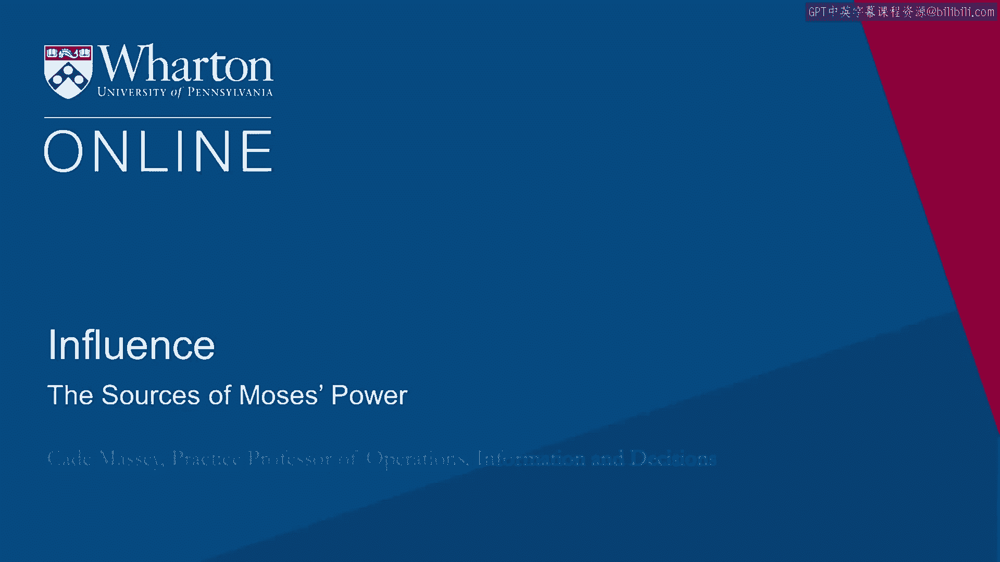
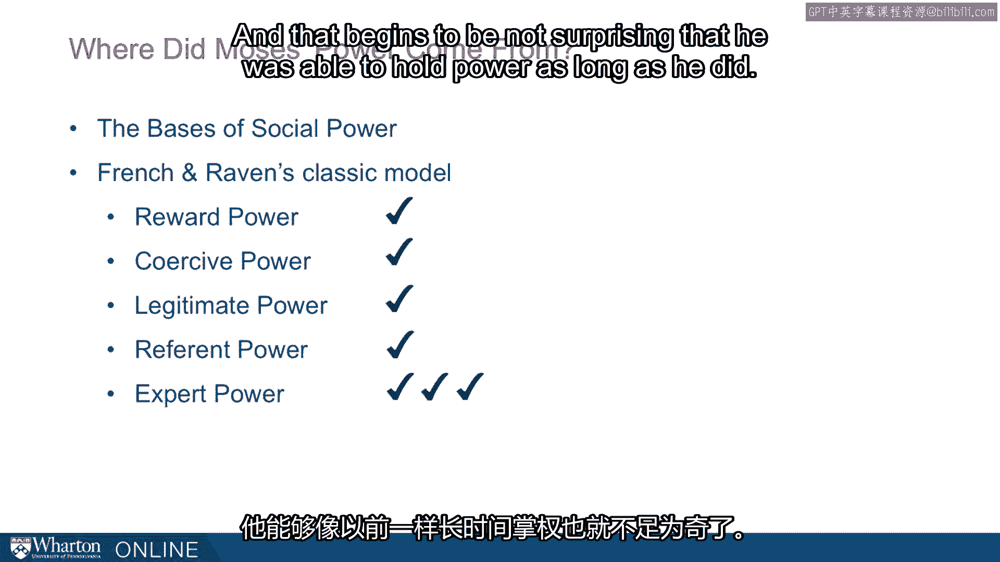
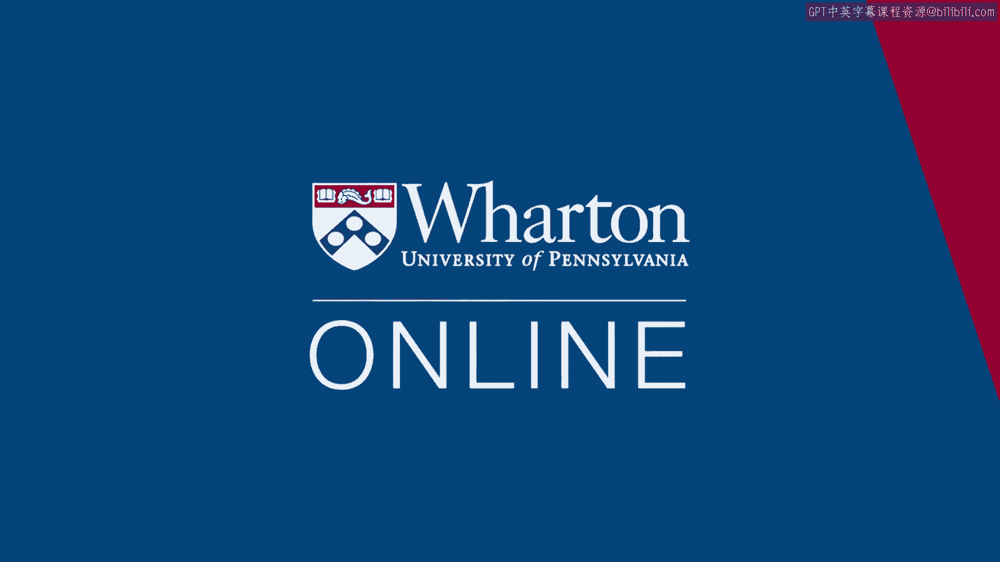

# 沃顿商学院《实现个人和职业成功》课程笔记 - P76：权力的来源 🏛️

在本节课中，我们将探讨罗伯特·摩西权力的来源。通过分析这位20世纪纽约最具影响力的人物，我们可以理解如何从多个维度构建和维持权力。

---

如果罗伯特·摩西是20世纪纽约市最具影响力的人物，这个说法非同寻常。因此，理解他的权力来源很有价值。

上一节我们介绍了弗伦奇和雷文的社会权力基础框架。本节中，我们来看看摩西的权力具体来源于哪些方面。

以下是基于弗伦奇和雷文框架，对摩西权力来源的逐一分析：

*   **奖赏性权力**：摩西能够奖赏那些与他合作的政客、地主和承包商。他本人不以权谋私，只领取一美元年薪，并出身富裕家庭，但他确保其他人能从他的项目中获利。
*   **强制性权力**：市长拉瓜迪亚之所以不愿反对他，原因之一就在于摩西的触角伸及众多领域。如果拉瓜迪亚在一个地方反对他，摩西可以在另一个地方进行报复。连纽约市长都受到这种制约，其他人更难以免疫。
*   **合法性权力**：他所担任的职务赋予了他这种权力。仅凭头衔，人们就会对他表示顺从。
*   **参照性权力**：这一点很有趣。一个拥有如此多其他权力来源的人，本可能不在乎形象或魅力。但根据卡罗的调查，摩西其实非常善于外交，他刻意讨好媒体，甚至关心一些令人惊讶的细节，例如活动邀请函所用卡纸的质量。他非常在意参照性权力。
*   **专家性权力**：他是在桥梁、隧道和基础设施项目方面的专家。世界各地的市政当局都派人到纽约向他学习。他在建筑工程和施工管理方面被公认为专家。但这只是他专家权力的一个来源。

摩西还擅长其他领域。仅从故事中我们就知道，他是一位法案撰写专家，被誉为“奥尔巴尼最好的法案撰写人”。他并非立法者，却获此声誉。因此，他拥有这一额外的专家权力来源。

最后，他帮助发展了通过“管理局”进行融资的整个概念。在融资方面，他的专业能力在当时基本上领先于所有人。因此，他拥有这三个专家权力来源。其中任何一个都足以成就一番事业。我们一生中能在一个领域达到他那样的专家水平就已属不易，而他在三个领域都做到了。

---

纵观这个权力清单，你会发现摩西运用了每一种权力来源，在某些情况下甚至是多次运用。这样一来，他能够长期掌权就不再令人惊讶了。

关于权力，我们了解到：权力越持久，通常来源于越多的渠道。摩西的权力正如我们所见的那么持久，而他恰好运用了弗伦奇和雷文提出的所有重要权力来源，这应该在我们的意料之中。

---

本节课中，我们一起学习了如何运用弗伦奇和雷文的权力基础框架来分析具体人物。通过拆解罗伯特·摩西的权力构成，我们看到持久的权力往往不是单一的，而是**奖赏权**、**强制权**、**合法权**、**参照权**和**专家权**等多种力量共同作用的结果。理解这些来源，有助于我们更全面地认识影响力的构建方式。