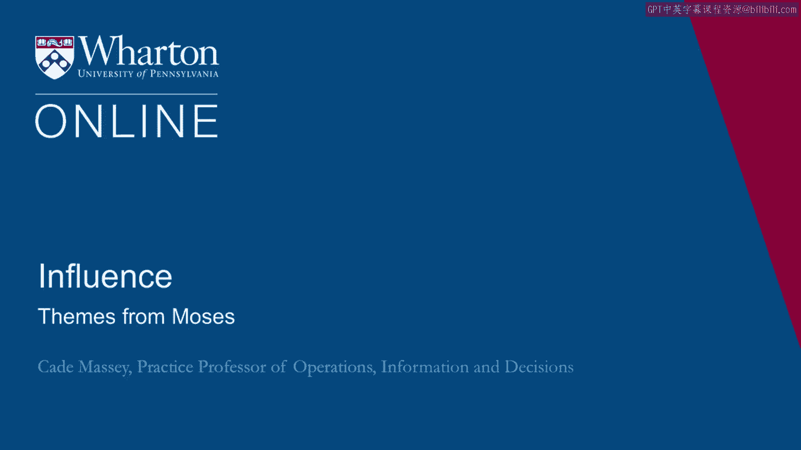
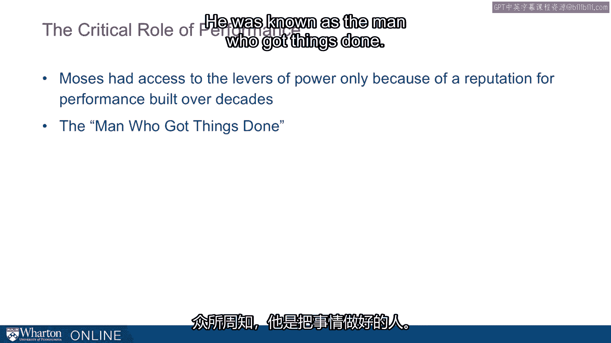
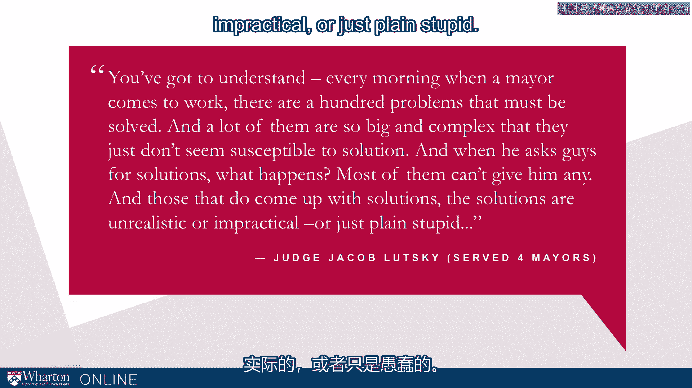
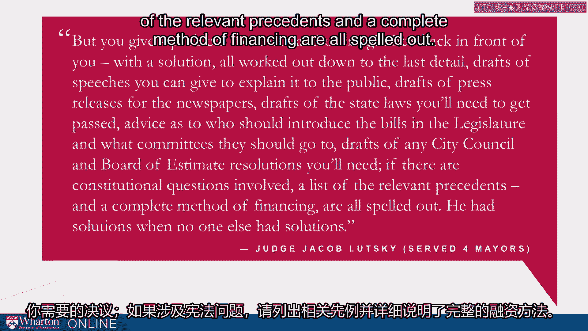
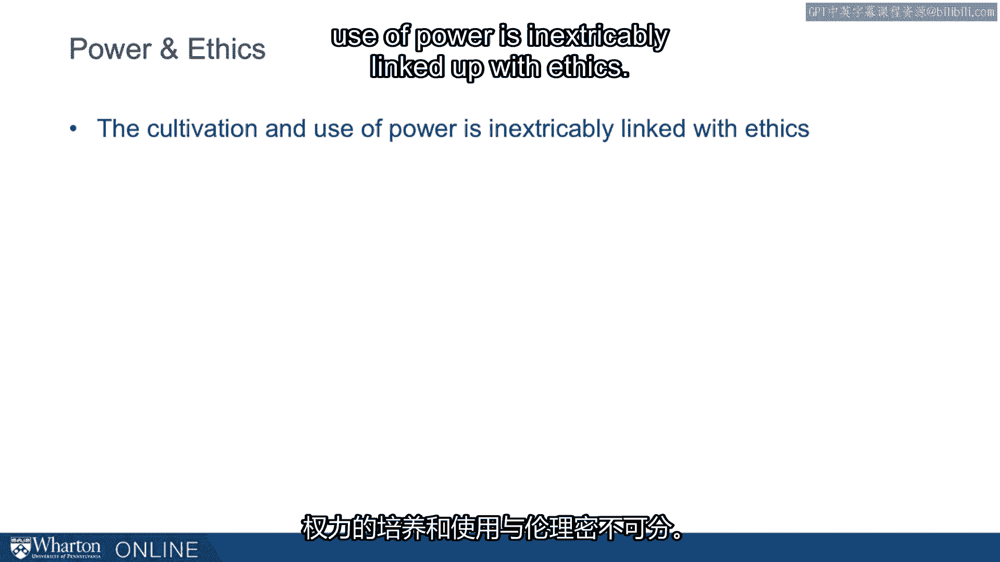
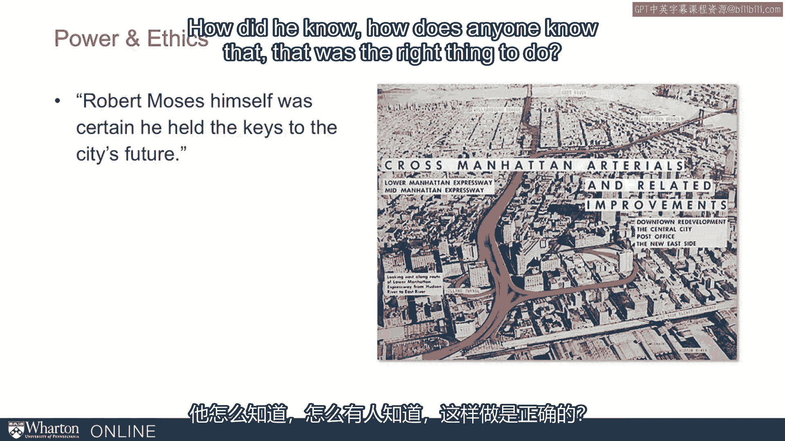
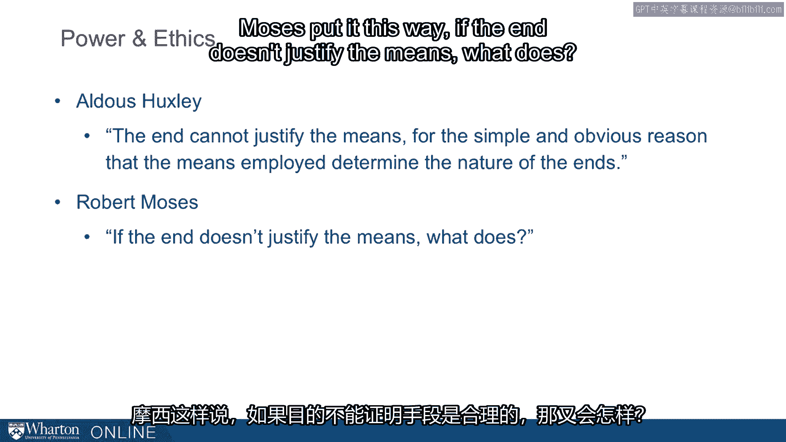
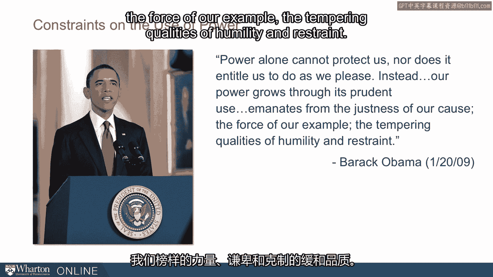
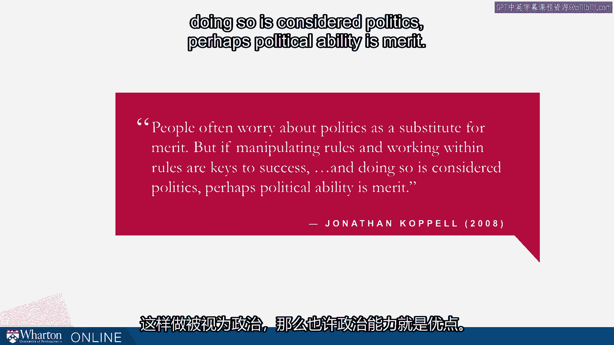

# 沃顿商学院《实现个人和职业成功（成功、沟通能力、影响力）｜Achieving Personal and Professional Success》中英字幕 - P77：13_从摩西获取的启示.zh_en - GPT中英字幕课程资源 - BV1VH4y1J7Zk

So we've seen that Moses illustrates all five of the bases of social power that。

French and Raven talk about， but he is such a rich study in power and such an。

interesting character that we can understand other aspects of power through， him as well。

He illustrates some issues we've already talked about and some that。

we will talk about for the rest of the class。 So let's consider other factors。

that affected how much power and influence he wielded。 So we'll talk about， performance。

organizational process， agency and ethics。 First， performance。

Moses had access to these levers that he pulled only because of his reputation， built over decades。

We drop you into a story that happens kind of mid-career。

for him but we're skipping over decades of work and reputation building that he。

had gone through that kind of gave him that earned him the confidence of。

legislators and mayors that allowed him to secure the power and the。

processes that protect him for decades。 He was known as the man who got things。

done。 The newspaper talked about this， the man who got things done。 How would you。

like to have the reputation as the man or the woman who gets things done？ What a， fantastic thing。

I'm emphasizing it here because it's easy to look at levers of。

influence and on topics like we're talking about in this course and think。

that they are alternatives to performance。 There is no alternative to， performance。

Performance is the necessary part。 It is what you're。

levering with all of these tools of influence but without the performance。

you don't have anything to lever。 So Moses is actually a great example of that。

despite how good he was with levers of influence， despite how he captured。

organizational processes in ways that might feel pretty nefarious。 He had。

first and foremost performance。 There's a great quote from Jacob Lutsky who was a。

judge under four mayors in New York。 This is elsewhere in Caro。 I think it's， worth seeing in full。

Lutsky says you've got to understand every morning when a。

mayor comes to work there are a hundred problems that must be solved and a lot。

of them are so big and complex that they just don't seem susceptible to， solution。

And when he asks guys for solutions what happens？ Most of them can't， give him any。

And those that do come up with solutions， those solutions are so。

unrealistic or impractical or just plain stupid。 But you give a problem to Moses。

and overnight he's back in front of you with the solution all worked out down to， the last detail。

Drafts of speeches you can give to explain to the public。 Drafts of。

press releases for the newspapers。 Drafts of the state laws you'll need to get， passed。

Advice as to who should introduce the bills in the legislature and what， committees that you go to。

Drafts of any city council and board of estimate， resolutions you'll need。

If there are constitutional questions involved a list。

of the relevant precedents and a complete method of financing all spelled。

out。 He had solutions when no one else had solutions。 This is amazing right？ How。

much would you give to be this kind of employee？ This kind of leader？ This kind， of manager？

This is the reputation he had。 This was the basis of his power and we， shouldn't forget it。

Performance is the basis。 Performance is the necessary bit。 Second， organizational process。

We talked about this earlier in this module with， Allison's models of power。

This is the model two organizational process。 Fefert。

Jeff Fert for the organizational scholar puts it this way。 It is often the。

case that exercising power creates enemies who constitute a threat to your。

long-term organizational survival。 Thus in developing and exercising power is。

important to you structural mechanisms that institutionalize your power and。

diffuse responsibility for decisions and actions。 This institutionalization is。

great so it's not just you it's not just your ability to persuade people。 It is。

institutionalizing in the organizational processes your preferences and your， goals。

Given the nature of rules and structure what are the implications for。

you as a manager one is to recognize via Allison as Allison talks about that。

these processes are not always established in the best interest of the， organization。

They can come about because of private agendas competing interest。

They often just persist out of benign neglect so it's not like they're， optimized。

They are there for often haphazard reasons and so they are right。

for tweaking either towards the rational direction or your interest。

Hopefully the rational interest but they can be your interest within the。

organizations toward whatever goals you're trying to achieve。 The second。

implication is should be apparent now from from Moses in particular is that。

you shouldn't accept these processes as a given。 They are essentially cards that。

are dealt and redelked continuously。 You can and should influence the dealing。 Why。

take these as passive？ This is going to be a theme that we pick up on in a little。

more detail with Moses and then throughout the course don't accept， circumstances as fixed。

Don't be passive with regard to your environment and in。

particular this thing that so many neglect that this thing that people don't。

appreciate how influential they are。 Organizational processes， bureaucracy， don't。

neglect that as something that can be moved in the direction of your goal。 That。

takes us to agency a third theme in the Moses example。 This notion that rule。

breakers are especially influential。 Rodrigo Kanalas， a sociologist at Yale。

talks about how essentially they are for innovation。 He studies it in the。

micro credit environment and it's been talked about more broadly。 Fefra again。

says if you have all the power you want or need by all means not only follow the。

rules but encourage everyone else to do so too。 But if you are still traversing。

your path to power take all this conventional wisdom and quote rule。

following with the big grain of salt。 Fefra saying great for those in power of。

course you want people to live by the rules but if you're not in power you've。

got to challenge the rules because in general the rules are built to protect， those in power。

So as you're traversing your path to power as Fefra says you。

almost necessarily have to challenge the rules and there's some optimal amount of。

rule breaking that needs to be done。 So the definition of agency is to act to。

exert control over one's environment and we find that this is a vital。

characteristic of powerful people。 They actively shape the situations they face。

rather than passively accepting what they find。 This is stacking the deck。 This is。

not playing the cards your delt。 There's a time and place to play the cards your， delt。

There's a certain philosophy there that is helpful in some。

situations but we're actively encouraging stacking the deck here。 This is。

exercising agency in your environment。 Now hopefully you see that the cultivation。

and use of power is inextricably linked up with ethics。 You can't read the most。

example you can't hear about the most example without worrying a little bit。

about okay was that okay？ I mean in a lot of ways that wasn't okay and that's。

going to come up with every exercise of power。 We've just talked about agency。

How did you react when we talked about agency in that way？ Do you blanch a little， bit？

Are you uncomfortable？ I hope you are uncomfortable because it shouldn't be。

okay to go crashing through every wall and breaking every rule。 That's not。

probably the best course of action for you or your organization。 So there's always。

going to be this tension between exercising that much agency， between， capturing， influencing。

bending organizational processes and ethics。 And， we're raising it now。

We'll continue to discuss it through the rest of the course。

and if you're not a little uncomfortable we want you to be a little uncomfortable。

Something I like about Moses and one of the reasons we use the most of these。

examples is that it provokes us to think more deeply about what is okay and what。

is not okay as we cultivate and use power。 So an example from Moses's own。

life was a proposal that he made later in his career。 This kind of proposal came。

from a conviction that he had。 Carol puts it this way。 Robert Moses himself was。

certain he held the keys to the city's future。 That's amazing conviction right？

When you are certain you hold the keys to the city's future。 It licenses pretty。

much whatever you want to do。 One of the things he wanted to do and one of the。

first big projects he wasn't able to do was the cross Manhattan arterial。 So this。

road runs we're looking from west to east across Lower Manhattan here from the。

Hudson to the East River and that four， five， six lane elevated expressway is。

about where Halston Street is now。 So basically he wanted to divide Lower Manhattan。

about where Halston is which would have separated Soho， Tribeca， the financial。

district from the rest of the island and happily most people feel happily he。

wasn't able to do this but this is what he wanted to do。 This was his conviction。

This was the agency he wanted to exert。 How does that sit ethically？ How did he， know？

How does anyone know that that was the right thing to do？ So this raises a。

question about ends and means and this is going to be something we want you to。

always grapple with around power and we'll continue to talk about it。 The author。

Aldous Huxley put it this way。 The end cannot justify the means for the simple。

and obvious reason that the means employed determine the nature of the， ends。

So Huxley clearly had a position on this。 Moses had a different position。 Moses put it this way。

If the end doesn't justify the means what does？ So we want。

you to struggle。 What is your position on this？ How do you reckon out ends versus， means？

This is something you're going to have to grapple with as you cultivate and， use power。

President Obama in his first inaugural address put it this way。 He said。

power alone cannot protect us nor does it entitle us to do as we please。 Instead。

our power grows through its prudent use， emanates from the justice of our cause。

the force of our example， the tempering qualities of humility and restraint。 So。

this is one approach to the use of power。 These are some considerations to the。

cultivation and use of power that helps you navigate these ethical questions but。

you're going to have to come up with your own。 We don't want to just take in what。

Moses did or what Huxley says or what Obama says。 These are inputs for you。

developing your own ethical framework。 One closing thought a quote from a former， colleague of mine。

yeah， Jonathan Capel。 Capel says people often worry about， politics as a substitute for merit。

But if manipulating rules and working within， rules are keys to success and doing so is considered politics perhaps political。

ability is merit。 This is really turning the concerns about politics on its head。

Not only is politics not an alternative to performance， it is a source of， performance。

You can't have performance without some degree of， political maneuvering。

We see the consequences of high-end political， maneuvering in Moses。

It raises issues for us that in some case that are， inspiring。

In some cases are worrying but these are issues that we're going to。

navigate for the rest of our careers hopefully and for the rest of the course。

we'll be talking about how to do that。 [BLANK_AUDIO]。

