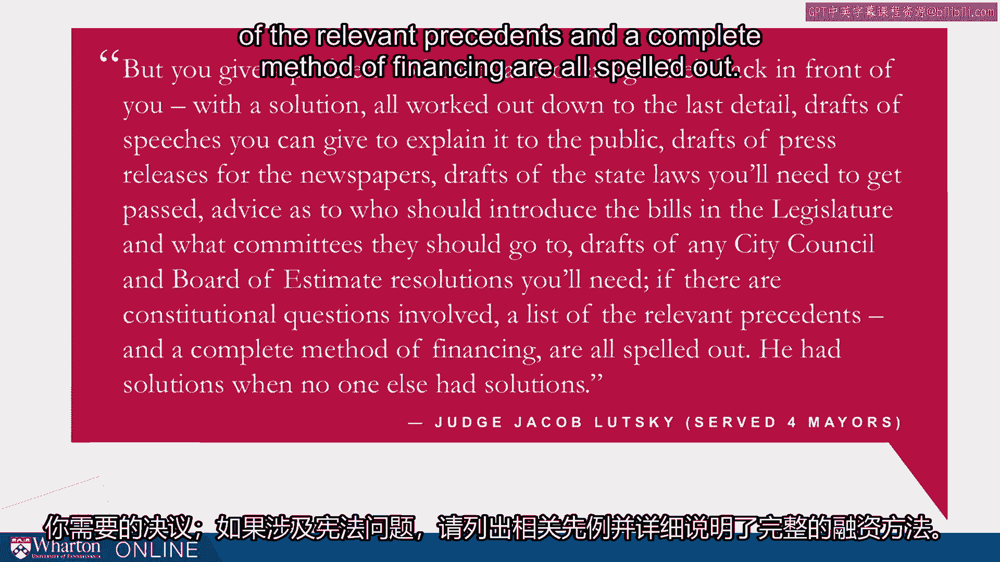
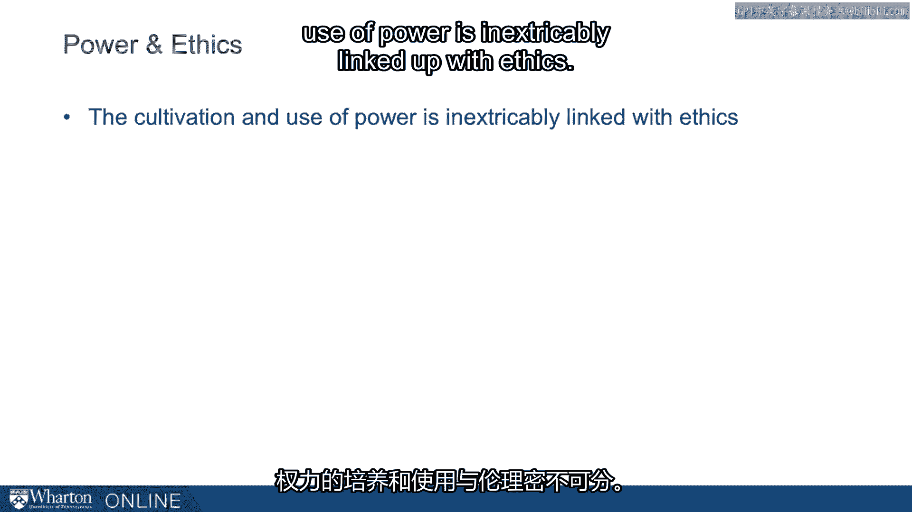
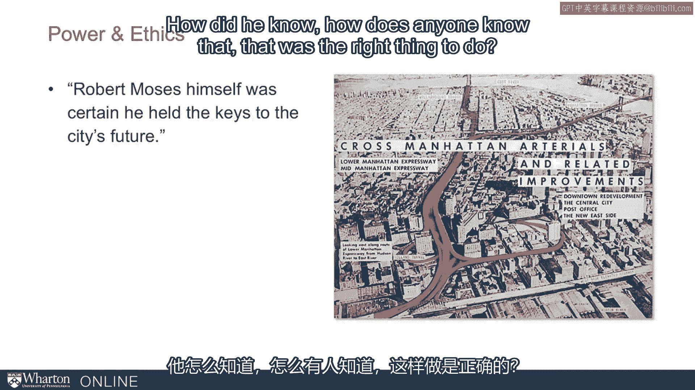
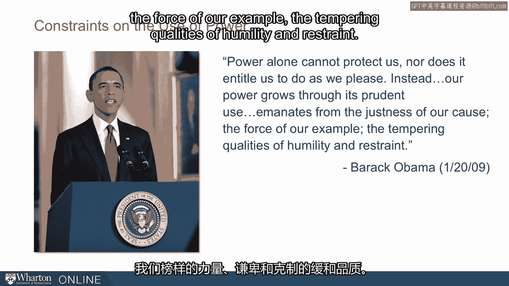
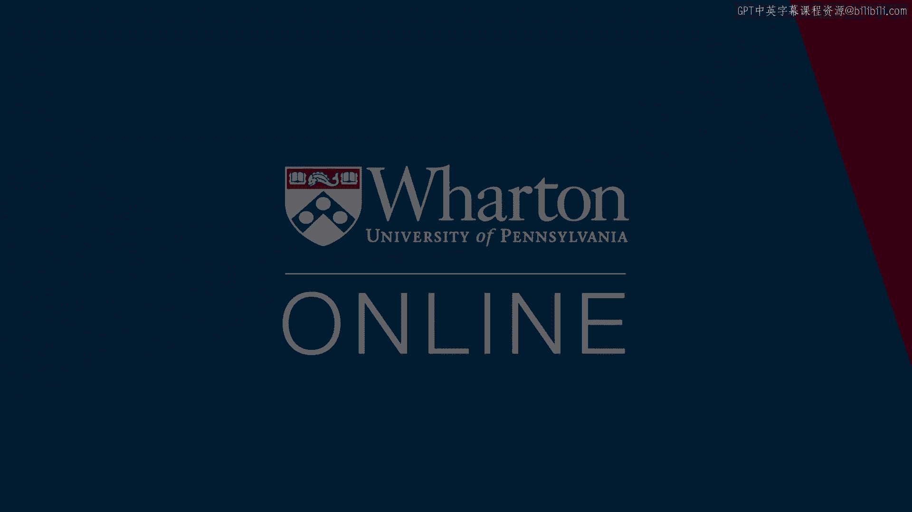

# 沃顿商学院《实现个人和职业成功》课程 P77：从摩西获取的启示 🧭

在本节课中，我们将通过分析罗伯特·摩西的案例，深入探讨权力与影响力的其他关键维度。上一节我们介绍了社会权力的五个基础，本节中我们来看看除了这些基础之外，还有哪些因素深刻影响了一个人的权力与影响力。

我们将聚焦于四个核心方面：**绩效表现**、**组织流程**、**主观能动性**以及**伦理道德**。摩西的职业生涯为我们理解这些抽象概念提供了丰富而具体的例证。

## 绩效表现：权力的基石 🧱

首先，我们来探讨绩效表现。摩西之所以能够运用各种权力杠杆，其根本在于他数十年间建立起的卓越声誉。

我们接触到的故事发生在他职业生涯的中期，但这背后是数十年的工作和声誉积累。正是这些积累为他赢得了立法者和市长的信任，使他能够获得权力，并建立起保护自己数十年的流程。他被称为“**能把事情办成的人**”。

以下是关于绩效表现的核心要点：

*   **绩效无可替代**：学习影响力工具时，切勿认为它们是绩效的替代品。绩效是必要的基础，是所有影响力工具发挥作用的前提。没有绩效，你将无物可“撬动”。
*   **摩西的例证**：尽管摩西精通影响力杠杆，甚至以一些可能被视为不正当的方式掌控了组织流程，但他首先拥有的是卓越的绩效。一位纽约法官曾这样描述他：“你把问题交给摩西，一夜之间，他就会带着详尽的解决方案回到你面前……他拥有别人没有的解决方案。”
*   **建立声誉**：这种“解决问题者”的声誉，是他权力的基础。我们都应努力成为这样的员工、领导或管理者。

## 组织流程：制度化的权力 ⚙️

上一节我们提到了绩效的基础性作用，本节中我们来看看如何通过组织流程将权力制度化。这呼应了之前艾利森的权力模型中的“组织流程模型”。

组织学者杰夫·费弗对此有精辟的论述：“行使权力常常会树敌，威胁到你的长期组织生存。因此，在发展和行使权力时，重要的是建立结构性机制，将你的权力制度化，并分散决策和行动的责任。”

这种制度化意味着，不仅仅是依靠你个人的说服能力，而是将你的偏好和目标嵌入到组织流程中。

鉴于规则和结构的特性，作为管理者，你需要认识到以下两点：

1.  **流程并非最优**：组织流程的建立并非总是为了组织的最佳利益。它们可能源于私人议程、竞争利益，或者仅仅是出于善意的疏忽而持续存在。因此，它们有被调整的空间。
2.  **主动塑造流程**：你不应被动接受既定的流程。流程就像不断被发出和重发的牌。你能够、也应该影响发牌的过程。不要将环境视为固定不变的，尤其是在许多人忽视的组织流程和官僚体系方面——不要忽略它们作为可以朝你的目标方向推动的事物的潜力。

## 主观能动性：打破规则的创新力 💥

对组织流程的探讨自然引向了第三个主题：主观能动性。摩西的例子揭示了“规则破坏者往往更具影响力”这一观念。

耶鲁大学的社会学家罗德里戈·卡纳莱斯的研究表明，规则破坏者对创新至关重要。费弗也指出：“如果你已经拥有所有想要的或需要的权力，那么务必遵守规则，并鼓励其他人也这样做。但如果你仍在通往权力的道路上，请对所有关于‘遵守规则’的传统智慧持保留态度。”

**主观能动性**的定义是：采取行动以施加对环境的控制。我们发现，这是有权势者的一个关键特征。他们主动塑造所面临的局面，而非被动接受现状。

这被称为“**做牌**”，而不是“打你被发到的牌”。在某些情境下，后一种哲学可能有其用处，但我们在此积极鼓励“做牌”——即在你的环境中行使主观能动性。

## 伦理道德：权力运用的永恒拷问 ⚖️

希望你现在已经看到，权力的培养和运用与伦理道德密不可分。在了解了摩西的例子后，你难免会思考：这样做对吗？

在许多方面，他的做法并不妥当。这引出了关于目的与手段的经典问题。作家奥尔德斯·赫胥黎认为：“**目的不能证明手段的正当性，原因很简单也很明显：所采用的手段决定了目的的性质。**” 而摩西则反问：“**如果目的不能证明手段的正当性，那什么能？**”

我们希望你对此进行挣扎和思考。这是你在培养和运用权力时必须面对的问题。奥巴马总统在他的首次就职演说中提出了另一种思路：“**单凭权力无法保护我们，也不赋予我们为所欲为的权利。相反，我们的权力通过其审慎的运用而增长，它源于我们事业的正义性、我们榜样的力量，以及谦逊和克制的调和品质。**”

这些不同的观点是你构建自己伦理框架的输入，而非标准答案。

## 总结与核心思考 🎯

本节课中，我们一起学习了从摩西案例中获得的四点启示：

1.  **绩效是权力的基石**，是所有影响力工具发挥作用的前提。
2.  **组织流程可以被主动塑造和制度化**，以巩固和延伸个人影响力。
3.  **行使主观能动性、挑战既定规则**，常常是通往权力和创新的必要路径。
4.  **权力的运用始终伴随着伦理拷问**，必须在目的与手段之间找到自己的平衡。

最后，分享我的一位前同事乔纳森·卡普尔的观点：“人们常常担心**政治**会成为**绩效**的替代品。但如果操纵规则和在规则内工作是成功的关键，而这样做被认为是搞政治，那么或许政治能力本身就是一种绩效。” 这彻底颠覆了对“办公室政治”的担忧。政治不仅是绩效的补充，它本身就是产生绩效的一个源泉。没有一定程度的政治运作，往往难以取得卓越的绩效。

我们在摩西身上看到了高端政治运作的后果，这些案例有的令人鼓舞，有的令人担忧。但这些问题将贯穿我们整个职业生涯。在本课程接下来的部分，我们将继续探讨如何驾驭这些复杂的议题。