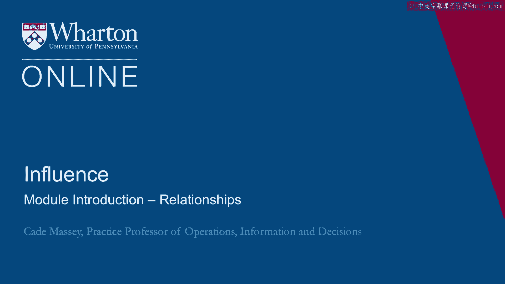

# 沃顿商学院《实现个人和职业成功（成功、沟通能力、影响力）｜Achieving Personal and Professional Success》中英字幕 - P78：14_关系模块简介.zh_en - GPT中英字幕课程资源 - BV1VH4y1J7Zk

Welcome back to Influence。

We want to kick it off with a little introduction and let you know where we're going。

This week is all about relationships。 One of the themes in the course is how much we get done through other people and therefore。

how much attention we need to pay to our relationships。 We're going to do it in two parts。

The first is on networks。 Very much focused on social networks。 The theory behind social networks。

The empirical work that's been done on social networks as well as some practical tips for。

cultivating those social networks and relationships。 In the second half we talk about coalitions。

Coalitions is one of my very favorite topics and both negotiations and influence for two， reasons。

One， they are very important。 It is a ubiquitous part of life。

an important influence tool to understand and to use。 And two。

they're not very well studied and not very often written about。

So we're going to spend half of week two talking about coalitions to tool you up for using them。

It's an important part of your relationships and one of the most important ways to influence。

organizations。 So here we go。 Here we go。 [ Silence ]。

