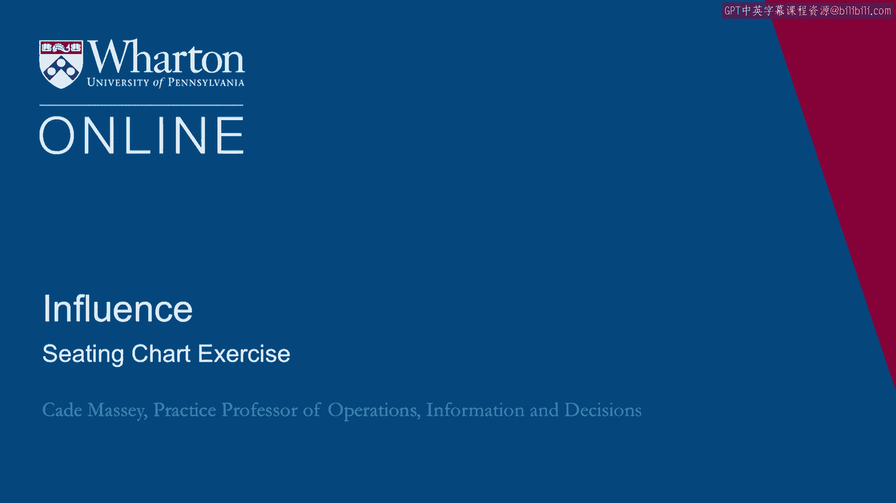
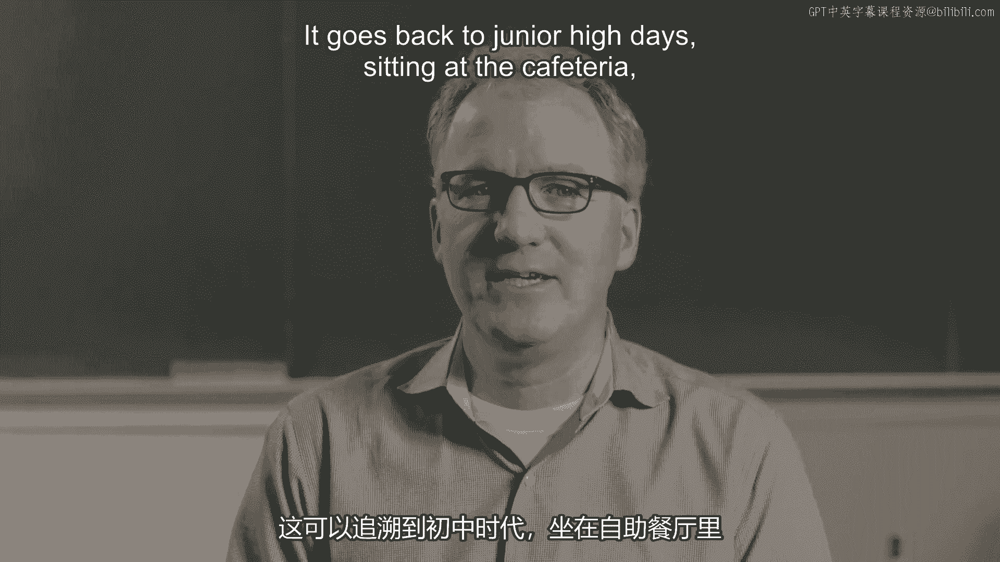
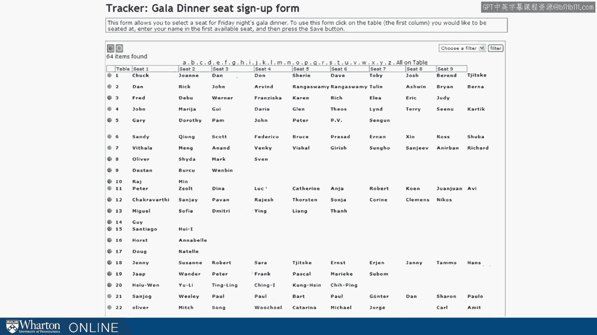
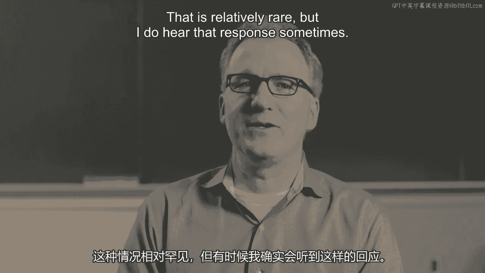

# 沃顿商学院《实现个人和职业成功（成功、沟通能力、影响力）｜Achieving Personal and Professional Success》中英字幕 - P79：15_座位表练习.zh_en - GPT中英字幕课程资源 - BV1VH4y1J7Zk

Imagine registering for a conference and being asked not only to enter your name and address。

pay the registration fee， but also choose where you're going to sit at the GALA dinner。

I hadn't seen that before， but apparently some conferences do ask for that because this is a screen that I saw on a colleague's computer a few years ago when I dropped by to say hello over lunch。

She was registering for a conference and was having to choose which of these tables to see that at the dinner。

And it raises a question that is ubiquitous for us。

We have to decide who we affiliate with， who we spend time with。 It goes back to junior high days。

sitting at the cafeteria， but it's a question that all of us face in one way or another pretty much every day。

So let's just walk through this as an example and I want you to consider what you would do。

If you were registering for this conference and you were facing this screen。

you're coming in and you have some tables to choose from， how are you going to decide？

What are you even going to base it on？ How are you going to think about it？

So some people when asked this question， look for their friends essentially。

Look for people they know and they want to sit at a table with people they know。

That's a very reasonable natural consideration。 Some people think about， well。

I don't want to sit at a table and then no one else comes and sits behind me。

So I want to sit at a full table basically。 I don't want to be isolated。

And that's again a human instinct and understandable。

What other considerations might you bring to this？ Some folks think， well。

who do I need to work with at this conference？ Who might I have some interest in talking to？

It could not be a friend。 It might be someone of purely professional interest。

Let me go get a chance to sit at the table。 It may be the only chance I had to talk to them。

Also reasonable。 Some ambitious people think， well。

let me sit with people who I don't know or aren't like me or I won't have a chance to visit with in any other situation。

That is relatively rare but I do hear that response sometimes。

How would you do this？ How would you decide？ In many ways what we're going to talk about in today's lecture is this kind of consideration。

You're building relationships all the time。 Not formal hierarchical relationships but informal relationships。

Can we bring some structure to how we do that？ Can we bring some insight into the consequences of how we do it？

A lot of it will look like the decision on what you do here at the registration。

One suggestion I would offer here and we talk about this when we talk about this exercise with our daytime students is what about serendipity？

What about what would happen if you sat at the table with only one or two seats filled so that you're rolling the dice essentially on the next seven or eight people that come to sit at that table？

What would the consequence of that be？ It's riskier。 It may not be comfortable。

What do we know about the people that sit down after we sit at the table？

What do we know about the people who when they see our name they decide to sit at that table？

It's risky。 We don't know for sure but we can be certain that on average those people chose to sit there for a reason。

They wanted to sit next to us。 It's interesting that when we're making these calculations we sometimes don't realize other people are making the calculations about us。

It might be in our best interest to actually expose ourselves to that serendipity。

to expose ourselves to the possibility that someone else is going to sit down and offer us something entertainment or information that we wouldn't have had otherwise。

That's an idea we'll continue to play with over the course of the day but wanted to get it out there because it's not something that folks often think about when they make these kinds of decisions。

With that start let's dive into social networks。 [BLANK_AUDIO]。

