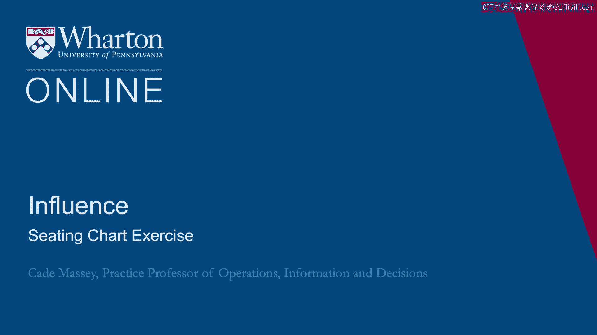
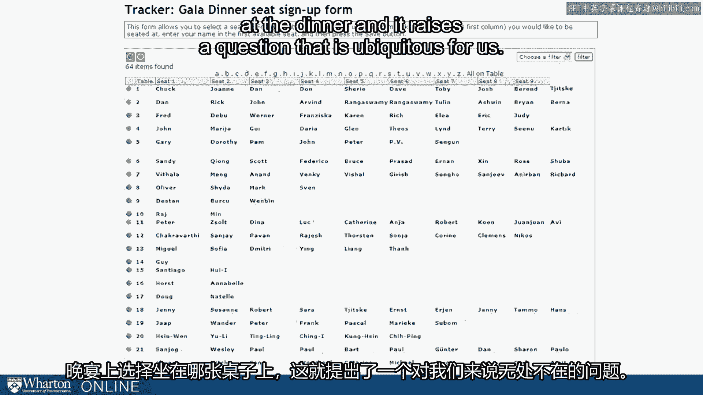
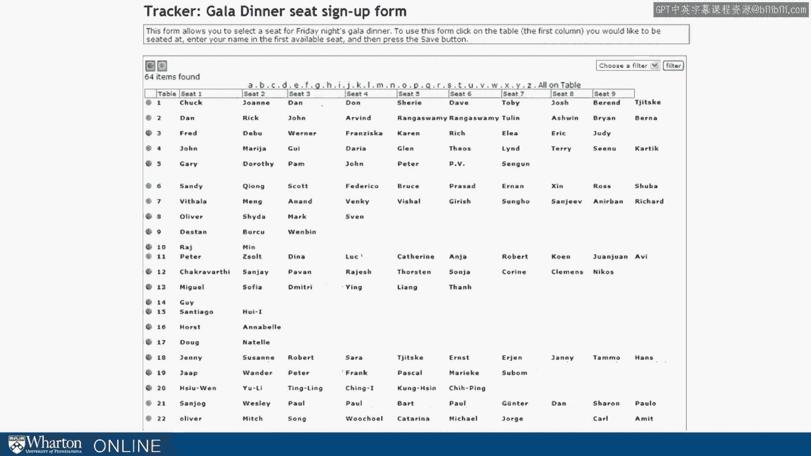
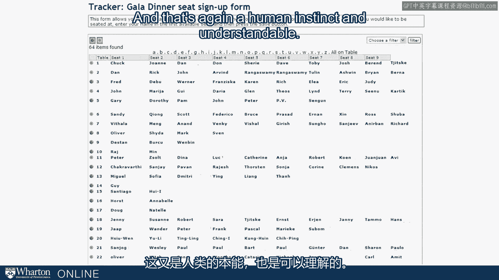
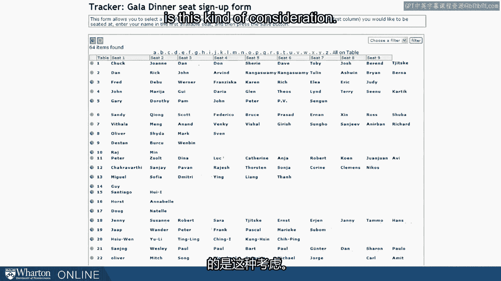
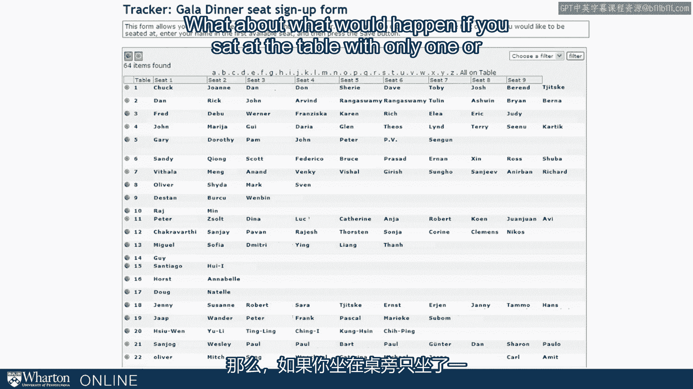

# 沃顿商学院课程《实现个人和职业成功》第79讲：座位表练习 🪑

在本节课中，我们将探讨一个日常社交场景——如何选择会议晚宴的座位。通过这个练习，我们将深入理解非正式人际关系的构建，并学习如何有策略地管理我们的社交网络。

---

想象一下，你在为一个会议注册。系统不仅要求你填写姓名、地址和支付注册费，还要求你选择在晚宴上坐在哪一桌。

几年前，我在一位同事的电脑屏幕上看到了这个界面。当时我顺路去打招呼，发现她正在为会议注册，并需要从几张桌子中选择一张。这引出了一个我们普遍面临的问题。

我们必须决定与谁交往，与谁共度时光。这可以追溯到初中时在食堂选座位的经历，但这也是我们每个人几乎每天都会以某种方式面对的问题。

让我们以这个例子来展开思考。请设想，如果你正在注册这个会议并面对这个选择界面，你会如何决定？你的决策依据是什么？你将如何思考这个问题？

以下是人们通常会考虑的几个方面：

*   **寻找熟人**：一些人会寻找朋友或认识的人，希望与熟悉的人同桌。这是一个非常合理且自然的考虑。
*   **避免落单**：另一些人会想，他们不希望坐在一张可能没人来的桌子旁，因此倾向于选择看起来会坐满的桌子。这同样是一种可以理解的人类本能。
*   **职业考量**：还有人会思考，在这次会议上需要与谁合作？对与谁交谈感兴趣？这可能不是朋友，而是纯粹出于职业兴趣的人。选择与他们同桌，可能是唯一能与之交谈的机会。这也非常合理。
*   **寻求突破**：一些有进取心的人会想，或许应该与那些自己不熟悉、与自己不同或在其他场合没有机会接触的人坐在一起。这种想法相对少见，但确实存在。

你会怎么做？如何决定？在今天的课程中，我们将要讨论的正是这类考量。

你无时无刻不在建立关系。这不是指正式的层级关系，而是非正式的人际关系。

我们能否为建立关系的方式引入一些结构？我们能否洞察不同选择所带来的后果？许多决策都类似于在注册时选择座位的场景。

在与日间课程的学生讨论这个练习时，我提出的一个建议是：**何不考虑一下“机缘巧合”**？

如果你选择一张只有一两个座位被占用的桌子，本质上就是在为接下来将要坐到这张桌子的七八个人“掷骰子”，结果会怎样？

这样做的后果是什么？这更有风险，也可能不那么舒适。我们对于在我们之后落座的人了解多少？对于那些看到我们的名字后决定坐在这张桌子的人，我们又了解多少？

这确实有风险，我们无法确定。但我们可以肯定的是，平均而言，那些人选择坐在那里是有原因的——**他们想坐在我们旁边**。有趣的是，当我们进行这些盘算时，有时并未意识到别人也在对我们进行盘算。

让自己暴露在这种机缘巧合之下，让自己接受“他人可能坐下来，为我们带来意想不到的乐趣或信息”的可能性，或许最符合我们的利益。

这是一个我们将在课程中继续探讨的想法。之所以在此提出，是因为人们在做出此类决策时常常不会想到这一点。

有了这个开场，让我们正式深入探讨社交网络。

---

本节课中，我们一起学习了如何通过“座位选择”这个具体练习，来反思我们构建人际关系的策略。我们探讨了从寻找安全感（与熟人同座）到主动寻求机遇（拥抱不确定性）的不同选择，并认识到他人也在根据我们的选择做出他们的判断。理解这些动态，是有效管理个人社交网络、提升沟通能力和影响力的重要一步。