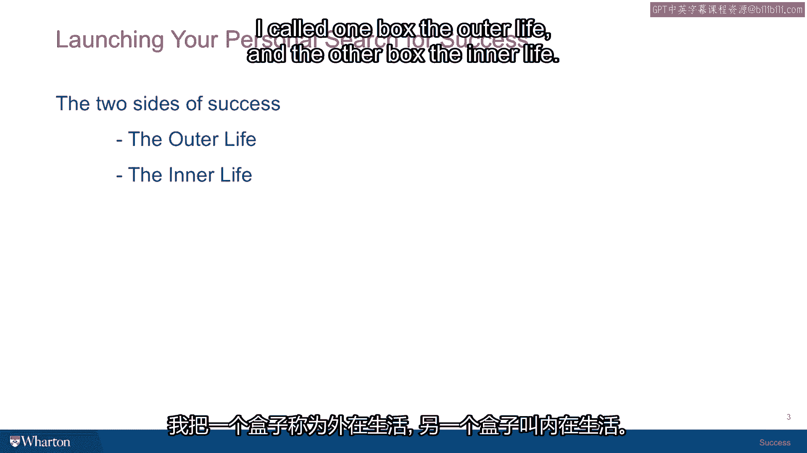

# 沃顿商学院《实现个人和职业成功（成功、沟通能力、影响力）｜Achieving Personal and Professional Success》中英字幕 - P8：7_成功的两面.zh_en - GPT中英字幕课程资源 - BV1VH4y1J7Zk

When you unpack the word success for the first time， it's like a box and you open the box。

and you look inside。 The first thing you notice and you probably notice this in the Six Lives exercise because。

no matter which life you are reading， each of them had these two dimensions。

So when you open the box and look inside， what you find is two boxes inside the box。 One。

I call one box the outer life and the other box the inner life。

The outer life has to do with achievements， career， recognition， celebrity， respect from， others。

the roles you play and the social occupations that you found your way to。

And the outer life is what most people think of when they just hear the word success。 They think。

oh， someone's successful。 It means that they are the president of their bank or they graduated from college or they。

have some sort of invention that they made or something。 So the outer life is what the media covers。

The outer life is what magazines celebrate。 The outer life is what people get awards for。

And for that reason， everybody， often， not everybody， but people often think that that's， all it is。

But then there's this conundrum because if you take an average person on the street and。

you just ask them randomly， which I sometimes do just because it's my field and I'm trying。

to kill time in a grocery store line while someone's counting pennies at the very beginning。

of the line to pay for their fruit salad。 I asked somebody， you know， I'm doing a little survey。

what do you think success means？ And if they're willing to answer the question and they don't think I'm too weird。

then they， will be almost always inclined to say， well， I don't know。

it seems to me like success is， happiness if you're happy or successful。

And if you ask somebody what's your goal for your children， almost all of them would， say， well。

we just want them to be happy。 So on the one hand。

you've got this societal point of view of the box of the outer life。

where all that we celebrate is achievements and career and position and status。

And on the other hand， you have this inner life， the other part， which is what most people。

resort to when they kind of think about what they really care about。

And so there's just contradiction between these two sides of success。

And a lot of what we're going to do together in this course and that you will be trying。

to resolve in your own life as you go through your life is reconciling and integrating and。

balancing the outer life and the inner life and the credit you give yourself for having。

a life that is rich in its inner dimensions or highly recognized in its outer dimensions。

And what happens between those two？ I think it's often the case that we make choices in our lives that favor the outer life。

And then we have regrets and second guessing because we've come up short on the inner life。

I think it's hard to choose the inner life over the outer life sometimes because it looks。

so unimportant。 But of course， at the end of your life。

I think most people are pretty inclined to think that， they would not say， "Gee。

I wish I could have another day to be alive so I could work some， more。"。

I think they're probably going to be asking themselves for another day so they could be。

with the people they love for another day。 So these two sides of success are going to be with us throughout the course and how you。

consider them a big theme and how we're going to analyze， break down and think about all。

the different topics that we talk about。 So in our next session。

we'll be picking up some themes related to everything we've talked， about so far。 [end]。

[BLANK_AUDIO]。

