# 沃顿商学院《实现个人和职业成功（成功、沟通能力、影响力）｜Achieving Personal and Professional Success》中英字幕 - P81：17_网络结构.zh_en - GPT中英字幕课程资源 - BV1VH4y1J7Zk

In this lecture， we'll drop into a little more detail on network structure。

Let's start with asking you a question。 What do you think the best position is to hold in a network structure？

What's your intuition for it？ And you might answer that by thinking about what do you believe the benefits of being。

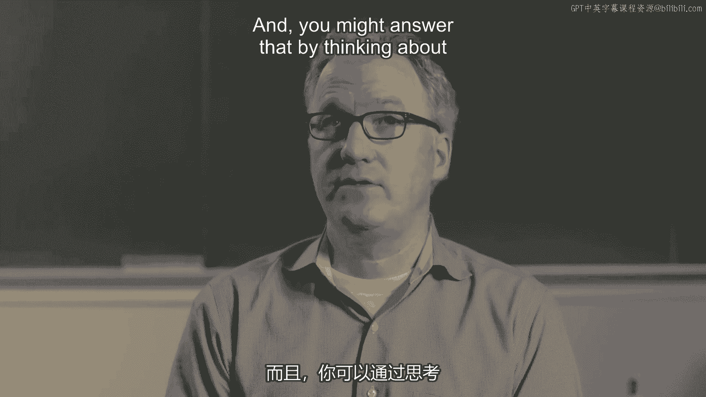

in a network are？

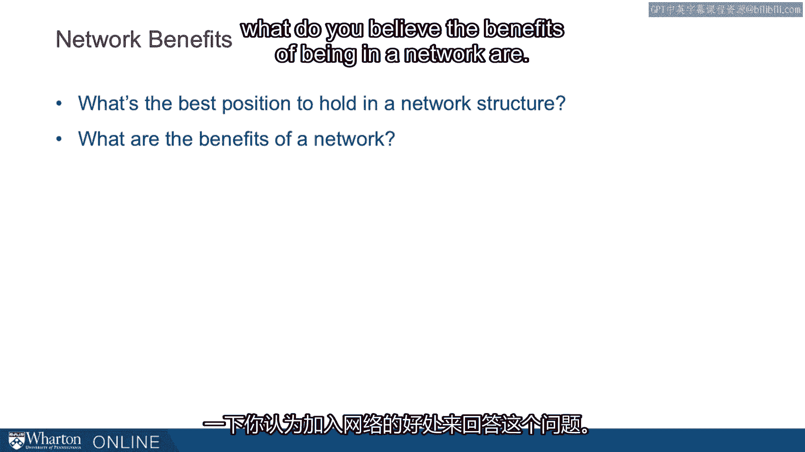

What benefits are you looking for from your informal networks？

So people come up with all kinds of things on this， but the obvious ones are， you know。

let's be humans。

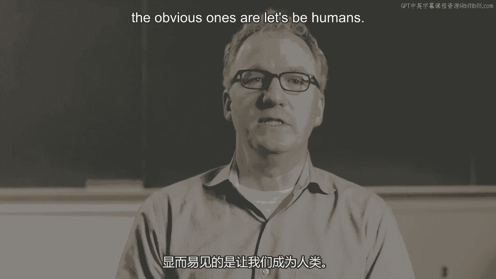

Affiliation， warmth， companionship， entertainment， that kind of thing。 Professionally。

we think about opportunity， resources， information。

And it's really that last one that we're going to focus on。

We're going to move towards some models here and a necessary part of working with a model。

is that you simplify the world。 And one of the simplifications that people make in this research area is we think about。

the benefits first and foremost as being information。 What about cost？

What do you consider the cost of being in a network？ And this is a little more ambiguous。

but one that most people seem to get and resonates， especially with our oversubscribed students。

are the time involved with maintaining your， network。

Most of us have difficulty spending as much time with the friends and professional contacts。

that we have。 And it's pretty obvious to us that there's a scarce resource there。 It's our time。

And so we can come up with other costs。 But for this exercise to understand the basic ideas in this field。

let's think about the， benefits being information and the cost being time。 So you might think。

all right， given that set up， what does it mean about where we want， to be？

Do we want to have a strong ally， for example？

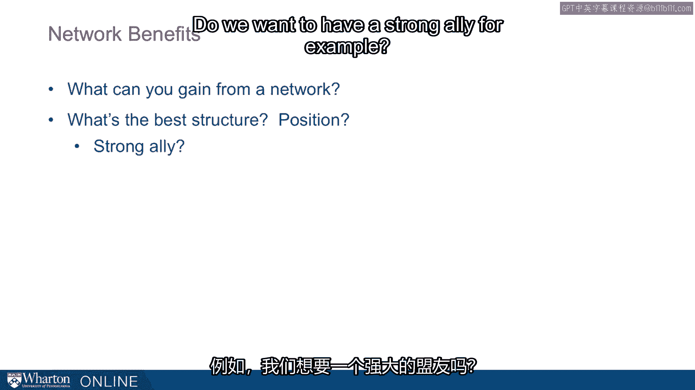

That's one way of thinking about it。 I want to be wherever the network， the strongest person is。

It gives you an advocate in hiring and promotion， provides training， maybe a little mentorship。

maybe a little support。 It's a reasonable thing to say。 Or you might say， well。

I don't really care where I am。 I just want to be in a cohesive network。

I want to work with people who know each other， they understand each other。

Maybe they all coordinate very easily。 There are lots of benefits from that。

And so that's understandable as well。 Others say， I want a large network as many ties as possible。

This is probably the most common answer， the most intuitive answer。

If we're going to talk about networks， we're impressed with people who can maintain big networks。

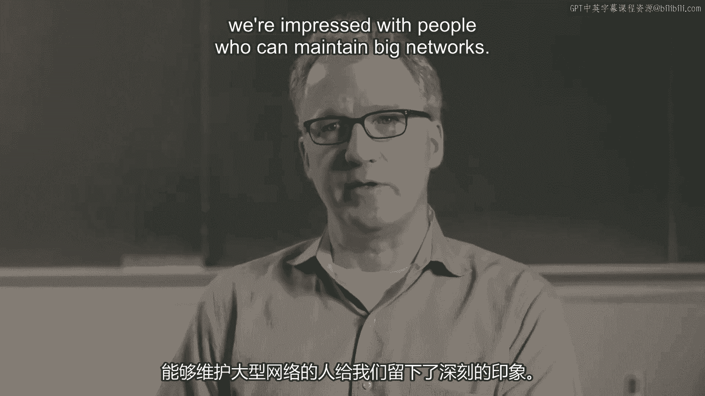

Others say， well， size is one thing， but I'll take centrality。 I want to be at the center of things。

I have to be at the heart。 Everyone has to come through me。

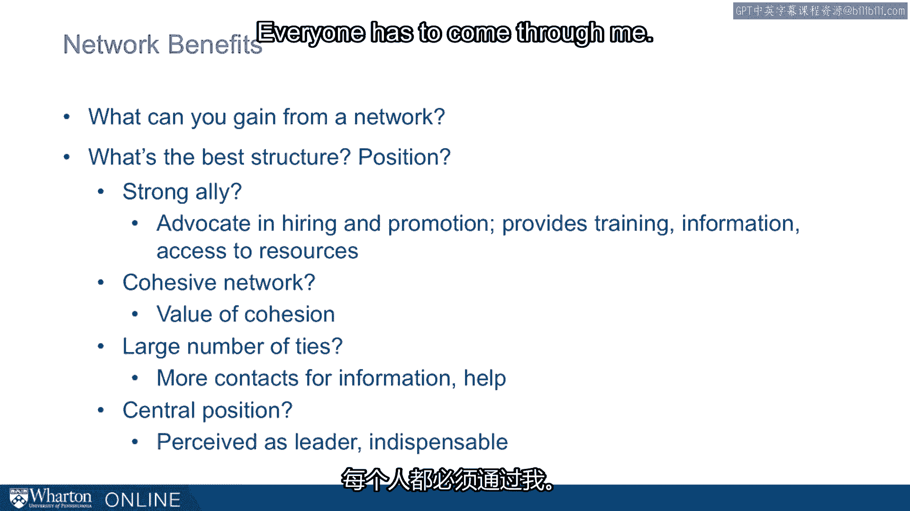

That's reasonable as well。 There are benefits。 There are some costs to all of these things。

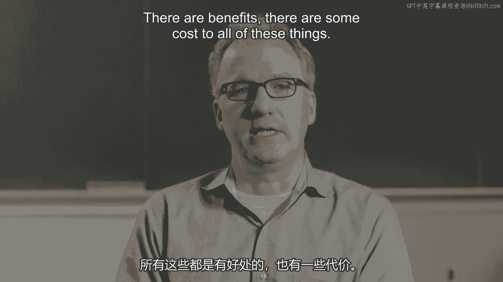

I think these are all relatively intuitive。 Because of that， I really want to emphasize another one。

a different one。 That is this notion of a structural hole。

Structural holes will unpack it in more detail momentarily。

These are basically centrally placed people with ties to those who are not cohesive。

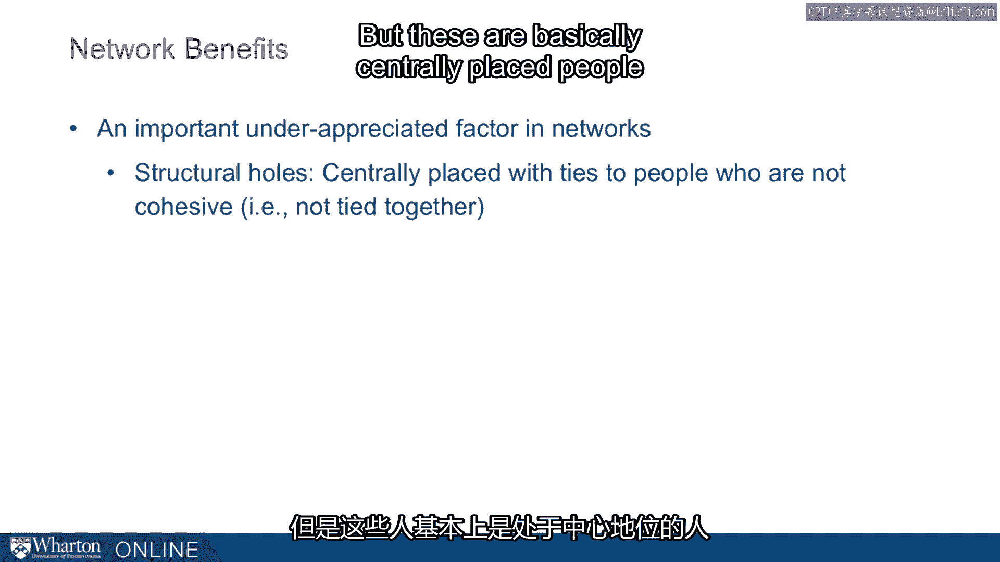

The idea is that in networks， everyone's not connected to everybody else。

If you can sit between disconnected groups， you're spanning this structural hole。

Maybe there's some real value in doing that。 Let's look at a picture and make this more plain。

Here is， let's say， a network of six people。 Consider especially the person in the red dot there。

This is what is considered a dense network。 They're all connected to each other。

This is what might be considered a disconnected network。 A larger number of people。

but the big feature here that differs across the two is that the。

one on the left is dense and the other on the right is disconnected。

What happens when you remove the red dot？ The person in the position of the red dot。

you remove that person from the dense structure。 Everybody still talks to everybody。

Information flows the same way。 Not a whole lot changes。 On the other hand。

in the disconnected network， if you remove the person in the position of， the red dot。

all of a sudden these groups don't talk to each other at all。

The organization is in a very different place。 Information doesn't flow and something is going to function very differently。

Clearly， a person who is in the role of the red dot will play a very different role in。

the organization if they're in that dense structure when they're in the disconnected structure。

That gap， the gap that the red dot is spanning there in the disconnected structure is what。

we consider a structural hole or a disconnect。

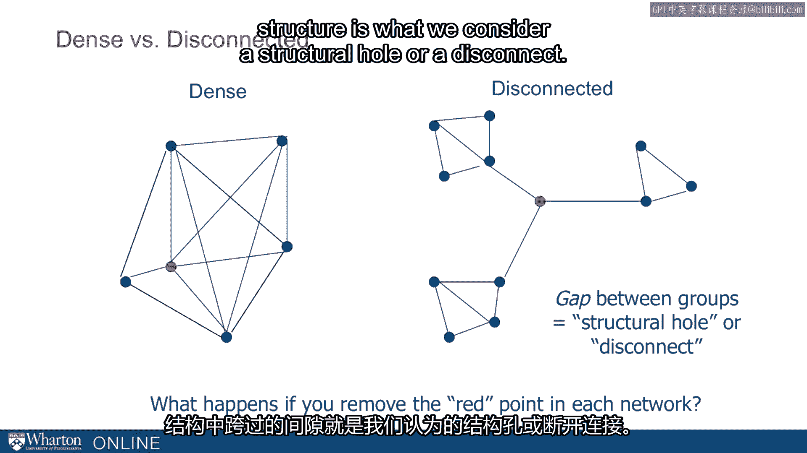

We really want to talk about the benefits of that。

It's going to drive pretty much everything else that follows here。 A dense structure。

relatively few structural holes， people are highly connected。

They have mutual influence on each other。 This is often a cohesive， similar group。

They work closely together， might think alike。 They probably have what the economists would call or the sociologists would call redundant。

information。 They're often tapping a restricted set of resources。

Contrast that with the disconnected structure where there are many structural holes。

This more often reflects a non-cohesive heterogeneous group。

They provide opportunities in terms of differentiated， non-redundant information and they access。

a wider array of these resources。 This idea comes from research originally by Mark Granovett or on week ties and then really。

built out by the sociologist Ron Burt。 We want to dig into it in a little more detail。

Here's another picture to talk about how you might think as you grow a network from four。

to eight to 16 individuals， what it would look like if you did that in a very disconnected。

way versus a very dense way。 We're going to use the terms redundant versus efficient。

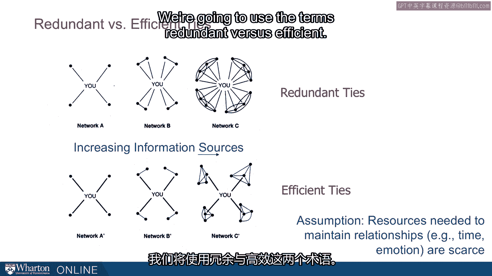

These terms， again， there's very much an economics base to the work on social networks。

It comes out of sociology， but this part of sociology is highly connected to economics。

These guys think about utility maximization。 The actors here are highly rational。

They're going to very much like economics talk about costs and benefits and they're just。

going to find the optimal solution given to costs and benefits。

They're going to use terms like redundant and efficiency。 These are modeling terms。

but let's explain to you what they mean。 The top there， it's network A， B and C as you move。

for example， from network A where you， have four connections and network B you have eight connections and network C you have 16。

connections。 In this case， every time you add someone to the network。

you're adding a new relationship。 You're going from four to eight to 16 relationships。 Great。

you've got more people， but we know there are costs associated with that。

It is what the economists and sociologists would call redundant ties。

Contrast that with the three on the bottom， A prime， B prime and C prime。

This person goes from four to eight to 16 always with four relationships。 In each case。

they have perfectly efficient networks。 They're spanning these structural holes。

This is a disconnected network and with the same four relationships， they're able to tap。

in to 16 people now because of the way they built it。

Sociologists would consider the bottom networks efficient and the top networks redundant because。

for much less at much less costs are tapping into the same information。

The assumption here is that the resources needed to maintain relationships， time and。

emotion are scarce。 I think that's a very reasonable assumption。 But given that assumption。

these guys are just kind of taking it to its extreme and。

asking， "Well， if you've got scarce resources， maybe you want to think about building a more。

efficient network。"， With these ideas out there， let's start talking about how networks might differ if you took。

them seriously， consider diversifying your network。 In this picture。

we begin with what is a very dense network。 A person has five relationships tapping into something like 10 or 12 individuals。

most of， whom are connected to other people in the same network。 And then after diversification。

after taking this theory really seriously， you've got the， same five relationships。

but now it taps into a much broader， maybe 20 plus individuals。

many of whom do not connect with other people。 And so you're tapping into more highly varied resources。

This is what the sociologists would claim are benefits of a more disconnected structure。

They would advocate even pursuing a more efficient network and eschewing redundancy that you。

see in the denser networks。 So there are many benefits， of course。

The people in the disconnected networks will be the first to know information outside of。

each pocket。 There are many benefits。 Partnerships if they want to。

they can play rival factions against each other。 And they might be sought out as a broker to introduce。

make contacts， make introductions， from one part of their organization to another。

There are many benefits。 They fall right out of it。 We don't want to ignore the cost。

What do you think the cost might be of this？ And we'll spend a little more time on that。

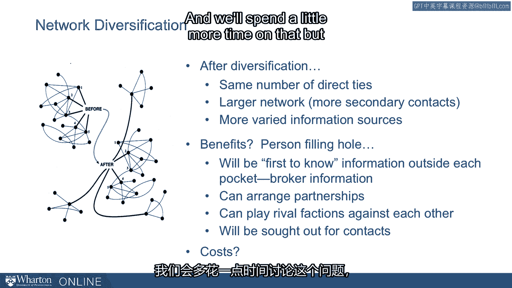

But I think it's fair to say that while extreme， these guys are mostly just making plain something。

that many of us do intuitively。 And in fact， I would push you to reflect a little bit on how is it that you're deciding。

where to spend your time， who to invest in， what relationships to cultivate， what relationships。

to let ride。 It's something that many people want to avoid。

It's a little bit uncomfortable to think about。 But the economic model and the sociological model takes us a starting place that we've。

got scarce resources。 We derive utility from things like relationships。

And we're essentially maximizers。 We're going to try to maximize how much utility we can get from our scarce resources。

You bring that model to relationships， and this is the kind of thing that we end up with。

I'm not going to say you should all think about it this way。 That you should act exactly like this。

That you should be as efficient to network as possible。 But I like the conversation。

And I like having it on the table。 Not least because I think we're all doing something like this anyway。

And let's put it。 Let's be a little bit more explicit about it。 Let's talk about the trade-offs。

And then let's see how we can exercise these ideas。

How we can use these tools in a way that isn't offensive to us。

We don't want to act in a way that isn't in the spirit of how we want to live。

We don't want to act in a way because the sociologist tells us this is more efficient。

just for that reason。 But can we borrow those ideas？

Can we borrow those tools and do it in a way that actually fits with the way we want to， live？

That's where we're coming from。 So a little more motivation for considering it。

There's work here by Ron Burt。 This was empirical work。 So far we've just talked theory。

Burt went out and ran a big study in a large organization that looked at how employees rose。

through the ranks there。 What rate of promotion they got over time。

And he compared that to the networks they had when they began。

What he found was strong relationship。 Social science goes this is a very strong relationship between those who had many disconnects。

So when a relatively disconnected structure compared to those who had few disconnects。

and more dense and formal structure。 Those with more disconnects showed a higher rate of promotion in the organization over。

time。

So this was kind of the beginning of what has turned into a huge industry and academic work。

on what are the empirical consequences of these various network structures。

And a little bit of motivation for well maybe it's not more than just theory。

Maybe these are things that do make a difference。 This idea that by tapping into a more diverse network we get information and opportunities。

that we wouldn't if we tapped into a more homogenous， more dense， more dense network。

So are there limitations？ Of course there are limitations。

We've named a few but we always want to mind these limitations and we want to in other parts。

of the course we unpack them more explicitly。 But if you think about， okay。

I'm going to maximize the efficiency of my organization， my network， what's the risk here？

If you're sitting there on the right hand side with four relationships into 16 people。

what's the risk？ Obviously one of the biggest risk is what happens if that one contact that you have in。

a cluster of four goes away？ What happens if that person moves or something goes wrong in that relationship？

Then your only bridge into that group is gone。 So this is fine with the sociologists。

They'll just say， look， we can still deal with that。

If you have an especially important cluster of people then you need to have more than one。

relationship in there。 You need some redundancy just in case something goes wrong。

They can drop that right into their model， run the utility maximizing thing again and。

it's going to give that kind of answer。 The more important the group。

the more important that you have some redundant ties into it。

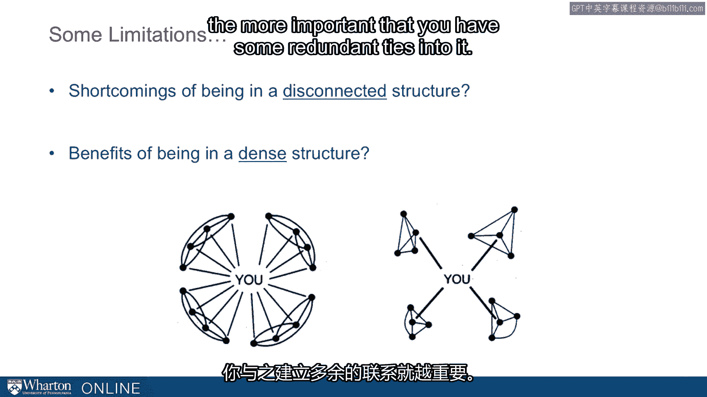

Let me give you one small example from politics in the United States that ends with a quote。

that I love that captures this pretty well。 "Jim Wright was a longtime congressman from the Dallas Fort Worth area in Texas。

He was in Congress for 34 years and finally near the end of his career there he took over。

a speaker of the house。 He seceded Tip O'Neill who was a longtime and famous speaker of the house。

So Jim Wright goes in and he only the last two years and this poor guy was in Congress。

for 34 years and he gets indicted as Speaker of the House and has to resign。 Why did that happen？

This was the beginning of Newt Gingrich。 Gingrich took it on himself to run right out basically。

He wanted more power。 He wanted to undermine the Democratic Party and so he found ways to run him out。

Gingrich， there's a lot of detail on this and that doesn't matter as much for the moment。

But what Gingrich said about Wright is very relevant to us today。

Gingrich says that when he began initiating formal investigations into Wright， this is。

in late 1987， he said， "I've watched my colleagues body language toward me。 It's actually improved。

If I had gone after Tip O'Neill this hard， I would have been a social outcast。

Wright should get a solid A for performance。 As a technician of power， he's done a great job。

The downside is he's a loner still。 There's no deep body of affection for him。

Being a loner eliminates the safety net of both information and goodwill。 That line says a lot。

This is why we tell the story。 This line from Gingrich， "Hoo， whatever you feel about Gingrich。

he's got some insight， into power politics。"， He says about Wright being a loner eliminates the safety net of both information and goodwill。

This is something that applies to all of us。 It's not just about speakers of the house。

He puts it in just perfect way。 Information and goodwill is both of these things。 Of course。

that even that simplifies things too much， but that's a nice two bucket summary。

of what we're looking for in informal networks。 Okay， a few caveats before we leave it。

Birds approach， characterized very much by cost-benefit calculations， a lot of intentionality。

and strategy here。 There are trade-offs。 This is inherent to the traditional sociological model of networks。

We've presented very quickly kind of an extreme version of this。 We want to be provocative。

We want to push you。 We also want to stay kind of simple。

We want to give you a simple framework for thinking about this。

We want you to reflect on how much of you're doing a lot of this tacitly already。

This is more or less just a theoretical benchmark。

It's going to push us to think about the opportunity costs of the way we build our。

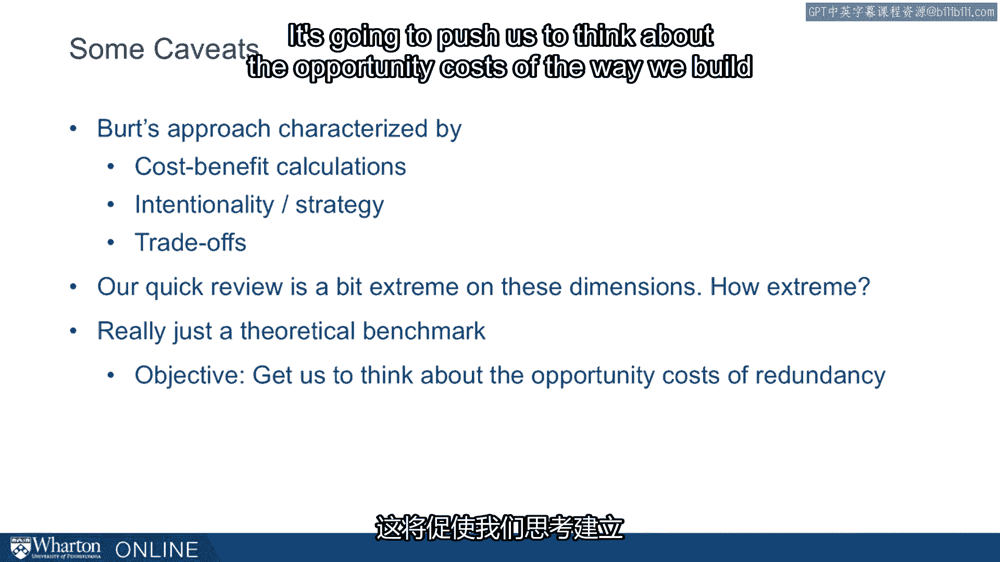

relationships and the way we move through organizations。 Thank you。 [end of transcript]。

[ Silence ]。

