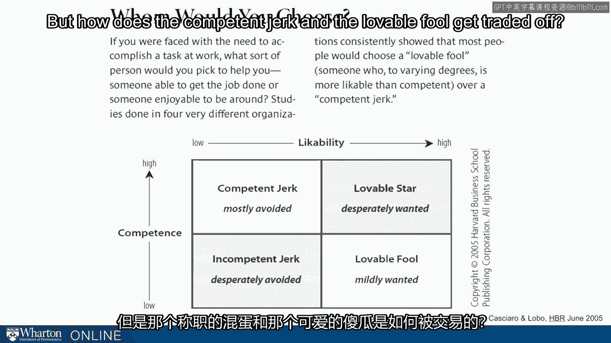

# 沃顿商学院《实现个人和职业成功（成功、沟通能力、影响力）｜Achieving Personal and Professional Success》中英字幕 - P83：19_培养网络.zh_en - GPT中英字幕课程资源 - BV1VH4y1J7Zk

So we've talked about the theory of networks and kind of a high level look on optimal structure。

What about how you actually build these networks？ Let's talk in a little more detail about the doing。

the concrete on the ground building， of networks。 And in some ways this is going to offset in the theory it can come off pretty Machiavellian。

pretty strategic which most folks don't want to bring to their relationships。

This is going to be the kind of the counterbalance because this is about the actual living the。

relationship。 So how do you cultivate a network？ We too often think about networks being a product of unilateral action。

I just go out and do。 I create。 They're actually， as should be obvious。

because of their relationship， much more bilateral。

process of exchange。 And if it's bilateral then it's going to tap into some things we know about。

In fact， things have been studied for decades in psychology and sociology， in particular。

reciprocity， becomes one of the most important tools for you to use and to keep in mind as。

you go about cultivating your network。 So we are deeply ingrained。

We know this from decades of research now。 We're deeply ingrained to treat others the way they treat us。

So we tend to be generous to those who are generous to us and different to those who are。

indifferent to us and hostile to those who are hostile to us。 It's almost a knee jerk reaction。

We know from studies of humans of course， but we know how basic this is because we see。

the same behavior when you look at the chimpanzees， for example。 What does this mean？

It means that their value from controlling resources is not just the control， but also。

how you control them。 If you control them in a more generous way。

then you're going to be treated with more， generosity。 If you control them in a hostile way。

you might be controlling the resources， but you'll， be fostering hostility as you go。

So an obvious implication is to bargain， make trades， offer the quid pro quo。

This type of exchange can be helpful and in some organizations of course it's the way。

you do business。 But better and not so obvious is generosity， granting unrequested favors。

So quid cine quo。 This is talking about invoking reciprocity and yields and indebtedness that often there's。

a risk there because it's a debt that may never be repaid， but it can provide energy。

in a network and provide bigger returns longer term。

So let me give you a quick example， this comes from Antarctic exploration in the 1916 era。

This is World War I era。 There was a man who some of you have read about or watched movies about Ernest Shackleton and。

he had a big well known exploration on the ship， the endurance。 But before that。

Shackleton had become known as a leader who put his men first。 This inspired。

I'm reading from a book about Shackleton， this inspired unshakable confidence。

in his decisions as well as tenacious loyalty。 During the march back from 88 degrees south。

so not quite 90 degrees south， didn't make， the poll。 One of Shackleton's three companions。

Frank Wild， who had not begun the expedition as， a great admirer of his。

recorded in his diary an instant that changed his mind forever。

Following an inadequate meal of pemma-kin and pony meat， Shackleton had privately forced。

upon Wild one of his own biscuits from the four that he， like the others， was rationed。

daily。 Wild writes， "I do not suppose that anyone else in the world can thoroughly realize how。

much generosity and sympathy was shown by this。 I do by God I shall never forget it。

Thousands of pounds would not have fought that one biscuit。"。

This is Shackleton， a leader on this expedition。 This is Shackleton getting loyalty from Wild。

He could never have gotten any other way。 Wild went on to be one of his lieutenants on the following expedition。

the endurance， expedition。 But it's just an anecdote。 It's just an example。

but it's a brilliant example of the kind of reciprocity that true。

generosity inspires in other people。 What's the recipe？ Because psychologists have studied this。

There is a bit of a recipe。 Reciprocity is different because it's more emotionally and because of that can become a。

source of loyalty。 In order for this to happen， help or gift or whatever resource you're sharing。

it must， be costly。 In other words， it has to be a credible sacrifice by the giver。

He must be intended unselfishly that it's not tied explicitly or even tacitly to repayment。

Ideally it's not expected。 Wild didn't expect Shackleton to offer him one of his four biscuits。

Ideally it's difficult to repay in kind。 It's not a balance that can be cleared with a simple transaction in the other direction。

Of course， the best way to be perceived as generous is what？ To actually be generous。

There's a recipe here， but the best way to navigate the recipe is actually bringing true。

generosity to your exchanges。 You see this from other people as well。

There was recently a tweet from Aziz Ansari， the actor and comedian。

One of his Twitter followers asked， "Aziz， I'm an aspiring showrunner， actor， and improviser。

Can you give me some advice on how to get to be where you are？"， Ansari in response says， "Well。

work hard， make good shit， then try to make even better。

shit and be nice to people。"， I love seeing this kind of advice from folks who emphasize the being nice part because it's。

true that nice doesn't always pay off， but nice is a nice asset to have working in your， favor。

You want the world leading towards you。 This is advice from an actor。

We've also seen academics who have studied this。 There was a study by Miguel Lobo and his colleague on bringing network analysis to an organization。

but they also assessed likability。 In this particular test published in HBR。

they characterized employees in an organization， on two dimensions， competence。

high competence and low competence， and likability， high likability， and low likability。

They created four quadrants。 You go from the competent jerk quadrant， which is mostly avoided。

to the lovable fool quadrant， which is mildly wanted。 On the diagonal， of course。

she has a lovable star。 That's not interesting。 Everybody wants and everybody wants to be the lovable star or the incompetent jerk。

Again， kind of not interesting because no one wants to be that and no one wants to be around， them。

But how does the competent jerk and the lovable fool get traded off？

There's a tradeoff there， right？ You've got to accept a little decreased performance for affability or a little bit better performance。

with someone you don't want to be around。 What they found was people had a pretty strong preference between those two on the lovable。

fool。 If you had to make the tradeoff， the organization's on average。 Again。

this ties into the reciprocity notion， lean toward the lovable fool。

So let's move to some practical tips。

When you read enough cases and enough examples and of autobiographies， one of the things。

you do get from those are some concrete tips from people， little ways of living that people。

have found helpful in cultivating their networks。 So one comes from a study by Coddar on effective general managers。

He found they spent 50 to 60 percent of their time building and maintaining networks。

It's an amazing investment for those who are most effective。 A second， nice quote from Heidi Royzen。

a famed networker out in Silicon Valley， she says， be reliable。 In particular， quote。

"If a relationship is built on performance and consistency， you。

can actually get by with fewer interactions。"， This is great advice for us because most of us don't have enough time。

We don't have as many interactions as we'd like。 She's saying， look。

you can get by without having regular interactions as long as you。

are consistent when you have them。 Another tip we pick up from some well-known networkers is email your new contacts the。

next day。 We're meeting new people。 Too often we let that sit。 We let it go away。

We let it atrophy before we act on it。 Some say， as a commitment， I'm going to email。

I'm going to follow up in some way with my new contacts the next day。

It is both a commitment device to get it done， but it also ensures that you actually。

have a contact before you need them。 You bring your name back to them。

You have a little exchange with them before you need anything from them。 Another tip。

learn to say no and nicely。 This is something else we learned from Heidi Royzen who in recent years has been a venture。

capitalist and has to turn down lots of investment opportunities sometimes by people that she。

knows and wants to maintain relationships with。 She spends a surprising amount of time saying no。

The opportunity costs are often high， but reputation costs are too。

You don't know where that person is going to go after they say no， who they're going， to talk to。

People in general don't spend enough time managing their knows well and nicely。 Finally。

moving beyond quid pro quo。 A lot of folks think about exchange and quid pro quo organizations。

In this lecture， we've been advocating considering reciprocity and moving beyond reciprocity。

Whether it's because you want to get contribution to the world or you want to invest in the， future。

think of the services you render others big and small。 Think of those services as a portfolio。

Some are going to pay off， some aren't going to pay off， but it's a portfolio。

It's essentially social capital that you're carrying around。

One last framework to give you as we wrap up this lecture。

One way of thinking about networkers is what do we see rookies do， kind of level one beginners。

what do we see intermediates do and what do we see real experts do as they cultivate。

their networks。 The beginners avail themselves of opportunities when they're presented。

Maybe the committee assignment， for example， we talked about before。

This at least requires recognizing opportunities and not everyone does this。 This is something。

This is a start。 Level two， the intermediates。 What do they do？

They create situations that provide these opportunities。 For example， they create dinner parties。

Even creative dinner parties like a plus one where you invite people you know and then。

ask them to bring somebody that the rest of the group doesn't know。 This takes energy。

it takes thoughtfulness， it takes intentionality。 Again。

it's a step towards more advanced networking and not everyone is going to be up for them。 Finally。

level three， the advanced。 These are folks who do the recognition of veiling and creating。

but then they also expose， themselves to situations where opportunities may or may not arise。

This goes back to our seating choice discussion。 Where do you sit？

What's the risk associated with sitting at the beginning of a table as opposed to the， end？

You're exposing yourself to serendipity。 It may work out， it may not work out。

but by no other means can you access the possibility。

that someone's going to sit down and bring you something that you didn't even know existed。

One last thought on cultivating networks and that is that it's networks can't really be。

built to serve a purpose。 It takes time。 These things are done incrementally and you have to avoid the appearance of being too。

instrumental。 Of course， the best way to avoid the appearance of being too instrumental is not to be instrumental。

But really the advice that we're sharing here and the tips that we're sharing are best。

as a way of life。 Taking these things in， helping them affect your decisions。

you want them to affect your。

decisions every day and the benefits to accrue over weeks， months， years， really。

One of the single best pieces of advice in the entire course， as far as I'm concerned。

is to get to know people before you need them。 Many people feel a squeamishness about some of the topics we've been talking about。

Getting to know people， thinking about structural holes， because these are relationships after， all。

One of the best prescriptions for managing that squeamishness is get to know people before。

you need them。 So that's cultivated networks， we've been talking at the individual level so far。

Before we go too far， we want to stop and say， "How do things look from the organizational。

perspective？"， [BLANK_AUDIO]。

