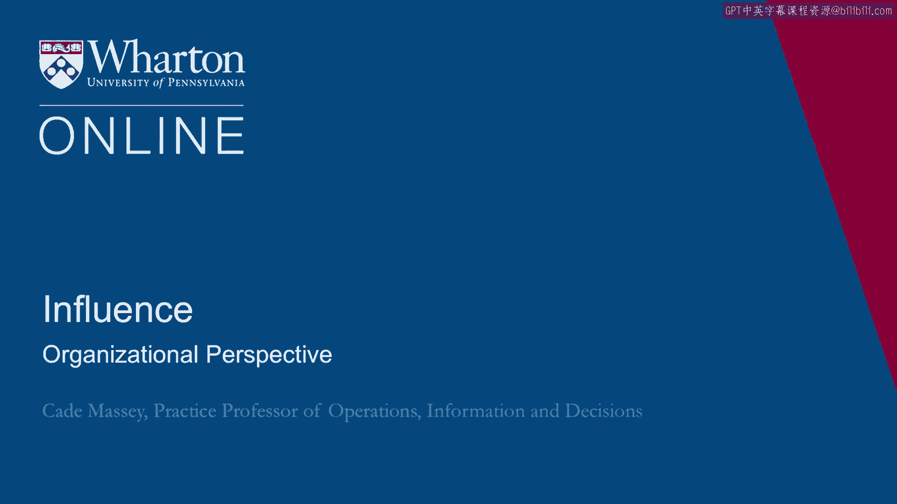
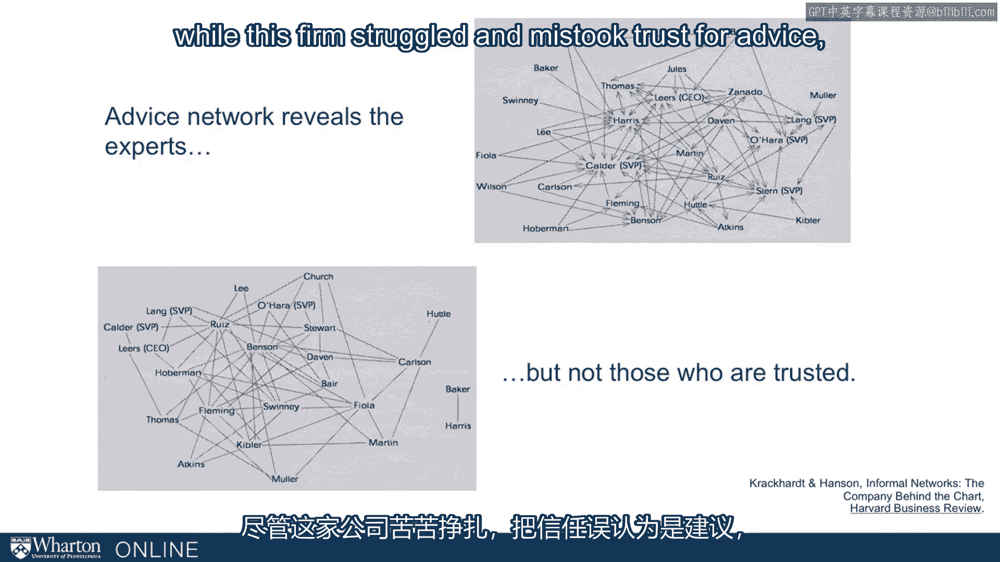

# 沃顿商学院《实现个人和职业成功（成功、沟通能力、影响力）｜Achieving Personal and Professional Success》中英字幕 - P84：20_组织视角.zh_en - GPT中英字幕课程资源 - BV1VH4y1J7Zk

So far we've been talking about networks and cultivating networks from an individual's。

perspective and in fact most of the course is built around that individual perspective。

We're trying to give you tools for navigating organizations。

But you also sometimes find yourself in more than managerial role and you'll need the。

organization's perspective。 So let's take a moment and think about what the implications of this social network theory。

we've been talking about。 What are the implications from the organization's perspective？

In particular， do we learn anything about org design from this？

Could we bring some of these ideas to org design？ And do we learn anything about how to assemble teams and how to staff teams as a result？

You always want to remember to flip that perspective。 While we're tooling you up as an individual。

sometimes you want to turn this around and， ask as a manager or as I think about managing individuals。

what are the implications？ So interdependence is a necessary part of organizational life but we need to mind those。

interdependence。 So we need to be careful about leverage others are developing。

All these tools we're giving you for placing yourself in the right place in an informal。

structure that can be a risk to the organization。 It can be a risk to you as a manager if someone who works for you is developing too much of。

that leverage。 So another more generous way to put it is you want to make sure that those who are in these。

high leverage positions who are spanning these structural holes， who are in these disconnected。

networks。 They're trustworthy and their interests are in line with yours and the organizations。

So if you pay attention to that you can align， you can get the right people in those positions。

and you can enhance the effectiveness of the entire organization。

Consider for example a case that a student brought to us a few years ago of a reorganization。

in a financial services firm who was based in New York but had heavy presence in Asia。

So before the reorganization they had all these different banking groups and they had。

three different Asian offices in Korea， China and Japan and there was no coordination between。

the banking groups in New York and the Asian offices a long way away。

With the reorganization they built an Asia group with a New York office so that all of。

the banking groups then coordinated their efforts with the distant field offices through。

that centralized Asian group in New York。 So clean things up。

ease is coordination makes a lot of sense from a network's perspective， though。

What are the benefits and the risks。 If you're taking what we said seriously in the earlier part of the lecture you would。

love to be in that position right。 It is a very picture of spanning a structural hole。

All the information that flows from the banking groups flows through you on the way to the。

Asian offices and vice versa。 But from an organizational perspective you might think that's a risk。

It is putting a lot of eggs into one structural basket and you want to make sure if you decide。

to go this way and you might do that for structural reasons you want to make sure that the right。

kind of person is in there that you can trust the person and that they're going to interact。

with those on both sides of that structural hole in a way that's productive and healthy。

for the organization。 So the presence of these disconnects can be good for individuals they can be risky for。

firms。 Mostly it means that information flow is impeded and you want to build connections to bridge。

that but you might take that too far of course because you don't want everybody with the。

same information totally homogenous you want to take advantage of that heterogeneity so。

there's a trade-off between how many of those holes you try to bridge and how many you let， sit。

Of course we also want to always mind the people that are sitting in those holes you don't want。

to grant too much power to people who sit in these high leverage situations。 What about staffing？

You've still got to make decisions on who to put in leadership roles。

If you take the network ideas seriously maybe we want to think about the social capital somebody。

brings to the leadership roles。 We historically have thought about experience and education and functional expertise。

What about social capital？ How can we do that？ Well there's an example from a classic example from crackcard enhancing about a manager who。

tried to use social capital but went about it in the wrong way。 So a quick illustration。

The managers in this situation used what they thought was a wise network a wise form of social。

capital and that was an advice network。 Who people in their organization went to for expert advice。

So they identified that person and put them in their leadership role。

They did not have a good experience with this because they hadn't considered the trust network。

A very different kind of network。 Who do people interact with？

Who do people actually trust in the organization？ That can be。

It doesn't have to be but it can be very different from those who they go to for advice。

So in this example while this firm struggled and mistook trust for advice it's actually。

an opportunity。 This shows the real opportunity with social networks especially these days with the。

proliferation of methodologies。 It's never been easier。

Social network methodology is allowing us to tap into attributes we haven't been able。

to observe otherwise。 Advice， trust， many others are coming。

So it's something that is going to be a real asset for organizations。

Beyond the tools that provides us as individuals it's assets for organizations to tap into and。

better understand their employees and therefore their future leaders。 [BLANK_AUDIO]。

