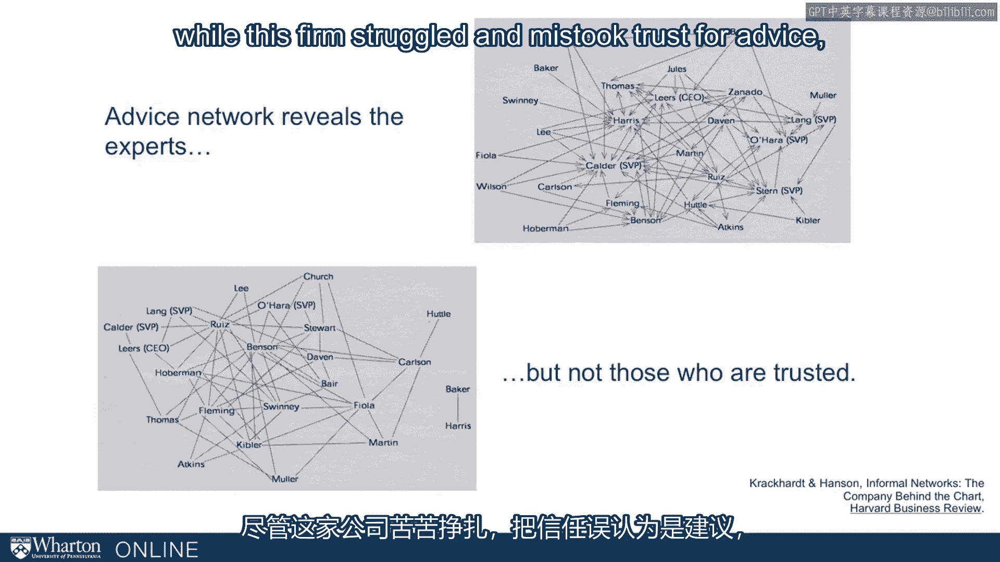

# 课程名称：实现个人和职业成功（成功、沟通能力、影响力）｜第20讲：组织视角 👥

在本节课中，我们将从组织的视角来审视社会网络理论。我们将探讨网络理论对组织设计、团队构建和人员配置的启示，并学习如何平衡个人网络优势与组织整体风险。

---

到目前为止，我们一直在从**个人视角**讨论网络及其构建。事实上，本课程的大部分内容都围绕这个视角展开，旨在为你提供在组织中导航的工具。

然而，有时你可能会担任管理角色，这就需要你理解**组织的视角**。因此，让我们花点时间思考一下，我们讨论的社会网络理论对组织意味着什么？

具体来说，我们能否从中获得关于组织设计的启示？能否将这些理念应用于组织设计？我们是否能学到关于如何组建和配置团队的知识？

你需要时刻记得转换视角。虽然我们一直在为你个人赋能，但有时你需要反过来思考：作为一名管理者，或者从管理个人的角度出发，这些理论有何实际意义？

---

## 组织中的相互依赖与风险 ⚖️

相互依赖是组织生活中必要的一部分，但我们需要留意这些相互依赖关系。我们必须谨慎对待他人可能发展出的**杠杆优势**。

我们为你提供的所有工具，都是为了让你在非正式结构中处于有利位置。但这可能对组织构成风险。如果你的下属发展出过多的杠杆优势，这对你作为管理者也是一种风险。

更积极的说法是，你需要确保那些处于**高杠杆位置**、**跨越结构洞**、身处**不连通网络**中的人是值得信赖的，并且他们的利益与你及组织的利益保持一致。

如果你能关注这一点，你就可以让合适的人处于这些关键位置，从而提升整个组织的效能。

---

## 案例分析：金融服务公司的重组 🏢

几年前，一位学生向我们分享了一个金融服务公司重组的案例。该公司总部在纽约，但在亚洲业务广泛。

重组前，他们有不同的银行部门，并在韩国、中国和日本设有三个亚洲办事处。纽约的银行部门与遥远的亚洲办事处之间缺乏协调。

重组后，他们建立了一个亚洲业务组，并在纽约设立了办公室。所有银行部门都通过这个位于纽约的、集中的亚洲业务组来协调与远方办事处的合作。

这理顺了流程，简化了协调。从网络视角看，这很有道理。但其中的**收益**和**风险**是什么？

如果你认真听了本课程前面的内容，你会很乐意处于那个亚洲业务组的位置。这正是**跨越结构洞**的典型图景：所有从银行部门流向亚洲办事处（或反向）的信息都要经过你。

但从组织视角看，你可能会认为这是一种风险。这相当于把很多鸡蛋放在了一个结构性的篮子里。如果你出于结构原因决定这样做，你必须确保安排**合适的人**在那个位置上——一个你可以信任、并且能以对组织有益且健康的方式与结构洞两边的人互动的人。

---

## 结构洞的双面性：个人机遇与组织风险 🔄

这些网络**不连通**的存在对个人可能是好事，但对公司则可能构成风险。这通常意味着信息流动受阻，你需要建立连接来弥合它。

但你也不能做得太过，因为你并不希望所有人都拥有完全相同的信息，变得完全同质化。你需要利用这种**异质性**。因此，在弥合多少结构洞与保留多少结构洞之间，存在一种权衡。

当然，我们也必须始终关注身处这些结构洞中的人。你不希望赋予那些处于高杠杆情境中的人过多的权力。

---

## 人员配置：将社会资本纳入考量 👥

你仍然需要决定由谁来担任领导角色。如果我们认真对待网络理念，或许我们应该考虑候选人能为领导角色带来的**社会资本**。

历史上，我们通常考虑经验、教育和职能专长。那么社会资本呢？我们如何考量？

这里有一个来自经典案例（Crackcard Enhancing）的例子：一位经理试图利用社会资本，但方法错了。简单说明一下：

案例中的经理使用了他们认为是明智的社会资本形式——**建议网络**，即组织中人们向谁寻求专家建议。他们识别出这个人，并将其置于领导岗位。

但结果并不理想，因为他们没有考虑**信任网络**——一种非常不同的网络。人们实际与谁互动？在组织中真正信任谁？这可能（尽管不一定）与寻求建议的对象完全不同。

在这个例子中，该公司因混淆了“信任”与“建议”而陷入困境。但这实际上也揭示了**机遇**。

---

## 社会网络分析的机遇 📊

这展现了社会网络分析带来的真正机遇，尤其是在方法论日益普及的今天。利用社会网络方法论，我们从未如此容易地洞察到那些原本无法观察到的属性，如建议网络、信任网络等。

因此，这将成为组织的一项宝贵资产。除了为我们个人提供工具外，它也是组织用来更好地了解员工、从而识别未来领导者的资产。

---

## 总结 📝

本节课中，我们一起学习了从组织视角审视社会网络。我们探讨了个人网络优势可能给组织带来的风险，以及结构洞在组织设计中的双面性。我们通过案例分析了重组中的网络考量，并讨论了在人员配置中纳入社会资本的重要性。最后，我们认识到社会网络分析不仅是个人工具，更是组织洞察人力资本和培养未来领导者的重要资产。