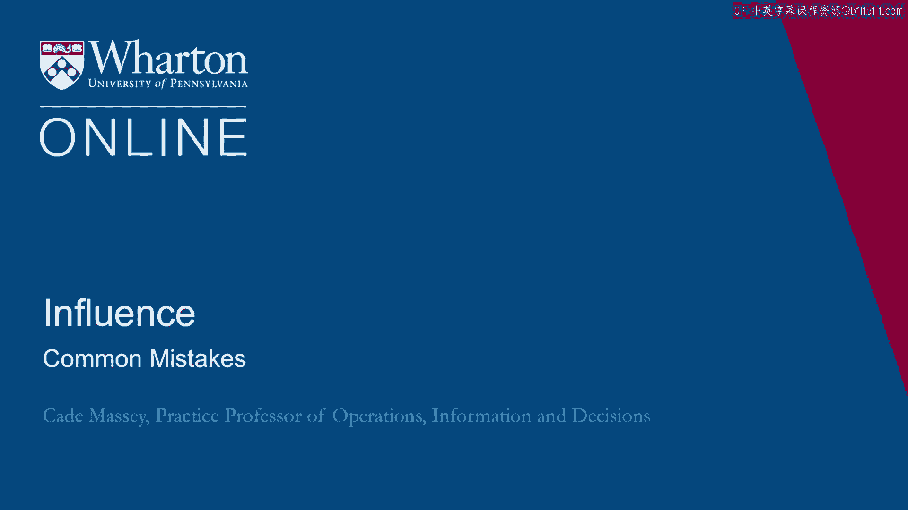
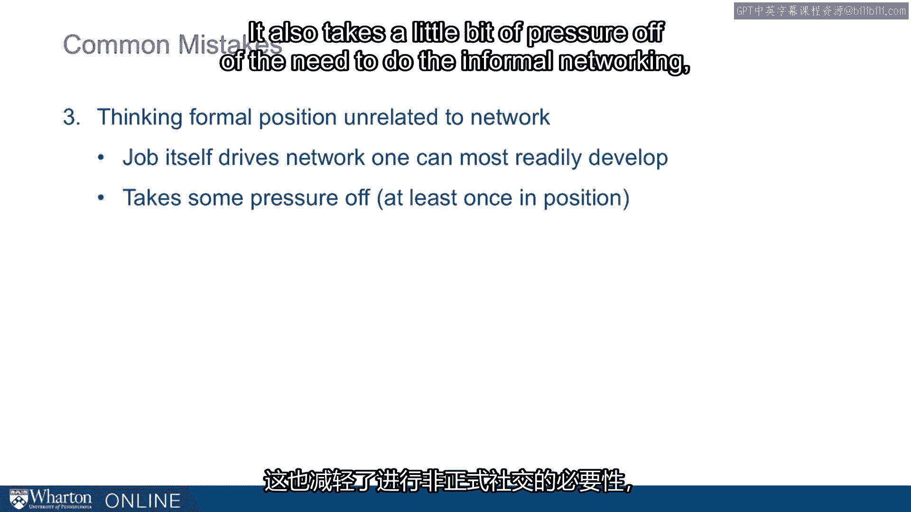
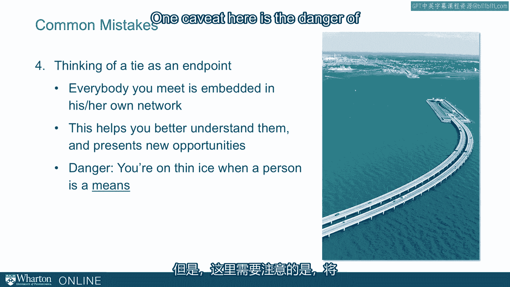

# 沃顿商学院《实现个人和职业成功（成功、沟通能力、影响力）｜Achieving Personal and Professional Success》中英字幕 - P85：21_常见错误.zh_en - GPT中英字幕课程资源 - BV1VH4y1J7Zk

So in this lecture we'll talk about a few common mistakes that people make as they build。

a network and cultivate relationships。 The first and probably most important is the mistake of waiting to network until you have。

an objective。 The ideas we've been talking about today are much more about a way of life。

It is a means rather than an end。 You should think in terms of social capital。

You should think about your net， informal networks as social capital。

You build and cultivate just as you might build your human capital。

Your network is something you bring to any situation just like your education and it's。

something you should grow in and of for itself， incrementally over time。 Second common mistake。

focusing on networking up。 It's appealing， alluring even to try to get to know those who are already in positions。

of power but there are a few problems with this。 One， there's more competition。

It's the scarce resource and the folks in those positions of power have even less time。

to give than those at lower levels。 It also puts an undue focus on formal hierarchy and you forget if you're only looking at those。

in positions of power you forget the informal sources of power as well。

Then finally a very practical consideration is one of the greatest sources of your network。

is going to be who you know now and how they evolve over time。

The folks you were going to school with， the folks you were starting your organizations。

with will move into positions of influence over time。

If you've neglected them along the way then you won't have those networks when they're。

actually in the positions where they can really make a difference。 Third common mistake。

thinking that your formal position is unrelated to the informal network。

We've spent so much time talking about informal network。

We don't want to neglect that there are relationship consequences， network consequences that come。

along with your formal position。 So the job itself can drive the network。

In fact it's going to put you in proximity。 It's going to give you regular interaction with a distinct set of people。

It's important way to think about that job actually。

What is the informal network that's going to be impaired or facilitated by the formal， position？

It also takes a little bit of pressure off of the need to do the informal networking because。

you know that some of it's going to come from the formal side。

And then finally some folks make the mistake of thinking of a tie as an end point。

They want to get to know a person， they neglect the network that that person sits。

Everybody you meet is embedded in their own network。

Basically one of the things you carry away from this discussion is how everybody is influenced。

and everybody brings a resource and everybody brings a constraint of their network。

So when you're getting to know people it's not just that person， you're getting to know。

the context， the social context that they live and work in。 So it helps better understand them。

It also helps you better understand opportunities that might exist。 Also the constraints that exist。

One caveat here is the danger of treating people as a means to get to their network though。

They're on thin ice in many ways when you start thinking about people as a means to your， end。

So even though we want you to think about them as in the context of their network we don't。

want you to think about them only because of their network。 [BLANK_AUDIO]。

