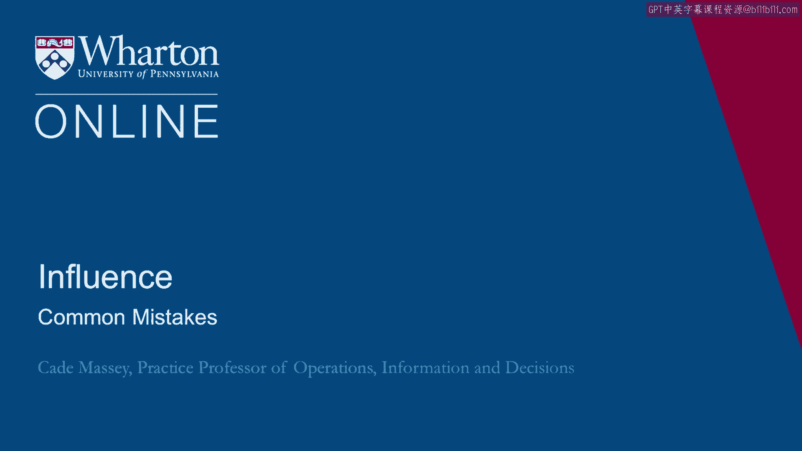
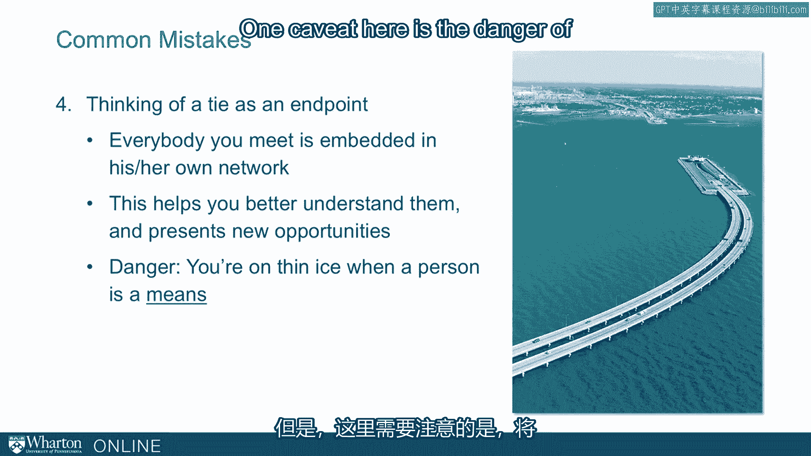

# 沃顿商学院课程《实现个人和职业成功》第21讲：建立人际网络时的常见错误 🚫

在本节课中，我们将探讨人们在建立和培养人际关系网络时常犯的几个错误。理解这些错误有助于我们更有效地构建社交资本，避免走弯路。

---

## 概述

成功的人际网络建设是一个持续的过程，而非一次性任务。本节将分析四个常见误区，帮助你建立更健康、更有效的关系网络。

---

## 错误一：等到有目的时才去建立网络

上一节我们介绍了社交资本的概念，本节中我们来看看第一个常见错误：许多人倾向于等到有具体目标（如找工作、寻求帮助）时，才开始建立人际网络。这是一个根本性的误区。

我们讨论的理念更应被视为一种生活方式，它是一种**手段**而非**目的**。你应该将你的非正式人际网络视为**社交资本**。

*   **社交资本公式**：`社交资本 = 持续积累的人际关系价值`
*   你应当像积累人力资本（如教育、技能）一样，去建设和培养你的网络。
*   你的人际网络是你带入任何情境的一种资源，就像你的学历一样。它本身就应该随着时间的推移，被持续地、渐进式地培育。

---

## 错误二：只专注于“向上”社交

人们常犯的第二个错误是只专注于结识那些已经身居高位的人。这虽然很有吸引力，但存在几个问题。

以下是专注于“向上”社交的主要弊端：

1.  **竞争更激烈**：高层职位是稀缺资源，而身处这些位置的人时间更少。
2.  **忽视非正式权力来源**：这会导致过度关注正式层级，而忽略那些拥有非正式影响力的人。
3.  **忽视现有关系的潜力**：你人际网络中最重要的来源之一，将是**你现在认识的人以及他们未来的发展**。你的同学、初创同事将来都可能成为有影响力的人物。如果你在过程中忽视了与他们的联系，当他们真正能发挥作用时，你将无法利用这些网络。

---

## 错误三：认为正式职位与非正式网络无关

我们已经花了很多时间讨论非正式网络，但同样不能忽视的是，你的**正式职位会带来相应的人际网络后果**。

实际上，工作本身可以驱动你的网络建设。

*   **代码示例**：`你的职位 -> 决定你接触的人群 -> 形成你的基础网络`
*   职位会将你置于特定的人群附近，让你与一组特定的人产生定期互动。
*   思考一份工作时，一个重要角度是：这个正式职位会**促进还是限制**哪些非正式网络的建立？
*   认识到这一点，也能减轻你在非正式社交方面的部分压力，因为你知道部分网络会从正式的工作关系中自然产生。

---

## 错误四：将单次联系视为终点

最后，有些人错误地将与某人建立联系视为终点。他们只想认识某个人，却忽略了这个人所处的整个网络。

你遇到的每个人都嵌入在他们自己的社交网络中。本次讨论的一个核心收获是：每个人都受到其网络的影响，每个人都带来其网络的资源和约束。

因此，当你认识一个人时，你不仅仅是在了解这个人，你也是在了解他们生活和工作的**社会背景**。这有助于你更好地理解他们，也能帮助你发现可能存在的机会和约束。

**但这里有一个重要的警告**：存在一种危险，即仅仅将他人视为接触其网络的**手段**。当你开始将人视为达成目的的工具时，在很多方面你都如履薄冰。因此，虽然我们希望你在其网络背景中思考他们，但我们绝不希望你**仅仅因为他们的网络**才去结交他们。

---

## 总结

本节课中，我们一起学习了建立人际网络时的四个常见错误：
1.  不要等到有具体目标时才行动，应将网络建设视为持续积累的社交资本。
2.  避免只“向上”社交，要重视并培育你现有的、平等的关系。
3.  认识到正式职位会塑造你的非正式网络，二者密切相关。
4.  不要将单次联系视为终点，要理解每个人背后的网络，但同时永远不要纯粹功利地对待他人。

记住，有效的人际网络是关于建立真诚、互惠的长期关系，而非短期的交易。