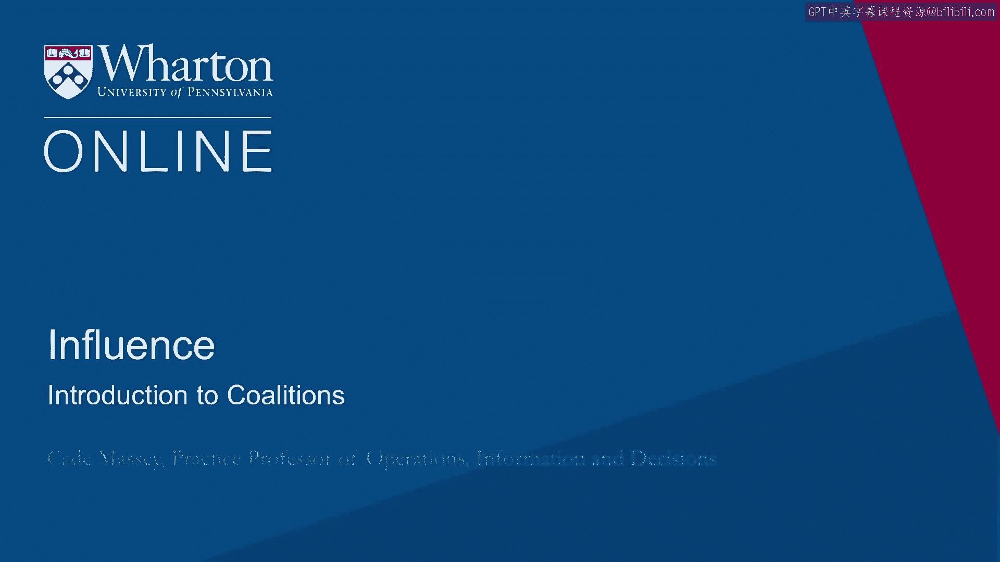
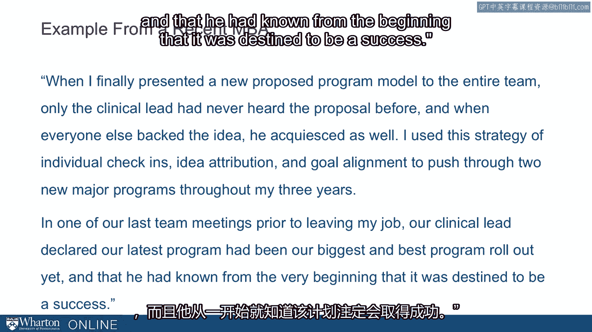

# 沃顿商学院《实现个人和职业成功（成功、沟通能力、影响力）｜Achieving Personal and Professional Success》中英字幕 - P87：23_联盟简介.zh_en - GPT中英字幕课程资源 - BV1VH4y1J7Zk

In this lecture， we'll talk about coalitions。

And to start that， I want to give an example from recent news。

There was an announcement a couple of years ago of a big gas deal between Russia and China。

Here is the headline in the Financial Times and it looks to all the world like a two-party， deal。

But if you read the article， you see how often third parties influence the deal。 In fact。

one of the motivations for this was that Russia wanted to beat the U。S。 to the， Chinese market。

there is increasing interest in liquefied natural gas from the U。S。 in China。

Russia doesn't want that to happen， so they want to land this deal so they can preserve。

the market for themselves。 That's the influence of the U。S。 Causing stand。

they have to locate this pipeline。 They have to build it across countries to get from Russia to China。

The shortest distance would be through Causing stand。

Causing stand didn't want to be in on the deal because of their long-standing pseudo-dependence。

on Russia as a former member of the Soviet Union。 On the other hand。

Mongolia next to China wanted the pipeline。 They wanted perhaps a little less dependence also from their big neighbor。

China， but China， didn't want Mongolia the other pipeline。

So they'd take it all the way to the east。 So we can see even in this relatively simple example。

it looks like a big two-party deal， but in fact third party has influenced the motivation and the location of this thing。

That's where we're coming from today。 Coalition is an incredibly important topic。

They affect negotiations and organizations and individuals all the time every day。

And yet we don't really hear that much written about them。 We don't see them study that much。

We want to share with you some of the things we have seen and studied in the last few years。

So to do that， let's start with an example from a recent MBA talking about her use of。

coalitions in her organization。 So let's just walk through this。 She writes。

"In my last job I worked for an organization providing consultation and training。

to mental health clinics to help improve their clinical services。

We were being asked to create a new offering that focused on their business operations。

There were a few members of my team who were very experienced in providing clinical trainings。

to clinics and they felt strongly that we should use the same program model to deliver。

these business services。 However， as the sole client contact。

I heard from our clients that using this model wasn't， working for their business needs。

The most junior member of the team by at least 15 years when I tried to communicate this to。

the entire team and propose a new solution， I was quickly shut down and dismissed by the。

lead clinical expert。 So let's stop here and ask， are you familiar with this kind of situation？

I suspect many of you are。 You don't have formal authority。

You might be in a relatively less influential position and yet you want to somehow impact。

the decision making。 What is she going to do？ So she gives us an high illustration of coalitions and what follows。

She said， "Identify that two of my main team members who came from business and operations。

functions were more sympathetic to my opinions。 They just didn't want to actively disagree with the other executives。

preferring to pick， their battles on other issues。

I began to meet with these team members individually， sharing my ideas and refining them based on。

their feedback。 Once I had their buy-in， I set up meetings with the more conservative team members who。

came from a range of business and clinical backgrounds， telling them that the ideas had。

come from their fellow executives and asking them for their feedback and input。

I also engaged different team members in helping me build out parts of an idea that I knew。

aligned with their personal goals。 For example， I asked our financial expert to help me think through the strategy for revamping。

our financial modeling training and lead the training for the initial pilot。

When I finally presented a new proposed program model to the entire team， only the clinical。

lead had never heard the proposal before。 And when everyone else backed the idea。

he acquiesced as well。 I used the strategy of individual check-ins。

idea attribution and goal alignment to push， through two new major programs throughout my three years。

In one of our last team meetings prior to leaving my job， our clinical lead declared our latest。

program had been our biggest and best program rollout yet and that he had known from the。

beginning that it was destined to be a success。 So here we have a fantastic example of using coalitions from a relatively powerless position。

in order to actually exert influence in their organization。

This is the kind of thing we want to study and learn how to do in today's lecture。 [ Silence ]。

