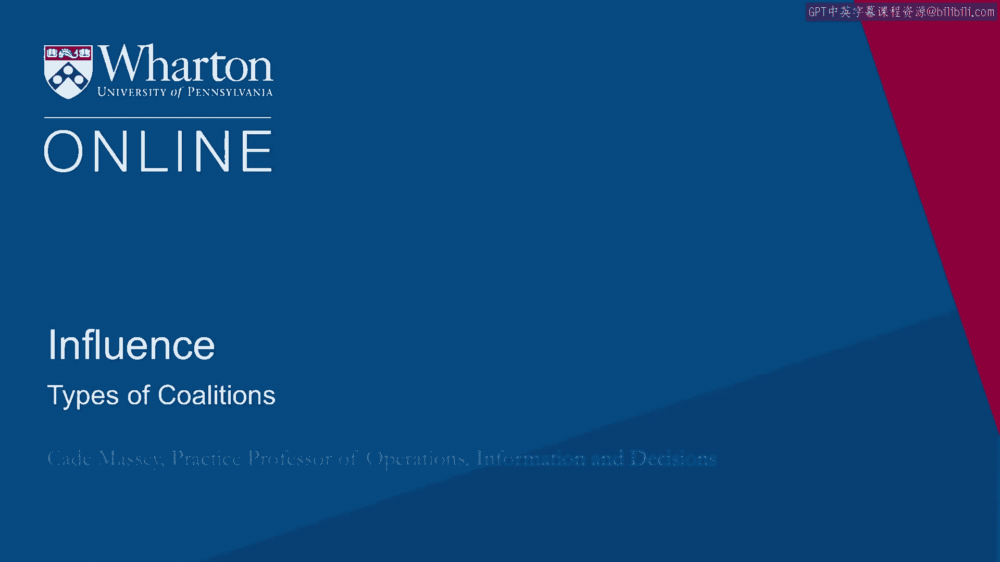
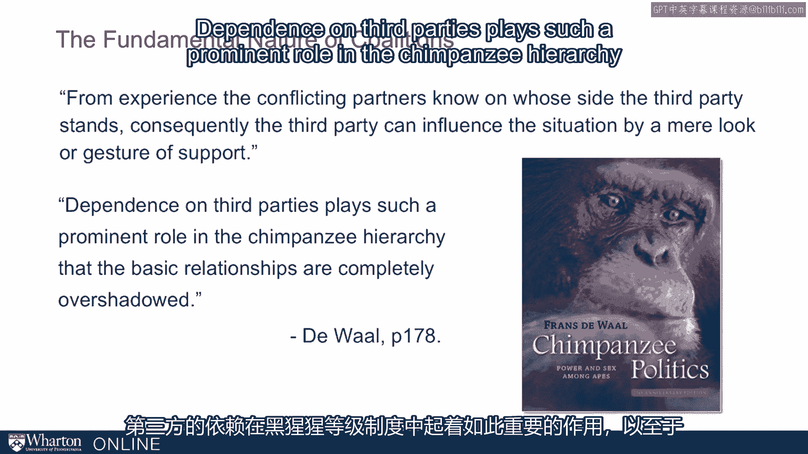
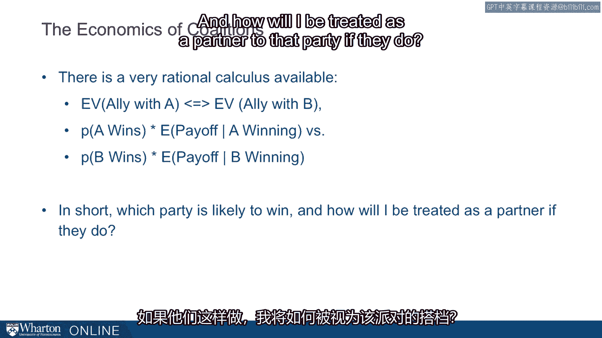
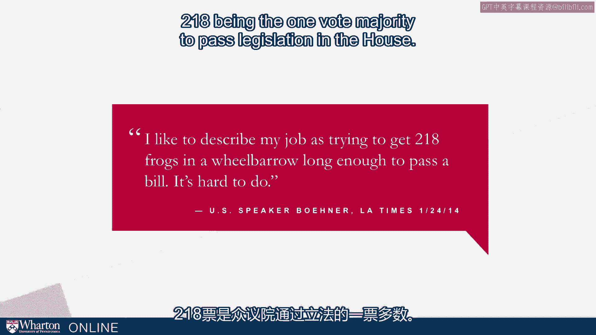
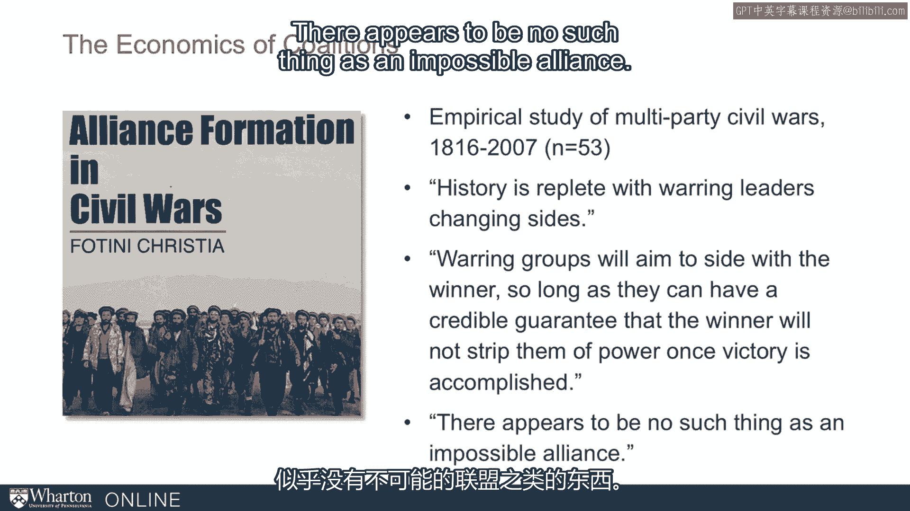

# 沃顿商学院《实现个人和职业成功》课程 P88：联盟类型 🤝

在本节课中，我们将要学习联盟的类型及其运作原理。联盟是个人和组织为实现共同目标而结成的合作关系，理解其背后的驱动力对于提升沟通能力和影响力至关重要。

---

## 联盟的重要性与哲学基础

联盟的哲学相当直观。政治哲学家埃德蒙·伯克曾精辟地阐述：当人们联合在一起时，他们能迅速传递警报，共同商议对策，并以团结的力量进行抵抗。反之，若人们分散各处，缺乏协调与秩序，沟通将变得不确定，商议变得困难，抵抗也难以实现。

由此可见，联盟能带来显著益处。为了理解人类行为的根本性，我们常观察灵长类动物的行为。研究发现，联盟行为在灵长类动物中也普遍存在，这表明它是我们与生俱来的、根本性的行为模式。

著名的灵长类动物学家弗朗斯·德瓦尔在其著作《黑猩猩的政治》中指出，冲突中的黑猩猩会关注第三方支持谁。因此，第三方仅通过一个眼神或姿态就能影响局势。在等级森严的黑猩猩社会中，这种依赖第三方的联盟关系甚至能完全掩盖其基本的社会关系。

从埃德蒙·伯克的哲学到黑猩猩的行为，都证明了联盟对人类行为至关重要且具有根本性。

---

## 联盟类型：一个谈判案例

为了深入探讨联盟的种类与细节，让我们从一个例子开始。这个例子来自哈佛谈判学院一个经典的“三方组织”谈判练习。

在这个谈判中，有三个参与方：海王星、冥王星和金星。他们需要决定如何分配一笔资源（可以是金钱或积分）。合作方式与收益如下：
*   **三方共同合作**：总共有24点可以分配。
*   **两两合作**：
    *   海王星与冥王星合作：共有22点。
    *   冥王星与金星合作：共有12点。
    *   金星与海王星合作：共有18点。

从收益结构看，海王星似乎是更有权力的一方。现在，假设你是最弱的一方——金星，你会如何行动？你知道这是一个关于组建联盟的练习。你会选择与强大的海王星结盟，还是与实力中等的冥王星联手？在做决定时，你不仅会计算点数，还会考虑与对方的关系和信任度。

这个决策过程揭示了现实中两种主要的联盟类型。

---

## 两种核心联盟类型

以下是两种核心的联盟策略：

1.  **权力平衡**
    这是政治学中一个长期存在的动态：当一个主导性力量出现时，较小的力量会联合起来以制衡它。在上述例子中，即冥王星和金星联合起来对抗更强大的海王星。

2.  **追随强者**
    这是另一种联盟类型，即较小的力量相互竞争，以争取与那个单一主导力量结盟。在上例中，金星可能会想：“我为什么要去找弱小的冥王星？直接与强大的海王星结盟不是赢面更大吗？”

当你作为较弱的一方试图决定组建何种联盟时，常常会面临这两种选择。有时你只是旁观他人组建联盟，那么如何预测结果会是权力平衡型还是追随强者型呢？理解这一点能帮助我们更好地把握联盟。

---

## 联盟形成的两大基础

联盟的形成主要基于两大基础：一是**利益**，可以看作是联盟的经济学；二是**身份认同**，可以看作是联盟的情感或情绪基础。让我们分别深入探讨。

### 基于利益的联盟

基于利益的联盟有一个非常生动的例子，叫做“浸信会与私酒贩子联盟”。这源于20世纪80年代对美国立法的研究，具体例子是美国一些州限制周日销售酒精的“蓝色法规”。

分析指出，支持该法规的联盟由两部分人组成：
*   **“浸信会”**（不一定是真正的浸信会信徒，而是泛指宗教领袖）：他们为联盟提供了道德高地，解释了立法的原因。
*   **“私酒贩子”**（这里指酒吧老板）：他们在经济上受益，因为周日只有酒吧能卖酒。他们的利益是财务性的，并能提供竞选资金。

这个联盟非常强大，因为从立法者的角度看，他们既有道德理由（宗教原因），又能获得实际利益（竞选资金）。该理论的提出者布鲁斯·扬达尔指出，当两种截然不同的群体都要求某项社会监管时，就会产生持久的社会监管。这种互补性加上共同的经济利益，形成了强大的联盟。

近期，绿色能源领域也有类似例子。在加州等地，大型金融利益集团支持绿色能源，表面上是出于环保原因，但实际上也看中了监管优势和投资机会。道德高地与经济利益的结合，构成了强大且互补的利益联盟。

在做基于利益的决策时，存在一种非常理性的计算方式，即计算与不同方结盟的**期望价值**。公式可以表示为：
`期望价值 = (A方获胜的概率 × A方获胜后我的收益) + (B方获胜的概率 × B方获胜后我的收益)`
简而言之，就是评估哪个派别更可能获胜，以及我作为其合作伙伴将如何被对待。

这类联盟的挑战在于其动态性，人们总是在寻找更好的交易。美国众议院前议长约翰·博纳曾形象地描述他的工作是“试图让218只青蛙待在独轮车里足够长时间，以便通过一项法案”。这很困难，因为总有人试图用更高的出价“挖走”这些“青蛙”。

一个强有力的例子来自对内战（如阿富汗等地的多派别内战）中联盟形成的研究。研究发现，交战团体只要能得到可信的保证，确保胜利者不会在获胜后剥夺他们的权力，他们就会倾向于加入更可能获胜的一方。研究表明，**利益**和**理性计算**可以克服看似根深蒂固的身份认同问题。

### 基于身份/情感的联盟

联盟形成的另一个基础是**身份认同**，它更基于情感，可能源于忠诚等因素。这会导致人们为了其他目标而牺牲狭隘的经济利益。

一个例子来自第一次世界大战时的英国和法国联盟。战争开始时，英法之间并没有正式的条约。当德国入侵比利时和法国时，英国必须决定是否站在法国一边参战。英国外交部的一份备忘录写道：“严格来说，没有书面条约约束我们支持法国……但协约关系已经建立、加强、经受考验并以某种方式得到颂扬，使人相信一种道德纽带正在形成……如果我们否认它，将使我们的声誉受到严重质疑。”

你可以看到，这与之前讨论的理性计算基础截然不同。这里的基础是**道德**和**荣誉**。最终，英国确实站在了法国一边加入了战争。

从视觉上看，情感也能发挥巨大作用，例如受压迫的弱小方可能会为了**复仇**而联合起来。

---

## 利益与身份认同的权衡

总的来说，我们面临**利益**与**身份认同**的权衡。
*   **基于利益（经济学）**：潜在的联盟伙伴范围很广，只要你能满足其经济利益，几乎任何人都可以拉拢。但这意味着你与盟友的联系相对**薄弱、肤浅**。
*   **基于身份认同（情感）**：能提供更**强大的连接**，但极大地**限制**了你能结盟的对象数量。

这两种方式没有绝对的对错或优劣，它们是联盟形成的两种不同路径，都至关重要。一个重要的结论是：忽视其中任何一种都是危险的。它们既是你可以用来组建联盟的机会，也是他人可能试图挖走你盟友的风险所在。

---

本节课中，我们一起学习了联盟的两种核心类型（权力平衡与追随强者）以及联盟形成的两大基础（利益与身份认同）。理解这些概念，能帮助我们在个人和职业场景中更有效地构建和维护合作关系，从而提升成功所需的沟通能力与影响力。