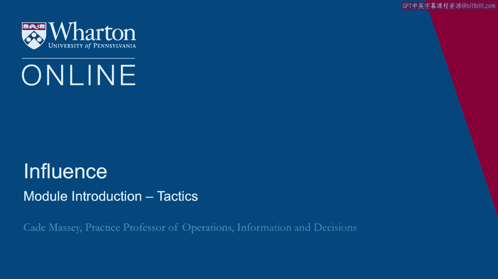

# 沃顿商学院课程《实现个人和职业成功》第28课：影响力策略模块简介 🧠

在本节课中，我们将进入影响力学习的第三周。我们将深入探讨一些具体的影响力策略，并分两部分进行讲解。首先，我们将聚焦于“说服”这一经典领域；随后，我们将更广泛地讨论不同的影响力风格。课程旨在帮助你理解实用的行为框架，并丰富你的影响力策略工具箱。

---

## 第一部分：说服的框架 📐

上一节我们介绍了本周的学习目标，本节中我们来看看第一部分的核心内容：说服。说服是影响力研究中的一个经典领域，其历史可追溯至数千年前。我们将重点理解其中实用的理论框架。

说服研究强调，有效的影响力并非依赖于个人特质或生理倾向，而是取决于具体的行为和策略。

---

## 第二部分：影响力风格与策略 🧰

在了解了说服的经典框架后，本节我们将更广泛地探讨各种影响力风格。我们将挑战那种认为影响力主要取决于个人特质的观念，转而强调可学习和应用的具体行为与战术。

为了达成这一目标，我们将分享过去十年间进行的一些实证研究成果。这些内容旨在帮助你充实自己的影响力策略工具箱。

以下是本部分将涵盖的核心策略类别：

*   **理性说服**：使用逻辑、数据和事实来构建论点。
*   **情感诉求**：通过激发情感共鸣或价值观来建立连接。
*   **合作协商**：寻求双赢方案，邀请对方共同参与决策。
*   **个人魅力**：运用自信、热情或可信度来感染他人。
*   **交换互惠**：暗示或明确提供利益交换。
*   **建立联盟**：争取他人的支持以增强自身立场。
*   **合法化策略**：援引权威、规则或传统来支持请求。
*   **压力策略**：使用要求、威胁或持续监督来达成目标。

---

## 总结 ✨

本节课中，我们一起学习了影响力策略模块的概览。我们首先探讨了拥有悠久研究历史的“说服”框架，随后转向了更广泛的影响力风格与行为策略。核心在于理解，影响力是一项可以通过学习和练习具体战术来提升的技能。希望这些内容能为你的个人与职业发展提供实用的工具。