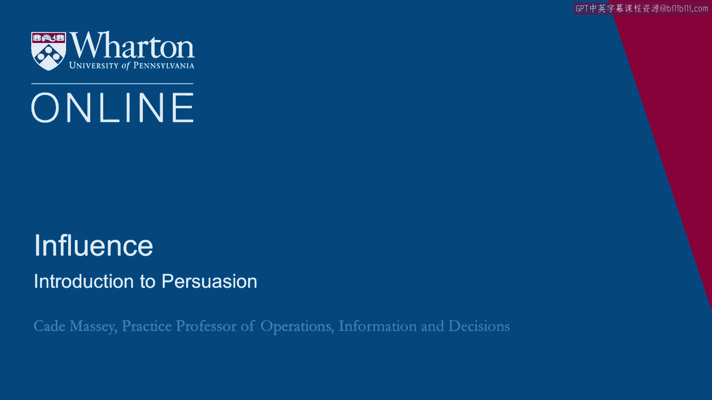
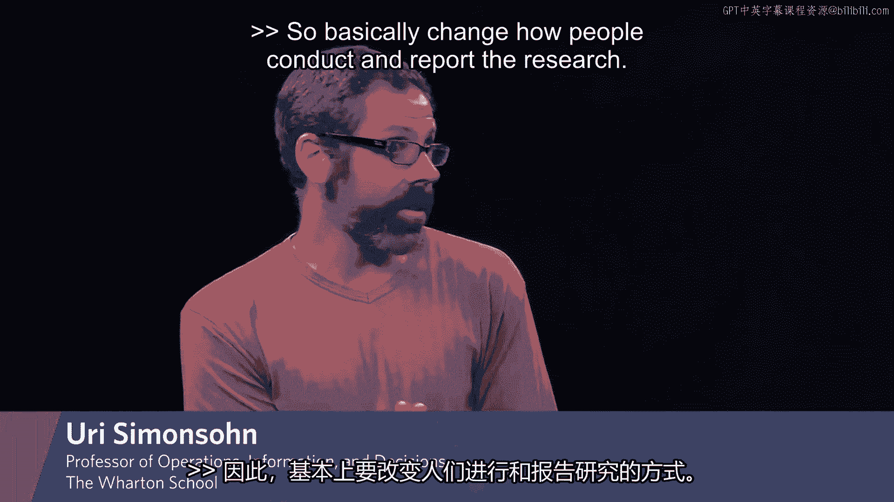
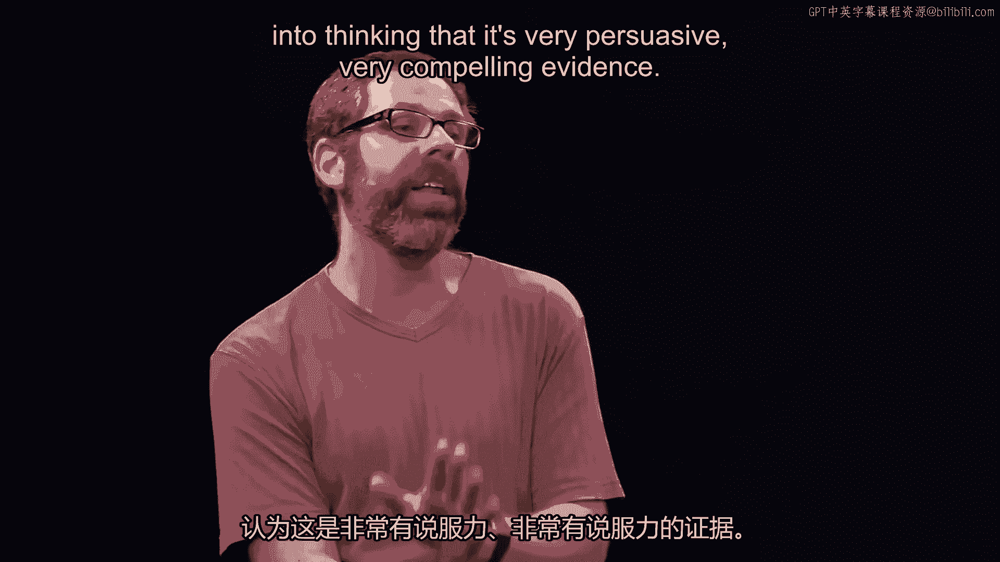
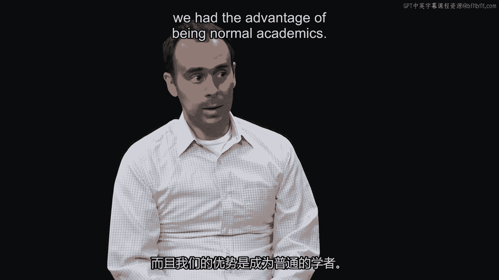

# 沃顿商学院《实现个人和职业成功（成功、沟通能力、影响力）｜Achieving Personal and Professional Success》中英字幕 - P93：29_说服力简介.zh_en - GPT中英字幕课程资源 - BV1VH4y1J7Zk

We're going to begin this module talking about persuasion。

And to do that， we'll start with an interview that I did recently with a couple of colleagues。

of mine， Yuri， Simon， and Joe Simmons， about some research they've done recently。

They published an article called "False Positive Psychology， Undisclosed Flexibility and Data。

Collection and Analysis， Allows Presenting Anything as Significant。"。

The final title on a subject that seems a little arcane and yet this paper has been wildly。

influential。 It's been cited 2，000 times since it was published in 2011。

It's arguably the most influential paper in what has been called the reproducibility crisis。

in psychology。 And it raises a question， did persuasion have any role to play in the impact this paper。

is having？ You might think academic research is a place where persuasion shouldn't matter。 In fact。

that's why I wanted to talk to Yuri and Joe because you think this is a place。

where it doesn't matter to his ideas。 But it turns out these guys put a lot of thought into rhetoric and persuasion。

So we sat down with them recently to find out how it went down。

So we're here this afternoon to talk to Yuri， Simon， and Son and Joe Simmons， both professors。

here at Wharton in the Operations， Information and Decisions group about research that they've。

been doing for the last， what fellas， six or seven years now？ Because back a little？ Six years。

Six years on what they initially called false positive psychology。

And they published a paper in 2011 which as of last count has something like 2，000 citations。

in less than six years and more papers behind that。

And people generally give it considerable credit for the conversation in psychology around。

reproducibility。 Some people will call the reproducibility crisis。

And others have had voice in this obviously。 But the paper and the research and the ongoing program has been influential。

We're here to talk today about persuasion， the role of persuasion and rhetoric in that， effort。

And the motivation is that we talk about persuasion all the time and other domains。

We talk about it in marketing or politics inside a firm。

But we don't usually think that something like science would involve persuasion and rhetoric。

My sense of having been around you guys in this project for most of that time is that。

persuasion has been an important part of it。 And so I thought it'd be good and instructive for us to talk a little bit about it and hear。

kind of from the inside how you've thought about that and what your experience with。

persuasion and rhetoric has been in this domain。 This was a paper that we really needed people to read and pay attention to。

Otherwise there's no point at all in doing it。 We were trying to change how the field as a whole did research。

And so for the first time in my life I was involved in a big persuasion attempt。

And so we really did think hard about how on earth to get people to read this paper。

Most people don't read papers that are part of academics。 Even academics for sure。

Most papers do not get read。 So we're going to talk in a lot of detail about this research。

It might be useful to explain in a very short fashion what the enterprise was。

So what exactly were you trying to persuade people to do？

I know that's a ridiculous question but it's concise。

So I basically change how people conduct and report the research。

So the idea is people have， when you conduct a study you collect many measures。

For example you may ask people how they feel about something that you may ask them how。

much they would be， how hard they would work to obtain it。 You may ask them multiple ways。

But then so they if you collect all those measures and you get to choose from them， the。

results report are going to be biased towards the one that works。

So imagine you try a drug and you give it to 100 patients and you see if it helps with。

weight or with their heart condition or with their skin。

And then if you try enough of those things one of them will work。

And then you report your results and you only talk about the one that actually worked。

The other measures will be made lead into thinking that is very persuasive。

very compelling evidence。

when in fact is just chance。 So this is an important feature here that this is basically a methodology paper。

So it's not just persuasion and rhetoric in a scientific endeavor but it's scientific。

methods and so we're really getting into what I think most people would think is pre-dry。

technical area not much room for persuasion。 So how did you position this paper？

How did you argue in this paper in a way that was different from other attempts， other academic。

attempts？ I mean we were writing a methods paper and most methods papers are written for methods。

people and we didn't want to write a paper for methods people。

We wanted to write a paper for normal people， normal academics at least。

And we had the advantage of being normal academics。

So a lot of methods， people writing methods papers are methods people but we're not a。

methods people so we sort of understood like what would it take for us to read a methods， paper。

And so we tried to build a methods paper that we ourselves would want to read。

So we started out by putting simulations in our paper because that sort of showed how。

big the problem was but I think the big insight was that a paper that just contains simulations。

is not a paper that many people are going to read。

And so we thought long and hard many many conversations around what is a good example。

or demonstration of the problem。 And we tried to come up with a demonstration that was interesting。

kind of cute， maybe， people would talk about it， you know that sort of thing。

I think that's sufficiently cute you should tell us real quickly just to describe it at。

a high level。 So we basically wanted to show that scientists could find statistically significant evidence。

for any hypothesis no matter how absurd。 And so we came up with a hypothesis that was demonstrably absurd which is that listening。

to a particular song can change how old you are。 And no one on earth believes that's possible。

And so we ran a study using the norms of the day that basically showed that that effect， was true。

We were like look if you do things the way that they are currently being done you can。

find evidence for this crazy hypothesis and you can write it up in such a way that people。

would be scientists would be persuaded by it。 And so we thought that piece was I think absolutely critical if we hadn't done that。

I'm not sure we would have gotten published but even if we had gotten published it would。

have probably been ignored。 That was one aspect of it。

So in terms of the persuasion thinking about it we would picture our least methodologically。

oriented friend and ask what would get this guy to tell about this paper to his friends。

What would the paper need to contain so it becomes like viral for academic standards？ Okay。

And where did that nucleation come from？ Is that a way you would thought about your work or your teaching or why that pivot from。

the way you might typically write？ The goal we said when we first met to discuss this we said okay so we want to change how。

psychologists do science and that felt like an impossible goal。

And so the first step in persuasion people have to listen to you。

And so I guess we were just very aware of how common it is for people to complain about。

a problem in academia and be ignored for decades and decades。

And so the first step for not being ignored is people need to know what you said。

I think at least introspecting that's what I think of you。 No， yeah absolutely。

So the first piece was basically getting people to want to read the paper by making it interesting。

maybe even a little funny in places， stuff like that。

But the second piece was about you can't just complain， as Yuri was just saying you can't。

just complain about a problem。 You also have to propose a solution。

Otherwise people just keep walking around complaining about it and nothing will ever get， done。

And you also have to produce a solution that is actionable and easy and really hard to。

argue against。 And so that was the other element of the paper that we really strove for。

Other people around that time or shortly thereafter were writing similar type pieces。

but the solutions on offer were utopian。 In fact some people even used the word utopian。

And they were not at all practical。 And they weren't going to happen any time soon and probably not in our lifetime and。

probably not ever。 And so we were trying to think instead of what could journals or what could scientists do。

tomorrow to change how they're doing it。 And so we really tried to find a baby step that would actually work。

actually be impactful， and that was sort of hard to argue with。

So those are sort of the two elements we really focused on。 Almost all of our conversations。

I mean the science of it was figured out in a day or two， or something。

Almost all of our conversations with this paper were about how to persuade。 Wow。

And the paper itself is actually quite short。 It's like nine pages and two or three of those are these prescriptions。

long list of prescriptions。 But obviously the persuasive effort goes beyond the publication。

You then go out and or even before the publication you're out talking about the paper， you're。

visiting schools， you're giving talks。 What， how did you find yourself going about that differently than you had before？

I think we're， we didn't， that we did not alter very much。

We did what we always did except that this time it was an incredible amount of demand。

to hear us talk about it。 So we， we submitted a symposium to a conference which is something everybody does all the。

time you say， here's three papers， please let us talk about it。 And they said， okay。

And usually 20 people show up， 50， maybe 100 people show up。 We had like 800 people。

It's like standing room only。 And that was， it's not like we prepped for that。 It just happened。

And I think it was， it was really just the downstream consequences of having drafted the。

message in the paper appropriately。 But did you， did the。

that must have been reinforcing in some way？ So you， you， you had this pivot to thinking in a more。

thinking about rhetoric more explicitly。 I'd be surprised if you didn't bake that into some of your presentations。

Did you not spend extra time more than usual working on just the right example or just the。

right analogy？ I feel like you guys are always coming up with these。

these analogies that are just so， apt。 Yeah。 I mean， I， I practiced like crazy for that talk。

For sure to try to make sure all the words were right。

But I think that was less of a concern about coming up with the right example in the talk。

Because basically we were using the example from the paper。 So that wasn't really the issue。

It was more about， you know， in my class on decision making， I talk about motivated reasoning。

and how， you know， people are more likely to believe something when they want to believe， it。

And a big implication of that is they don't， they're more likely to believe you if they。

like you than if they dislike you。 If we come out at the symposia and start talking about， hey。

you guys are all doing this wrong， and you know， we're better than you。

And we come out swinging like that。 That's terrible and if， and false。

because we had been doing all of the things that we， pointed out in the paper。

you can look at some of the garbage that I published prior to 2011。 It's， it's terrible stuff。

And so we were also very cognizant of the language was about we as a field and in the。

paper and in talks， we'd emphasize how we had all done these things。 And now all of us。

including us， now need to change the way we're doing things because。

you don't want to get on your high horse。 People are going to hate that。

Beyond just the first paper， you're also very well known for work on P curves。 And in that paper。

you came up with this term P hacking。 You've coined a few phrases now that people know well。

false positive psychology was the， title of the first paper。

This term researchers degrees of freedom。 What role do you think getting the right terms or titles play？

You'd like to think as academics， come on， this shouldn't matter， this is superficial。

but it kind of feels like it mattered here。 I feel like it matters。

It allows conversations to more naturally flow。 I've had a couple of experiences where I've really struggled in a slightly different stream。

of research， really struggled putting forward the ideas in a way that rests on with people。

And then I just， what if I just call it something that， that， so instead of saying， I knew a。

approach to a value in a replication。 And I play with like 10 different iterations of those words in different order。

And then I said， oh， actually， this is really analogous to having a small telescope。

So I really branded the paper the small telescopes problem and it immediately became a much easier。

idea to convey。 When you want to talk about that paper， you say the small telescopes paper。

you don't， have to say the paper or assignments with this thing and it becomes like a two sentence thing。

So I get that entirely。 But I also have been aggravated for years。

We all have been by researchers who are forever naming things， kind of unnecessarily。 It seems。

even well known researchers sometimes forever want to came up with new heuristics。

They're going to name something。 How would you characterize a successful。

effective attempt at naming something new versus kind， of a superfluous， which is something we see？

You know， so it's not just go give something a new name。 You have to do it in some thoughtful way。

So it'd be hacking， for example。 It came after-- so the first paper， the full-spotted one。

used researchers' research of research， of freedom。 And we used that， I don't know。

let's say 10 times。 But then for the following paper， we had to use that every other paragraph。

And it just didn't seem sustainable to use research of research of research of freedom。

a hundred times。 And we don't like acronyms。 We didn't want to have RDFs everywhere。 And so we said。

we need a word。 And so it was really， there's a concept in need of a label。 Let's find the label。

We're supposed to， let's create an artificial need for a label so that we can become famous。

or something。 OK。 So I think that--， Which is the way it feels sometimes。 Yeah。

sometimes it feels like， well， this is really similar to what if I call it different。

maybe we perceive it as different。 That's not-- I don't think I would ever give for that。

Absolutely not。 But if you have a concept that you have to repeat， and every time you repeat it。

you， have to define it， like basically the term is a definition of the term。

That's when you need a word and a term。 What missteps have you made？ You guys have had。

and you're part of a broader effort， of course， big impact。 So you've done lots right。

Do you think there are any places that you've missed or that you would have done differently？ Yes。

Absolutely。 Such a chance。 So early on， we would get-- because we had zero experience on this。

right？ So we were-- we had seven years of experience as researchers， but zero as persuaders， right？

And so when people would push back and say， engage in personal attacks， questioning our， integrity。

or just any criticism of what we're saying， the facts in a very public arena。

it felt like an imperative to immediately and forcefully respond very emotionally。

Just because it felt wrong to do it。 And we did。 And at least I would not do that anymore。

So first of all， it is okay for people to have wrong beliefs that they express publicly about。

your work。 You don't have to respond to all of them。 And then if you do respond。

it's fine for you to remain cool。 There's almost no downside to taking the higher moral ground。

We were talking about this intuition。 I can't remember where we got it from。

where the better it feels to say something， the， probably the worst it is for you to say it。

It's a great year。 And unfortunately， I don't know what it comes from。

So when we're writing something， if it feels great to say it， we try to erase it。 You've written。

I think it was you writing the amount of the more general effort on essentially。

argumentation and science。 Because you guys have been in this debate。

you've kind of learned some do's and don'ts。 What else would you say is important？ Yeah。

so that's immense planning。 That's why he's not a term， exactly。 Yeah， that didn't go on。 Not yet。

at least。 So I think we're three principles。 I'll see if I can remember them。

One was to not assume you know the intentions of your counterpart。

It is very common for people who are criticized to think they know the intentions of the other。

part and that those intentions have not been on。 So it's a personal attack for jealousy or for political reasons。

And the point is， it's not like there's never， of course there's some attacks or personal。

but you don't know as a recipient of a criticism why it comes。

And it's irrelevant because the criticism is right or wrong and if it's wrong， but for。

the right reason it doesn't matter， it's still wrong。 So don't pay attention to that。

The other one was like reaching out。 So if you're going to discuss somebody else's work。

send them a draft and ask them what， they think。 It's fine。

It's not about this and to them this would be impossible。

It's immoral for you to share your story with the person you're describing before you publish， it。

But we have a blog and we do it and it's amazing。 To be clear。

it's immoral because of the rules of journalism。 The rules of journalism。 Objectivity， presumably。

That's right。 They feel like they'll be compromised。

I don't really buy the argument because it's not like you tell them， okay， you write it。

up and I'll publish for you， send me。 I'll feed back。

And so often people get upset with journalists or with bloggers or with scientists because。

they feel they've been mischaracterized。 And it's。

almost every time we share the draft of a blog post where we discuss somebody。

else's work with them， they get incredibly upset about the tiniest thing that you couldn't。

care less about changing。 And you change it and they feel like you've seated a lot of ground and you feel like the。

piece is indefinetrable from what it was like。 So by the way。

that seems to connect to that quote about you rarely change someone else's。

mind without changing your own。 So you're talking about， it's a form of negotiation almost。

You give just a little bit but it feels great to them and it helps in the persuasive effort。

essentially if you can give a little bit。 And then there was a third principle in Minch Splaining。

Yeah， the third principle is described only able。 So don't， so for example。

if you're going to say something is， if you feel something's， wasteful and you call it wasteful。

all you're really saying is， I don't like it。 You're not really helping the recipient of the message understand why you find it wasteful。

And once you've explained what you find it wasteful， you don't really need a label anymore。

because anybody who reads your description will incorporate that。

So you almost never need to tell the recipient what you think。

You're just interested in why you're thinking and they'll figure it out。 For my experience。

it makes messages much more difficult to counter。 Especially because terms can be so loaded and so easy to be interpreted in the wrong way。

especially if you are the person who's being thrown into the term out。 And Yuri。

you just apologize for doing exactly this thing。 I mean you wrote this piece and then within the year you violated your own principle。

But then you also kind of confess to it straight away and say this is。 Well， you know。

it's very natural to feel good， to want to feel good with what things， you say， right？

It's like when you throw the punch that second feels great。 Right？

Is there a rest of your life that you regret it？ But that instantly feels great。 Right， right。

right。 Anything else fellas？ Anything else about rhetoric and persuasion you think we haven't touched on that's especially。

important or that you've learned along the way？ I mean。

just related to what Yuri was just saying is I think he's a million times better。

than I am at all the stuff he was just suggesting。

I think we've also really benefited from being a team of three。 So。

Lafe Nelson is also part of our team and he's at the University of Berkeley。

And a team of three is sort of for us I think is being critical because there are times。

when two of us get very worked up and emotional and want to respond to an email in a certain。

way or want to post something online in a certain way that violates these kinds of principles。

And there's almost always at least one of us who has the cool head and we always check。

with the other two before doing anything。 And so it's especially for me it's really been helpful over the years because I could。

have if I was doing this on my own because I'm a more emotional person and basically I'm。

a bigger idiot is what I'm saying。 I would have probably done a lot of damage to the cause。

But do you eventually start internalizing some of those voices and perspectives having worked。

in that group and Lafe importantly great let's recognize Lafe as well but having worked。

with Lafe in the years as close as you have for these years at some point you'll never。

not need them at all but do you need them a little bit less？

I mean yesterday we wrote something we sent it to Lafe and said isn't this great？

I was like no you really don't want to send that。 And so we turned this page long email into a very polite sentence。

And so it's hard because when you're experiencing the frustration or the anger it's just really。

hard to。 The best you can do is have policies like I write emails and then I don't put the person's。

name in it who I'm directing it to so I don't accidentally hit send and then after I write。

it I'm like that's going to feel really good to send and then I save it or I forward it。

to them and ask if I can send it and 100% of the time they would say no you cannot send。

it or I would not send it to them and realize two days later that of course you can't send。

that you need to sort of calm down。 These are policies like my experience of this stuff unfortunately has not changed so the。

misery is still there of dealing with this kind of stuff。

You know it's not that different from over buying or over eating when you're hungry。

It's just a very it's a it's emotional drive。 Is that visceral？ Yeah it's a visceral reaction。

It's a very basic instinct of expressing your anger when you experience it。 Yeah I sort of feel bad。

There's lots of people in the field who have weighed in on these arguments and they've。

made some people have made just massive missteps by posting things online and I feel like they're。

going at it alone so like they don't have the person like whispering their ear or chaining。

them to the floor you know telling them not to do this。

And so we've had the benefit of at least having the three of us and I don't want to say that。

I think there have been times where even all three of us sort of together did the wrong。

thing but but it's way way less frequent than otherwise would have been if we if we had。

gone it alone。 Great。 All right guys thanks for the time very much。 Thanks for the good。

Yeah appreciate it。 [BLANK_AUDIO]。

