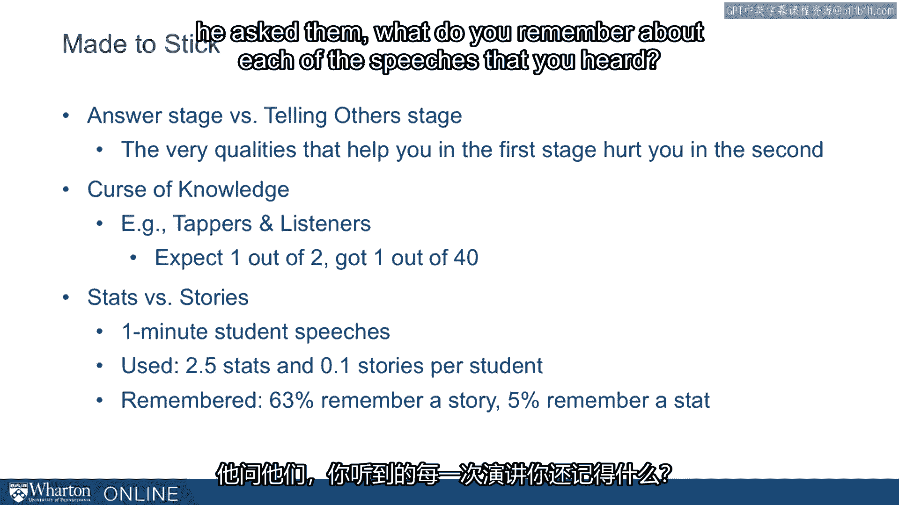
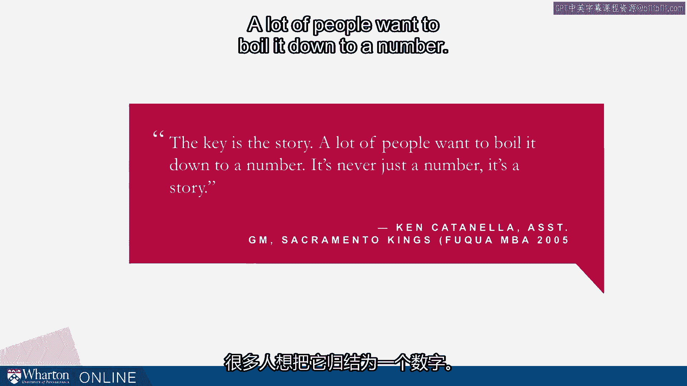

# 沃顿商学院《实现个人和职业成功（成功、沟通能力、影响力）｜Achieving Personal and Professional Success》中英字幕 - P94：30_希思兄弟.zh_en - GPT中英字幕课程资源 - BV1VH4y1J7Zk

So we started this topic of persuasion with a discussion with a couple of academic researchers。

to get a concrete real world example of using rhetoric in the perhaps surprising place， academic。

research。 We heard some themes there and some priorities they had as they tried to convince the world。

their ideas mattered。 And I think you'll see as we drop into the literature of persuasion that it connects。

to some of the main ideas that folks who have studied persuasion per se say are important。

I want to start that by talking about some research by two brothers， Chip Heath and Dan， Heath。

who now have written three books。 But their first book was about persuasion。

It's called Made to Stick， published in 2007。 And it came from Chip Heath's work on understanding。

begin with understanding urban legends。 What makes urban legends persist， what makes them catch on。

what are the elements that make， them especially sticky。

It was an odd topic for an academic researcher to start with and people really didn't know。

where he was going at the time。 But from that question and from his research came this book。

which has been very important， and has given us some great thoughts on how we can be more persuasive。

So they use an acronym to summarize their work。 The acronym spells out success and success stands for in their framework simplicity。

unexpectedness， concreteness， credibility， emotions and stories。 Something about this literature。

Heath and Heath's as well as other places is that it's， not brain surgery。

This is not stuff that you really need me to sit here and explain to you。 You can read these ideas。

We've got， you can dig into the whole book even just the introduction or the conclusion。

from this book will help you understand where they're coming from。

The challenge is actually using it。 So the beautiful thing about this book is that it gives us an example after example and。

reminder after reminder of how important and what an impact these ideas can have。

So keeping your message simple， if at all possible， coming up with unexpected elements。

telling people things they don't already know， using concrete examples， staying away from。

pure abstractions。 Stepping into emotions and then finally in one of the most prevalent themes in their。

work telling stories。 So we'll talk about a little more detail of what they study but this is their overarching。

framework and one of the things they say is that you don't have to do all of these。

Persuasive message doesn't have to have all of these traits。

They compare it to talking about the attributes of a great basketball player。

It would be fabulous if a basketball player was off the charts with rebounding， assist。

and scoring as well as defense but to be a successful basketball player you don't have。

to be off the charts and all of them。 Though the more you are strong in the better you're going to be。

Same with the persuasive message。 There was a study of what makes an effective advertisement。

Heath and Heath talk about they're distilling from effective ads a template of six different。

approaches essentially to effective ads and in the end they say all creative ads resemble。

one another but each loser is uncreative in its own way。

The argument here is that there is really kind of a recipe for what makes a message persuasive。

There are systematic ways to produce creative， innovative， sticky ideas。

One of the big messages they give us you might even think of this as the fundamental persuasion。

era is that one of the worst things about knowing a lot is that we're tempted to share it all。

Once you've worked hard on a project or once you've become an expert in the field you tend。

to want to share the expertise you want to share everything you know and that's almost。

exactly the opposite way of crafting a persuasive message。

The message should start with the audience and not with what you know。

So there's a bias from the very beginning to try to do too much。 It's a good bias to lean against。

This picture here is a relief above the door of the Yale Law School and I was amazed and。

entertained that the law school would have the humility to put this there。

I think it's a great reminder to academics。 Academics not only at Yale Law School but other places that we're tempted to share too much。

sometimes and the most effective way to educate is not to share everything that you know。

Some other stories and details in Heath and Heath that I think are especially important。

for us to remember。 One is this distinction between the answer stage and the telling others stage。

I remember working as a young consultant being feverishly away at preparing a project for。

a presentation， preparing a project for a client and essentially awake you in the day of the。

presentation and manager walking in and going okay so how are we going to convey this message。

What are we going to say to these guys？ I hadn't put any thought that。

I was just trying to get the answer。 All my time was focused on getting the answer。

I hadn't allocated any time to how I'm going to convey that answer to the most important， person。

the client on this engagement。 This is something we often run into。

We focus too much on the answer stage and we forget the importance of the telling other， stage。

Heath and Heath say that the very qualities that help you in the first stage hurt you in。

the second。 If you're really good at getting the answers that sometimes gets directly in the way of。

actually communicating those answers。 We need to appreciate and preserve time for the telling others stage。

A second idea they provide is this curse of knowledge。

This draws on decades of psychology actually but they talk about a study in the field where。

people experimental subjects were assigned to being either a tapper or a listener for a。

particular task。 The task was the tapper would be told the name of a song。

a piece of music and they were， there to tap out on the desk or the table the music to the other person in the way that。

they could understand what they were saying， what they were tapping。

The other person of course is trying to guess the music。

An interesting wrinkle here is that they would ask the tapper what's the likelihood that the。

other person is going to guess what you're tapping。 Do you predict that they'll be able to guess it？

So tappers thought that they would get about one out of two and in fact listeners got one。

out of forty。 It is essentially impossible to listen to someone tapping a song and a desk and no one。

through tapping。 That's not surprising。 What's surprising is how hard it is for the tapper to understand that。

The tapper can't get the music out of their own head and because they can't get the music。

out of their own head they can't put themselves in the shoes of the person who's listening。

They can't。 It's hard to grab their perspective of the other side。

Good communicators get the music out of their head and put them shelves in the situation。

of the listener who's hearing it for the first time。

It's one of the most important things you can do as you prepare a persuasive presentation。

The terrifically interesting study on stats versus stories。

He assigned his students to make one minute speeches and they didn't know that afterwards。

they were going to be asked questions about each of the speeches。 What did they remember？

So as they made speeches he coded did they use statistics in their speech and did they。

use stories in their speech。 What he found was in these one minute speeches students used on average two and a half statistics。

per speech and only one out of ten students used a story。 However。

when he asked the students afterwards after everyone had given their speech he asked。

them what do you remember about each of the speeches that you heard？

63% remembered a story and only 5% remembered a stat。

Remember they were given something like 25 times more stats than stories and yet 12 times。

more frequently they remembered the story not the stat。

This reminds me of a quote from a former student of mine and a continued friend and colleague。

Ken Katonella who currently is assistant general manager at the Sacramento Kings。

He was a Fuqua MBA， graduated in '05。 He's worked for a number of MBA teams over the years。

He says he played basketball and then his professional niche was statistics and analytics， first。

But he said despite having that analytic background that the key is the story。

A lot of people want to boil it down to a number。

It's never just a number。 It's a story。 This from a numbers-oriented field。

This from a guy who's very purchased into the league with stats。

He says it still always comes down to a story。 There's a quote from Robert Moses who we studied earlier in the course。

One of his closest assistants over the years was a fellow by the name of Jack Madigan and。

Madigan talked about how persuasive Moses was。 When we talked about Moses we talked about all the different sources of power he had。

He was also a master of persuasion。 Madigan says it never ceases to amaze me how you can talk and talk and talk to some guy。

about something you've got in mind and he isn't very impressed。

And then he bring in a beautiful picture of it or better yet a scale model with the bridge。

all in white and the water nice and blue sea and you can see his eyes light up。

Moses knew the power of a diorama。 Moses knew the power of persuasion if you can make it concrete and exciting to somebody。

It's a good juristic to keep in mind as you prepare your presentation。 Where's your diorama？

You're not often going to actually have a diorama but you need something in your persuasive。

message that acts like a diorama。 Where is your diorama？

Let's end with a quote from President Abraham Lincoln who was known as a persuasive speaker。

as well not only in his big public speeches but as an individual on a more interpersonal， level。

Lincoln said though the cause be naked truth itself transformed to the heaviest lance。

harder than steel the sanctimonious reformer could do no more pierce the heart of the。

drinker or the slave owner than penetrate the heart shell of a tortoise with a rise。

draw such as man and so must he be understood by those who would lead him。

In order to win a man to your cause Lincoln explained you must first reach his heart。

the great high road to his reason。 Lincoln says here basically that it doesn't matter how good you cause it doesn't matter。

how strong your intentions you've got to get to the heart first if you don't get to。

the heart you're never going to get to the head。 Lincoln followed that advice Lincoln was one of our best presidents and one of his part。

of his success came from understanding how to persuade people。 [BLANK_AUDIO]。

