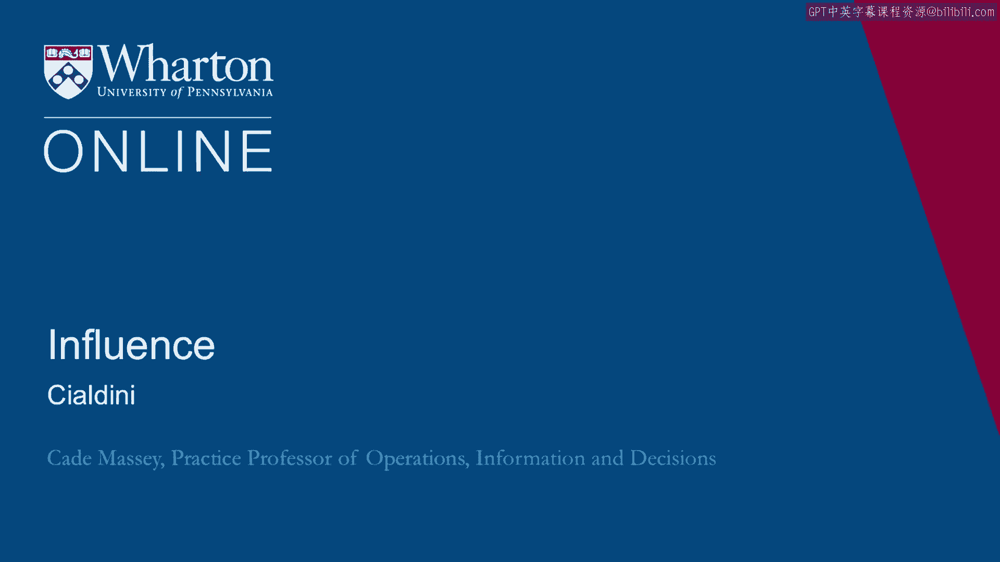

# 沃顿商学院《实现个人和职业成功（成功、沟通能力、影响力）｜Achieving Personal and Professional Success》中英字幕 - P95：31_西尔迪尼.zh_en - GPT中英字幕课程资源 - BV1VH4y1J7Zk

Before Heath and Heath， there was Chaldini。 Chaldini is probably the single most。

contemporary researcher of influence。 You can read his work in any number of， places。

There was an HBR about 15 years ago。 His original book， "Call to Influence，"。

has been in multiple editions。 Many folks are exposed to his work in classes and， undergrad。

grad school， and his initial motivation came from trying to understand。

how things like door-to-door salesman worked。 How。 those people who were。

successful in that situation， what were they doing？ He actually did first-person， research。

He signed up and sold door-to-door in order to be trained in those。

techniques and find out what it was that was going on。 From his research and over， the years。

and now it's been decades， he's distilled it down to six principles。

Chaldini considers this these six principles of persuasion。 Like Heath and。

really like much of the field， there's not much here that is surprising or that， hard to understand。

The challenge is let's get exposed to it and then keep it。

salient as we try to give our persuasive messages。 So in just a nutshell， his。

principles are reciprocity， social proof， consistency， authority， scarcity， and， lacking。

So reciprocity is a notion that we're talking about elsewhere in this， course。

Long-established in sociology and psychology that we're inclined to treat。

other people the way they treat us。 So if you want others to cooperate with you。

you cooperate with them。 If you want others to be nice to you， you do be， nice to them。

If you want others to give something to you， it helps to give， something to them。

So it turns out that this is a bit of a sales technique used， in various places。

Social proof is the demonstration that others are doing what， you want people to do。

To demonstrate to others that others have bought in， they've committed， they've engaged。

using others as an example of the behavior， trying to elicit。

Consistency is one of the more subtle ideas in Chaldini's， principles。 This is。

it calls it commitment and consistency and it draws on working， psychology on dissonance reduction。

Once a person is stated a commitment to a， course of action， they're inclined。

especially if that statement was， given in a voluntary way， in a public way。

they're going to be inclined to stay on， that course。

So if you can elicit from someone a commitment， especially a， voluntary one and a public one。

the more that they will stay in line with that， commitment over time。

A fourth principle from Chaldini is authority。 This is， calling on those who have credentials。

credibility， history， drawing on other， people's credibility essentially to back the claims that you're making and the。

causes you're trying to elicit from others。 Fifth is scarcity。 This of course， of。

course people find more valuable those resources that are more scarce。

Chaldini's talking about something more subtle than that， which is that the。

perception of scarcity can drive people to increase their demand for it。 So if。

people think an offer is only available for a limited time， they're， if they， credibly believe that。

they're going to be driven to act on it with more， urgency。

And then finally liking this draws on an ocean again long established。

in psychology of similarity that we are more persuaded by those we are more， similar to。

And this one is sufficiently common and sufficiently available that I。

want to give one quick example。 And I'm going to give an example by contrast， essentially。

And this is just a quote from a book but it makes the point very， nicely。

The quote itself comes from a Barbara King Salver book called "Prodigal， Summer。

" And it was used by Amy Clark in a New York Times article a few years ago， to point this out。

She says， the quote， let's go with the quote first， the quote is， "Bite，" he had said。

with the northerners clipped "I" an outsider intruding on this， place like a kazoo vine。

So it is an observer noticing someone speak with the。

dialect that's a little different than the local dialect。 And as a result this。

person gets categorized as this foreign negative vine that they're familiar with。 So Amy Clark says。

"One vow instantly marks the speaker as the outsider， leading， to assumptions about his politics。

religion and trustworthiness。 It's a， brilliant comparison to the kazoo vine a choking weed imported from Japan the。

late 19th century that swallows entire hills and trees。 But you see what she's。

emphasizing there that once a person is marked as an outsider all the， categor。

the assumptions that come with that category， politics， religion， trust。

worthiness all of which are negative here because they're an outsider come。

along with it all because they spoke differently。 We can flip that all around。

and one of the things Chaldini is saying basically that when you're trying to。

persuade others you want to get onto similar ground in some way。 You want to。

establish a commonality with the audience because once you've done that。

they're gonna find you more persuasive。 They're gonna be more open to you。 They're。

gonna be coding you not as an outsider but as an insider with all the。

beneficial attributes that come with that。 [BLANK_AUDIO]。

