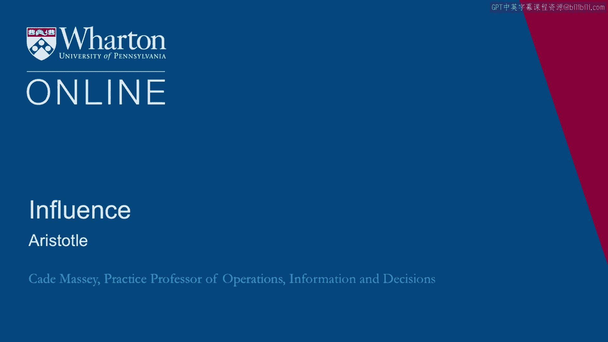

# 沃顿商学院《实现个人和职业成功（成功、沟通能力、影响力）｜Achieving Personal and Professional Success》中英字幕 - P96：32_亚里士多德.zh_en - GPT中英字幕课程资源 - BV1VH4y1J7Zk

So we began this conversation about persuasion with recent work by Chippeth and Dan Heath。

And then we went further back to kind of the bedrock work in psychology from Chaldini。

But we can go back further yet to Aristotle's time and ancient rhetoric because they give。

us a framework that is in some ways simpler than the more recent ones。

And yet includes almost all the same elements that the more recent research has emphasized。

So we can look at it as here's another framework or we can look at it as here's an umbrella。

concept framework for holding these other more recent ideas。 And I think both are useful。

So let's just take a moment and understand how Aristotle talked about rhetoric。

There are three means of persuasion according to ancient rhetoric， logos， pathos and ethos。

Logos is the logic of the idea。 Pathos is the emotion of the audience and ethos is the character of the speaker。

So you can see that these are focused on three different elements in the persuasive dynamic。

One is the speaker， of course the origin of the idea。

The second is the idea itself which needs to be logical。 And finally the audience。

the target of the persuasive message， the emphasis being on。

applying the emotions of the target audience。 So these ideas map onto things we've been talking about and many of our students around。

here certainly in business schools don't need that much help on the logo side。

In fact you might think that they are very strong with logos and kind of neglect the other， too。

This is typical when people think about persuasive messages。

They typically think first about the logic of the force of their idea。

The research we've been talking about with Heath and Heath and much of what we talk about。

with Chaldini but especially with Heath and Heath is focused on pathos。

It's a reminder that what makes persuasive messages sticky is what or the emotions they。

engender and other people。 So much of what we've talked about emphasized logos and pathos。

Ethos is kind of the neglected leg of Aristotle's framework。

It shows up a bit in both Heath and Heath and Chaldini but we don't hear people talk about。

it as much and people don't understand it as much and they find it harder to execute。

So I'm going to give you one example on the Ethos side。

This example comes from a speech that Ben Franklin gave at the Constitutional Convention。

Very appropriate since we're in Philadelphia the Constitutional Convention was here in。

Philadelphia and Ben Franklin founded the University of Pennsylvania back in the day。

So he stood up to a proposal that was made for salaries in some of the executive offices。

and it's interesting to observe how we went about this。

Now remember Franklin was not only a brilliant mind and an inventor and many many many other。

things。 He was also a diplomat。 He was known as being good with persuasion and rhetoric。

This is how he begins his speech。 He says， "It is with reluctance that arise to express a disapprobation of any one article。

of the plan。 In which we are so much obliged to the honorable gentleman who laid it before us。

From its first reading I have borne a good will to it and in general wish it success。

In this particular of salaries to the executive branch I happen to differ and as my opinion。

may appear new and shimirical it is only from a persuasion that it is right and from。

a sense of duty that I hazard it。 The committee will judge of my reasons when they have heard them and their judgment may。

possibly change mine。 I think I see inconvenience in the appointment of salaries。

I see none in refusing them but on the contrary great advantages。"， So what do you see him do there？

What do you see Franklin do？ The idea of ethos in rhetoric is that we have to convey our character through our speech。

We can't get up there and just claim who we are。 We have to show who we are in the way we go about trying to persuade other people。

It seems that Franklin accomplishes a number of things in the way he begins his speech。

One he says that he is basically favorably inclined so he is in some sense flattering。

the other side。 He is letting them know that he is not opposed to them in principle。

In fact he is appreciative of them。 He also is claiming in his words disinterestedness。

He is neutral on this。 It is not out of some prejudice that he opposes these proposals。

And he also at the end does this very clever thing which says， "Look judge my opinion。

In fact maybe based on your reaction I might change my mind。"。

He is not saying that he is so fixed that he is a zealot here。

That he is coming out from some kind of permanent position。 But rather this is my take。

I am reasonable。 I am open。 This is my take。 Now we don't know if any of these things are true but he is not trying to accurately reflect。

his actual beliefs。 What he is trying to do here is be effective。

In persuasion and in rhetoric there is a difference between being right and being effective。

Franklin here is trying to be effective。 In doing so he really gives us a nice example of ethos in persuasive speech。

Back to Aristotle。 One of the ideas here is that the three part framework of rhetoric is a simpler way to。

carry forward these ideas about persuasion。 I love the work by Heath and Heath and the folks that have worked on that afterwards love。

the work by Chaldini and all that that is produced but sometimes it is a lot to keep。

on top of six principles from Chaldini。 The success acronym from Heath and Heath。

Aristotle gives us three。 There are times and places when you really need to draw on all three of these。

Sometimes you sit down for a very important message， a very important email。 It is a good reminder。

Aristotle gives us a good reminder。 Where is my pathos in this message？ Where is my ethos？

How am I getting that across？ In what way does my message have logos？

It is a very simple framework and in that framework we can hang much of what we see from Chaldini。

and Heath and Heath。 For example， logos， the inherent logic of the idea。

You see elements of consistency there， scarcity， social influence， simple。

All falls under the logos rubric。 What about pathos？ The emotion of the audience。 Well， clearly。

specifically Heath and Heath talk about emotions。 They talk about story， surprise， concrete。

All of those are elements of pathos。 They are ways or paths towards pathos。 And finally， ethos。

the character， the speaker。 We see people， we have seen Chaldini and Heath and Heath talk about this as well。

especially， Chaldini credibility， liking， similarity， authority。 All of those are elements of ethos。

Just suggesting this is kind of an easier framework for hanging many of these bigger， ideas。

the newer ideas on the broader framework。 Not least because the challenge with persuasion， again。

isn't that you understand it as much， as you remember it。

You need to find a framework that is useful for you that you'll actually implement that， you'll use。

The Dean at the Yale School of Management gave an interview a few years ago talking about。

the role of Aristotle's rhetoric in her own messages。

This is Sharon Oster who's an economist at Yale。 She stepped in to take the Dean's role for a few years between permanent appointments。

by other deans。 She talked， I heard her talk about how often she would take Aristotle's framework to her。

speeches。 The Dean's of business schools fly around the country giving updates about what flying。

around the world， talking to alumni， giving updates on what's going on in the school。

and give a lot of speeches。 She found it useful to think in Aristotle's three-part framework， ethos。

pathos， logos， and as she talked about it in an interview， she says。

"The question of how we teach the， skills and values that people will need to create this kind of value-added leadership。

is a difficult one。 It's one that all management schools really struggle with。"。

Another framing we think about comes from Aristotle， a leader needs logos， pathos， and， ethos。

You can layer that onto the issues we're discussing。

We all as educators think about the logos part because we're in the business of training。

people and skills like analytics。 I think we do some with ethos， ethics and values。

but we actually do very little with， pathos。 And then Rick Levin who is Yale President at the time says。

"The passion。"， Oster says， "Yes， how do you get people not only follow their own passion but to create。

passion in others and lead them in that way？"。

Aristotle gives us a great framework。 I found it useful。

Many others have found it useful for millennia。 And here's a nice example from a leader in business education talking about how it has。

influenced her own use。 Thank you。 [BLANK_AUDIO]。

