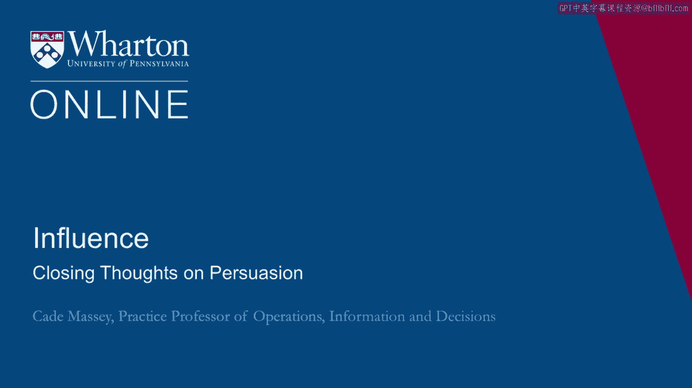
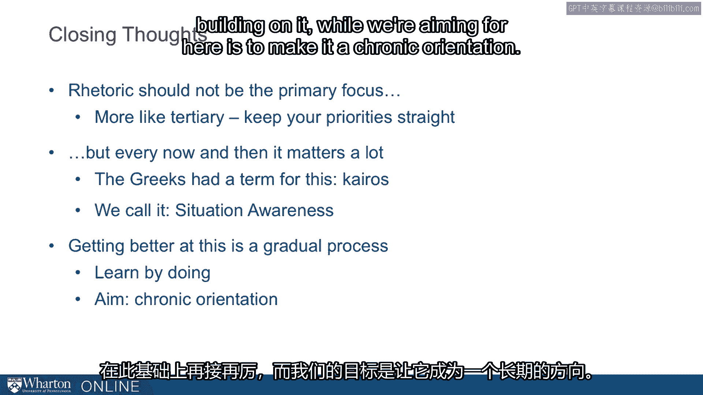

# 沃顿商学院《实现个人和职业成功》课程笔记 P97：33_关于说服力的总结 📝

在本节课中，我们将总结关于说服力的核心要点。我们将探讨如何精炼信息、运用情感、利用无形的影响力，并理解时机与实践的重要性。这些原则将帮助你更有效地进行沟通和施加影响。

---

## 精炼核心信息 ✂️

上一节我们探讨了说服的多种方式，本节中我们来看看如何组织你的信息。希思兄弟指出，掌握大量信息的一个最大弊端是，我们倾向于分享所有信息。这可以被视为演讲者的根本错误。

其解决方案是：**找到核心**。你需要不断删减，找到核心信息，并围绕它进行构建。

## 情感的关键作用 ❤️

逻辑并非总是越多越好。你必须与受众匹配，这需要一定的敏感度和准备。我们常常低估情感的重要性，尤其是在商业和商业教育领域，我们受过分析训练，可能会忽略一个最强大的杠杆——**情感**。

## 无形的影响力 🫥

未被察觉的说服努力往往更具影响力。如果人们察觉到你试图推销什么，他们会产生防御心理。如果你能避开这些心理防御，你就会更具说服力。

以下是利用社会影响力的几种方式：
*   **日常接触**：无论是所处的环境、接触的语言，还是共事的同事，人们都会在长期中受到巨大影响。
*   **重复曝光**：这是原因之一。
*   **避开防御**：这是另一个原因。

## 时机与情境意识 ⏰

修辞不应该是首要焦点。我们并未在整个课程中过分强调它，它可能更像是一个第三位的考虑因素，但在某些时刻和场合，它至关重要。

希腊人对此有一个术语：**Kairos**。这本质上是关于时机的、未被充分重视的修辞第四要素。在说服努力中，时机是一个重要的考虑因素。

我们将此与**情境意识**的概念联系起来。你需要知道何时是坐下来仔细构思说服性信息的时机，因为这样的时刻总会到来。

## 这是一个渐进的过程 📈

你不会一夜之间就从思考这些原则的人，转变为能有效运用它们的人。这里的一个重大主题是：**这些事都不复杂**。

最大的挑战是让它们保持显著。你可以通过以下方式做到这一点：
*   **实践**。
*   **尽早获得一次成功，并在此基础上继续努力**。

我们的目标是使其成为一种**长期的取向**。让你在演讲、交谈或写便条时，能意识到需要在这里加入一点情感诉求，需要在那里找到一种建立个人信誉的方式，并且以不引起他人反感的方式去做。

## 总结与最终启示 💡

本节课中，我们一起学习了说服力的几个关键总结。回顾耶鲁法学院入口上方的浮雕，它代表了过多的逻辑诉求。贯穿所有这些工作的一个最大主题是：**说服的方式远不止逻辑一种**。

我们大多数人受过逻辑训练，许多人觉得它很直观，因此我们过度使用了它。请记住，有效说服是情感、信誉、逻辑以及无形影响力的综合艺术。