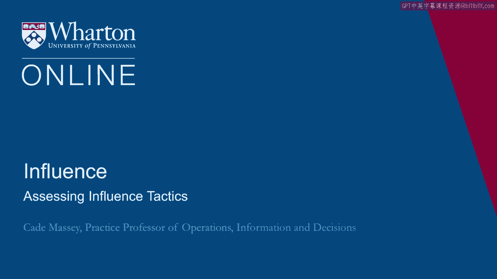
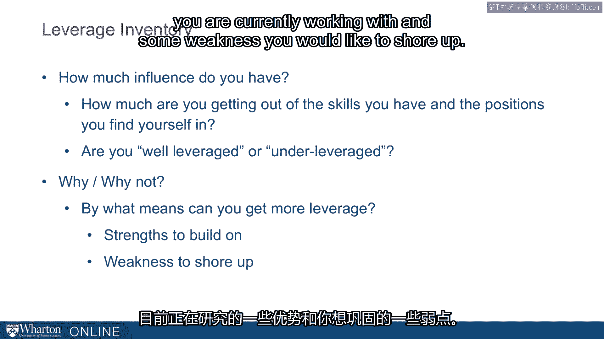
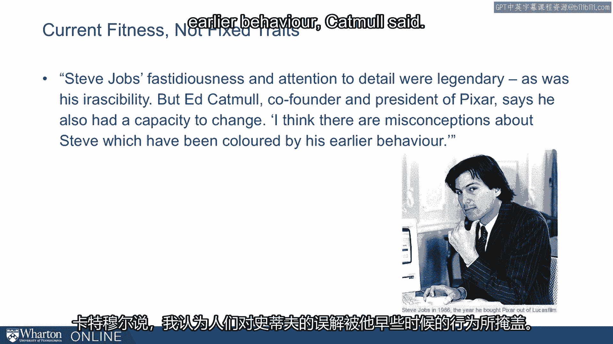
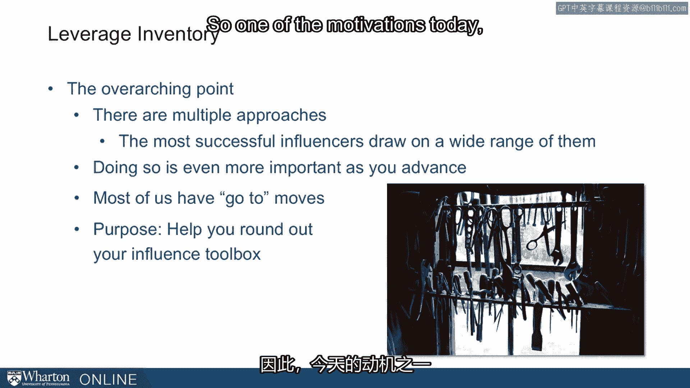

# 课程 34：评估影响策略 📊

在本节课中，我们将探讨影响风格，并基于你已完成的“影响力清单”调查进行分析。我们将了解如何评估自身的影响力水平，识别当前的优势与待改进之处，并学习如何拓展你的影响力工具箱。

---

## 概述

上一节我们介绍了影响力的基础概念。本节中，我们将深入探讨“影响力清单”这一工具。该清单旨在帮助你理解自身当前的影响力水平，评估你是否充分利用了自身的技能与职位优势，并最终引导你思考如何提升影响力以实现更大影响。

## 影响力清单的目的

影响力清单的设计目的是帮助你理解你拥有多少影响力，以及你从自身技能和所处职位中获得了多少产出。核心问题是：**你的影响力杠杆率如何？** 你被充分赋能了吗？还是未被充分利用？更重要的是，原因是什么？

我们想要深入探究“为什么”和“为什么不”，以便你能理解需要做什么来**增加你的杠杆率**并产生更大影响。最终，我们将要求你识别当前正在发挥的**优势**，以及你希望弥补的**弱点**。

请记住，这就是我们的目标。我们将讨论这份调查问卷，分析我们通过此问卷看到的一些典型结果。但归根结底，我们希望你能基于自己的调查结果以及对不同影响力工具的理解，反思你需要改进什么，以及你可以利用什么。

## 关键前提：影响力是可变的

在此讨论中，重要的是记住我们谈论的是**当前的适应状态**，而非固定特质。这不是DNA测试。它不会断定你是某种类型的人且在你的整个职业生涯中都将如此。这只是你当前的状态。

我喜欢举史蒂夫·乔布斯的例子。他当然以意志坚定著称，但即便是乔布斯也是可塑的。在他去世后，《金融时报》的一篇文章中写道：“史蒂夫·乔布斯的挑剔和对细节的关注是传奇，他的易怒也是如此。但皮克斯联合创始人兼总裁埃德·卡特穆尔说，他也有改变的能力。”卡特穆尔说：“我认为人们对史蒂夫有误解，这些误解被他早期的行为所渲染。”“人们忽略的是，史蒂夫非常聪明。他意识到很多那样的行为对他并不利，于是他改变了自己的行为。因此，在他生命的最后15年里，同样的人一直跟随着他。人是可以改变的，他就是证明。”

这对我们是一个很好的例证。我们即将讨论的任何内容，只要你愿意并专注于它，**你都可以改变自己**。

## 影响力工具箱：多元方法与拓展

影响力清单的核心观点是：存在**多种影响他人的方法**，而最成功的影响者会运用其中一系列方法。对于我们大多数人而言，随着职位晋升和责任增加，你需要越来越多这样的影响力工具。

我们通常有自己**惯用的方法**。你在生活中使用这些方法取得了成功，因此倾向于依赖它们。
*   有些人擅长电子表格，总想成为处理数据的人。
*   有些人要求很高，他们会挥舞“锤子”，对他人施压。
*   有些人则恰恰相反。他们是“拍背鼓励者”，想请人吃饭、了解他人、成为朋友。

这些都是影响他人的非常不同的方式。它们都可供我们所有人使用，但我们倾向于停留在相对狭窄的范围内，倾向于使用我们惯用的方法。

因此，今天的另一个动机是帮助**充实你的影响力工具箱**。

## 最后的提醒

再次提醒，这不是DNA测试。这就像，假设我们今天让你跑800米。就现在，穿上鞋，我们出去跑。这并不代表那是你能跑出的最快速度。你们中的一些人可能正处于巅峰状态，准备好了，那差不多是你能做到的最好水平。但你们中的许多人有一阵子没跑800米了，这可能并不能反映你最佳状态下的能力。

这就是我们当前的状态。审视你当前的状态，然后要求你反思需要弥补什么。

---

## 总结

本节课中，我们一起学习了如何通过“影响力清单”评估自身的影响力策略。我们明确了评估的目的是理解当前杠杆率、识别优势与弱点，并认识到影响力风格是可以通过专注努力而改变的。最重要的是，我们了解到最有效的影响者掌握并灵活运用多种影响工具，因此拓展个人惯用的影响力方法范围至关重要。