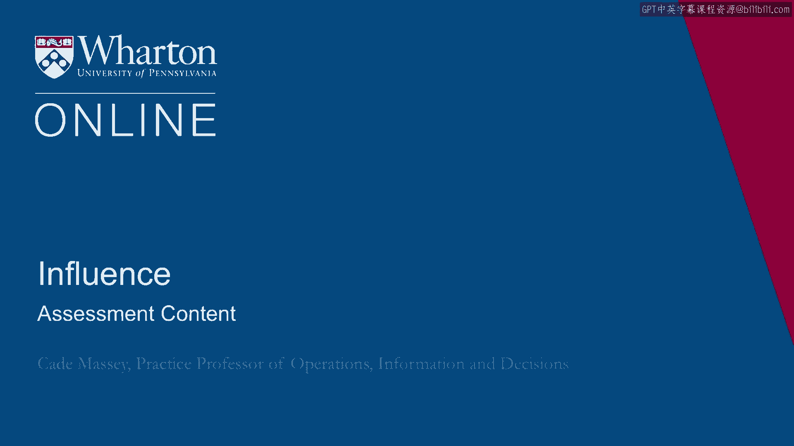
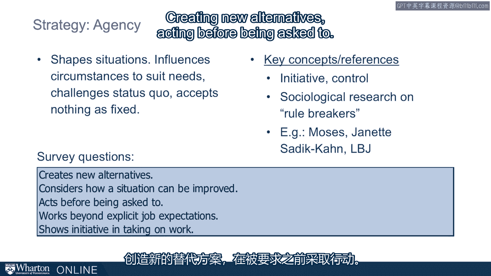
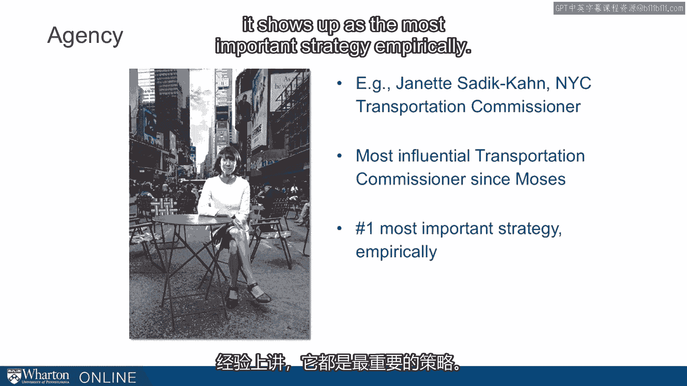
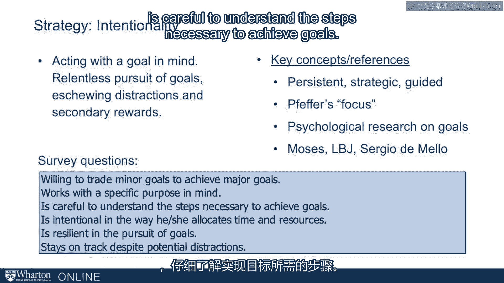
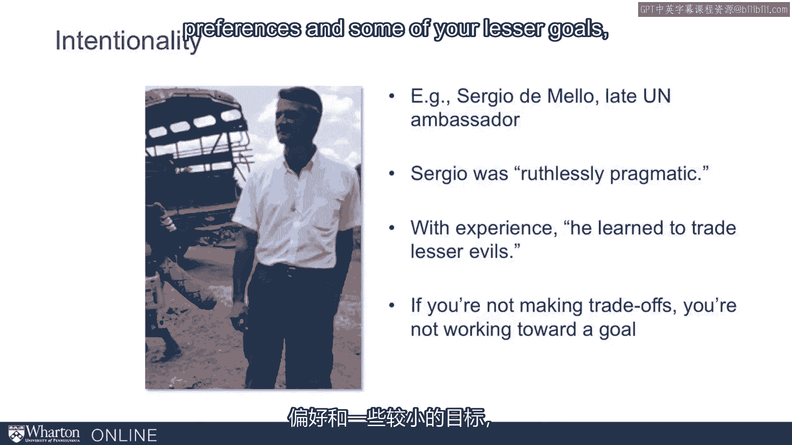
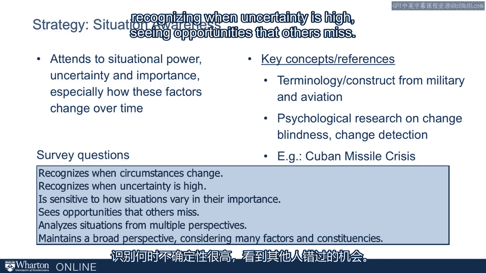
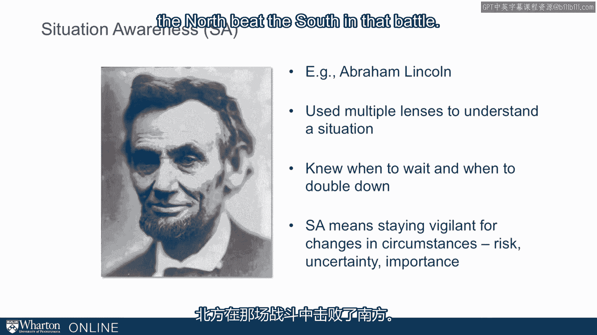

# 沃顿商学院《实现个人和职业成功（成功、沟通能力、影响力）｜Achieving Personal and Professional Success》中英字幕 - P99：35_评估内容.zh_en - GPT中英字幕课程资源 - BV1VH4y1J7Zk

The leverage inventory is intended to assess you across a wide range of。

influence strategies。 So let's look at what these are。 You can think about it in a few。

different buckets。 First， this persuasion bucket。 Logos， pathos， and ethos。 These are。

the components of Aristotle's rhetoric。 We've seen them in our section on。

persuasion and we'll talk about them in a little more detail as we go through the， individual tools。

The second bucket is relationships， dyadic relationships。 You。

might think about them as negotiation relationships。 This set includes， exchange， might。

and allocentrism。 And then the last bucket you might think of more。

as the structure of relationships。 More the macro look at your relationships。 And。

these include networks， coalitions， and team building。 So this set of nine comes。

from kind of a common framework， almost conventional wisdom out there on what。

the influence strategies are。 So we've listed them here in three columns。 One is。

the leverage inventory。 And then another is the hey groups tool。 This is one of the。

early industry tools that assesses influence tactics。 And then a third， column with McKinsey。

the consulting firm。 They train their consultants on， influence tactics。

And we've lined them up so you can see how common each of these。

rows is basically tapping into the same thing。 So you only need ten rows to cover。

the nine topics that all three groups are covering。 The point here is that。

there's pretty much a canon， a conventional wisdom around what the key， influence tactics are。

We're going to go beyond this， but this is our starting， place。 These are the first nine。

So what I want to do is go through each of these， nine and give you just a quick summary。

but also identify the survey questions， that are related to each of these tactics so that you know you want to tie。

your results to to these concepts。 The first is allocentrism。 So this is the。

opposite of egocentrism。 This is an other orientation。 A person who actively seeks。

others interests and considers their preferences。 It's related to empowerment， collaboration。

It's related to what Jeff Efre refers to as sensitivity to others。

It's related to the negotiation framework。 First put out there by Errian Fisher， getting to yes。

The survey questions we use to operationalize this concept are， listed here。

They include looking for solutions that will benefit all the， parties involved。

I'm not going to read each of them， but listens， attentively when listens attentively when others talk。

This is trying to， understand where the other side is coming from。 Not necessarily to give them。

everything they want， but let's understand where they're coming from。 Allocentrism。

A second is exchange。 This is a willingness to to quid pro quo， but a。

preference for going beyond it。 So it's highly related to reciprocity， which。

we've talked about in previous lectures。 It's highly related to Bob Axelrod's。

game theoretic concept of tit for tat。 The survey questions here include things。

like offering rewards to people for compliance， understanding the need to help。

others in order to get help from them。 We use six different questions to build a。

scale to tap into to reflect what exchange is。 A third is might。 Might is a。

willingness to use coercive power。 More generally an ability to address。

difficult issues and tolerate conflict。 So in the very beginning of this course， we。

talked about French and Raven and their notion of coercive power。 This is。

tightly connected to that。 We operationalize this with survey questions。

like standing up for his or her opinion， able to tolerate conflict， letting people。

know when they perform below expectations。 These all group under this umbrella of， might。

In my experience in the classroom， this is something that students， some。

students really struggle with。 Some， many of them need to exercise this a little， more freely。

even if it's not on a daily basis。 And then there are some on the。

other end of the spectrum who probably need to dial it back a little bit， perhaps。

might be a little too comfortable exercising might。 Another concept is， networks。

The idea here is to cultivate a broad and disparate set of informal， relationships。

This is connected to the notion of structural holes。 Research by， Burt and before him， Granovetter。

We talked about that earlier in the course。 Survey questions here are things like maintaining relationships that span。

disparate groups or making an effort to become friends with colleagues at work。 Another concept。

coalitions。 We have an entire day on coalitions， so you're well， tooled on this by now。

Identifying and getting the support of key people， it's。

connected in some ways to childini's social influence。 It's connected to animal， behavior。

We saw multiple examples from Franz Duall， the primatologist and the。

concept we talked about the practice of having the meeting before the meeting。 So。

we operationalize this with questions like and listing the support of。

individuals one by one in order to build support for an idea。 Another tactic， team building。

This is building groups， prioritizing cohesion， highly connected， to organizational culture。

to the concept of socialization。 The questions we use， here are prioritizing group cohesion。

helping articulate an inspirational， vision for a group。

making appeals to values or principles shared by the group。

All of these are around building teams and keeping people closely connected。 Another concept， logos。

This is back to Aristotle and the notion of persuasion。 Using logical reasons。

expertise or data to convince or persuade others。 So five， quick。

punchy ways we operationalize this， finding ways to make points as， simply as possible。

gathering data to support his or her position， using arguments， that are well reasoned。

This is something our MBAs typically do pretty naturally。

so this isn't the hardest part of persuasion but many people still need to， focus on this。

A second component in persuasion is pathos。 This is conveying。

message in a way that has emotional resonance。 Of course this again comes。

from Aristotle and Cicero。 It's connected to the readings we did by， Heath and Heath。

Some of the ways we operationalize it。 Using stories to help， make my points。

This is one of the things many people mostly did add to their， rhetoric。

tailoring communication content and style to this specific audience。 So we。

have six different ways here。 We talked about persuasion in some detail a couple， of lectures ago。

Heathos， the third and final component of Aristotle's rhetoric。

establishing personal credibility through credentials， commonality and decorum。 You。

meet others expectations for your role。 So it does connect to some of Chaldini's， concepts。

Similarity and authority， it connects to the French and Raven idea of， expert power。

We operationalize it with a couple of items， four items， presenting ideas with confidence。

making his or her efforts and， accomplishments known。

This is one of the things that adds some flavor to this， particular concept。

Many people struggle with this。 What we know is that people。

will be more persuasive if the audience understands their credentials and their， credibility。

The challenge though is we know we don't like to be told by other。

people what my credentials and credibility are。 So how do you get that。

across so that you'll be more persuasive without being a jerk and turning people， off。

It's one of these wonderful little challenges in influence。 So that is an。

overview of the first nine。 And that is again kind of the conventional wisdom。

the canon in the field。 And that's where we started when we first started using， this tool。

building this tool years ago。 But in working with executive MBAs and， studying the literature。

we thought there were a few components missing and we've。

added three and we think of them as meta tools or kind of tools to figure out how。

to use the other tools。 They are agency intentionality and situation awareness。

So let's spend just a little bit of time understanding what these three mean。

Agency is shaping situations， influencing circumstances to suit needs， challenging status quo。

accepting nothing is fixed。 It's connected to the ideas of， initiative and control。

It's connected to research and sociology on rule breakers。 We see many examples in this course。

Robert Moses， Jeanette Saude Kahn that， illustrate this。

Some of the behaviors we assess through questions。 Creating new， alternatives。

acting before being asked to。 And again Jeanette Saude Kahn， she is a。

great illustration of this。 Here she is Transportation Commissioner was in recent。

years Transportation Commissioner in New York。 And she gets credit for these。

pedestrian only zones in New York。 She really transformed the landscape in New。

York in a way that no one would have thought possible cutting through red tape。

largely on the heels of her agency。 She did other great things but she was not。

willing to take anything as fixed。 Most folks think she was the most。

influential Transportation Commissioner since Moses and we mean Robert Moses， there。

And if you look at our data， which we will in a minute， this always shows up。

Every group we've ever tested shows up as the most important strategy empirically。

The second of the new tools is intentionality。 Intentionality is acting， with a goal in mind。

Relentless pursuit of goals， eschewing distractions and， secondary rewards。

This is connected to Jeff Efert talks about it as focus。 There's。

obviously decades of research on goals。 We've seen examples in this course from。

Robert Moses and Sergio de Melo， which I'll elaborate on again in a minute。 The。

survey questions we use to assess this include things like is careful to。

understand the steps necessary to achieve goals。 Is resilient in the pursuit of。

goals。 And again Sergio de Melo illustrated this for us。 We thought we saw。

Sergio in the very first lecture in this course。 He is the late UN ambassador and。

when he died he was thought of as probably the top diplomat in the world。

We studied him while he was running essentially East Timor。 And some of the。

things we read about him in the book by Samantha Power about him is that he was。

"ruthlessly pragmatic" that with experience in his career he learned to， trade lesser evils。

This all means that he was making trade-offs。 He was。

sacrificing lesser goals in pursuit of his bigger goals。 One way to think about it。

is that if you're not sacrificing some of your preferences and some of your。

lesser goals you're probably not working with enough intentionality towards your。

biggest goals。 Finally， situational awareness。 Attending to situational， power。

uncertainty and importance and especially how these factors change， over time。

This concept comes to us from the military。 Those of you who have been， in the military。

the US military at least know how often you're trained and drilled， in SA situation awareness。 SA。

The aviation industry has picked it up and from， their other industries are adding it to their to their training repertoire。

It's， connected also to psychological research on things like change blindness and。

change detection。 We talked about it some in the Cuban Missile Crisis that we。

talked about early in the course。 Some of the survey questions here are。

recognizing when circumstances change， recognizing when uncertainty is high。

seeing opportunities that others miss。 One of our favorite examples comes from。

President Abraham Lincoln， President of the United States in 1861 to 1865。 We can。

use Lincoln to illustrate any of these leverage inventory concepts。 He was one。

of these guys who was extraordinarily adept at the full range。 He played the。

full range but he gives us a nice illustration of situational awareness。

especially around knowing when to wait and knowing when to double down。 So when。

he was about to give the Emancipation Proclamation freeing the slaves in the。

United States it was a it was there was a big debate even in the north the part of。

the country he was from and among Republicans even though they were。

fighting a war against the south。 Everyone wasn't on board about the， Emancipation Proclamation。

There was great debate there。 He himself debated it。

for a long time and eventually came to believe that it was time to issue this。

proclamation free the slaves。 It was the summer of 1862。 They were one year into。

the Civil War and he came to his cabinet and said it's time to do this。 I've， debated it。

What do you guys think？ And they all went around and gave their， reactions。

It has said that he had thought of all of them except for one。

His Secretary of State Seward said I like the idea but it's a bad it's a， bad moment to do it。

Bad timing。 We are presently losing the war。 If we do this。

now it will look like the desperate act of a of a weak government。 He encouraged。

Lincoln to set it aside until the war had turned and then it would be received， better。

Lincoln saw the wisdom of the suggestion and did in fact put it in his。

death drawer and sat on it for six months or so and then on the heels of。

Antietam which was the bloodiest day in American history。 The north beat the。

south in that battle and turned the tide of the war。 He gave the Emancipation。

proclamation freeing the slaves。 The remarkable thing to me about the story is。

that here's Lincoln on the eve of making one of the grandest gestures a。

government has ever made and he decided the timing wasn't right。 He。

realized that what mattered was the effectiveness of this thing。 It didn't。

matter how morally right he was in order to be effective。 Timing mattered。 The。

situation mattered and he was willing to postpone this big gesture。 Grand， gestures。

Big a gesture as a president has ever made。 He postponed it in in order。

to wait for the right situation。 So those are our 12 tactics。 That's what we。

assessed you on in the leverage inventory and in the next lecture we'll go into。

some detail into what the data look like。 [BLANK_AUDIO]。

