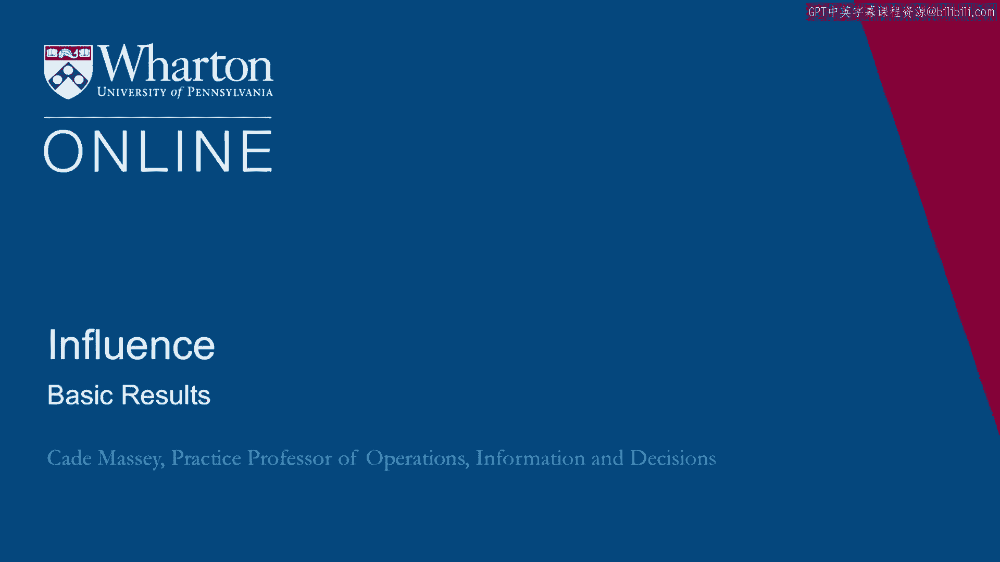

# 课程 36：解读影响力清单结果 📊

在本节课中，我们将学习如何解读影响力清单的评估结果。我们将回顾数据收集过程，理解评分标准，分析自我评估与第三方评估的差异，并探讨如何将12种具体策略归纳为更宏观的三大影响力策略。

---

## 结果概述与评分标准

上一节我们介绍了影响力清单的构成。本节中，我们来看看如何解读这份清单的评估结果。

我们收集这些数据已有近十年，对象包括MBA学生、高级管理人员工商管理硕士以及一些高级管理培训学员。现在我们可以对这些数据进行分析，这也能帮助你理解你自己的结果。

首先，需要记住这份清单的评分标准是关于行为频率的。评分范围从1到4分，分别代表“很少或从不”到“几乎总是”。每个策略的得分由4到6个相关行为问题的得分汇总而成。

报告形式大致如下：Y轴列出了从“利他主义”到“信誉”的12种策略，X轴则显示了从“很少”到“总是”的频率范围。第一部分是你的自我评估分数，即你根据每个策略下的行为问题为自己打出的分数。

## 自我评估与基准比较

第二部分是班级平均分或基准分数。这个基准可能来自MBA学生、高级管理人员工商管理硕士或本慕课课程的参与者。引入基准的目的是提供一个参照。自我评估就像一面镜子，反映出你对自己行为的认知。我们将其置于理论和文献的框架中，以便如果你想调整某些行为——增强或减弱——可以更有针对性地进行思考。

有时，我们不仅进行自我评估，还会邀请与评估对象共事过的一群人（如上司、下属、同事）对其行为进行评估，这被称为360度评估或第三方评估。多年来，我们对于第三方评估与自我评估之间的关系有了一些认识。

总体而言，两者高度相关。在所有12个策略上，自我评估与第三方评估的平均相关系数约为0.57。在我们进行的大多数课程中，这个系数介于0.5到0.6之间。

以下是一个包含数百名学生的较大样本的总结。你可以看到，在几乎每一个策略上，自我评估的分数都低于第三方评估的分数。我们在所有人群中都能观察到这种差异：人们自我报告的行为频率，低于第三方评估者报告他们所观察到的频率。

我们无法确定真相是什么。不知道是人们实际做得比他们意识到的更多，还是第三方评估者推断他人做得更多。但我们确实观察到了一点偏差。因此，你可以放心，如果你的360度评估者为你打分，你的分数很可能会全面略高一些。

其中一些策略的偏差（Delta）比其他策略更大。例如，在“互惠”和“利他主义”上，偏差不大。这些行为更容易被观察到。而在“意图性”和“威权”上，差距则稍大一些。你可以利用这些信息来增加背景理解，并想象如果你的同事、上司和下属来评价你，结果会是什么样子。

## 性别差异分析

你可能会好奇男性和女性之间是否存在差异。我的学生也经常问我这个问题。以下是一年的样本数据，共108人，显示的是12个策略的平均分。

总体来看，没有显著差异。在存在差异的地方，也符合一些刻板印象。例如，在“威权”上，男性被评价为使用该策略的频率略高于女性。在“利他主义”上则相反，女性被评价为更频繁地运用这种理解他人、试图理解他人的策略。

这与刻板印象一致，这也强调了事实是我们并不知道真相是什么。我们不确定他们实际在做什么，评分可能只是与刻板印象保持一致。但总体而言，也许令人惊讶的是，在这些样本中，男性和女性的行为评分是相似的。

## 从12种策略到三大影响力维度

到目前为止，我们一直在讨论12种具体策略，我们的调查也是围绕它们构建的，这是理论的基础。但我们或许可以用更简单的方式来讨论，将它们进行聚合。

一种聚合方式是思考“硬实力”和“软实力”。传统上，人们以这种方式谈论权力。千百年来，人们谈论一种形式的权力——硬实力，如军事实力、经济实力。更近一些，主要由于约瑟夫·奈的贡献，人们开始谈论软实力。

奈在《经济学人》杂志的一篇文章中写道（特别是在9/11事件后）：“纵观历史，国家联盟不断兴起以制衡主导力量……虽然可能形成制衡美国力量的联盟，但它们不太可能成为牢固的同盟，除非美国以专横、单边的方式运用其硬实力，从而损害其软实力或吸引力——即让他人想要你所想要的重要能力。”他基本上是在告诫美国注意使用硬实力的方式，因为它可能影响其软实力。

组织学者杰弗瑞·菲佛也以类似方式讨论权力，他将有助于获得权力的个人特质分为两类：一类是获取支持和盟友的能力（包括对他人的敏感性、灵活性和淡化自我），另一类是在竞争环境中生存的能力（包括精力、体力、专注力和容忍冲突的能力）。这看起来很像第二类的硬实力和第一类的软实力。

我们或许可以将我们的12种策略也这样划分。但我们也可以询问数据：什么是简化的正确方式？也许我们可以从12种减少到2种，或者一直减少到1种，又或者不应该减少那么多，也许只应减少到3种。

我们可以使用一种称为“因子分析”的技术来回答这个问题。这是一种降低数据维度的方法。我们可以将12种（如果我们有20或30种）策略提炼为2个或3个属性。这种方法会告诉我们，在开始丢失信息之前，可以简化到什么程度，同时也能帮助我们识别数据中的关键模式。

因此，我们将使用因子分析来简化你的报告。你需要记住12种策略，还是可以将其提炼为更少的东西？

当我们在这些报告数据上使用因子分析时，我们发现数据中存在三个因子，这在多个样本中都是一致的。一个因子基本上是一个加权平均值。它会为12种策略中的每一种赋予一定的权重。某个策略可能对某些因子有很大权重，而对其他因子权重很小。

以下是我们数据中三个因子的权重：
*   **因子A**：在“信誉”和“威权”上权重很大，在“利他主义”上权重很低（实际上是负权重），其他策略权重居中。
*   **因子B**：在“团队”、“网络”、“联盟”、“情感”、“互惠”和“利他主义”上权重很大，在“陈述”和“能动性”上有一点权重，但主要是那六种关系型策略。
*   **因子C**：权重主要来自底部的四种策略：“意图性”、“逻辑”、“情境意识”和“能动性”。

那么，这看起来像什么？因子分析本身不会告诉你这些因子是什么，也不会给它们命名。它只告诉你加权平均值是什么。

观察第一个因子，它很像**硬实力**。观察第二个因子，它包含了所有关系型策略，很像**软实力**。我们预期到这两个因子。有趣的是第三个因子，它包含了三个元工具——“意图性”、“情境意识”、“能动性”，外加“逻辑”。我们不确定“逻辑”是否会与另外三个一起出现，但数据确实如此。我们最终称这个因子为**巧实力**。

这样，我们可以将你的12种策略提炼为三大更广泛的策略：**硬实力**、**软实力**和**巧实力**。

“巧实力”这个术语我们再次借用于约瑟夫·奈。这是他几年前出版的《权力的未来》一书中的新观点，其中有一章专门论述巧实力。这也是我们首次接触到这个术语。事实上，奥巴马政府多年来一直在谈论它。奈引用了国务卿希拉里·克林顿在其确认听证会上的话：“你必须使用所谓的‘巧实力’，即运用我们掌握的所有工具——外交、经济、军事、政治、法律和文化工具，为每种情况选择正确的工具或工具组合。”

这与我们关于“元工具”的概念非常契合，并且几乎完美地映射到我们数据中归类为元工具的那三种策略（意图性、情境意识、能动性），此外，我们的数据还表明，“逻辑”也应包含在内。

以上是我们对数据的初步分析和描述。在下一节中，我们将要探讨：“好的，但这与影响力具体有何关系？”

---

**本节课总结**：本节课我们一起学习了如何解读影响力清单的评估结果。我们回顾了评分标准，比较了自我评估与第三方评估的差异，并分析了性别因素的影响。最重要的是，我们通过因子分析，将12种具体的影响力策略归纳为三大宏观维度：**硬实力**（基于权威和逻辑）、**软实力**（基于关系和情感）以及**巧实力**（基于元认知和情境适应）。这为我们理解和运用影响力提供了一个更清晰、更高效的框架。