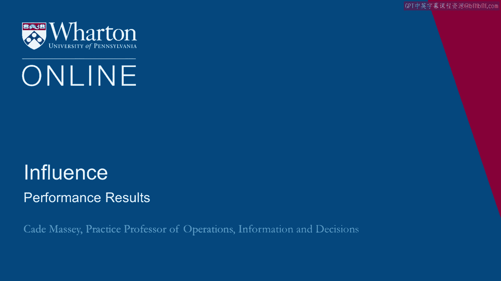
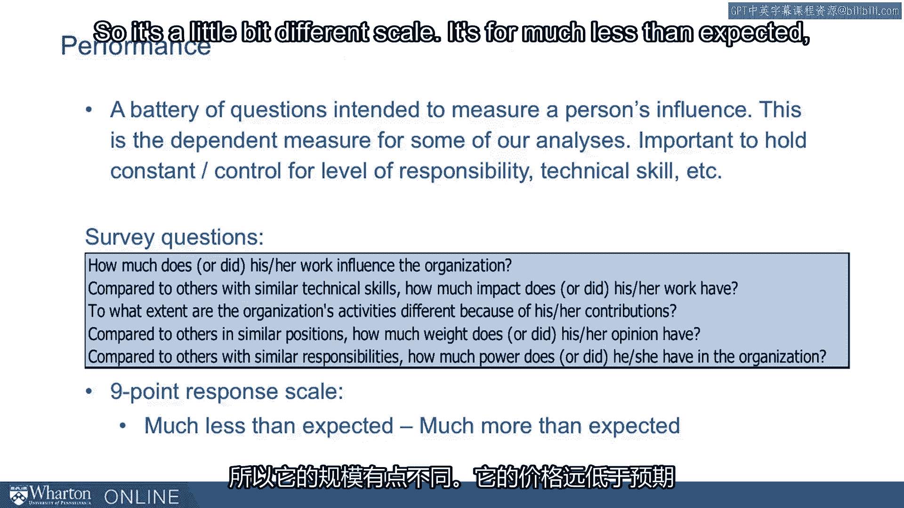
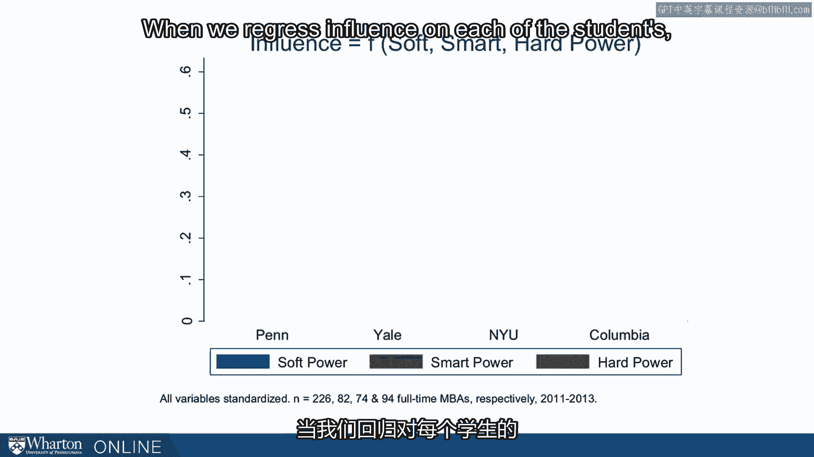
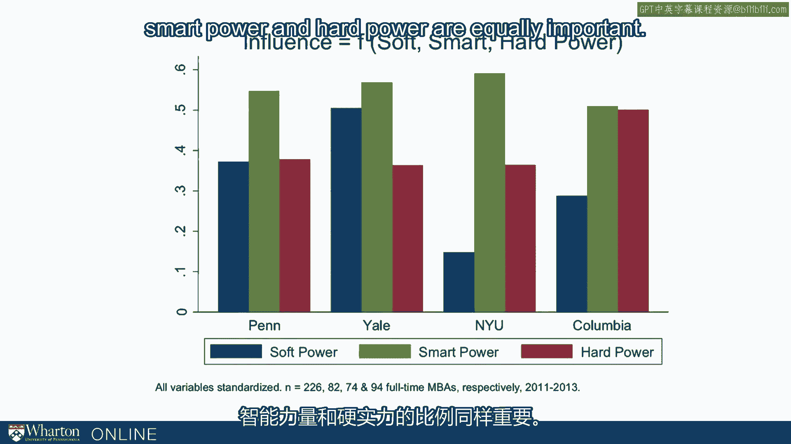

# 课程名称：沃顿商学院《实现个人和职业成功》第37讲 📊 表现结果

在本节课中，我们将要学习如何将影响力行为与个人在组织中的实际表现结果联系起来。我们将通过分析调查数据，探讨不同影响力策略与个人影响力之间的实证关系，并了解这些关系在不同情境下的变化。

---

在上一节中，我们分析了影响力清单结果的汇总统计数据及其内在联系。本节中，我们将把这些行为数据与个人在组织中的实际表现结果关联起来，以验证这些行为是否真的有效。

目前，我们尚未将这些行为与其他因素联系起来，也不清楚它们为何重要。理论认为，这些行为会影响一个人的影响力，但我们需要证据来证明这一点。

在我们的360度调查中，除了询问影响力行为，我们还包含了一组额外的问题来衡量个人在组织中的影响力。这些“表现问题”旨在评估个人在其职责范围内对组织产生的影响大小，同时控制其职责层级和技术能力等因素。

调查问题都围绕这一核心展开，彼此非常接近，共同构成了一个有效的评估体系。回答采用九点量表，范围从“远低于预期”到“远高于预期”。

我们将这些回答汇总为一个单一的表现衡量指标。下图展示了我们最初约400名学生的表现分布情况，可以看到一个近似正态的分布。

这些学生来自耶鲁、沃顿、哥伦比亚和纽约大学的MBA项目，因此他们的表现大多“高于预期”并不奇怪。但关键问题在于，我们能否从分布中找出规律，理解为何有些人表现更出色，有些人则相对逊色？我们能否帮助人们从分布的左侧移动到右侧？

---

现在，我们同时拥有表现衡量指标和行为频率数据，可以分析它们之间的关系了。

以下是基于约850名MBA和EMBA学生数据绘制的图表。我们将汇总后的表现指标（y轴）与参与者被报告使用各项策略的频率（x轴）进行了关联分析。图表共有12个子图，分别对应12种不同的影响力策略。

每个子图都展示了第三方评价者报告的影响力与策略使用频率之间的关系。例如，左上角的图表代表“主动性”策略，图中添加了非参数的低平滑曲线来展示趋势。

从这些数据中，我们能看出什么？这是我们第一次进行实证分析。

首先，可以看到所有12种行为都与影响力呈正相关。这意味着更多地使用这些行为，与在组织中被认为有更大的影响力正相关。

其次，这些关系的强度并不相同。有些曲线的斜率更陡峭，表明该行为与结果（影响力）的关联更紧密。例如，“主动性”和“目的性”的曲线非常陡峭，“联盟建立”也相当陡峭。而“精神感召”和“权力”则相对平缓，“利他主义”也出人意料地平缓。它们虽然呈正相关，但与影响力的关联似乎不那么紧密。

第三，某些策略的使用频率在不同人之间差异较小。例如，我们的MBA和EMBA学生在“目的性”上表现得相对集中，大家都有较强的目的性。而“权力”和“精神感召”则表现出更大的差异。

此外，一些策略似乎存在收益递减效应。“精神感召”、“权力”和“团队建设”等策略的曲线在达到一定程度后趋于平缓。而“主动性”和“目的性”则没有明显的收益递减迹象。

总而言之，我们现在获得了证据，表明人们使用这些策略的频率与他们所在组织中产生的影响力是相关的。

---

我们可以将这些策略汇总到之前讨论过的三大因素中：软实力、巧实力和硬实力。

同样，这三者都与影响力呈正相关。当我们将它们综合起来看时，会发现人们运用这些策略的频率与其对组织产生的影响力之间存在相当紧密且积极的正向联系。

最后，我们可以开始了解这些策略在不同情境下的重要性有何不同。也许再过十年，我们能告诉你某个行业的“成功配方”是什么，而另一个行业则完全不同。目前我们还没有如此精细的数据。

但我们拥有来自多所商学院的数据。我们可以分析数据，看看软实力、巧实力和硬实力的相对重要性如何。

在下图中，我将展示当我们将学生的影响力回归到其软、巧、硬实力得分上时，得到的回归系数。对于每位学生，我们知道其第三方评价者报告的组织影响力，也知道他们使用软、巧、硬实力的频率得分。我们可以据此分析，例如在宾夕法尼亚大学，软实力对学生影响力的回报率如何？与巧实力相比呢？我们对四所学校都进行了同样的分析。

以下是我们的发现。我们该如何解读这些回归系数？

首先，在所有四所学校中，巧实力都被报告为三者中最重要的，或至少并列最重要。这非常有趣，因为在此之前人们甚至没有研究过巧实力。据我们所知，这是首次对巧实力进行实证操作化和研究，而它却显现为最重要的因素。

其次，可以看到不同学校之间存在差异。例如，在纽约大学，以及程度稍轻的哥伦比亚大学，软实力在学生入学前的工作经历中显得不那么重要。这有点符合刻板印象，尤其是纽约大学，相当大比例的学生来自金融服务业，而该行业并不以重视软实力著称。

反过来看耶鲁大学，软实力比硬实力更重要。这又恰好符合耶鲁以从事更多非营利性工作而闻名的刻板印象。

至于宾夕法尼亚大学，数据显示巧实力和硬实力具有同等的重要性，形成了一个完美的平衡。

这让我们初步感受到，最优影响力“配方”的比例会因情境而异。我们甚至在学生来自不同学校、拥有不同工作背景的情境中看到了这种变化。

---

本节课中，我们一起学习了如何将影响力行为与实证表现结果相关联。我们通过数据分析发现，所有12种影响力策略都与组织影响力正相关，但关联强度不同。巧实力在多个情境下显示出突出的重要性，而软实力和硬实力的重要性则因行业和背景不同而有所变化。这些发现为我们理解影响力提供了实证基础，并提示我们应根据具体情境灵活调整影响力策略的组合。