# 课程 42：硬问题调查解读 🧐

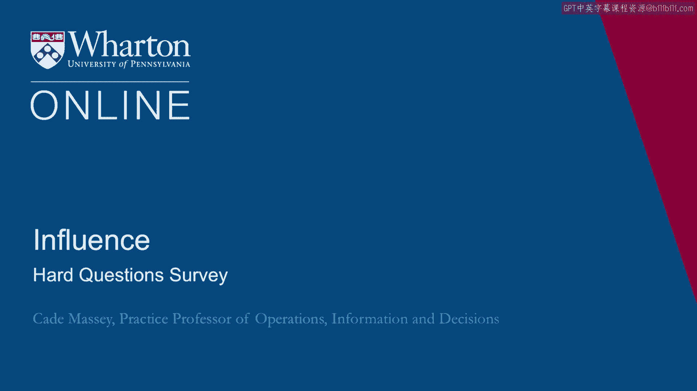

在本节课中，我们将解读“硬问题调查”的结果。我们将从具体情境出发，自下而上地探讨伦理问题，而非仅进行抽象的哲学讨论。通过分析你在多种可能遇到的情境中会如何选择，我们可以更好地理解你所遵循的原则，以及你可能尚未遵循的原则。

上一节我们介绍了从具体经验出发进行伦理推理的方法，本节中我们来看看调查中的具体问题及其结果。

---

## 调查动机与方法

我们设计了一系列情境，这些情境最初来源于MBA和高管MBA项目的学生，他们分享了在决定是否使用影响力策略时面临的挑战。正如我们在过去几周的课程中所讨论的，影响力的运用每一步都涉及伦理问题。我们希望对此保持清醒的认识。

因此，我们提出以下问题：在各种情境下，你会怎么做？我们将逐一分析这些问题。在分析过程中，请你思考以下几点：
1.  **指导你做出选择的原则是什么？** 你可能会反复依赖同一原则，或者发现自己在牺牲某些原则。
2.  **你能创造出什么替代方案？** 我们迫使你做出非此即彼的选择，但现实生活很少如此。应对伦理困境的最佳方法之一，就是识别并打破这些“虚假的二元对立”，寻找第三种解决方案。
3.  **警惕合理化行为。** 许多人在解释选择时，会说出那些心理学研究中警告的合理化言辞，这应引起我们的警惕。

以下是调查中的十个问题。我们将其中的一个选项编码为 **务实选择**，另一个为 **理想主义选择**。请记录你做出了多少个务实选择（0到10个）。我们将在最后展示人群的得分分布。

---

## 问题一：利用下属关系

你是一个项目团队的高级成员，一名初级成员与客户公司的CEO有亲属关系。你希望影响该CEO以利于项目成功。你可以利用你的高级职位“要求”这位初级同事动用其关系，尽管你知道这会令其不快。

*   **A. 要求初级同事帮忙**（务实选择）
*   **B. 不要求初级同事帮忙**（理想主义选择）

**调查结果**：73%的人选择不要求帮忙（理想主义），27%的人选择要求帮忙（务实）。

---

## 问题二：会前会议

下周有一次重要会议，多位关键利益相关者将投票决定一项你倡导了数月的政策。反对派领袖将从外地飞来参会。你发现有一位久未联系、你认为态度未定的投票者。你可以通过思考她的优先事项，将她的观点融入你的演示报告来影响她。或者，你也可以邀请她在投票前共进早餐，非正式地分享你的观点。此时反对派领袖刚下飞机，没有时间进行类似会面。

*   **A. 将利益相关者的观点融入演示报告**（理想主义选择）
*   **B. 在投票前邀请利益相关者共进早餐**（务实选择）

**调查结果**：60%的人选择融入观点（理想主义），40%的人选择共进早餐（务实）。

---

## 问题三：薪资谈判

你在某竞争性公司实习了一个夏天，并获得了全职工作机会。然而，对方提供的薪资未达你的期望，尽管你使用了基准数据和其他论据进行谈判，仍无法说服他们提高报价。你认为，如果出示另一家竞争公司的更高报价，很可能动摇他们的决定。但这需要你去面试第二家公司，并可能在这个过程中歪曲你对第二家公司的真实兴趣，浪费其资源。你很清楚即使拿到第二家公司的offer也不会接受。

*   **A. 面试第二家公司**（务实选择）
*   **B. 不面试第二家公司**（理想主义选择）

**调查结果**：48%的人选择面试第二家公司（务实），52%的人选择不面试（理想主义）。

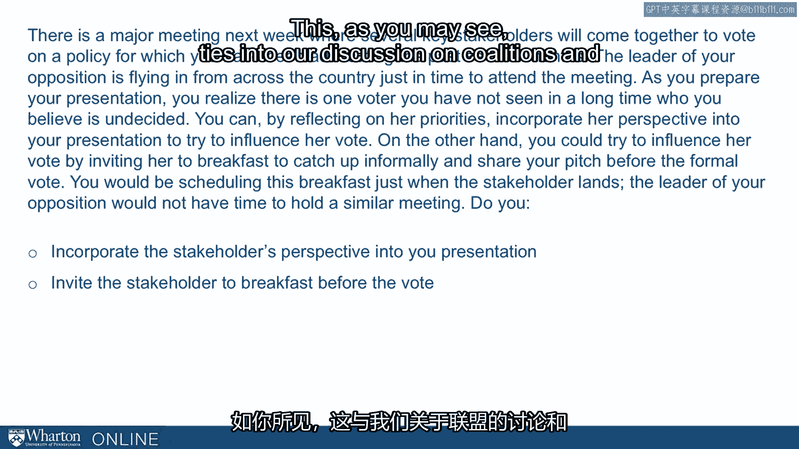

---

## 问题四：数据呈现

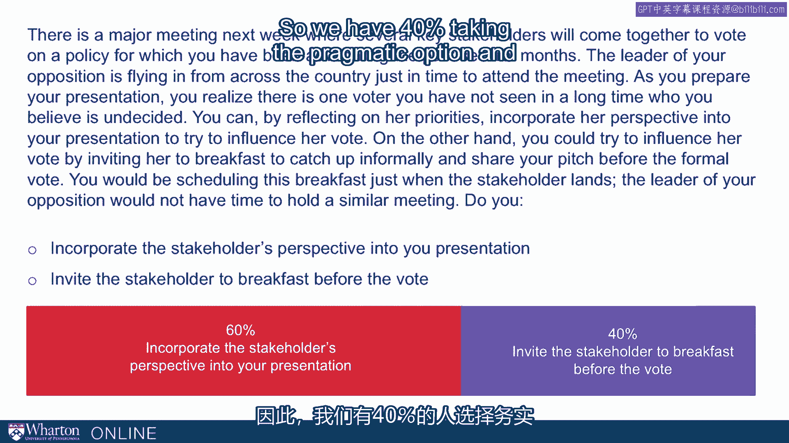

你的老板要求你为高层领导运行一份报告，以评估你最近主导项目的有效性。如果分析结果积极，你和你的老板都很可能获得晋升，公司也可能因此避免数百个裁员岗位。在分析过程中，你发现如果与过去三年的基线数据（而非过去五年）进行比较，结果看起来会更有利。你可以为使用三年数据找到理由，尽管你知道使用完整的五年数据在技术上更具可比性。

*   **A. 展示仅使用过去三年数据的分析**（务实选择）
*   **B. 展示使用全部五年可用数据的分析**（理想主义选择）

**调查结果**：45%的人选择使用三年数据（务实），55%的人选择使用五年数据（理想主义）。

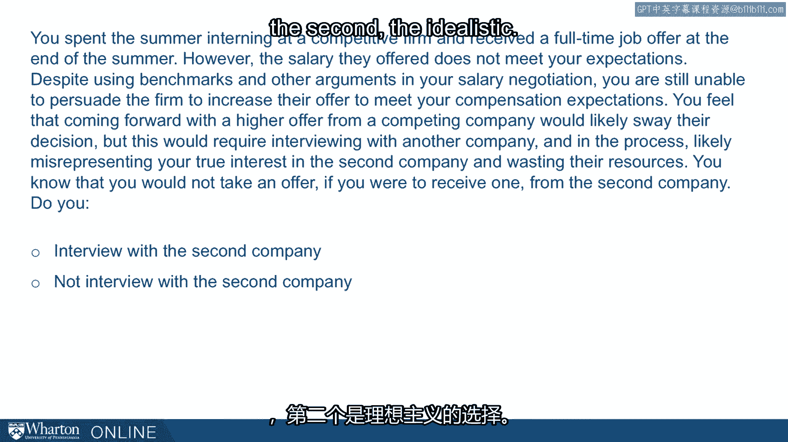

**请注意**：我们并不认为这些问题有标准答案，目的也不是评判对错。这只是为了衡量你在课程中讨论的各种影响力策略上的倾向性。需求与权衡因情境而异。我们只是推动你进行思考，看看自己的立场，更重要的是，了解你基于什么原则做出决定。

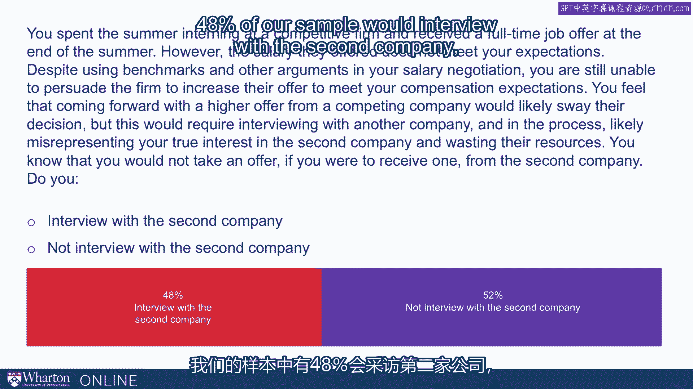

在继续之前，请做三件事：
1.  累加你做出的务实选择数量（0-10）。
2.  思考你在做这些选择时所依赖的原则。
3.  思考是否存在“第三种方式”。我们迫使你做出二元选择，但如果有其他创造性的替代方案，能否解决你感受到的伦理困境？

---

## 问题五：归咎于第三方

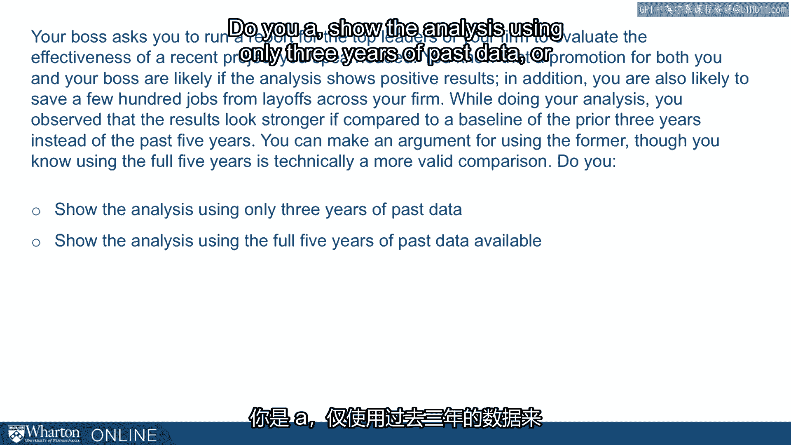

由于误解，你在一项关键任务中委托的第三方造成了重大经济损失，但责任归属模糊（是你还是第三方）。你的公司是该第三方的重要客户，因此你有能力将责任完全归咎于他们，要求他们退款。或者，你可以承担部分责任，但这会损害你的声誉。

*   **A. 迫使第三方承担全部责任**（务实选择）
*   **B. 接受共同责任**（理想主义选择）

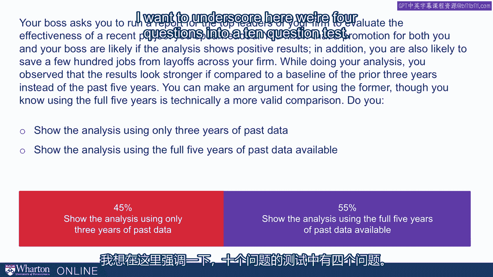

**调查结果**：仅14%的人选择归咎第三方（务实），86%的人选择共同承担（理想主义）。

---

## 问题六：客户亲属的雇佣

你在投资管理公司工作，公司一直试图争取一位高净值客户，她将成为公司有史以来最大的账户。经过数月的努力，她提到她的儿子正在寻找投资管理领域的工作，并询问你公司是否有职位空缺。你审查了她儿子的申请材料，发现他明显不符合公司典型的学术和职业招聘标准。然而，雇佣他很可能会确保你赢得这位新客户。

*   **A. 向潜在客户的儿子提供工作机会**（务实选择）
*   **B. 不向潜在客户的儿子提供工作机会**（理想主义选择）

**调查结果**：29%的人选择提供工作（务实），71%的人选择不提供（理想主义）。

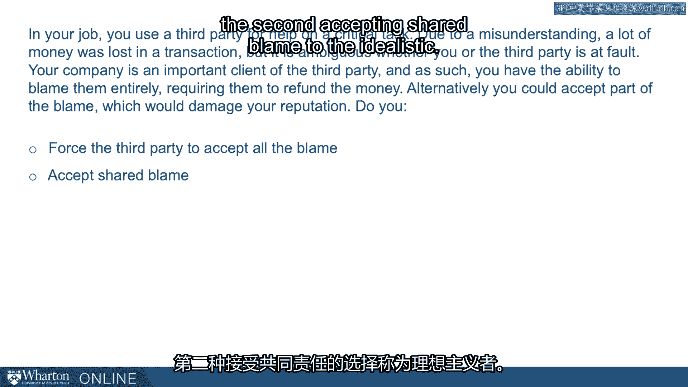

---

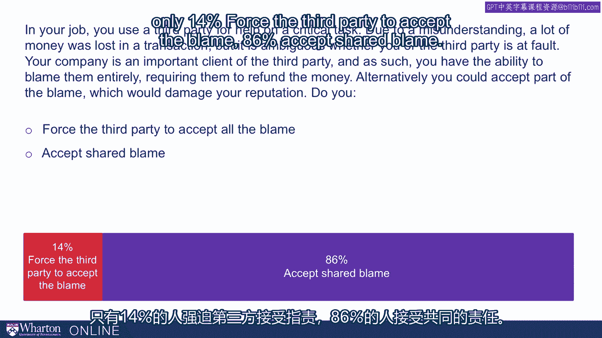

## 问题七：掩饰经验不足

在职业生涯早期，有时你可能觉得需要淡化自己的经验不足以建立信誉，尤其是在需要经常与客户或受益人互动的工作中。在此情境下，你入职新工作六个月，即将首次与客户会面。客户询问你的专业背景。

*   **A. 承认自己资历尚浅**（理想主义选择）
*   **B. 修饰（夸大）自己的经验**（务实选择）

**调查结果**：70%的人选择承认资浅（理想主义），30%的人选择修饰经验（务实）。

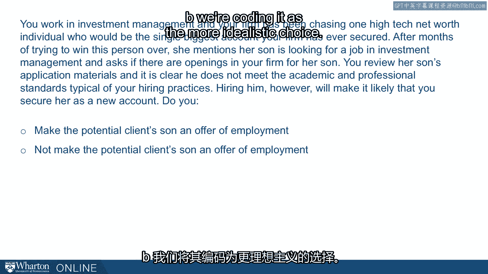

---

## 问题八：初创公司融资

你正在创业，几天后将要向第一位潜在投资者进行重要推介。你知道对方在决定是否投资时，会询问你是否已有其他投资者承诺投资。如果你说没有，将严重损害你获得这笔投资的机会。

*   **A. 暗示已有其他投资者承诺投资**（务实选择）
*   **B. 承认尚无其他投资者**（理想主义选择）

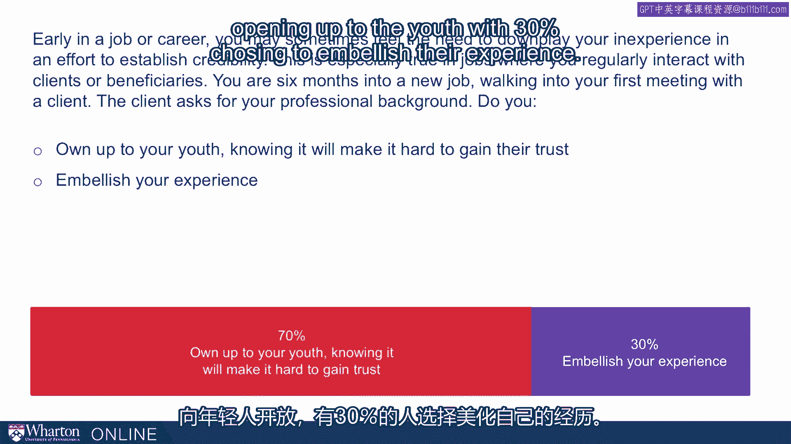

**调查结果**：35%的人选择暗示已有投资者（务实），65%的人选择承认没有（理想主义）。

到目前为止，你的得分是多少？更重要的是，你发现了哪些指导原则？你是否在妥协某些原则？你是否在创造性地思考，如果有自由，你会做出什么其他选择？

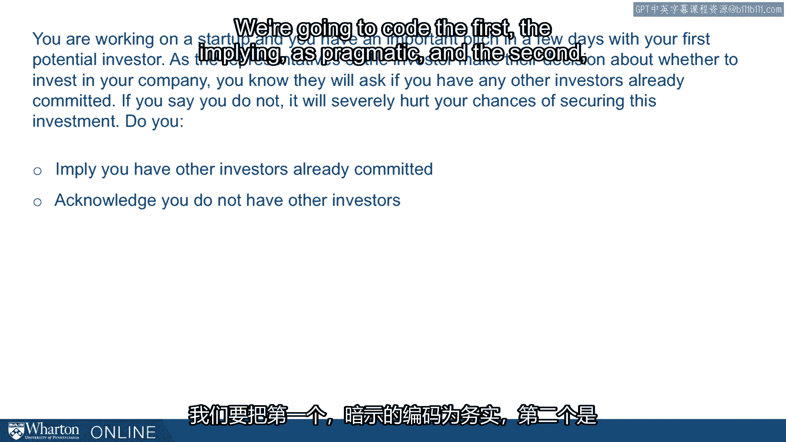

---

## 问题九：基于共同爱好的关系

你最近发现公司的一位高级经理刚搬到你的城市，并且是你最喜爱球队的超级粉丝。你对此感到兴奋，认为这可能是与他建立关系的关键杠杆。尽管你听说过关于这位经理的负面评价（难以相处、对初级同事不好），但你认为体育联系可以成为建立关系、推动职业生涯的平台。你仅从职业角度对这段关系感兴趣。你意识到这位经理刚到此地，渴望建立个人关系，他不会知道你建立关系的动机纯粹是职业性的。

*   **A. 建立关系以助力职业生涯**（务实选择）
*   **B. 不建立关系**（理想主义选择）

**调查结果**：75%的人选择建立关系（务实），25%的人选择不建立（理想主义）。

---

## 问题十：与令人反感者交往

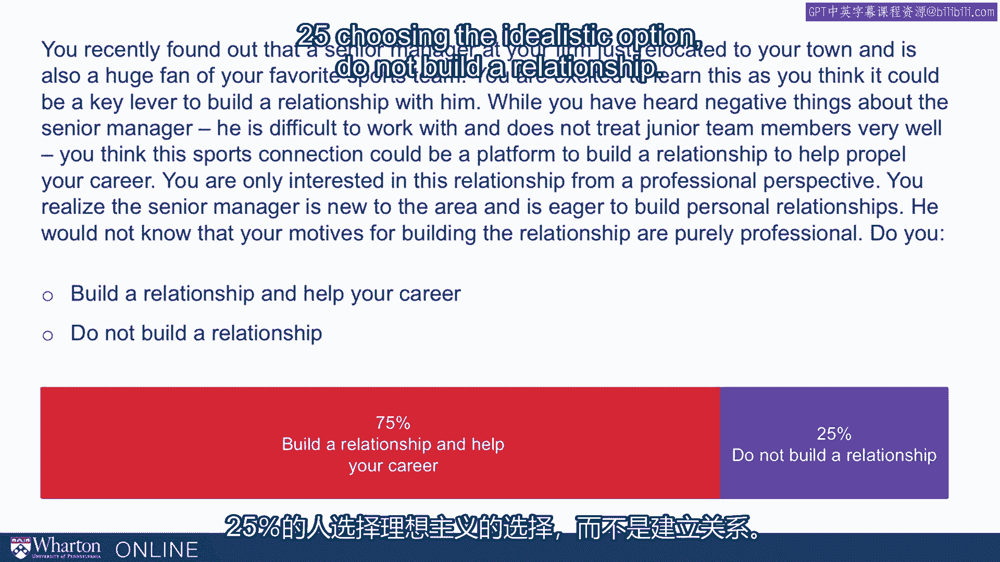

你刚入职一家新公司担任产品经理。在你的职业生涯中，你深知建立广泛职业网络以及与职业联系人建立个人关系的重要性。这对产品经理角色尤为重要，因为你的部分职责是连接组织的不同部门。你的一位最关键的利益相关者经常在背后侮辱团队成员，他还是一个偏执者，使用恶劣的侮辱性言辞贬低他人。然而，由于他在新公司的职位，获得他的支持对你的成功至关重要。这个人对你产生了好感，并邀请你今天下班后去喝一杯。你预计他会通过贬低他人来与你建立联系，这让你感到不适。你也担心同事会因你与他喝酒而反感你。

*   **A. 去喝一杯**（务实选择）
*   **B. 拒绝邀请**（理想主义选择）

**调查结果**：33%的人选择去喝一杯（务实），67%的人选择拒绝（理想主义）。

---

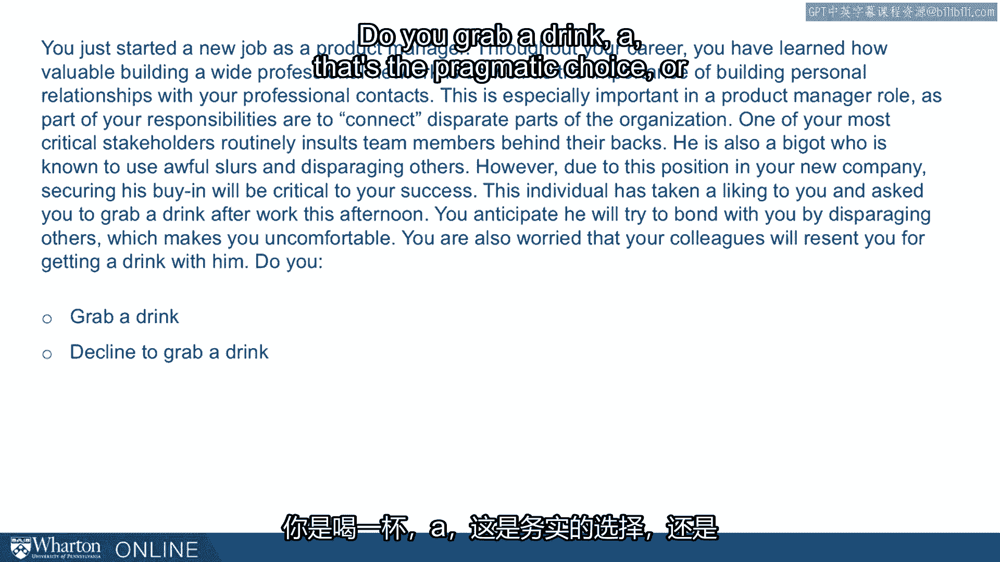

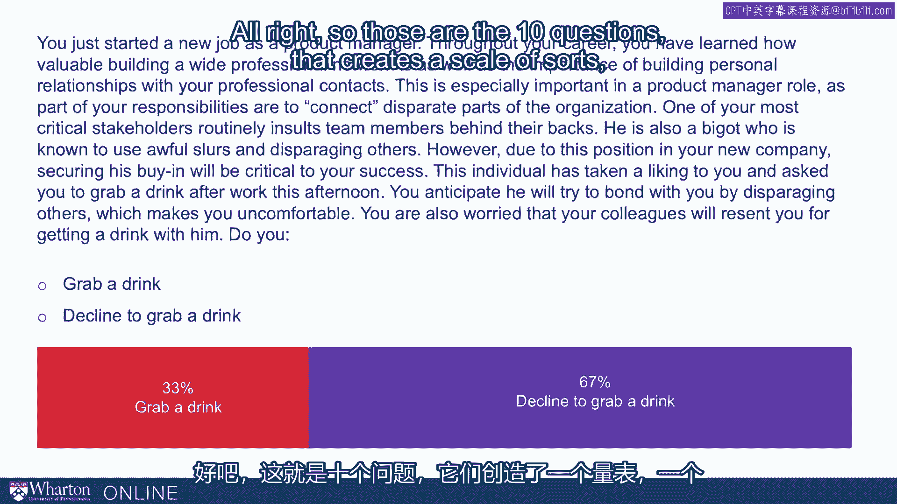

## 结果分析与解读

这十个问题构成了一种“务实程度”或“权宜之计”量表。这个量表没有标准答案或理想位置。但我们希望，通过回答这些问题，你能开始发现哪些原则对你最重要，并开始培养在面对此类虚假二元对立时寻找“第三种方式”的习惯。

以下是你得分的参考背景。我们要求你记录务实选择的数量（0-10）。下图展示了美国成年人的代表性样本的得分分布。

**全国样本（成人）**：
*   **平均分**：`3.7`
*   **分布特点**：存在相当高的标准差，表明差异很大。峰值（众数）是2分，其次是3分。大部分人的得分集中在1到6分之间，整体偏向理想主义一端。

这个得分因情境和人群而异。例如，我们对MBA学生进行了同样的调查（样本量91人），结果显著不同：
*   **MBA样本**：
    *   **平均分**：`6.0`
    *   **分布特点**：标准差较小，均值远高于全国样本。得分范围从2分到10分，但整体分布明显向高分（务实）端移动。

这种差异可能源于不同的偏好、训练或其他因素。重要的是，你要将自己置于这些分布中，并问自己：**这是你想处的位置吗？** 无论得分高低，无论是否典型，你对自己所处的位置感到舒适吗？你对自己达成这个位置所依据的原则感到舒适吗？

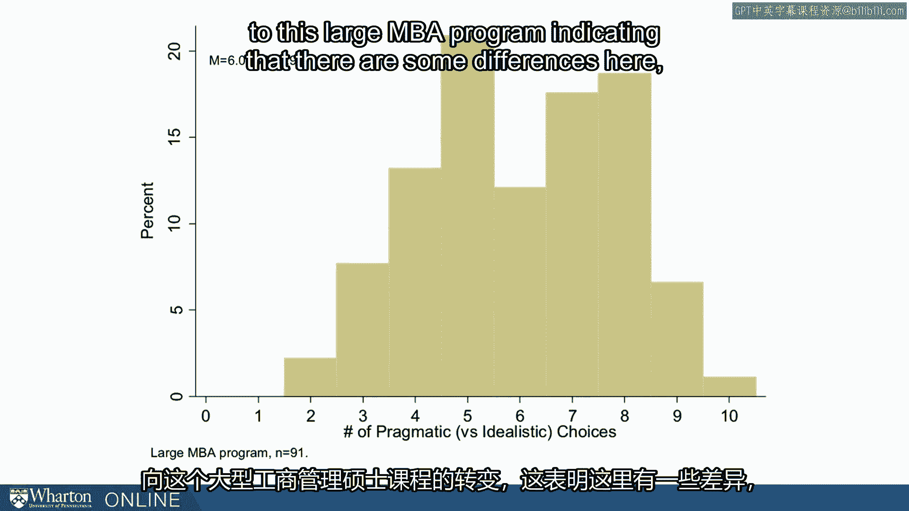

---

## 总结

本节课中，我们一起学习了通过“硬问题调查”进行伦理自我审视的方法。我们分析了十个具体情境下的选择，区分了务实与理想主义的倾向，并查看了不同人群（全国成人样本 vs. MBA学生）的得分分布。

核心在于，这不是一场考试，而是一次自我发现的旅程。其价值在于：
1.  **明确个人原则**：识别你在决策中真正依赖和可能妥协的核心价值观。
2.  **挑战二元思维**：练习寻找“第三种方式”，以更具创造性和伦理性的方式解决困境。
3.  **定位与反思**：了解自己在特定人群中的相对位置，并深入反思这是否符合你对自己的期望。

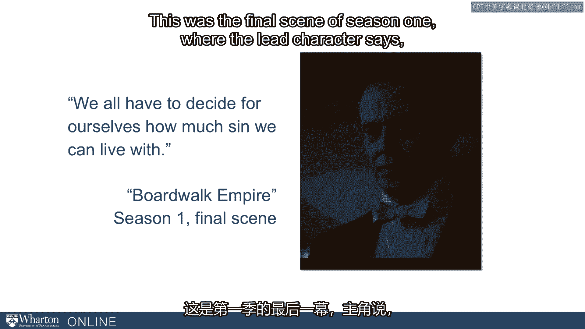

最后，引用《大西洋帝国》中的一句话作为结尾：“**我们每个人都必须自己决定，我们能承受多少罪孽。**” 虽然用在这里有些戏剧化，但本节课的主题正是如此——**决定你自己希望在诸如“务实程度”这类光谱上处于什么位置。**

