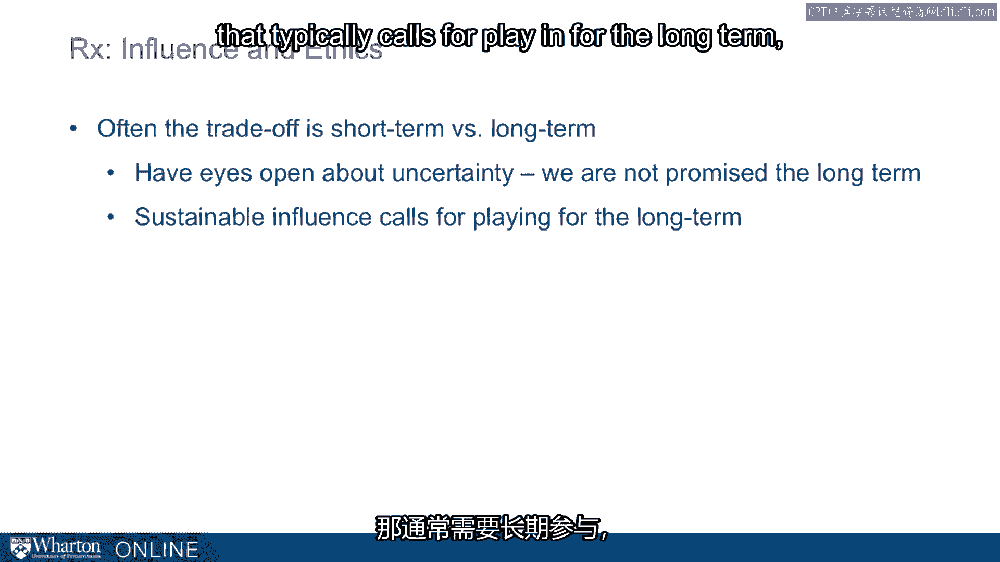

# 课程 P108：构建你的伦理框架 🧭

在本节课中，我们将深入探讨伦理框架的构建。上一节我们讨论了伦理困境，本节中我们来看看如何建立一个清晰的伦理框架，以指导你在运用影响力时做出符合原则的决策。一个明确的框架能帮助你抵御外部压力，确保你的行为与核心价值观保持一致。

---

## 动机：为何需要伦理框架？

运用影响力存在风险，但放弃运用影响力同样存在弊端。你无法通过简单地选择不施加影响来回避伦理困境。你必须牢记自己的目标，理解你为何要运用影响力。这些目标可能关乎个人、家庭、朋友、组织、同事、更广泛的社区或公共政策。你有很多运用影响力的目标和动机，因此，仅仅回避并非良策。

---

## 核心任务：明确你的原则

本节的核心思想是阐明一个伦理框架，以帮助你抵御世界的压力。世界有时会试图将你拖下水，你越是需要运用影响力，就越需要应对这些伦理困境。那么，哪些原则是你绝不愿违背的？你的价值排序是什么？你可以使用什么框架来确保在运用影响力时不落入陷阱？

我们将分享一些来自他人的框架示例。这些框架你不必全盘接受，但它们可以启发你构建自己的框架。

以下是几个可供参考的伦理框架示例：

*   **马可·奥勒留的清单**：这位哲学家的理念可以归纳为一个检查清单：永远不要认为某事对你有益，如果它让你**背叛信任**、**丧失羞耻感**，或让你表现出**仇恨**、**猜疑**、**恶意**、**虚伪**，或渴望那些**最好在私下进行的事情**。这是一个相当高的标准，列出了六七项可能为你提供检查的原则。
*   **理查德·谢尔的谈判观**：在他的谈判著作中，他指出重视个人诚信的人，其谈判行为会**始终如一地遵循一套深思熟虑的个人价值观**，并且在必要时能够向他人**解释和辩护**这些价值观。请注意，理查德并未规定这些价值观应该是什么，他只是强调要保持一致、深思熟虑并能进行辩护。
*   **奥斯卡·纳卡哈拉的检查清单**：这位沃顿同事在一次早餐谈话中分享了他的标准：
    1.  **《华尔街日报》头版测试**：如果你的行为被刊登在《华尔街日报》头版，你会作何感想？
    2.  **换位思考**：如果你处在对方的位置，你会有什么感受？
    3.  **重复性测试**：如果你必须连续10次或100次做出同样的决定，你是否每次都愿意跨越这条原则？
    4.  **长期与短期**：采取这个行动的长期后果与短期后果相比，是更好还是更糟？

---

## 一个参考框架示例

最后，我想提出我自己的框架作为另一个样本，旨在推动你为自己开发类似的东西。我的框架分为两部分：一部分是“绝对准则”，另一部分是“个人考量”。

### 绝对准则

这些是我坚信重要且具有普遍性的原则。

1.  **认知你的偏见**：这回到了我们本半节课开始时提到的巴纳吉等人的文章。我们往往相信自己才是客观的，而别人可能有偏见。大卫·阿莫尔的研究指出了“客观性幻觉”。这要求我们寻求**情感距离**、**外部视角**以及**环境和制度设计**。正如一句名言所说：“我们看到的不是世界的本来面目，而是我们自己的样子。”
2.  **与他人讨论你的决定**：这是检验你偏见的一个重要且简单的方法。如果你正在考虑一个你不想与他人谈论的行动方案，这本身就是一个危险信号。讨论对象的背景差异越大越好，因为同质化的群体难以提供新的视角。正如奥巴马在谈论建立多国联盟时所说：“我们应该倾向于多边而非单边行动，因为建立联盟的过程迫使你提出尖锐的问题。”
3.  **寻找“第三条道路”**：生活不是电影，我们完全有可能**既保持高效又维护诚信**。我们需要警惕非黑即白的错误二分法，并在伦理困境中发挥创造力，寻找两全其美的解决方案。

### 个人考量

这些是更个人化的选择，但值得考虑，可以作为你构建自己框架时的参考。

1.  **设定高标准的诚实**：这不仅影响你的言辞，也影响你的行为。在个人层面，诚实类似于组织层面的透明度。如果你知道自己必须保持诚实，这会在事前就改变你的行为，提高决策门槛。
2.  **追求行为的一致性**：我们可以通过自问“在我的多少个社交圈子里，我能坦然讨论此事？”来审视行为。一致性要求我们在不同场合的行为不应割裂，这能提供一个有效的检查机制。心理上，在不同领域扮演截然不同的角色也会带来损耗。
3.  **为长远打算**：通常，更难走的道路从长远来看往往更好。虽然未来充满不确定性，但如果我们追求的不仅是影响力，而且是**可持续的影响力**，这通常就需要**着眼长远**，有时甚至需要**牺牲短期利益**。我们感兴趣的是建立长期、可持续的影响力。

---

## 总结

本节课中，我们一起学习了构建个人伦理框架的重要性与方法。我们探讨了明确自身原则的必要性，分析了几种不同的伦理框架示例，并介绍了一个包含“绝对准则”和“个人考量”的参考框架。记住，关键在于找到一套你能**始终遵循**、**深思熟虑**并在必要时能**坦然辩护**的价值体系，从而帮助你在运用影响力时，既能达成目标，又能守住底线，实现可持续的成功。