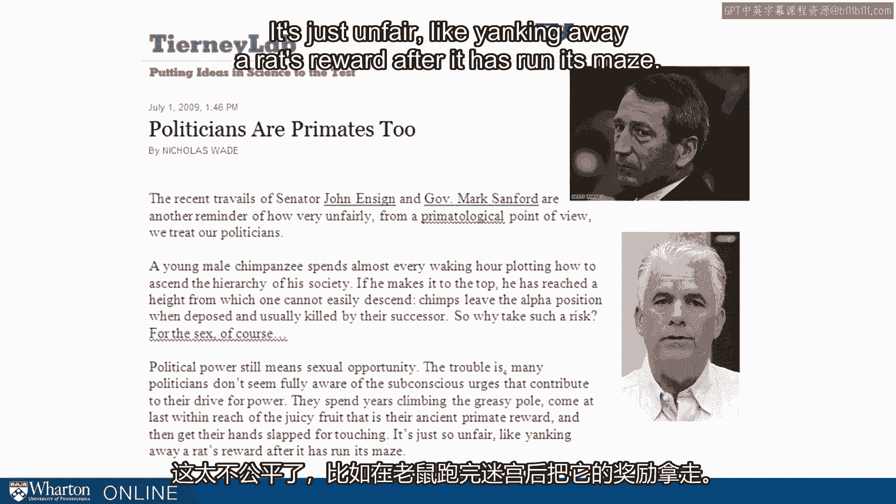
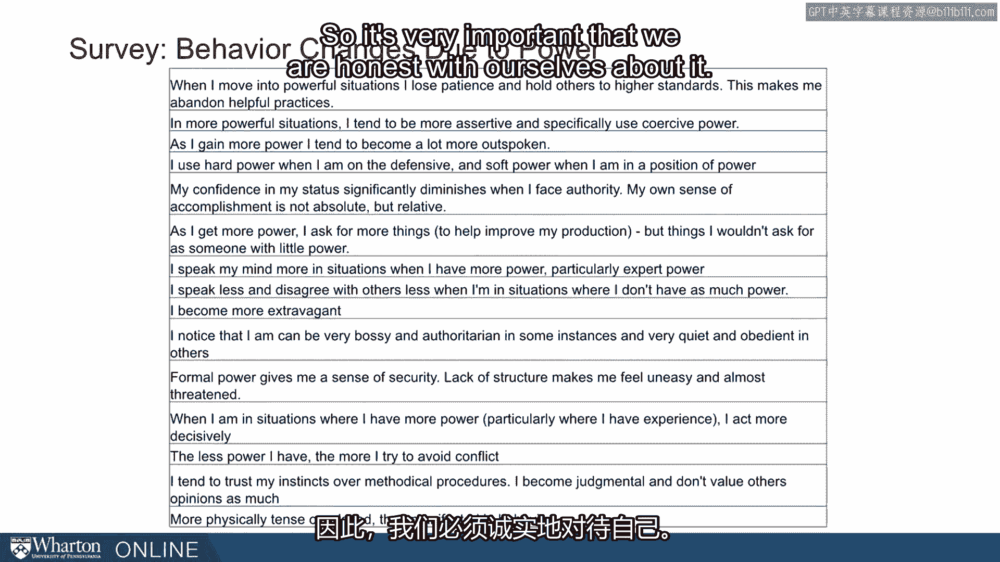

# 课程 P110：典型案例分析 🧐

在本节课中，我们将通过一系列真实案例，探讨权力与地位如何影响个人行为。我们将看到，从政客到运动员，再到历史人物，许多人在获得权力后都经历了相似的行为变化。理解这些模式有助于我们认识自身在权力情境下的潜在变化。

---

教学这一主题时，一个有趣且可悲的方面是，我们从不缺乏案例。

近年来，我们目睹了许多地位崇高者的不当行为。

几年前，《纽约时报》的Tierney Lab专栏曾引用一段话，当时政客马克·桑福德和约翰·恩赛因遇到了麻烦。

作者尼古拉斯·韦德写道：“政客也是灵长类动物。” 他说：“参议员约翰·恩赛因和马克·桑福德最近的困境再次提醒我们，从灵长类动物学的角度来看，我们对待政客的方式是多么不公平。一只年轻的雄性黑猩猩几乎每时每刻都在谋划如何攀登其社会等级。如果它成功登顶，便到达了一个不易下降的高度。黑猩猩通常在被继任者推翻并杀死后，才会离开首领位置。那么，为何要冒此风险？当然是为了性。政治权力仍然意味着性机会。问题在于，许多政客似乎并未完全意识到推动他们追逐权力的潜意识冲动。他们花费数年攀爬油腻的杆子，终于触手可及那多汁的果实——这是他们古老的灵长类奖励——却因触碰而遭到责罚。这就像老鼠跑完迷宫后，奖励却被猛地夺走一样不公平。”

桑福德和恩赛因的例子只是开始，我们还可以列出更多。艾略特·斯皮策，情况类似，只是多了一层虚伪，让事情更具讽刺意味。

泰格·伍兹，体育界更著名的例子之一，遇到了一些重大的婚姻问题，这导致他竞技高尔夫生涯过早结束。当他经历婚姻问题并结束治疗后，他说了一些话，这些话简直可以直接出自社会心理学教科书。

他说：“我背离了我被教导应信奉的核心价值观。我知道我的行为是错误的，但我让自己相信常规规则不适用于我。我从未考虑过伤害了谁。相反，我只考虑自己。我直接跨越了已婚夫妇应遵守的界限。我以为我可以为所欲为而不受惩罚。我觉得我一生努力工作，理应享受身边的所有诱惑。我觉得我有资格。多亏了金钱和名声，我不必远行就能找到它们。”

因此，伍兹因婚姻不忠而陷入麻烦，但其背后的理由，正是我们在许多拥有权力并已习惯权力的人身上看到的、由地位驱动的不当行为的核心理由。

最后一个例子，一个古老的例子，用以强调这种现象由来已久，并且影响着即使是非常有成就、非常值得尊敬的人。这是米开朗基罗的大卫，但我们指的是《旧约》中的大卫王。

让我们回顾一下大卫。如果你对大卫一无所知，可能也知道大卫和歌利亚的故事。这是大卫首次登上世界舞台，作为牧童击败了巨人歌利亚。他后来撰写了《圣经》中的许多诗篇，并担任以色列国王很长时间。但他也有与拔示巴有关的事件。

你还记得大卫和拔示巴的故事吗？拔示巴是他爱上的一个女人。他看见她在隔壁楼顶沐浴。对他而言不幸的是（首先他邀请她到家里），他与这个女人发生了关系。而对拔示巴而言不幸的是，她已婚，丈夫是他手下的一位将军。那么大卫做了什么？这位撰写诗篇、身为公正国王的大卫做了什么？他密谋杀害了那位将军。他召集其他将军，说：我们去攻打旁边的敌人。让拔示巴的丈夫打头阵，当敌人反击时，你们就撤退，让他被杀。事实上，这些人照做了。拔示巴的丈夫被杀了。现在他可以独占拔示巴了。

这就是大卫。这就是大卫王。大卫王似乎也成为了我们在近期社会心理学研究中一直记录的、完全相同问题的牺牲品。但本质上，人们与这个问题斗争了数千年。即使像大卫王这样值得尊敬的人，也同样易受其影响。这对我们来说应该是一个严肃的警示。

我想把问题转向你们，请问：**当你们拥有权力时，你们有何不同？** 现在是一个反思的好时机。你可能已经观察到，在高权力情境和低权力情境下，你的行为方式有些不同。你在哪些方面不同了？

这是我们有时会调查学生的问题。我这里收集了一些回答。这确实是随机样本，是我们全日制MBA学生关于权力如何改变他们的调查回复随机样本。这只是自我报告。让我们来看看。

你会看到范围很广的回答，其中一些与我们一直在讨论的社会心理学研究相呼应，有些可能略有不同。你会听到人们谈论变得更挥霍、更自由地表达想法、使用硬权力。例如：“我变得更直言不讳。”“我拥有的权力越少，就越避免冲突。”这些都是人们对权力改变自身方式的诚实反思。

这些学生的平均年龄是27岁。他们可能拥有过一些权力，但还未拥有他们在未来10年、20年、30年将会拥有的那种权力。他们还没有十年或二十年的时间去适应他们可能获得的地位。这只是变化的开始。这正是我们希望保持觉察的，正是我们希望睁大眼睛看清的，也是每当我们帮助你们培养和发展地位与权力时所担心的，因为正是这些可能让你们跌倒。

事实上，**权力携带着自我毁灭的种子**。权力带来这些改变，而这些改变随后可能削弱你的权力。因此，对我们而言，诚实地面对这一点、承认并接受我们就像大卫、泰格·伍兹和艾略特·斯皮策一样易受影响的事实，是非常重要的。并且希望我们能采取措施尝试减轻其影响。

在下一节中，我们将开始讨论一些应对措施。

[空白音频]

---

**本节课总结**

本节课我们一起分析了多个典型案例，从现代政客、体育明星到古代君王，揭示了权力如何普遍地导致行为变化，例如自我膨胀、漠视规则和道德风险。关键启示在于，**权力本身蕴含导致其衰落的因素**。认识到自身在权力情境下的易变性，是防止其负面影响的第一步。在接下来的课程中，我们将探讨具体的应对策略。