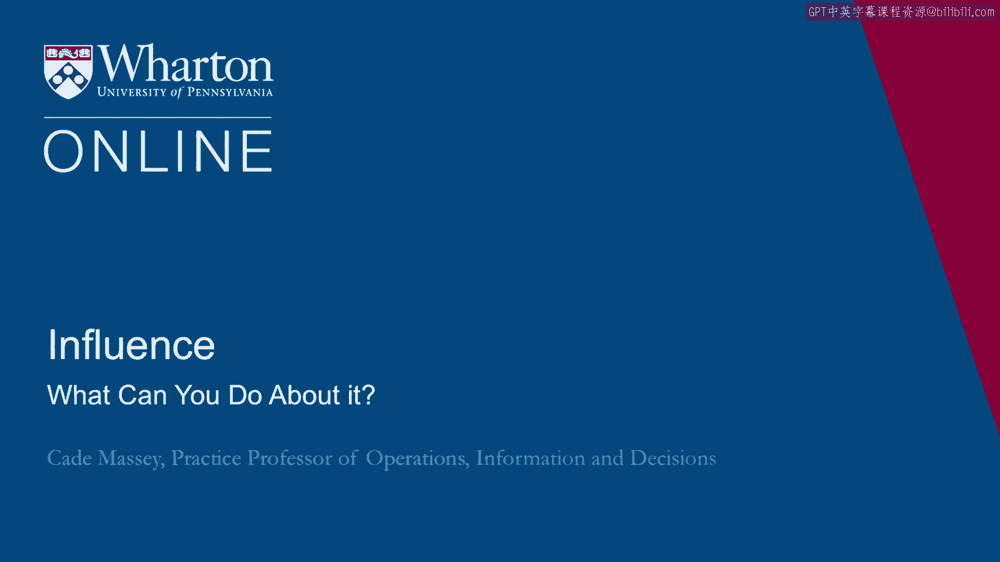
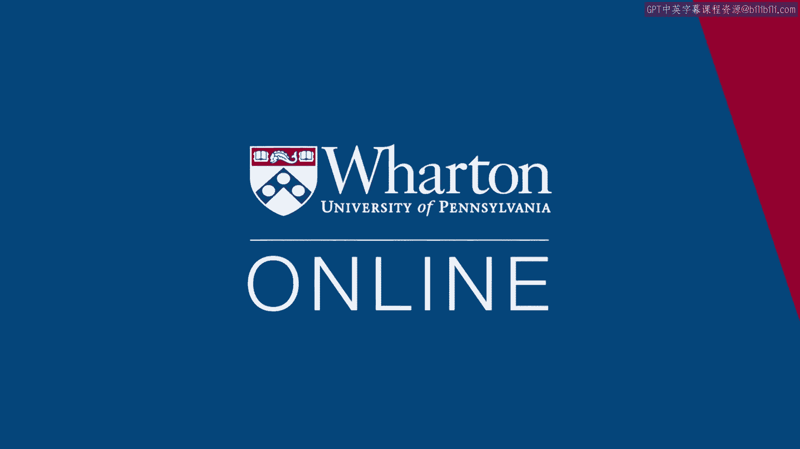

# 沃顿商学院课程笔记 P111：如何避免权力与地位带来的心理陷阱 🧠

在本节课中，我们将探讨一个关键问题：当人们获得更高的地位和权力时，如何避免随之而来的心理变化与负面影响。我们将重点介绍斯坦福大学学者罗德·克雷默的研究，他提出了一系列实用的“处方”，帮助人们规避“天才到愚人综合症”——即因才华获得权力，又因权力带来的问题而失去权力。

---

## 克雷默的六项核心处方

上一节我们提到了地位与权力可能带来的心理变化，本节中我们来看看罗德·克雷默教授提出的具体应对策略。他通过观察商界和政府领袖，总结出以下六项建议：

以下是克雷默建议的六项具体行动：

1.  **保持生活简单**：避免因地位提升而使生活变得不必要的复杂。
2.  **公开承认缺点**：主动谈论自己的问题和错误，而不是掩盖它们。
3.  **释放试探气球**：在做出重大决策前，先提出初步想法以收集反馈。
4.  **关注细节**：即使身居高位，也要继续关心和处理小事。
5.  **增加而非减少反思**：在繁忙中刻意留出时间进行自我反思。
6.  **认清权衡取舍**：意识到每个决定都涉及利弊，没有完美的解决方案。

这些建议本身不难理解，执行起来看似简单，但不同的人可能会在不同项目上遇到困难。

---

## 实践中的挑战与个人反思

那么，对你而言，这些建议中哪些你已经在做？哪些对你来说很自然？哪些又是你的挣扎所在？

例如，许多人发现 **“公开承认缺点”** 这一点很难做到。我们真的应该谈论自己的问题和错误吗？克雷默发现，能够避免“天才到愚人”问题的人，正是那些更早暴露问题、更能接受不完美、并预期他人也不完美的人。

另一个常见的挑战是 **“增加反思”**。我们生活在一个非常忙碌的社会。克雷默指出，能避免问题的人往往是那些能从忙碌中抽身、反思自己行为、而不是不停从一个活动奔向下一个活动的人。

这些并非高深莫测，但确实需要我们付出努力。请思考一下，你如何能在生活中更多地实践这些建议？你已经在哪方面遇到了困难？

如果你现在27岁，刚刚起步，就已经在某些方面感到困难，那么未来当你承担更多责任、获得更大成功时，可能会遇到更多问题。克雷默的建议是，现在就开始将这些原则融入生活，为你未来的道路提前接种“疫苗”。

---

## 来自企业领袖的印证

其他领袖也呼应了克雷默的建议。哈拉斯娱乐公司CEO加里·洛夫曼指出：“你在组织中的地位越高，就会有越多的人告诉你你是对的。”

他的“解药”包括：
*   定期并公开承认错误。
*   强调决策过程，优先考虑数据和分析，而非谁做决策。
*   积极寻求外部人士的意见。
*   鼓励团队内部的辩论以及组织内的批判性自我反思。

这与克雷默的处方高度一致。

---

## 自我觉察与具体实践方法

一位EMBA学生曾在课后一年给我发邮件，他写道：“观察一下你的笑话变得多么‘有趣’。” 他提到，晋升后，即使他自知并不幽默，人们也开始对他的笑话发笑。这让他意识到，随着成功而来的是阅读“自己新闻”的诱惑。他认为，如何避免“天才到愚人综合症”的幻灯片最为重要，并坦言：“每次我的自我膨胀时，我就会犯错。”

另一位研究权力的斯坦福教授拉腊·蒂登斯指出，正是这种**反思**是她研究的意义所在。她认为，排序行为时刻在人与人之间发生，而其有害影响源于我们对此避而不谈。一旦它成为我们关系中明确的一部分，我们就能更好地控制其发展。这对我们自身也同样适用：如果我们能对自己更诚实，能明确指出这些问题，能更明确地告诉周围的人权力和地位如何正在或可能改变我们，我们就能降低风险。

一位学生分享了更深刻的例子：她的一位前经理曾将职业失误记录在案近五年，并且让助理每天随机选一条通过邮件发给他。起初她觉得这很古怪甚至自虐，但经理解释说，他见过太多领导沦为“权力悖论”的牺牲品，一旦到达顶峰便不再承认或从错误中学习。他这样做是为了不断提醒自己，他也不过是凡人，无论达到什么职位或薪酬等级都难免犯错。傲慢常导致自满或决策鲁莽，他发誓尽一切努力避免让这种风险占据上风。这是一个将处方深刻融入生活的极端例证。

组织心理学家杰夫·菲弗指出：“警惕性下降与环境变化的结合，常常导致权力的丧失。” 他的处方之一是：**时常让自己置身于一个完全不关心你职位的社会圈子中**。这也是我与MBA和EMBA学生讨论时最常出现的建议之一：与认识多年（有时是数十年）的人保持联系，与在你拥有权力和影响力之前就认识你的人保持联系，这能让你保持脚踏实地和外部视角。

---

## 清醒的认识与最终总结

最后，菲弗提出了一个非常清醒的告诫：
> **“无论最初的意图和抱负如何，权力最终都会冲昏每个人的头脑。”**

不幸的是，基于过去十年左右的研究和教学，我也倾向于认同这一观点。这似乎有一种必然性，或者至少是一种强大的普遍趋势。如果我们不愿意承认这一点，只会增加它发生在我们身上的风险。

---

**本节课总结**：我们一起学习了权力与地位可能带来的心理变化及风险，重点掌握了罗德·克雷默教授提出的六项实用处方来规避“天才到愚人综合症”，并通过企业领袖案例和具体实践方法，理解了保持谦逊、持续反思、接纳反馈和维系旧友关系对于长期成功的重要性。核心在于，**提前觉察并主动管理**权力带来的影响，是维持个人与职业成功的关键。