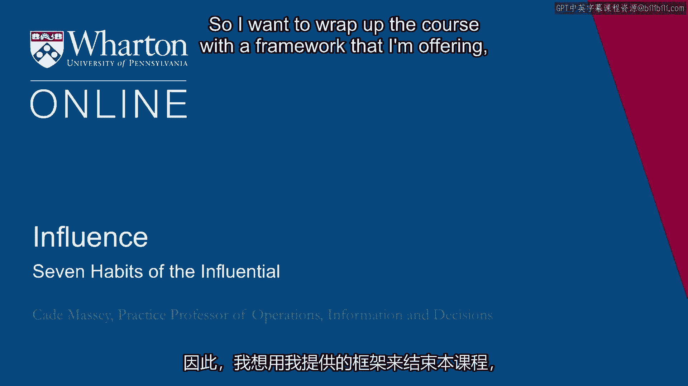
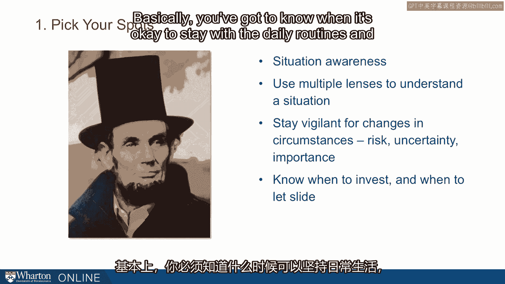
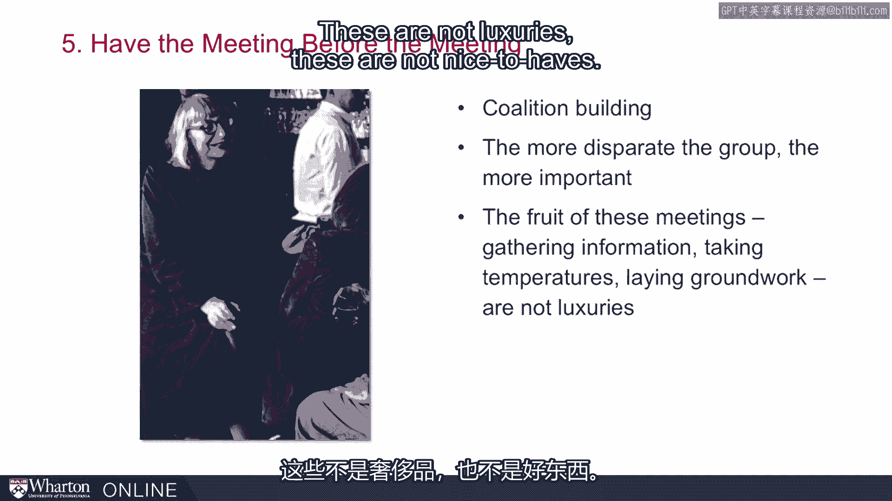
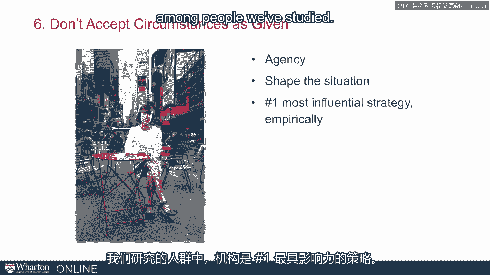
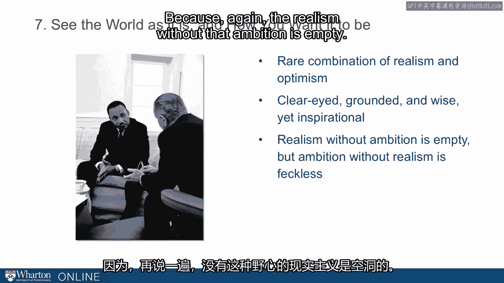

# 课程 P113：有影响力者的七个习惯 🧠



在本节课中，我们将总结并提炼出实现个人与职业成功的关键框架——**有影响力者的七个习惯**。这个框架旨在帮助你整合课程中的核心主题，并将其转化为可实践的日常行为。

---

## 概述

课程接近尾声，我们将介绍一个总结性的框架。虽然这并非唯一的框架，但它提炼了课程中反复出现的关键理念。我们鼓励你在此基础上，进一步提炼出对自己最有意义的要点。


这个框架被称为 **“有影响力者的七个习惯”**。接下来，我们将逐一详细解读每个习惯，它们呼应了我们在整个课程中讨论过的多个主题。

---

## 七个习惯详解

### 1. 选择你的战场 🎯



上一节我们介绍了框架的整体概念，本节中我们来看看第一个习惯：**选择你的战场**。这个习惯源于**情境意识**。

**情境意识**指的是一种能力：运用多种视角理解当前处境，对环境变化（尤其是风险、不确定性和重要性方面的变化）保持警惕。其核心在于知道何时应该投入精力，何时可以顺其自然。本质上，你需要分辨何时可以遵循日常惯例，何时需要采取不同行动。

亚伯拉罕·林肯是实践这一习惯的绝佳榜样。信息意识是一套通用的技能，而**选择战场**这个习惯，正是我们在有影响力的人身上常见的特点。

---


### 2. 将他人利益放在心上 🤝

第二个习惯是**将他人利益放在心上**。我们在课程早期介绍过一个专业术语：**他者中心主义**。

**他者中心主义**是一种关注他人视角的思维方式，与自我中心主义相对。罗伯特·摩西虽然以强势著称，但出人意料地精通此道。他深知，你越能满足他人的需求，他人就越有能力回馈于你。

这不仅仅涉及考虑他人的想法，还包括顾及他们的感受，即**情感诉求**的概念。

---

### 3. 愿意做出权衡取舍 ⚖️

第三个习惯是**愿意做出权衡取舍**。我们以课程中的第一个例子塞尔吉奥·维埃拉·德梅洛为例。


我们在德梅洛身上看到了**目的性**。他高度重视灵活性与适应性。为他立传的作者萨曼莎·鲍尔称，塞尔吉奥是“无情的务实主义者”。从他以及课程其他案例中，我们得到一个启示：如果你不在做权衡取舍，那么你并非真正朝着目标努力。

**公式**：`实现目标 ≈ 做出明智的权衡`

---

### 4. 在需要之前培养关系 🌐

第四个习惯是**在需要之前培养关系**。这里以海蒂·罗伊岑为例，她是一位知名的硅谷创业者、风险投资家和社交达人。

我们讨论过人际关系网络。这个习惯旨在解决许多人对“经营人脉”感到不适的问题——与其功利地思考“网络”，不如真诚地思考“人与关系”。为了在时间分配上保持一定战略性，一个可行的方法是：**有意识地规划社交，但无目的地培养关系**。



**在需要之前培养关系**，是实践这一点的好方法。

---

### 5. 召开“会前会” 💬

第五个习惯是**召开‘会前会’**。这个习惯真正体现了这些是**日常行为方式**，并不复杂，只需融入我们的例行公事。



简·雅各布斯是这里的例子。她在格林威治村的酒吧里与罗伯特·摩西进行了著名的对决，并通过建立联盟展示了联盟的价值。相关研究和案例表明：群体越是多元，建立内部联盟的能力就越重要、越有价值。

你可以利用这些“会前会”来收集信息、试探态度、奠定基础。它们不是可有可无的“人情树”，而是在组织中获得影响力的必要环节。

**代码逻辑**：
```python
if 重要会议或决策:
    召开会前会(目的=收集信息、试探态度、奠定基础)
```

---

### 6. 不被动接受既定环境 🚧

第六个习惯是**不被动接受既定环境**。图中是贾妮特·萨迪克-汗，一位当代的交通专员，她在许多方面继承了摩西的足迹。



她展现了强大的**主观能动性**，例如在纽约市开辟步行区。她坐在百老汇大街中央的照片正体现了这一点：她塑造情境，而非被动接受既定事实。我们的实证研究发现，**主观能动性**是我们所研究人群中最具影响力的策略。

---


### 7. 洞悉现实，怀抱愿景 🌈

第七个，也是最后一个习惯：**既看清世界本来的样子，也看到你希望它成为的样子**。图中是林登·约翰逊总统和马丁·路德·金博士正在为60年代初推动的民权立法制定策略。


自重建时期以来，民权立法在美国国会屡屡失败，已有75到80年毫无进展。约翰逊总统完成了这项伟业，他凭借的是**现实主义与乐观主义**的罕见结合。约翰逊以强硬务实著称，但他同时也怀有清晰、鼓舞人心的愿景。

这里的理念是：**两者缺一不可**。没有抱负的现实主义是空洞的，而没有现实主义的抱负是徒劳的。我们鼓励你将两者结合起来。我们希望课程能让你在“现实主义”方面装备得更完善、更高效，但同时希望它能与“灵感抱负”相结合。

**公式**：`有效影响力 = 现实主义 × 抱负（愿景）`

---

## 总结与最终启示

我们称其为“习惯”，是因为它们确实是融入每日、每周例行公事中最有效的生活方式。以上便是七个习惯。我们希望你能从中提炼出对自己最有意义、最有用的部分。这只是一个框架，一种理解我们所学内容的方式。

课程的最后，我们再次回到亚伯拉罕·林肯。在多丽丝·卡恩斯·古德温的《对手团队》一书（后部分内容被改编为电影《林肯》）中，有一个场景令人深省。

时值1865年1月，南北战争已近尾声。林肯团队正在为通过宪法**第十三修正案**（旨在永久废除奴隶制）做最后努力。在投票前的关键时刻，林肯对他的团队说：

> “我是美国总统，拥有巨大权力。以宪法条款废除奴隶制，将决定未来所有时代的命运……这项措施如此重要，必须获得那两票。我让你们来决定如何做到，但记住，我是美国总统，拥有无上权力，我期望你们去争取到那些选票。”

这段话给我们什么启示？即使拥有最崇高的事业和最正义的立场——如同林肯一样——你仍然需要争取选票，仍然需要运用影响力策略来实现目标。

**核心结论**：**正确、道德、努力，这些都不足够。要成就伟业，你需要一系列工具，需要这些影响力技能。**


---


本节课中，我们一起学习了构成“有影响力者的七个习惯”框架的七个核心行为准则：选择战场、心系他人、敢于权衡、提前建联、会前沟通、主动塑造、兼顾现实与愿景。我们以林肯的故事作为最终启示，强调了即使目标正义，掌握并运用影响力工具也至关重要。祝愿你在未来的工作和追求目标的道路上，善用这些工具，一切顺利。