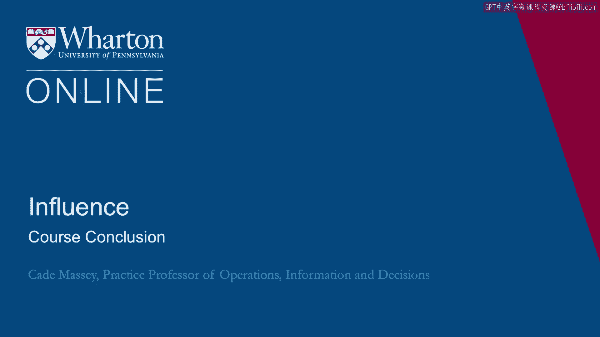

# 沃顿商学院《实现个人和职业成功》课程总结 🎓

在本节课中，我们将对《实现个人和职业成功》这门课程进行总结，回顾核心工具与理念，并为你未来的实践送上祝福。

---

欢迎最后一次回到课堂。在课程结束之际，我想给你一些临别赠言。

首先，我要感谢你投入的时间。如果你已经坚持学到这里，说明你为此付出了大量的精力。我们衷心祝愿你在生活中运用这些工具时一切顺利。



在本课程中，我们并未过多探讨你的具体目标和目的应该是什么。我们默认你已拥有宏大而雄心勃勃的目标。我们祝愿你在追求这些目标的过程中取得最佳成果。

我们希望这些工具能对你有所帮助，并衷心祝愿你最终能成功实现它们。

---

## 课程核心回顾

上一节我们表达了感谢与祝愿，现在我们来简要回顾一下贯穿本课程的核心概念与工具。

以下是本课程重点培养的三大核心能力及其关键要点：

1.  **成功的基础**
    *   成功并非偶然，它建立在清晰的自我认知与目标设定之上。
    *   核心公式可概括为：**成功 = 明确的目标 + 持续的行动 + 有效的调整**。

2.  **沟通能力**
    *   有效的沟通是影响力的起点。它涉及清晰地表达自己并准确地理解他人。
    *   关键代码（沟通原则）可简化为：
        ```python
        def effective_communication(message, listener):
            # 1. 清晰编码信息
            encoded_message = clarify(message)
            # 2. 选择合适渠道传递
            delivered_message = deliver(encoded_message, channel)
            # 3. 确认接收与理解
            feedback = confirm_understanding(delivered_message, listener)
            return feedback
        ```

3.  **影响力**
    *   影响力是让他人自愿认同并支持你的想法的能力。它建立在信任、专业知识和互惠基础之上。
    *   其增强回路可表示为：**可信度 → 有效说服 → 积极结果 → 强化可信度**。

---

## 总结与践行


本节课中，我们一起回顾了整个课程的尾声。讲师感谢了你的参与，并祝愿你能将所学的关于成功、沟通与影响力的工具应用于实际，助力你达成个人与职业上的宏伟目标。

记住，这些概念和工具的价值在于运用。现在，带着这些知识，自信地开启你的实践之旅吧。祝你成功！