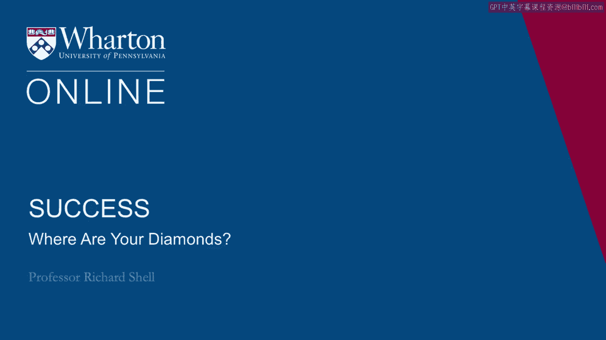
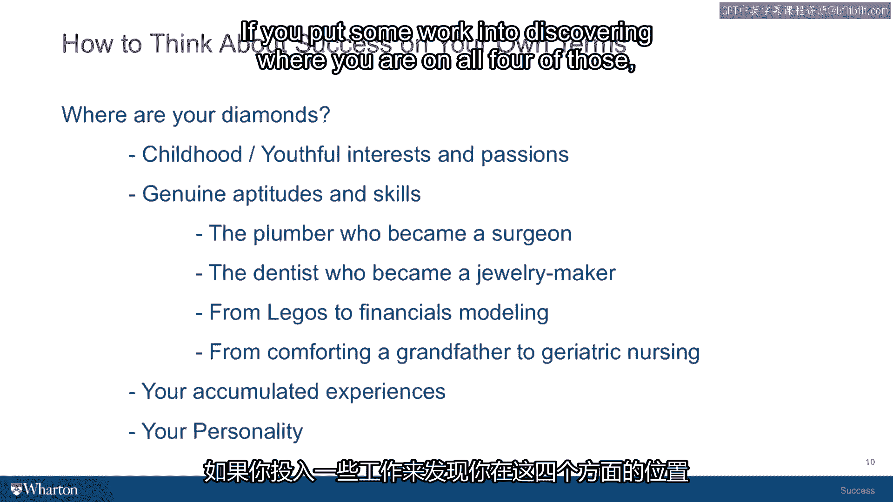

# 课程14：你的钻石在哪里？💎

在本节课中，我们将学习如何识别并挖掘你自身所拥有的、独特的“钻石”——那些能引领你走向内外成功的内在能力与特质。我们将通过四个具体类别来系统地探索它们。

---

## 概述

成功往往始于自我认知。许多人向外寻求机会，却忽略了自身早已拥有的宝贵资源。本节课将引导你向内探索，通过回顾童年兴趣、评估实际才能、总结过往经历以及分析个人性格这四个维度，来发现你专属的“钻石”。这些特质组合在一起，将构成你独一无二的优势和满足感的源泉。

## 发现你的四颗钻石

寻找内在优势的过程有时是反直觉的。向前迈进的最好方式，往往是先向后看。我们每个人都有在童年和青少年时期投入过的兴趣与热情，但随着年龄增长，它们可能因学业、考试等“更重要”的事而被搁置。然而，这些被埋藏的种子，很可能蕴含着指引你未来方向的线索。

以下是发现你自身“钻石”的四个关键类别。

### 1. 童年的兴趣与热情 🔍

我们首先回顾过去。请回想你8岁到15岁之间的时光，问自己：“我当时真正感兴趣的是什么？是什么让我充满活力、迫不及待起床、感到兴奋并乐在其中？”询问你的父母或儿时朋友，你们当时真正享受做什么。

你可能会觉得那些只是“孩子的游戏”，比如假装是洞穴探险家或牛仔。但在这些童年兴趣的表面之下，往往埋藏着一种活动或动机，它至今仍在你内心涌动，等待着被你的工作环境或爱好所激发。

**一个例子**：我年轻时曾经历一段迷茫期，最终决定去法学院，并非出于对律师职业的热爱，而是为了谋生。然而，在法学院的第一学期，一次课堂经历改变了一切。当教授提问，我看到所有同学举手时，我产生了一种“灵魂出窍”的体验。我意识到，我真正想成为的，是讲台上那位吸引所有人注意力的老师。这让我进一步回想起，我从5岁起就热爱表演，在学校的戏剧中总是担任主角。我享受成为焦点、表演歌曲。那一刻我恍然大悟：教授就是在进行一种表演，只不过主题是可以谋生的法律。这个源于童年的“表演”热情，最终指引我走上了成为教授的道路。

因此，不要轻视那些童年小事。你喜欢解谜、擅长帮助他人、照顾长辈、或是领导一个小俱乐部——这些小小的种子仍然活着，只需一点浇灌，就能绽放成对你而言无比强大的能力，因为它们深深植根于你的天性之中。

### 2. 真正的才能与技能 ⚙️

上一节我们回顾了可能被遗忘的热情，本节我们来看看你当前拥有的、优于大多数人的实际才能和技能。这方面的评估，你可以借助职业咨询、技能测评等多种工具来完成。

我的同事安吉拉·达克沃斯（著有《坚毅》一书）提出了一个有趣的观点：才能和技能会经历一个“放大”过程。当你将多项技能协调地运用于同一项活动，并且你在每一项上都比一般人出色时，你更有可能在该领域脱颖而出并取得卓越成就。

**一个例子**：名厨茱莉亚·柴尔德。她最初是作家，但写作能力并不顶尖。后来，她在情报工作中锻炼了整合大量数据和观点的能力。随后，她随丈夫移居巴黎，发现了自己对烹饪的天赋。现在请注意：她拥有不错的写作能力、出色的信息整合能力，以及烹饪热情。当她将这三点结合起来——一个能写作、能整合信息、厨艺又好的厨师——她便创作出了世界级的优秀食谱，这比单纯做好其中一项要罕见得多。最终，她儿时喜欢在派对上搞怪、成为焦点的性格（另一项能力），让她在偶然的电视烹饪节目机会中，成为了美国文化中第一位喜剧明星厨师，成就传奇。

所以，关键在于寻找那些真实的才能与技能。每一项单独看可能并不特殊，但当你将它们组合起来，用于一项人们愿意付费、且能让所有技能在特定情境下和谐运作的事情时，奇迹就会发生。

**更多例子**：
*   一位擅长精细手工的管道工，后来重返校园，成为了一名优秀的外科医生。
*   一位成功的牙医，因厌倦将手放入别人口中，转而将同样的精细动手能力用于制作珠宝，成为全职珠宝匠。
*   一位从小喜欢玩乐高的学生，毕业后在华尔街构建金融模型，乐在其中。
*   我的一位学生，在咨询工作中感到不满，她意识到自己最大的满足感来自于通过触摸去安慰和帮助他人（这源于照顾百岁祖父的经历）。于是她重返校园学习护理，最终成为一名老年科护士，用双手帮助他人康复。

思考你的才能与技能，它们在某种程度上是天生的，一旦被识别就非常稳定。这是第二颗值得你仔细考虑的钻石。

### 3. 积累的独特经历 📚

前面我们探讨了内在热情和才能，本节我们来看看你外在的、独一无二的人生经历。请回顾你所有的积累经验，它们构成了只属于你的故事，包括你遇到的导师、接受的培训，甚至那些在当时令你不快、因为环境无法让你满足的专业经历。

当你以正确的目的将这些独特的经历组合起来时，它们将成为你在未来情境中巨大的竞争优势来源。

**一个实践建议**：既然无法在课堂进行，我建议你拿出一张纸，为自己做一个小记录：
*   在一页列出你年轻时的兴趣与热情。
*   在另一页写下你多年来做过的、探测你才能与技能的各类评估结果。
*   审视你拥有的不同经历，不要认为任何经历是无关紧要的。询问你的朋友、伴侣或父母，哪些经历帮助你走到了今天。

**一个例子**：我曾做过的最艰难的工作之一，是在弗吉尼亚州一家高档餐厅当服务员，甚至要穿着可笑的殖民时期服装。但这段经历锻炼了我多任务处理、与陌生人建立关系、创造融洽氛围并管理其期望值的能力。这些经验对我现在与高管、家长和学生合作时，都非常有力且有益。

所以，你的积累经验，如果你走在正确的轨道上，没有一样会被浪费。

### 4. 你的个性特质 🧩

最后，我们来到第四颗钻石：你的个性。同样，有很多性格测评可以告诉你属于内向还是外向。在本课程中，我将提供一个名为“SAME分析”的测评工具：
*   **S** 代表社交技能
*   **A** 代表行动技能
*   **M** 代表思维模式
*   **E** 代表情感特质

测评很简单，只需在一系列陈述中，标记出哪个更符合你。我的学生们发现，更进一步的做法是：将这份测评发送给你的社交网络（那些了解你的人），请他们从他们的视角评价你的个性，然后对比网络反馈与你自我认知的差异。将两者结合，你能更全面地了解自己的个性。

## 总结

本节课中，我们一起学习了如何发掘你专属的四颗“钻石”：
1.  **童年的兴趣与热情**：追溯让你真正兴奋的源头。
2.  **真正的才能与技能**：识别并组合你优于他人的能力。
3.  **积累的独特经历**：将一切过往，皆视为财富。
4.  **你的个性特质**：了解并善用你独特的性格维度。

如果你投入一些精力去发现自己在以上四个方面的位置，通常一些模式会开始浮现。这些模式能帮助你理解为何过去喜欢做某些事，以及未来哪些事情或组合可能对你有吸引力。你的钻石非常重要，它们只属于你，独一无二，并且只存在于你的内心、思想和记忆之中。

带着这些“钻石”在口袋中，我们稍作停顿，准备进入下一节课。