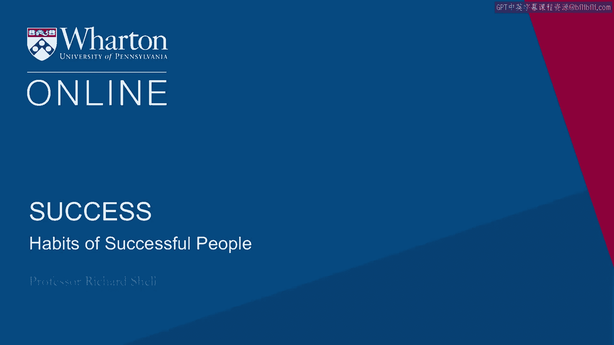
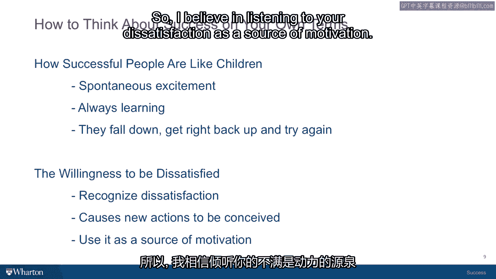

# 沃顿商学院课程《实现个人和职业成功》第15课：成功人士的两个习惯 💎

在本节课中，我们将探讨成功人士普遍具备的两个核心习惯。这些习惯能帮助个人整合内在满足与外在成就，从而走向更平衡、更充实的人生。

上一节我们介绍了源自个人内在的“四颗钻石”能力。本节中，我们来看看成功人士如何通过具体的思维与行为习惯，将这些内在能力转化为外在成果。

## 习惯一：自发的兴奋感与学习心态 🚀

成功人士的第一个习惯是，对他们所从事的事情抱有自发的兴奋与热情，并且倾向于从错误中学习。

这种习惯源于他们将内在生活的能量应用于外在生活。当遇到障碍、错误或失败时，这股内在能量能推动他们跨越难关。他们能够重新站起来，掸去灰尘继续前进，因为他们正在追求一个能带来内在满足感的目标，这本身就构成了强大的动力。

我们可以用一个孩子学走路的例子来理解：
> 我记得我的第一个儿子刚开始学爬行，然后尝试走路。他不断跌倒，撞到自己，但又会兴奋地爬起来继续走。孩子对于正在体验的自主性、行动力以及走路后能探索的广阔世界，怀有与生俱来的兴奋感。

**核心机制**可以概括为：
**内在能量 → 驱动外在成就 → 培养韧性 → 进入学习模式**

因此，习惯一的精髓在于，对你所做的事情保持那种**自发的兴奋感**。

## 习惯二：接纳不满的意愿 🔍

现在，我们来探讨第二个关键习惯：愿意感到不满。

在成功学和心理学领域，普遍存在一种强调“积极思考力量”的学派，认为每个人都应该保持积极和快乐，并将其视为成功的秘诀。但我并不完全认同。

根据我的经验，恰恰是在我对现状**最不满意、最不快乐**的时候，我才发现了做出改变、朝着更好方向前进的必要性和紧迫性。

当然，在遭遇挫折时，保持快乐和积极思考是有益的，它能帮助你确信自己的兴奋感将带你继续前行。但同样重要的是，当不满出现时，能够**识别并承认它**。

以下是可能引发不满的常见情况：
*   你对现任老板不满意。
*   你对所居住的社区不满意。
*   你对自己现有教育背景带来的机会不满意。
*   你对政治体系的运作方式不满意。

正是源于这些不满的时刻以及伴随的情绪，新的行动才开始被构想。你会开始思考：“鉴于这种不满，我该如何改进？我该如何迈向新方向？如何推动自己摆脱现状，进行一场有望让我变得更好的改变？”

我相信，**倾听你的不满，并将其视为一种动力来源**。我注意到，周围那些能以某种方式将内在与外在维度结合起来、在我看来算得上成功的人，通常具备这两个习惯。

以下是这两个习惯的具体表现：
1.  **韧性、兴奋感及跌倒后爬起的能力**：这是第一个习惯的体现。
2.  **倾听并尊重自己的不满**：他们将不满视为动力来源，然后开始寻找那些做得更好或做法不同的人，主动接触他们，获取关于如何改善自己生活的新想法。

本节课中，我们一起学习了成功人士整合内外生活的两个核心习惯：**保持自发的兴奋感并从错误中学习**，以及**将不满视为变革的动力并积极寻求改进**。掌握“四颗钻石”的内在能力，再培养这两个习惯，你将为个人与职业的成功奠定坚实基础。

接下来，我们将探讨一个令人惊喜的新主题。