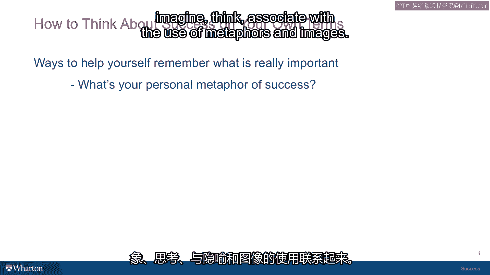
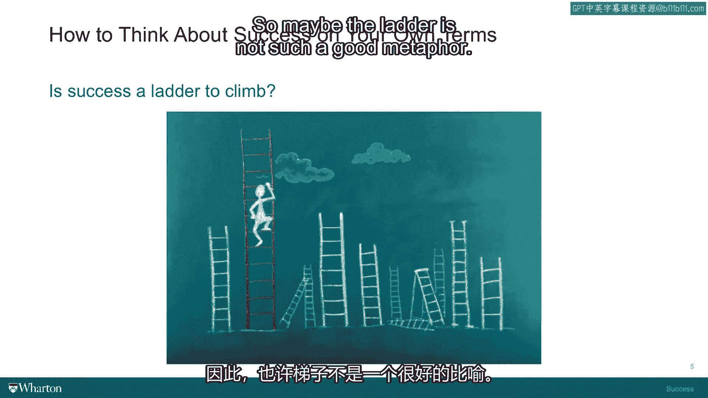
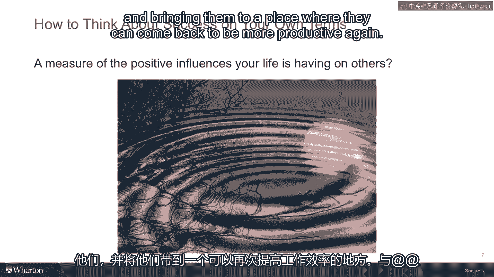
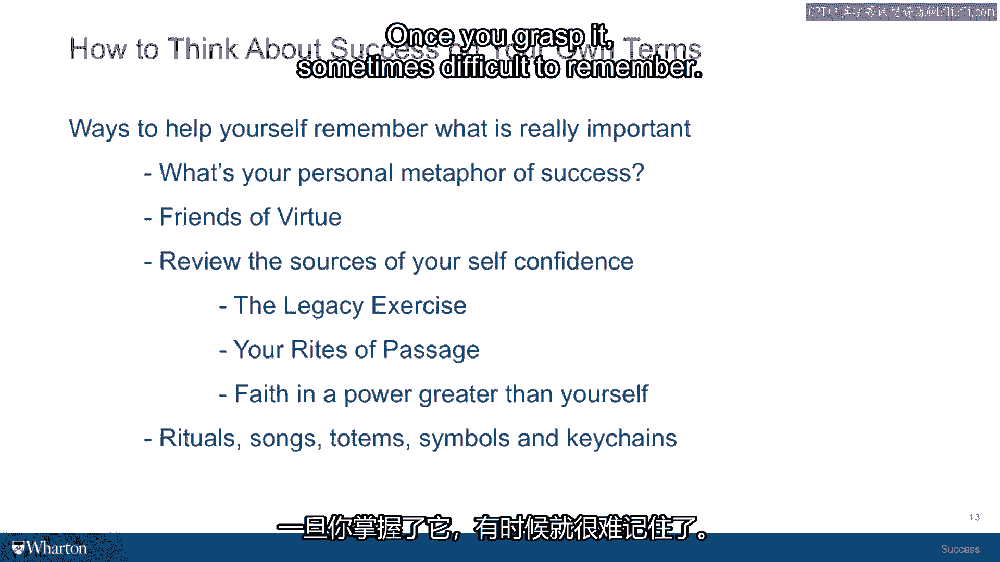

# 🧭 沃顿商学院《实现个人和职业成功》课程笔记 - P16：为什么你的成功价值观容易被遗忘

在本节课中，我们将探讨一个普遍存在的困境：即使我们经过深思熟虑，定义了自己独特的成功价值观，这些观念也常常被遗忘或淡忘。我们将学习如何通过建立有效的“记忆工具”来对抗这种遗忘，确保我们的行动始终与内心深处的价值观保持一致。

---

开始系统、审慎地思考“成功”对你而言的真正含义时，一个令人沮丧的部分是：即使你发现了自认为正确的答案，它似乎也转瞬即逝。你发现自己会忘记它，需要重新学习，并滑回过去所认同、但如今已知道并非最佳的那些价值观。

认识到这一点非常重要：成功人士拥有的另一个习惯是，他们明白自己很可能需要借助一些事物来记住自己是谁、要去往何方。他们会为自己量身定制并创造一些流程来帮助记忆。这并非偶然。

大多数主要宗教每周（有时甚至每天）都有固定的仪式，这并非巧合。原因在于，它们所教导的宗教价值观同样难以铭记、易于遗忘。因此，人们需要回到圣所、聆听布道或接触宗教符号，他们需要一遍又一遍地更新这种联系，才能让这些价值观在其生活中保持核心地位。

你为自己设计的成功价值观也是如此。

---

我想讨论四种不同的方法，帮助你记住自己的成功价值观。每一种方法既需要发挥你的想象力，有时也需要回溯过去。以下是几种评估方式，可以帮助你思考。

### 1. 运用隐喻 🪜

人类的大脑天生擅长通过隐喻和图像进行想象、思考和联想。最常用的成功隐喻是“梯子”。

“梯子”作为成功的隐喻无处不在，以至于人们常常忘记自己正在使用这个隐喻，并开始不自觉地用这个隐喻来交谈。例如，人们谈论“到达成功阶梯的下一级”、“达到下一个层次”、“攀登”等。本质上，“梯子”是地位的隐喻。

地位是外在生活的重要组成部分，因此它与成功并非无关。但如果你想对其拥有一定的掌控权，就必须理解隐喻的局限性。

请看这张一个人爬梯子的图片，看看你能否发现这幅图所暗示的局限性。这幅图缺失了一些东西，作为成功人生的隐喻，它感觉并不完整。

当我向高管和学生展示这幅图时，他们通常会立刻指出几点。我们来看看你发现了多少。

首先，**梯子有很多架**。那么这个人爬的是哪一架？为什么是这一架？梯子的形象可能是相当随意的。你可能在人生的某个阶段开始爬某一架梯子，然后就不再考虑其他可能的选择，只是继续爬你正在爬的那一架。但拉开一点距离看，你可能会意识到，对这个人来说，最好的行动或许是爬下当前的梯子，换一架更适合他的。

其次，人们注意到**梯子似乎就到头了**。当你爬到顶端时会发生什么？这个隐喻没有提供太多帮助。你爬到了梯子顶端，接下来该做什么？它缺乏连续性。

最重要的是，人们最终往往会注意到，**这个人完全是孤身一人**。只有一个人在爬梯子。但只要你稍微思考一下自己的生活，就会意识到这根本不符合生活的真实图景。没有人是独自完成任何事的。你始于某个家庭，生活在社区中，在学校有老师帮助你，一路上有导师、教练以及所有支持、激励、帮助你找到方向的人。而这些人都不在这幅图里。

如果这幅图想更真实一点，应该有一群人围绕在这个攀登者周围，欢呼、提供帮助，甚至递上不同的梯子。因此，记住任何令人满意的人类生活都离不开社会背景，这一点非常重要。而这幅图完全没有体现这一点。

所以，也许“梯子”并不是一个很好的隐喻。

### 2. 审视“竞赛”隐喻 🏁

另一个常见的隐喻是“竞赛”。许多来到沃顿商学院的学生竞争意识很强，他们想赢。他们在高中“赢了比赛”，在大学也“赢了比赛”，作为MBA学生，他们试图在找最佳工作的“比赛”中获胜。许多人将成功本质上建模为胜利和获胜。

这本身没有错。竞争能量非常强大。如果引导得当，它能让你早起，为你参与的活动增添活力和紧迫感，并带来乐趣。我并不是说竞争不好。

同样，如果你退后两步，将这个隐喻视为一种成功理论来审视，可能会发现一些问题。这未必是你想作为人生基础的压倒性理论。

当我向高管和学生展示这幅图时，他们几乎立刻意识到：**要有人赢，就必须有很多人输**。那么，击败一大批其他人，真的是你成功的必要条件吗？许多人在思考后会说，并非如此。他们喜欢赢，但不必以他人失败为代价。

当然，这里还有另一个问题，它与“梯子”的问题类似：**你选择参加哪场竞赛**？如果你是短跑运动员、马拉松跑者或竞走运动员，你必须选择适合你个性、技能、耐力和激情的比赛，否则你会感到非常沮丧。

最后，如果你对竞争缺乏一些洞察，不惜一切代价只求获胜，你将会破坏许多关系，让很多人受伤，并在你周围制造大量怨恨，这绝非成功人生的最佳条件。

因此，你必须持有一种视角：获胜更像是一场游戏。有时你赢，有时你输。与你竞赛的人同样投入，并抱有同样的态度——更多是为了乐趣和能量，而非关乎他们作为人的价值，无论输赢。为这个隐喻添加这些维度后，它或许会变得有帮助。但你可以看到，如果你没有意识到自己的动力几乎完全来自“获胜”这个隐喻，它可能会阻碍你，让你陷入不想处的境地。

### 3. 探索“涟漪”隐喻 🌊

我再给你第三个隐喻，因为你的真正任务是找到适合自己的那个。我只想用几种不同的思路来启发你如何思考这个问题。

请看这幅图像：一个池塘，有人刚刚向里面投了一颗石子，结果产生了这些从石子落点向外扩散的同心圆。这可能是一个人的成功意象，他将成功视为对周围人产生的积极影响的数量或程度，并且他施加于某人的每一个积极影响，都会为那个人对他人产生积极影响创造条件。

因此，如果你通过帮助、指导、提供信息或灵感、在他人受苦或低落时给予安慰并帮助他们恢复生产力等方式，启动了一个积极影响，这些涟漪可以传播得很远。

这与“梯子”有些不同，你不是在向上或向下，而是在**扩散**。这个持续运动所蕴含的能量，远比赢得一场比赛然后筋疲力尽地躺下要多，因为这种能量会自我更新、自我增强。

多年来，我在向不同受众教授这个主题时，曾挑战公立学校教师、公共安全人员、医疗保健组织人员，现在我也挑战你：**思考一个适合你的隐喻**。一个深思熟虑、能体现最佳自我的隐喻。

我认为，一个好的成功隐喻能帮助你记住目标，因为你可以自问：我处在正确的位置吗？我正在做我应该做的事吗？因为我能感受到今天的活动与我为自己创造的成功隐喻之间的一致性。

有人建议用“指南针”的图像来帮助人们找到方向。一位高中田径教练曾表示他喜欢用“指南针”这个隐喻。一位学前班老师说，她的成功意象是非洲一棵巨大的遮荫树，整个村庄可以在树下聚集、创建社区、自我更新并躲避烈日。这就是她认同的自己应该所处的位置，也是她所做事情的意义。

所以，你的挑战是：**找到你自己的隐喻**。把它写下来，思考它，与你的朋友、爱人讨论它，看看能否进一步完善它。

---

上一节我们探讨了如何运用隐喻来具象化和铭记成功价值观。接下来，我们看看第二个重要的记忆工具。

### 4. 借助社交圈的力量 👥

这实际上引出了第二个用于记住和更新成功理论的工具：你的**社交体验**，即你选择围绕在自己身边的人。

如果你选择与那些不认同你的价值观、抵制或与你的价值观竞争、或轻视你价值观的人为伍，那么忘记这些价值观、迷失在你所在社交群体所认同的价值观中，就会容易得多。

因此，我认为非常有帮助的做法是，非常有意识地选择你的社交群体，使其成为对你价值观的强化体验，而不是妥协。当你还是个孩子时，你的父母可能想确保你和“对的人”在一起。他们关心这一点，部分原因不仅是为了你的安全，也是希望你与那些他们作为家庭领导者所认同的价值观的人交往。

现在你离开了家庭圈子，这些选择由你自己做出。明智地选择你的社交圈子非常重要。

亚里士多德曾在他的书中（这也是我们在成功课程中讨论的主题）定义了三种友谊。我认为这可以很好地诊断你与朋友的关系。

亚里士多德提到的三种朋友是：
*   **快乐型朋友**：基本上，这是你喜欢一起玩乐的人。
*   **功利型朋友**：这是你为了完成工作或推进某个外在目标而交往的朋友。

这两种友谊都很有帮助，可以为你提供良好的社交网络。但正如亚里士多德所认为的，社交关系的真正回报在于找到并珍惜他所谓的 **“美德型朋友”**。

美德型朋友是那些真正希望你最好的人。当你和他们在一起时，能激发出你最好的一面。他们是那些能温和地提醒你最重要的价值观、在你开始偏离时给予一点指导的人。同时，他们自己也与你所尊崇的美德产生共鸣并身体力行。

那么，你有多少美德型朋友？通常不会很多。他们往往是那些与你共同度过生命中非常重要阶段的人，在你经历危机或冲突时了解你，并在你转型期间一直陪伴你。你了解他们的故事，他们也了解你的故事。你们是共同更新的人。

检验一个美德型朋友的好方法是：即使有一段时间没见，当你打电话时，对话一开始，你们就能立刻接上上次中断的地方。你们彼此非常了解，无需寒暄，也无需通过询问工作等来重新建立功利型友谊的正式感。你们都知道对方生活中正在处理的最重要问题，并以此作为彼此联系的一部分背景。

不同的人有不同的社交容量，但也许你的生命中有三四个美德型朋友。他们可能是你的父母之一、童年好友、大学室友，也可能是你的配偶。我认为，如果你的生活伴侣是美德型朋友，那将是一起度过人生的非常特别的组合。

所以，**让自己身边围绕着那些能更新和提醒你价值观的人**。这是第二个非常重要的工具。

---

我们已经介绍了通过隐喻来定义成功，以及通过美德型朋友来巩固价值观。接下来，我们看看第三个关键工具：如何恢复个人自信。

### 5. 更新个人自信的源泉 💪

我们都有状态起伏的日子。当我们处于低谷时，会失去自信。本质上，我们是对自己已认同的根本成功价值观失去了信心，开始觉得生活失去了以往的意义、方向或活力。每个人都会遇到这种情况。

你如何更新自信的源泉，让自己重新朝着已知最适合你的方向前进呢？在成功课程中，我们使用了一个练习，我想在此提供给你。这是一个可供下载和完成的练习，是一个相当简单而深刻的思考活动。

在课程中，我们谈到一位名叫马可·奥勒留的罗马皇帝。他生活在公元二、三世纪，是一位伟大的将军，大部分时间在法国为罗马人民征战。但他也是一位哲学家。有一天，他开始写日记，最终形成了一份他称之为《沉思录》的文件。这基本上是一本日记。

在这本日记的第一篇里，他列出了迄今为止生命中所有赋予他遗产、促成他成功的人。他谈到一位叔叔、一位老师、他的父亲、他的母亲。他描述了这些重要人物传递给他的每一项重要品质，正是这些品质让他成为一个能够思考自己生活、并拥有有意义人生的人。

我们称之为 **“遗产练习”** 。如果你在我们分享的课程间隙看一看，你会发现其中包含关于生活的一整套经验：如何去爱与被爱、如何设定目标、如何表达感恩等等。

我挑战你去做的是：思考你生命中那个赋予你某种美德或实践知识、使你得以成功的人。花点时间回忆一个关于那个人的故事，将他们带入你的记忆，并对他们给予你的一切心存一丝感激。累积起来，当你想到这些人赋予你的所有“资产”时，你的自信往往会开始回归。因为你意识到，你拥有比你想象的更多的东西，他人已经给了你很多礼物来帮助你前行。

因此，通过思考你如何成为今天的你，“遗产练习”可以成为更新自信的好方法。在此额外建议我的学生多做一步：完成练习后，你可能会发现名单上有些人你最近没有感谢过，或感谢得不够。没有什么比给他们发一封邮件、打个电话、安排一次联络，向这些赋予你遗产的人表达感激之情更能让你感觉良好了。这也会作为最后一步，帮助你更新自信。

更新自信的第二个工具是：**记住你生命中的“通过仪式”和艰难时刻**，那些你坚持不懈并最终度过的难关。基本上，那些没有击垮你的经历常常让你更强大。人们回顾生命中在军队服役、或在学校、关系中经历特别艰难的个人危机时期，他们设法挺了过来。他们记得那种让自己度过那个“通过仪式”的能力感，重温这种感觉可以推动你重新掌控当前的处境。

最后，对一些人来说，提醒自己拥有一个比自己更强大的信仰和力量。无论你如何定义它——是用宗教术语，还是用你在自然伟大图景中的位置、生命的连续性、生命之轮来定义——如果你有办法更新那种信仰，这通常是一种将自己交托给那个比你更强大的力量的方式，并更新那种源于感到有更强大的力量在关注你、在你挣扎度过人生挑战时支持你的自信。

---

我们已经探讨了你的隐喻、美德型朋友以及各种更新自信的工具。最后，我发现非常有用、我的学生也反馈很有帮助的一点是：**拥有一些更新仪式**。

可以是一首体现你价值观的歌曲。学期结束时，学生们经常会汇编一个歌单，刻录CD或在网站上收集歌曲，这些歌曲是他们每个人对成功的“主题曲”。这可能是一个非常迷人的音乐集合，因为对有些人来说是说唱歌曲，对有些人来说是感伤民谣，对有些人来说是宗教仪式歌曲。

还有一些能更新你能量的事物、符号。例如，我曾有一个学生，脖子上总是戴着一条项链，上面系着一个小木制物件，像是一种他随身携带的图腾。我问他那是什么，他说高中时他曾去一个中美洲国家，帮助一个村庄建造学校。他整个夏天都和那个团队在一起，建好了学校。期间，他与村里一些即将使用学校的孩子建立了深厚的友谊。其中一个孩子送给他这个与那个国家及其本土动物相关的小符号作为礼物。他决定从此一直戴着它，以提醒自己人生的首要目标：帮助发展中国家的人们，为那些没有机会的人带来机会和教育。

这是一位在沃顿商学院的学生，显然周围充满了各种权力、成功地位和财富的象征。而他提醒和更新对自己成功价值观承诺的方式，就是把它戴在脖子上。所以，这可以成为一种非常强大的仪式性记忆方式。

无论什么对你个人有效——我的办公室里到处都是乌龟，我的公文包上也有乌龟。我非常喜欢乌龟。这是一个象征，因为乌龟长寿、耐心、智慧。我的妻子非常喜欢大象，所以我们家里有很多大象。大象同样耐心、温和、忠诚且非常注重家庭。因此，我们尝试用身边的小符号来体现我们的价值观。

---

成功一旦领悟，有时也难以记住。因此，我们刚刚讨论的这些工具，每一个在你的生活中可能扮演不同的角色，但一项非常重要的练习是：识别它们，让它们靠近你，珍视它们，以帮助你记住你是谁，以及你要前进的方向。