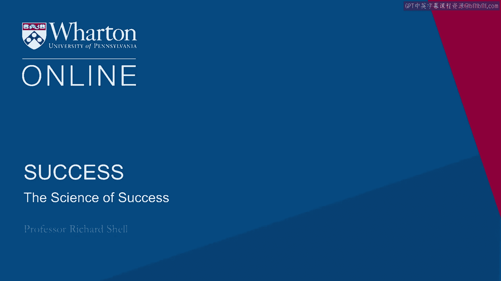
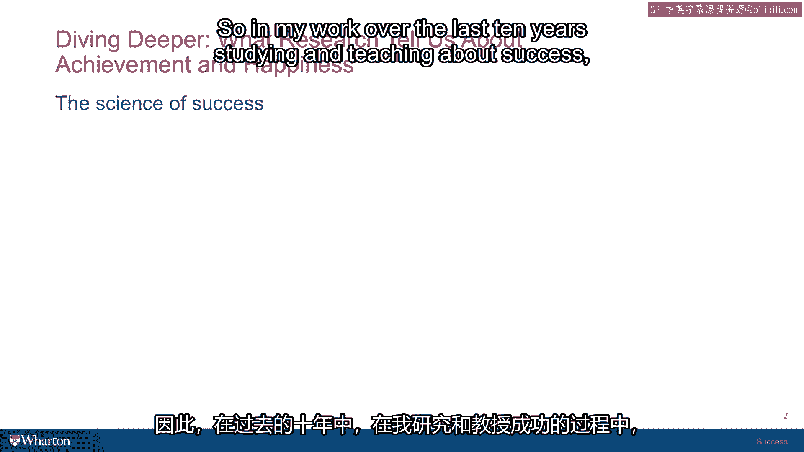

# 课程18：成功的科学 🧪

## 概述

在本节课中，我们将探讨关于成功的科学研究。我们将分别审视构成成功的两个核心部分——内在生活（幸福）与外在生活（成就），并了解传统智慧如何与现代社会科学的研究发现相互印证。

---

欢迎回到我的办公室。很高兴见到你。我非常感兴趣并渴望与你探讨一个极其重要的话题，这个话题将让我们有机会了解一些研究如何揭示关于成功两大范畴的奥秘。

这两个范畴分别是内在生活与外在生活。外在生活侧重于**成就**，而内在生活则侧重于**幸福**。

我是一名律师，并非社会科学家。但我深入研读过哲学与心理学，并有幸在一个充满社会心理学与社会科学氛围的环境中工作。

在宾夕法尼亚大学和沃顿商学院这样的地方，其一大益处就是有大量研究专注于与成功学相关的诸多课题。

最值得注意的是，在宾大，我们拥有由马丁·塞利格曼领导的正向心理学中心。安杰拉·达克沃斯等人对幸福的研究已超过十年。我参加他们的研讨会，有幸从他们那里学习到各种不同的研究发现。

当然，在沃顿商学院，也有相当多的人研究成就的科学。因此，我非常荣幸能与亚当·格兰特合作，他是我们顶尖的管理学教授之一，专注于付出、原创性与创造力的研究。

所以，虽然我不是科学家，但我对成功的科学确实有一些了解。我希望能与你分享这些，不仅因为它有趣，更重要的是，它将帮助你更好地理解这两个“盒子”底下真正的内涵——幸福之盒与成就之盒，并开始理解其运作机制，以及如何更有效地思考这两个主题。

---

在过去的十年里，我致力于研究和教授成功学，其中一个最有趣的发现是：大量传统的“如何成功”类书籍，尽管当初并非基于科学，但其观点却被现代社会科学所验证。

在美国，我们的文化一直专注于成功。第一本名为《成功》的杂志在19世纪末出版。在20世纪20、30年代，有许多人撰写了至今仍在销售的优秀书籍。

其中几本包括戴尔·卡内基在1930年代所著的《人性的弱点》。这本书深刻揭示了自尊对人们的重要性，以及如何建立友谊——主要是功利性的友谊和工作关系，并在传达如何做到这一点上非常有效。

成功学文献中的另一部经典是由拿破仑·希尔所著的《思考致富》。这个书名非常引人深思。但它真正关乎的是**可视化**、**相信自己**，以及后来被称为“精神力量”的成功理论。

事实证明，现代认知心理学，例如斯坦福大学心理学家卡罗尔·德韦克等人的研究，已经表明以某种方式相信自己——她称之为**成长型思维模式**——绝对是关于如何放大人生成功的一个可靠的社会科学发现。

现今的多数运动心理学也是如此。如果你观看奥运会，当运动员准备从山顶滑下进行滑雪回转比赛时，你会观察到他们。他们站在山顶，闭上眼睛，身体来回摆动。他们正在脑海中预演整个赛道，想象每一个转弯。这正是拿破仑·希尔在谈论运用心灵和心灵的力量为自己可视化未来时所描述的情景。

因此，一个有趣的事实是：基本的“如何成功”类书籍，被证明比人们预期的要正确得多。

[空白音频]

---

## 总结

本节课中，我们一起学习了成功的科学框架，区分了以幸福为核心的**内在生活**和以成就为核心的**外在生活**。我们了解到，许多经典的成功学理念，如**可视化**（`mental imagery`）和**成长型思维模式**（`growth mindset`），已得到现代社会科学研究的支持与验证。这为我们更科学、更有效地追求全面成功奠定了认知基础。