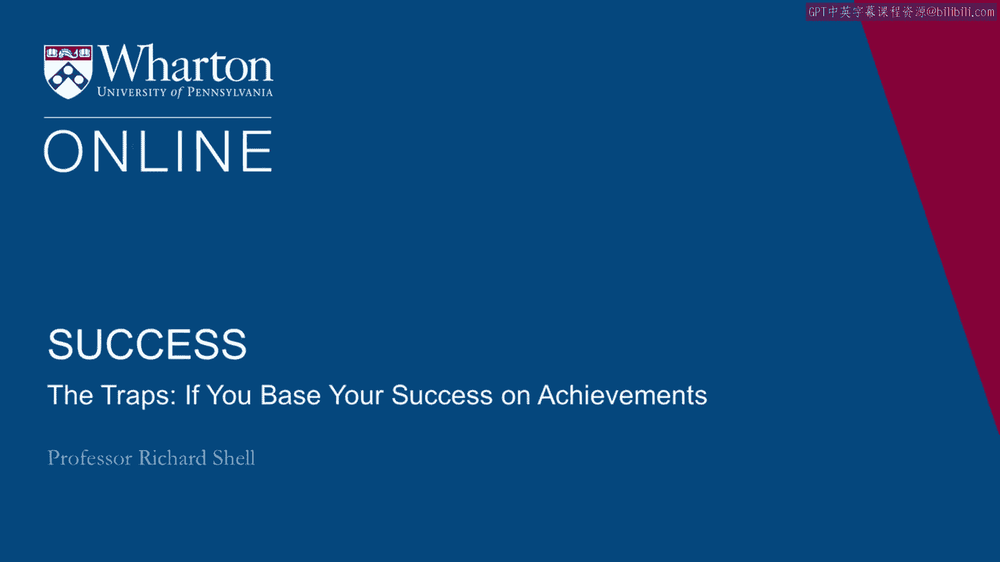
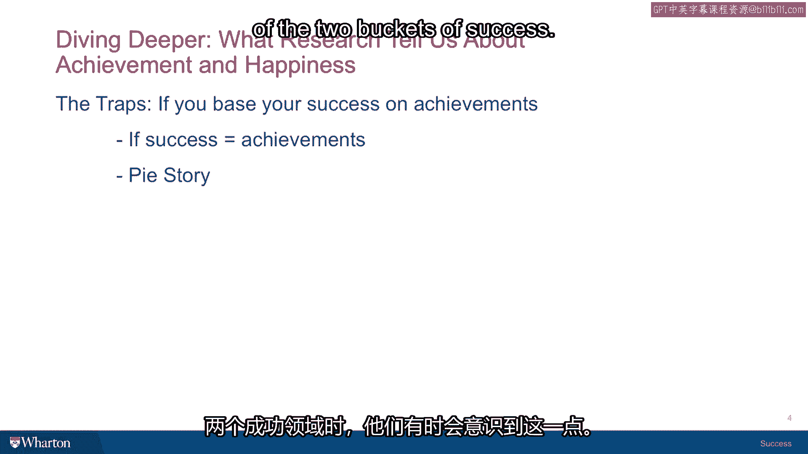

# 🎯 课程19：将成功建立在成就上的陷阱

在本节课中，我们将探讨一个普遍存在的成功观念：将成功等同于个人成就。我们将分析这种单一价值观可能带来的问题，并通过一个真实故事来理解为何许多高成就者反而感到不满足。

---

## 📚 关于成功的科学

成功科学主要研究如何获得成功。

它通常意味着如何达成目标。结合本课程，我们会为你提供一份经典的、关于如何成功的书单。

但这不是本课程的核心。本课程旨在探讨你对“成功”一词的定义。

因此，在接下来的几节课里，我们将讨论：如果你将成功建立在某些特定价值观上，可能会遇到哪些问题和复杂情况。这些麻烦源于你只依赖一种价值观，而忽视了其他。

我们将从“成就”开始，然后再讨论“幸福”。

---

## ⚠️ 如果将成功完全定义为成就

如果你决定孤注一掷，将成功完全定义为你所取得的成就，会发生什么？这似乎是一个显而易见的选择，也像是大多数人所追求的。

但如果成功基本上等同于成就，这里有一个问题：**为什么许多高绩效人士常常感觉糟糕？**

结果往往是家庭破裂、关系疏远、抑郁、药物滥用。那些痴迷于成就导向的人，最终常常陷入非常糟糕的境地。

我认为原因在于，他们实际上没有将成功的内在面与外在面结合起来。他们把所有的“赌注”都押在了一边。

---

## 📖 一个律师的顿悟故事

几年前，沃顿商学院有一位演讲者分享了一个非常有趣的故事，关于一个想明白这个道理并重新定位自己生活的人。我想与你分享这个故事，因为它很好地总结了人们有时会有的顿悟时刻——当他们意识到自己在成功的两个维度上，过于偏重了其中一个。

故事的主人公是一位企业家，他在美国东南部的乔治亚州和南卡罗来纳州经营着一系列庞大的业务。当他的公司还很小时，他聘请了亚特兰大一家律师事务所的律师作为外部法律顾问，帮助他建立公司。

随着公司发展，他终于意识到需要一位律师全职加入公司，作为内部法律顾问。于是他去找亚特兰大律师事务所的那位朋友，问道：“你能推荐一个人来当我们公司的内部律师吗？”

那位律师说：“让我想想，回头联系你。”

几天后，这位亚特兰大的律师再次出现在企业家的办公室，他说：“我找到了担任你们内部律师的绝佳人选。”

企业家问：“是谁？”
他说：“是我，我来做。”
企业家说：“我可能付不起你在律师事务所的薪水，算了吧。”
律师说：“我不在乎你付多少钱，你给我多少我都接受。我想和你一起工作。”
企业家问：“你为什么想这么做？”

他说：“在你问这个问题之后，我回家仔细思考，得出了这样的结论：我在高中拼命学习，为了进入一所好大学；我在大学拼命学习，为了进入一所好法学院；然后我在法学院拼命学习，为了进入一家顶尖的律师事务所；现在我又在这家律师事务所拼命工作，成为了合伙人。”

“我突然意识到，我一直参加的是一场盛大的‘吃馅饼比赛’，而且我一直在赢。但每次我赢，奖品总是一样的，奖品总是**更多的馅饼**。”

他说：“我厌倦了吃馅饼。我想加入你，一起建设你的公司，做我喜欢做的事，并从中获得一些乐趣。”

于是，企业家雇佣了他。上班第一天，这家伙出现了，他穿着夏威夷衬衫，准备开始工作。他依然是之前那位出色的律师，但对于**为何工作**以及**如何工作**，他有了全新的态度。

---

## 🔄 成就的循环性

这个故事揭示了成就可能具有的循环性。如果你不清楚自己在追求什么，你最终只会像旋转木马一样重复循环。

你只是去达成别人所说的成功目标：一个学位、一份有地位的工作。但如果这就是全部，到头来，你只会得到**更多的馅饼**，而这并不会带来真正的满足感。

[空白音频]

---

## ✅ 本节总结

本节课中，我们一起学习了将成功狭隘地定义为“成就”可能带来的陷阱。我们看到了，如果只关注外在成就而忽视内在满足，即使不断“获胜”，也可能陷入空虚和不满足的循环。成功需要平衡内在价值与外在成就，而不仅仅是无休止地追逐下一个“馅饼”。