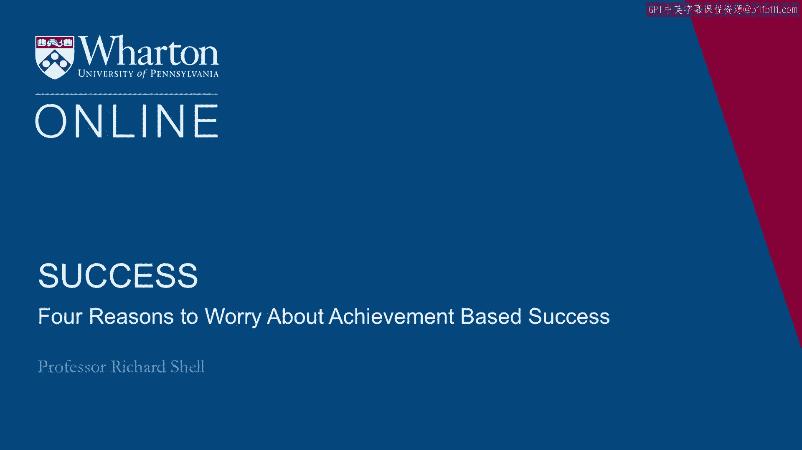
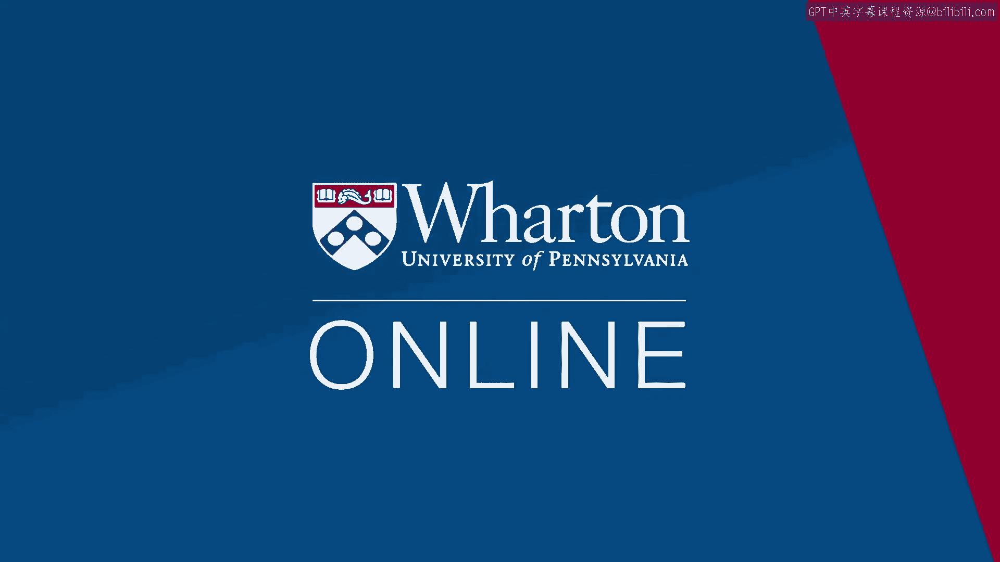

# 🎓 沃顿商学院课程笔记 P20：警惕“基于成就的成功”的四个陷阱

在本节课中，我们将探讨一个核心问题：如果我们将成功的定义完全建立在“成就”之上，可能会遇到哪些问题？课程指出了四个主要的陷阱，并引用了史蒂夫·乔布斯的演讲来强调追寻自我目标的重要性。

---

## 📌 概述：成就的相对性与陷阱

上一节我们讨论了成功的不同维度。本节中我们来看看，如果仅仅将成就视为成功的唯一标准，可能会面临哪些挑战。以下是基于成就的成功理论需要警惕的四个理由。

---

## 1️⃣ 所有成就都是相对的

第一个问题是，所有成就都具有相对性。我们在生活中经常看到这种现象。

例如，许多在高中名列前茅的学生进入沃顿商学院后，发现自己身处一群同样曾是毕业致辞代表或SAT满分获得者之中。突然间，他们觉得自己过去的成就显得微不足道。

美国幽默作家H.L.门肯有一句名言，精辟地概括了这个问题：“财富就是任何比连襟收入高的收入。”这就像美国郊区“与邻居攀比”的故事。

**核心概念**：如果你的自我价值感建立在成就比较上，那么总会有人比你成就更高、拥有更好的车、更大的房子、更多的银行存款，或享受更奢华的假期。

因此，要警惕将相对论应用于成就衡量。这很可能不是衡量成功人生的稳定方式。

---

## 2️⃣ 选择错误的“池塘”

第二个问题是，非常有才华的人常常选错了“池塘”。

这是什么意思？因为成功感是相对的，你会通过与周围人的比较来衡量自己的成功。

如果你选择了一个糟糕的“池塘”，周围都是你认为比你优秀、且你无法追赶的人，那么你将不再感到成功。事实上，你可能会逐渐变得沮丧。

在宾夕法尼亚大学，一些学生就会遇到这种情况。他们突然发现自己置身于众多优秀的高中毕业生之中。第一学期结束后，他们的成绩不如高中时出色，因为在高中他们不费吹灰之力就能名列前茅。在这里，他们发现自己第一学期的课程成绩平平。

这种对自尊的打击如此巨大，以至于他们选择了放弃。他们认为自己无法取胜，于是停止了努力。当然，一旦停止努力，他们就失去了任何获胜的机会，最终以非常平庸的方式度过大学生涯。

其实很简单，如果他们当初选择了一个不同的“池塘”——不是庞大的常春藤盟校，而是一个能获得更多关注、更能脱颖而出的规模较小的学院——他们未来的选择机会可能是一样的。美国有许多非常优秀的小型院校。

那样，他们会感觉自己身处合适的“池塘”，成为“小池塘里的大鱼”，保持高度自信，受到激励并表现出色。

有时人们认为无法选择“池塘”，但事实并非如此。如果你担心自己的成功价值观，思考自己真正想实现什么、人生应如何运作、如何平衡幸福与成就，那么选择“池塘”是一个非常重要的决定。选择一个大小合适的“池塘”所带来的满足感，远胜于盲目追求最负盛名、但进入后却感到痛苦的“池塘”。

所以，这是第二个陷阱：你必须选择正确的“池塘”，而人们常常选错。

---

## 3️⃣ 成就追求者可能是“饿鬼”

第三个问题是，有时成就追求者本质上是强迫性的。他们只知道如何获取成就。

他们被贪婪（积累更多财富）、骄傲（获取更多权力或重要性）、控制他人等欲望所驱动，并且永不满足。

因此，无论每天醒来，他们都被同样无法满足的动机驱使，去积累更多、获得更大影响力、寻求更好的自我感觉。

这类人有一个名字。笔者曾在亚洲一些佛教寺院学习，了解到佛教神话中一种非常可悲的存在，叫做“饿鬼”。

“饿鬼”是指那些在生前放纵所有欲望、在追求权力、金钱、地位和赞赏等欲望满足方面贪得无厌的人。这些人死后会转世为饿鬼。

饿鬼是一种灵体，身体大如象，嘴巴却小如针尖。因此，在无尽的轮回中，他们永恒的追求就是平息这种可怕的、令人痛苦的饥饿感，因为他们永远无法吃饱，哪怕获得一丝满足感。

在佛教的观念中，他们转世到这种永恒饥饿的可怕境地，正是因为在生前（即我们正在经历的人生中）无止境地追求那些无法满足的欲望。

所以，如果你在生活中看到任何“饿鬼”——可能是一个永远觉得不够重要的老板，或者一个总是渴望更多关注的人，亦或是不断挣扎着获取更高地位或更多金钱、永不停歇、甚至践踏周围人以达到目的的人——请不要嫉妒，而是感到怜悯。因为这些行走在我们中间的“饿鬼”，生命对他们来说来来去去，但他们永远无法获得满足。

这是人们可能陷入的第二个陷阱。

---

## 4️⃣ 追求他人设定的目标

第四个理由是，如果你将所有成功价值都押在成就上，可能会在某天醒来时意识到，你实现的并非自己设定的目标，而是他人为你设定的目标，而你甚至没有察觉。

当一个人努力寻求家庭认可时，这种情况就可能发生。例如，父母一直希望他成为一名医生，他历经艰辛读完医学院，然后某天醒来，却疑惑自己为何成了医生，甚至并不喜欢这个职业，结果发现只是为了取悦父母。

也可能是因为他们与一位导师关系密切，导师给了他们一个目标，他们便不再思考这是否真正适合自己，只是一味地试图取悦导师。

笔者在大学时有幸师从小说家安东尼·伯吉斯（《发条橙》作者）。在一次辅导中，他给笔者布置了一项作业：“你想学习写作？你应该写一些诗剧。”并建议基于短篇小说改编。

这是一项非常复杂的任务。笔者最终花费数月时间创作了几部基于詹姆斯·乔伊斯小说的诗剧，作为毕业论文。虽然现在看，那次练习有其价值，但当时完成后，只感到彻底的空虚，没有满足感，没有成就感，只有疲惫。

笔者认为，这就是当你为实现他人的目标而努力，却没有真正意识到自己为何这样做时，有时会发生的情况。

---

## 🍎 史蒂夫·乔布斯的启示：追随内心

这里想分享一段苹果公司联合创始人史蒂夫·乔布斯2005年在斯坦福大学毕业典礼上的演讲。在这段演讲中，他给出的核心建议之一，正是停止追求他人的目标，开始规划并踏上实现自我设定目标的旅程。

**演讲核心摘录与总结：**

乔布斯讲述了三个故事：

1.  **关于串联点滴**：他从里德学院辍学后，旁听了书法课，当时看来毫无用处。但十年后设计第一台Macintosh电脑时，这些知识被用上，使Mac拥有了优美的字体排版。这说明了**相信直觉、串联人生点滴的重要性**。
    > “你无法预先把点点滴滴串连起来，只有在未来回顾时，你才会明白那些点点滴滴是如何串在一起的。”
2.  **关于爱与失去**：他在30岁时被自己创立的苹果公司解雇。这虽然痛苦，却让他摆脱成功重负，以新手心态进入人生最具创造力的阶段，创立了NeXT和皮克斯，并最终回归苹果。这说明了**热爱所做之事是坚持下去的唯一动力**。
    > “我确信让我一路走下来的唯一动力，就是我热爱我所做的事。”
3.  **关于死亡**：17岁起，他每天都会问自己：“如果今天是我生命中的最后一天，我还会想做今天要做的事吗？”罹患癌症的经历让他更深刻地认识到，**记住自己即将死去，是避免患得患失、追随内心最好的方式**。
    > “你们的时间有限，所以不要浪费时间活在别人的生活里。不要被教条所困——那等于活在别人的思想结果里。不要让别人的意见淹没了你内在的心声。最重要的是，要有勇气追随你的内心与直觉。”

他的结束语是：“**保持饥饿，保持愚蠢。**”

---

## 📝 总结

本节课我们一起学习了将成功完全建立在成就之上可能面临的四个主要陷阱：
1.  **成就的相对性**：比较会带来不稳定的满足感。
2.  **选择错误的“池塘”**：环境比较会影响自我认知和动力。
3.  **成为“饿鬼”**：被永不满足的强迫性欲望驱使。
4.  **追求他人目标**：在无意识中实现了别人的期望，而非自己的理想。

史蒂夫·乔布斯的故事强有力地提醒我们，真正的满足来自于**追随自己的内心与直觉，为自己设定的目标而努力**，而不是盲目追求外部的成就指标或他人的认可。警惕这些陷阱，有助于我们建立更健康、更个人化的成功定义。