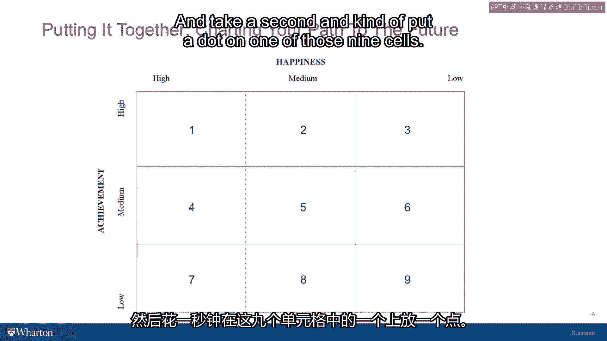

# 沃顿商学院课程《实现个人和职业成功》第22课：整合一切 🧩

在本节课中，我们将回顾整个课程的核心内容，并通过一个简单的自我评估练习，帮助你整合所学知识，衡量当前状态，并规划未来的成功路径。

很高兴再次与你在费城沃顿商学院的办公室相聚。

这是我们最后一个主题单元。我们共同开启这段课程旅程时，首先审视了你所继承的成功价值观。

我们进行了一项名为“六种人生”的练习。

你有机会选择六种不同的人生片段，判断哪一种生活或多或少更为成功。

我们探讨了这些价值观的来源——你的家庭、文化，以及如何将自己从这些固有假设中分离出来的问题。这样你才能获得更广阔的视角，开始掌控激励你的价值观，将它们置于面前并做出选择。

随后，我们探讨了如何具体化和个性化你对成功的追寻。

这包括思考你的能力，以及思考你多年来养成的习惯。这些习惯让你能在跌倒时重新站起，让你能处理不满情绪并从中获得动力，让你在认为自己可以改进时受到激励。

在上一节课中，我们深入探讨了成功的两个维度。

即内在生活（幸福）和外在生活（成就），并更深入地挖掘了这两个生活层面的实际内涵。我们发现，如果以恰当的方式思考，它们有时可能令人失望，但清晰的认知有助于你理解和诠释自己的经历。

在这最后一节课，也是最后一个单元中。

我们将致力于帮助你**衡量当前在成功旅程中所处的位置**，并开始规划未来的道路、下一步行动、你瞄准的目标，以及你可能开始朝那个方向迈进的途径。

我认为我们已经准备好开始工作了。我准备了另一项评估。

另一个小谜题供你解答。请看你屏幕上将出现的三乘三矩阵。

我请你审视那九个格子，并决定你在这个矩阵中的位置。其中垂直维度代表你的**成就**，水平维度代表你的**幸福**。请基于你当下的状态进行判断。

将此视为一个类似除夕夜的时刻，你正试图评估当前的生活状况。你感知到的成就水平是低、中还是高？

你感知到的幸福水平是低、中还是高？

请花一点时间，在这九个格子中的某一个里标记一个点。

我曾与许多人进行过这个练习，并根据他们为何将点标记在特定格子的陈述，得出了一些非常有趣的结论。

因此，我想引导你了解这个过程，以及当人们将自己定位在某个格子时，他们通常在想些什么。之后我们将继续推进。

---

**本节课总结**

在本节课中，我们一起回顾了整个成功课程的核心框架：从审视继承的价值观，到个性化定义成功，再到深入理解幸福与成就两个维度。最后，我们通过一个简单的**自我定位矩阵**练习，帮助你整合所学，评估现状，并为规划未来的成功路径做好准备。