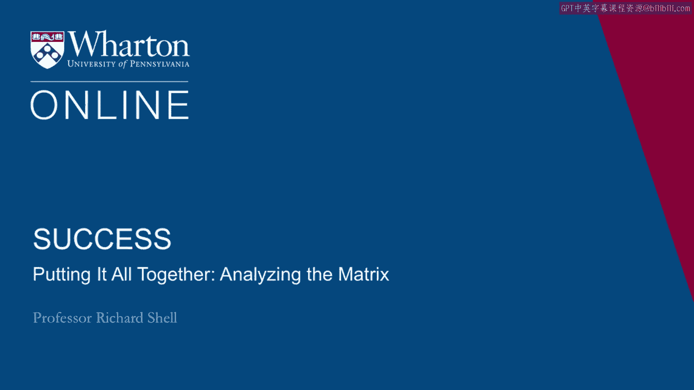

# 课程23：成功分析矩阵 🧩

在本节课中，我们将学习一个用于评估个人成功状态的工具——成功分析矩阵。这个工具没有标准答案，旨在帮助你了解自己当前对成功两个维度的感知：内在生活（幸福感）与外在生活（成就）。

---

## 矩阵结构介绍

上一节我们提到了成功包含内在与外在两个维度。本节中，我们来看看用于评估这两个维度的具体工具——一个九宫格矩阵。

这个矩阵由两个维度构成：
*   **水平维度（X轴）**：代表**幸福感**，从左（最高）到右（最低）。
*   **垂直维度（Y轴）**：代表**成就**，从上（最高）到下（最低）。

矩阵的九个格子各有编号。阅读顺序为从左至右，从上到下。

以下是矩阵的布局描述：
*   顶部一行（格子1、2、3）代表**高成就**，但**幸福感水平递减**。
*   最左侧一列（格子1、4、7）代表**高幸福感**，但**成就水平递减**。
*   其他格子则代表了幸福感和成就不同组合的中等水平。

---

## 如何进行自我评估

了解矩阵结构后，现在我们来学习如何使用它进行自我评估。

操作非常简单：仅基于**今天、此刻**的感受进行总结，用笔在其中一个格子里点一个点，标记出你对自己生活状态的定位。

这个练习能让人们有机会评估生活中哪些方面进展顺利，哪些方面可能需要改进。每个人的感知不同，标记的点位置也不同。

通常，位于矩阵外围的格子（如3、6、9、8、7）被选择的频率最低。大多数人最终会将点标记在格子1、2、4或5，其中**格子5（中等幸福感与中等成就）是最常见的选择**。

---

## 不同格子的含义解读

在标记了点之后，理解不同位置所代表的含义至关重要。以下是不同格子所反映的典型心态：

*   **格子1（高成就 & 高幸福感）**：选择此处的人通常对生活感到非常积极。他们可能天生拥有积极的性格和心态，倾向于每天都将自己的处境视为“格子1”的生活状态。
*   **格子2或4（高成就 & 中等幸福感 或 高幸福感 & 中等成就）**：选择这里的人，通常是为了激励自己在某个生活维度上向前迈进。他们可能正期待职业生涯的下一步、某个新项目的成功，或是人际关系的新发展，并相信达成后幸福感或成就水平会提升。
*   **格子5（中等成就 & 中等幸福感）**：处于此位置的人基本感到满意，并愿意向任何方向努力。这是一个有趣的状态，因为当你在两个维度上都处于中等水平时，可能更难确定应该优先关注内在生活还是外在生活。此时，可以问自己：在格子5中，你的点更靠近**上方**（成就）还是更靠近**左侧**（幸福感）？这有助于明确下一步的优先方向。

---

## 两个来自格子3的案例

为了更具体地理解这个工具，我们来看两个不常见的案例——两位都将点标记在**格子3（高成就 & 低幸福感）** 的高级管理者，但原因截然不同。

**案例一：远离热爱的资深高管**
第一位是一家财富500强公司北美区的负责人。他给自己高成就评分，是因为其职位远超预期。然而，他意识到，过去三次晋升使他越来越远离真正热爱的工作（如工厂运营、效率提升），而陷入了更多的会议、政治和内部冲突中。他感到成功，但失去了工作的激情，且由于责任重大，很难回到起点。

**案例二：痛恨法律的年轻顶尖律师**
第二位是一位来自南美的35岁律师，他刚荣获该国“顶级律师”称号，是有史以来最年轻的获奖者。他因此给自己高成就评分。但他给出低幸福感评分的原因很简单：**他讨厌法律工作**。尽管擅长，但这无法带给他任何满足感。与第一位不同，他年轻且技能（法律训练）易于迁移，因此通过更换工作、职能或公司来提升幸福感会容易得多。

这两个案例展示了人们如何到达不同的状态，以及一旦确定了需要关注的领域（无论是追求外在成就，还是提升内在幸福感），所面临的挑战也各不相同。

---

## 总结与下一步

本节课中，我们一起学习了**成功分析矩阵**这个诊断工具。它帮助你评估当前在幸福感与成就两个维度上的位置，理解不同状态的含义，并通过案例思考自身可能面临的挑战。

这个矩阵是一个小小的诊断，旨在明确你当前的议题和需要努力的方向。在接下来的课程中，我们将看一些具体的工具，帮助你朝着这些目标开始切实地努力。