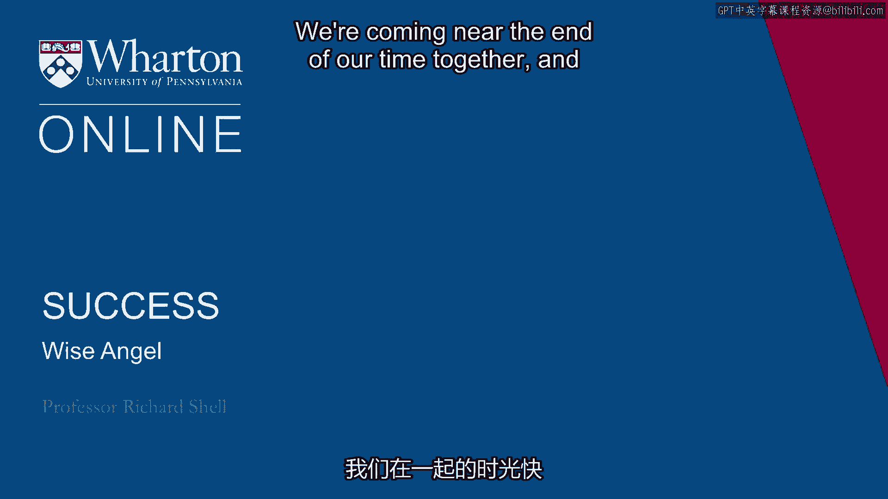
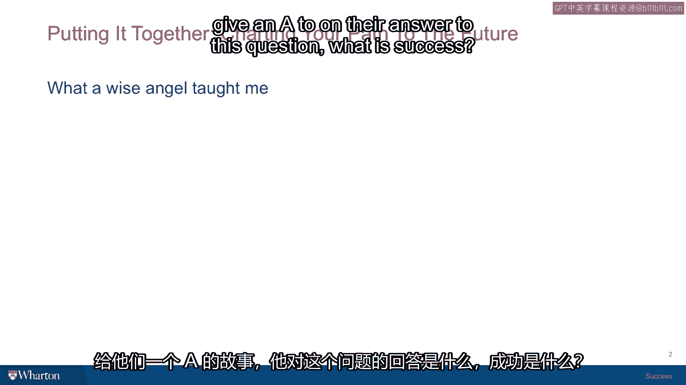
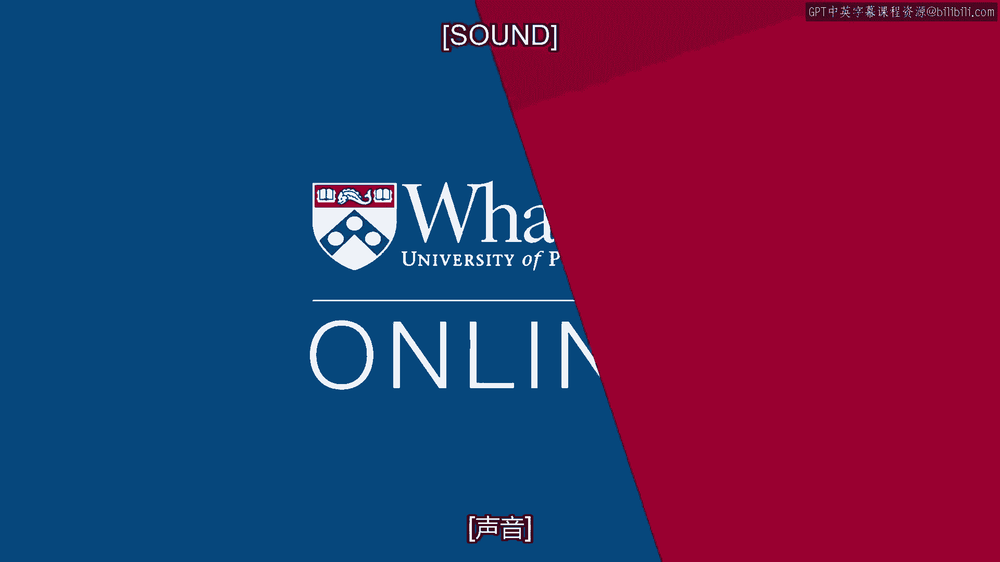

# 沃顿商学院《实现个人和职业成功》课程 P26：智慧天使 👼

在本节课中，我们将通过一个真实的故事，探讨“成功”与“幸福”的本质。一位普通访客在学术研讨会上的发言，为我们提供了一个简洁而深刻的成功定义框架。

---

我们的课程即将接近尾声。我想与大家分享一个故事，故事的主人公是我认为在回答“什么是成功？”这个问题上，可以得到“A”等评分的人。

当时，我正坐在沃顿商学院的一间会议室里，参加一个关于全球幸福与相对收入的研讨会。有人进行了一项跨国研究，涵盖了尼日利亚、不丹、印度、美国、丹麦、德国等国家，旨在分析整体幸福感和国家财富与收入之间的相关性。这是一项相当复杂的社会科学研究。会议室里大约有15位来自不同院系的教授。

研讨会开始前，主讲人正准备展示他的数据。这时，门开了，一位年长的绅士走了进来。在我看来，他显然像是在校园里从事某项建筑工作的人，碰巧听说这里有一个关于幸福的研讨会。在宾夕法尼亚大学，我们有一个传统：欢迎公众参加任何公开的研讨会。所以，有公众成员进来并不奇怪。我们总会有点好奇，想知道这个人会有什么收获，或者他会说些什么，不确定他是否属于我们学术圈这个“部落”。

这位绅士最终在长桌的末端坐下，就在我旁边。他的手放在桌上，我能看出那绝对是劳动者的手，有些粗糙，布满老茧。他穿着法兰绒衬衫和蓝色牛仔裤，面容饱经风霜。于是，我把注意力转回了演讲。

主讲学者介绍了各地的数据、财富水平、问卷答案，以及幸福与财富之间可能或不可能存在的相关性。然后他结束了演讲，并请大家提问。有人问了一个关于数据集回归分析的问题，大家进行了一些讨论。

接着，坐在我旁边的这位先生举起了手。正如我所说，当一位公众成员在这样的研讨会上发言时，其他教授们都会屏住呼吸，因为很难预料他会说什么，或者他的观点从何而来。所以，当他举手时，现场有一种屏息凝神的气氛。主讲人说：“先生，请讲。”

他说了一些我永远不会忘记的话。他说：“我只是一个普通公众，不太理解你们讨论的大部分内容。但在我看来，你们似乎在谈论幸福和金钱。就我的理解而言，幸福和金钱彼此之间真的毫无关系。”

他说：“据我所知，幸福就是三样东西：**良好的健康、有意义的工作和爱**。如果你拥有这三样东西，你就是幸福的。” 此刻，研讨室里一片死寂，因为没人知道该说什么。主讲人说：“呃，谢谢您，先生。” 停顿了一下后，另一个人问道：“那么您研究的丹麦样本数据呢？” 又有人发表了评论，然后讨论就像海浪冲刷沙滩一样，盖过了这位先生的评论，仿佛那里从未有过沙堡。

这位先生等了几分钟，讨论逐渐偏离了主题。然后，他静静地起身，走出了门。我心想，沃顿刚刚被一位智慧天使造访了。上帝派来一位天使，向我们揭示了生命的秘密，却没有人倾听。但我记住了他的话。我非常钦佩他，因为虽然他说那是他的幸福理论，但在很多方面，那也是关于成功的理论。因为它结合了内在生活（良好的健康、爱）和外在生活（有意义的工作），并将其打包成一个非常容易理解的框架。很明显，这个人是通过一些非常重要的人生教训才领悟到这个真理的。

我不知道他的理论对你是否正确。我认为，你可能拥有健康，也可能健康不佳，有时你对此无法控制。仅仅因为健康变差，并不意味着你不幸福或不能成功。你的生活中可能有爱，但爱也可能消失，你可能会失去所爱的人，这也不是你能控制的。仅仅因为生活中的爱发生了变化，其质量或数量改变了，也不意味着你不能再幸福或成功。

他是第一个对我使用“有意义的工作”这个短语的人，而我们刚刚讨论过这一点。所以我采纳了他的说法，并在关于工作、职业和同事的研究背景下进行了探索。他教会了我如何思考工作的一些非常重要的东西。但即使你的工作并非世界上最有意义的工作，它仍然可能是你擅长的事情，并能让你养家糊口。而你生活中真正的激情、兴趣和兴奋，可能来自周末为你孩子的足球队做教练，或者来自你的一个爱好，比如研究美国内战的重演活动，或者你热爱在街边的公共花园里劳作。所以，即使是有意义的工作，也不是衡量你是否成功的最终标准。

但我仍然钦佩这个人，因为他深入思考过，拥有自己的价值观、自己的结论和自己的抱负，并且能够以一种非常简单的方式清晰地表达出来。我认为他是一位真正有智慧的人，这就是我称他为“智慧天使”的原因。

因此，这是我对你在成功之旅上的最终挑战：**尝试提出你自己对“成功”这个词的定义**。哪些是组成部分？哪些是要素？哪些是你想要打包在一起，构成你想要踏上的旅程、你想要采取的旅行方式的目标和抱负？如果你能做到这一点，请记住，这个定义今天和25年后可能不同。生活不断变化，我们对成功的定义也会改变。但努力将其作为一项任务总结出来，为你自己阐明个人的成功理论以及你计划如何实现它，是非常值得的。

顺便说一下，这**也是我在成功课程结束时总是布置给学生的期末论文题目：“我的个人成功理论是什么？我计划如何实现它？”**。我们认识到，这篇论文只是学生在某个时刻经过思考后，表达其想法的一个快照。我的目标不是将他们束缚在某条道路上，而是给他们一张在特定时间点的思维照片。十年后，如果那篇论文对他们来说，是能够带着兴趣和收获重读、再读，并思考“嗯，那是我在人生那个阶段对成功意味着什么以及如何实现它的想法，我现在看到了当时没看到的细微差别，或者我发现我可能已经偏离了道路，我应该回到我为自己勾勒的道路上，我需要提醒自己那个写下论文的更好的自己”，那么我就会觉得我成功了。这些你真正将思想结晶下来的小时刻，在日后的人生中可以有各种各样的用处。

---

本节课中，我们一起学习了“智慧天使”的故事及其启示。他提出的幸福三要素——**良好的健康、有意义的工作和爱**——为我们思考成功提供了一个简洁而有力的框架。关键在于，成功是一个高度个人化的概念，需要你结合内在追求与外在表现，去定义属于自己的组成部分、目标和旅程。最终挑战是：**明确你的个人成功理论，并规划实现它的路径**。请记住，这个定义可以随着人生阶段而演变，但主动思考和记录这一过程本身，就具有深远的价值。