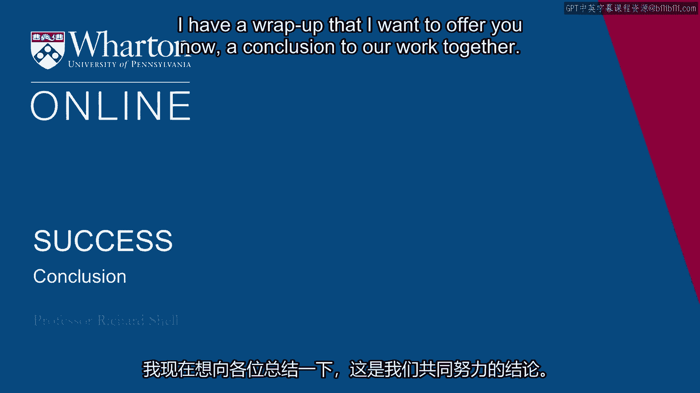

# 课程P27：总结与个人成功理论构建 🎯

在本节课中，我们将对沃顿商学院《实现个人和职业成功》课程的核心内容进行总结。我们将回顾关键概念，并通过分享与解读三则关于成功的重要引言，帮助你构建属于自己的个人成功理论框架。

---

## 课程回顾与个人成功手册

上一节我们探讨了影响力的具体策略，本节中我们来看看如何整合所有学习内容，形成个人化的成功指南。

课程持续了14周，包含了大量练习与阅读。在最后一堂课中，我们进行了一项特别活动：每位参与者分享一则最能体现其成功理论的引言。这则引言可以来自书籍、诗歌、戏剧、音乐或任何其他来源，并需要阐述其重要性。

这项活动的意义在于，它帮助你将课程中的所有思考凝结成一个象征。结合我们之前的所有练习，你就能构建自己的“成功手册”。

以下是构成你个人成功手册的关键组成部分：

*   **六种人生练习的答案**：这是在课程初期完成的练习，帮助你探索不同的人生可能性。
*   **你的专属“四颗钻石”**：这代表了你的兴趣、能力、经验和独特故事的结合。
*   **你对意义的理解**：你对于有意义的工作、幸福和成就中哪些方面最为看重，以及你如何理解和评估它们。
*   **你的成功隐喻**：一个能帮助你思考成功的象征、意象或画面，例如一棵树、一个指南针、一个池塘、一架梯子或一场赛跑。

所有这些元素共同构成了专属于你的成功手册。这不是一本放之四海而皆准的“成功学”指南，而是完全基于你自身经历的个性化总结。

## 三则关于成功的核心引言

以下是我想与大家分享的三则引言，它们分别对应成功的不同维度。

### 引言一：关于成就

第一则引言与“成就”相关，它来自中国古老的智慧典籍《易经》。

> **“唯有当我们勇于直面事物的本来面目，不抱任何自欺或幻想时，才会从事件中发展出一线光明，借此可以辨识出通往成功的道路。”**

这则引言至关重要，因为它指出，你的成就技能并非外在于你。它们早已潜藏或发展于你自身内部。关键在于，要勇于直面你的天赋和技能，不抱任何自欺或幻想，专注于你真正擅长的事情。

停止幻想那些遥不可及的目标（例如成为NBA球星），聚焦于你实际能做好的事情，并将它们组合成你独特的价值主张。一旦你清晰地认识到自己能做什么，并将这些能力组合起来，你人生中的成就部分就会加速，甚至爆发式增长。因为当你提供独特的价值主张，并找到合适的应用场景时，你就会像火箭一样一飞冲天。

**核心在于：看清事物本质的清晰度和勇气。**

### 引言二：关于幸福

第二则引言关乎“幸福”，出自一位古罗马哲学家。

> **“获得幸福所需的一切其实很简单。”**

这是一个我们极易忽视的真理。在追求幸福的过程中，我们总是想要更多：更多样化、更丰富的体验、更奇特的选择、更多的一切。然而，关于幸福——无论是片刻的欢愉、整体的满足还是深层的喜悦——的真相是，它们只是人类体验的一部分。

你最深刻的幸福时刻很可能是偶然发生的。它可能发生在一个失眠的商务旅行夜晚，当你漫步海滩，恰逢日出，被自然之美和自身存在深深震撼的那个瞬间。这并不复杂，它仅仅是在生命发生的当下，全然临在。

我认为，你越能向幸福的简单性敞开自己，越能感知周围的节奏与生命的韵律，你就越有可能体验到更多这种成功中至关重要的方面——那种内在的喜悦和深层的幸福感。

### 引言三：关于审视生活

第三则引言既非直接关于成就，也非关于幸福，而是关于如何思考成就、幸福与成功——这正是我们整个课程一直在探讨的核心。它来自柏拉图笔下，关于其老师苏格拉底的记述。

> **“未经审视的人生不值得度过。”**

我认为他的意思是，如果你的一生从未审视所承载的文化价值观、从未审视塑造你的家庭影响、从未审视使你趋同或产生压力的社会力量，那么这样未经审视、近乎自动运行的人生，并非基于你自己的思考，而只是 assimilate 了你恰好出生其中的纷繁思潮，这样的生命或许并不值得度过。

我们课程中所探讨的一切，都指向“自我审视”这一方法。通过它，你可以发现自身真正的成就能力，发现你真正的成功价值观，发现幸福对你的真实含义。所有这些问题的答案，都不在电视、电脑或书本里，它们只存在于你的内心。这正是苏格拉底的本意，也是这则引言成为我最喜爱的成功格言的原因。

## 结语

我们的课程到此结束了。与大家共度的时光非常美妙。

我授课的方式，并非直接给出建议来回答问题，而是通过提问，引导对方思考可能的答案以及问题的另一面。令人惊讶的是，人们常常能通过这样的对话，为自己做出最正确的选择。

我希望这门课程能帮助你为自己做出最正确的选择。很高兴能与大家分享这一切。感谢你的参与。祝你好运，并祝愿你取得全方位的成功。

---

**本节课中我们一起学习了**如何整合课程所学，通过回顾“六种人生”、“四颗钻石”、成功隐喻等工具，构建个人化的成功手册。我们重点解读了三则分别关于**成就**（需勇气直面真实自我）、**幸福**（源于简单与临在）和**生命态度**（未经审视的人生不值得度过）的核心引言。最终，我们认识到**自我审视**是发现个人成功真谛的根本方法。希望你能与亲友分享属于自己的成功引言，并在不断反思中，书写独一无二的成功篇章。